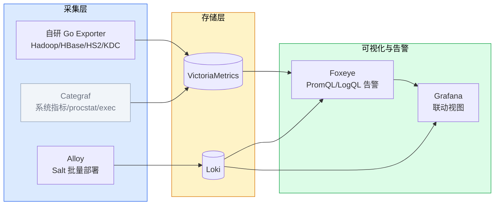
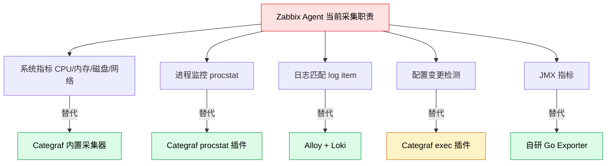
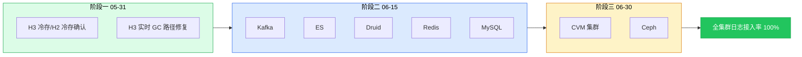
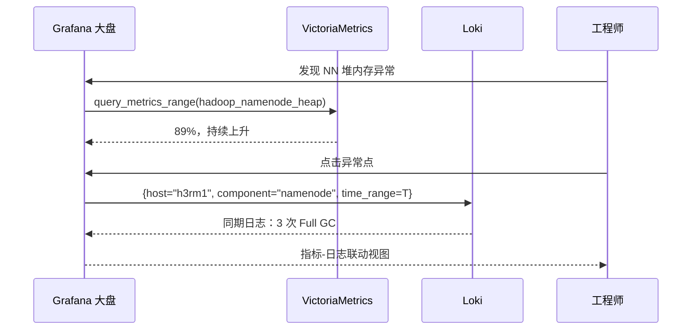
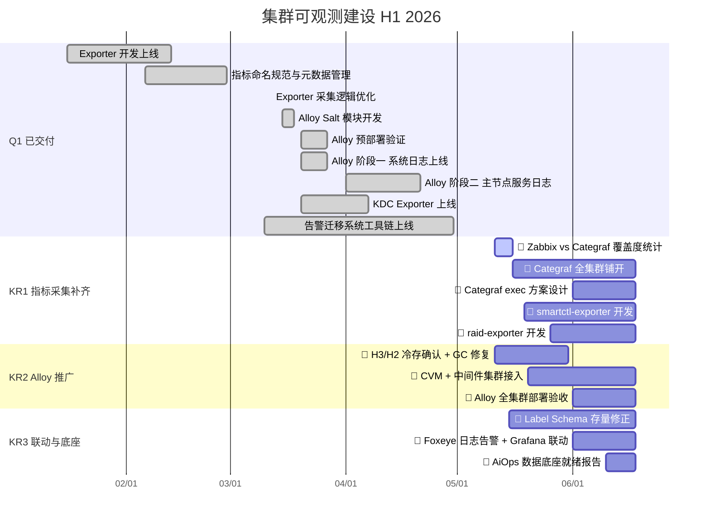

# 1 背景/现状

> **最后更新：2026-05-11**

大数据集群可观测体系重构自 2026 年 1 月启动，目标是用 Prometheus + Exporter + Loki + Foxeye 的云原生可观测栈替代 Zabbix + 物理机本地日志的旧体系。当前处于 H1 建设中后期：

- **技术栈与架构**：集群由 Ambari 管理、Kerberos 认证；指标采集采用自研 Go Exporter + Categraf，统一写入 VictoriaMetrics；日志采集采用 Alloy 通过 Salt 流水线批量部署，写入 Loki；告警与大盘由 Foxeye（基于夜莺）承载
- **已完成能力（Q1）**：Hadoop/HBase/HS2/KDC Exporter 开发上线；Exporter 采集逻辑优化（per-host context 隔离）；Alloy Salt 模块开发完毕（3.18）；Alloy 阶段一全集群系统日志上线（3.27）；Alloy 阶段二大数据主节点服务日志接入（4.21）；告警迁移系统工具链上线（4 月）
- **建设中的能力**：Alloy 向 CVM 与中间件集群推广（P0，DDL 06-30）；Categraf 全集群铺开（方案设计中）；Zabbix agent vs Categraf 覆盖度统计（本周启动）
- **尚缺失的能力**：smartctl-exporter / raid-exporter 未建设（硬件类告警阻塞）；指标与日志 Label 体系统一（存量不合规项待修正）；Grafana 指标-日志联动视图未开发

---

# 2 问题分析

**1. 数据采集基础设施仍存缺口，阻塞告警迁移各象限**

- 告警迁移已按四象限（指标/日志/配置变更/硬件）重组，每种类型依赖不同的采集基础设施
- **指标类**：Hadoop/HBase/HS2/KDC Exporter 已就绪；Kafka JMX 待优化、Categraf procstat 待铺开
- **日志类**：大数据主节点已接入 Loki；CVM/中间件集群仍为零覆盖
- **配置变更类**：依赖 Categraf exec 插件，方案未启动
- **硬件类**：smartctl/raid Exporter 全部未建设

**2. Alloy 日志采集推广不均衡，多集群存在盲区**

- 大数据集群（H3 离线/实时/冷存）Alloy 覆盖较好，H2 冷存待确认
- CVM 集群、中间件集群（Kafka/ES/Druid/Trino/ClickHouse/Milvus）零覆盖或部分覆盖
- Spark 作业日志确认不通过 Alloy 采集（已聚合到 HDFS）

**3. 指标与日志孤立，Label Schema 统一滞后**

- Prometheus Label 与 Loki Label 命名不一致（`component` vs `service_name`），无法跨数据源关联
- 缺乏 Metric-Log 联动视图，故障排查链路割裂
- Foxeye 日志告警规则未建立，日志侧异常无法自动告警

---

# 3 方案/目标

**Objective**：以「数据采集基础设施全面铺开」为核心，消除 Exporter / Alloy / Categraf 三大采集链路的覆盖盲区，交付标准化、可联动的 Metrics + Logs 数据底座，支撑智能运维 OKR 的告警迁移与 Hermes ChatOps 建设。

**已交付里程碑（Q1）**：

- ✅ **Hadoop/HBase/HS2/KDC Exporter 开发上线**（2026-01 ~ 04），大数据核心组件指标全覆盖
- ✅ **Exporter 采集逻辑优化**（2026-03-12），per-host context 隔离防止单节点假死阻塞
- ✅ **Alloy Salt 模块开发完毕**（2026-03-18），Pillar 分层架构就绪
- ✅ **Alloy 预部署验证**（2026-03-27），minion-id / 路径 / 权限全部核查通过
- ✅ **Alloy 阶段一：全集群系统日志上线**（2026-03-27），4 批次分批部署验证通过
- ✅ **Alloy 阶段二：大数据主节点服务日志接入**（2026-04-21），NN/RM/HS2/DN/NM/HBase/ZK

**三个 KR**：

- **KR1**：补齐指标采集链路缺口。**预计 6 月 18 日**，👤 Categraf 覆盖全集群 + smartctl/raid Exporter 开发完成并上线；🔗 Kafka JMX Exporter 优化由 Kafka 团队负责
- **KR2**：Alloy 全集群部署推广。**预计 6 月 18 日**，👤 大数据集群全量接入 + CVM 集群接入 + Pipeline 降噪生效；🔗 中间件集群日志路径信息需各中间件负责人提供
- **KR3**：Label Schema 统一 + Foxeye 日志告警 + Grafana 联动视图。**预计 6 月 18 日**，👤 三项全部达标

---

## 3.1 指标采集链路补齐（KR1）

补齐 Exporter 覆盖缺口，推进 Categraf 替代 Zabbix agent，为告警迁移四个象限提供完整的指标数据源。

**核心设计思路**：

- **Exporter 缺口补齐**：Hadoop/HBase/HS2/KDC 已就绪；Kafka JMX 优化进入工程排期；smartctl-exporter 和 raid-exporter 启动方案设计（Go 自研，复用现有 Exporter 技术栈）
- **Categraf 全集群铺开**：先统计 Zabbix agent vs Categraf 覆盖度（本周），输出缺口清单后在 Salt 流水线上分批部署 Categraf
- **Zabbix agent 替代路径**：系统指标 → Categraf 内置采集器；procstat → Categraf procstat 插件；配置变更 → Categraf exec 插件；JMX → 自研 Go Exporter

---

## 3.2 Alloy 全集群日志接入（KR2）

通过 Salt 流水线将 Alloy 推广到大数据/中间件/CVM 三组全量集群，消除日志采集盲区。

**核心设计思路**：

- **六维度追踪**：按组-集群-服务-组件四级结构统计部署状态，详见 [[Alloy全集群部署推广]]
- **三阶段推广**：阶段一（大数据收尾，DDL 05-31）→ 阶段二（中间件接入，DDL 06-15）→ 阶段三（CVM 接入，DDL 06-30）
- **排除项**：Spark 作业日志（已聚合到 HDFS）、YARN Container 日志（NM 管理，`yarn logs` 获取）

---

## 3.3 指标-日志联动与数据底座（KR3）

统一 Label Schema，建立 Foxeye 日志告警规则，配置 Grafana 联动视图，交付 AiOps 数据底座。

**核心设计思路**：

- **Label Schema 统一**：`cluster`/`component`/`hostname` 在 Prometheus 和 Loki 中完全对齐，存量不合规项随 KR2 推广同步修正
- **Foxeye 日志告警**：新建 HS2 OOM / NN Full GC / RM 队列拒绝三条 LogQL 告警规则（新建规则，非存量迁移）
- **Grafana 联动视图**：利用 Explore Split View，指标异常点通过变量自动传递 `hostname`/`component`/时间范围至 Loki，实现一键跳转

---

# 4 关键事项拆解

| KR | 任务 | 时间 | 说明 |
|---|---|---|---|
| **Q1** | ✅ Hadoop/HBase/HS2/KDC Exporter 上线 | 1.16 - 4.7 | 4 个自研 Go Exporter，覆盖大数据核心组件 JMX 指标 |
| | ✅ 指标命名规范与元数据管理规范 | 2.6 - 2.28 | 规范层；Metrics Catalog 实现层由智能运维 OKR 承载 |
| | ✅ Exporter 采集逻辑优化 | 3.12 | per-host context 隔离，防止假死节点阻塞全局采集 |
| | ✅ Alloy Salt 模块 + 预部署验证 | 3.15 - 3.27 | Salt State 模块，Pillar 分层，minion-id/路径/权限核查 |
| | ✅ Alloy 阶段一：全集群系统日志 | 3.20 - 3.27 | 4 批次分批部署（测试→管理→工作→其他集群） |
| | ✅ Alloy 阶段二：大数据主节点服务日志 | 4.1 - 4.21 | NN/RM/HS2/DN/NM/HBase/ZK 全部接入 |
| | ✅ 告警迁移系统工具链上线 | 3.10 - 4.30 | Multi-Agent 转换 + 三层匹配 + 双跑数据采集就绪 |
| **KR1** | 👤 Zabbix vs Categraf 覆盖度统计 | 5.11 - 5.16 | 全节点覆盖度矩阵，缺口清单 |
| | 👤 Categraf 全集群铺开 | 5.16 - 6.18 | Salt State 模块 + 分批部署，目标 100% 覆盖 |
| | 👤 Categraf exec 方案设计 | 6.1 - 6.18 | 通用检测脚本模板 + 单节点试点 |
| | 👤 smartctl-exporter 开发 | 5.19 - 6.18 | 磁盘 SMART 指标（Go），复用现有 Exporter 技术栈 |
| | 👤 raid-exporter 开发 | 5.26 - 6.18 | RAID 卡状态采集（MegaRAID 优先） |
| | 🔗 Kafka JMX Exporter 优化 | - | 外部依赖，Kafka 团队负责 |
| **KR2** | 👤 Alloy 大数据收尾（冷存确认+GC 修复） | 5.11 - 5.31 | H3/H2 冷存确认 + GC 路径修正 |
| | 👤 CVM + 中间件集群 Alloy 接入 | 5.20 - 6.18 | Kafka/ES/Druid/Redis/MySQL/Trino/Clickhouse/Milvus |
| | 🔗 中间件日志路径信息 | - | 外部依赖，需各中间件负责人提供 |
| | 👤 Alloy 全集群部署验收 | 6.1 - 6.18 | 日志接入率 100% |
| **KR3** | 👤 Label Schema 存量修正 | 5.15 - 6.18 | Exporter + Alloy 配置不合规项修正 |
| | 👤 Foxeye 日志告警 + Grafana 联动 | 6.1 - 6.18 | ≥3 条 LogQL 告警 + NN/RM/HS2 联动视图 |
| | 👤 AiOps 数据底座就绪报告 | 6.10 - 6.18 | 三项指标达标验收 |
