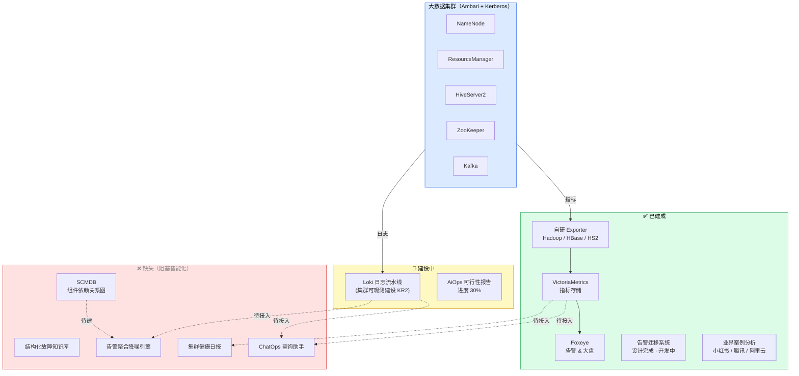
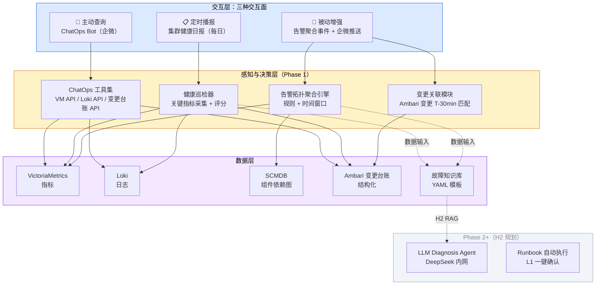
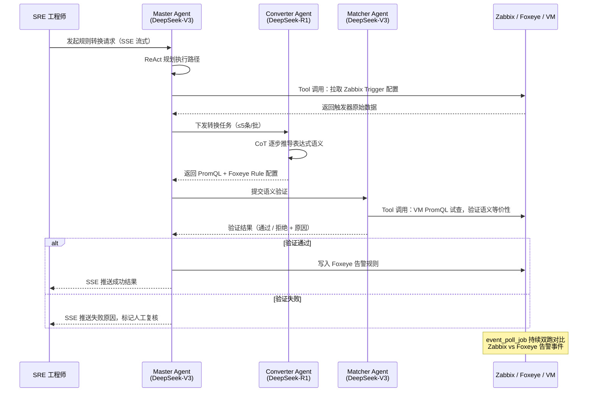
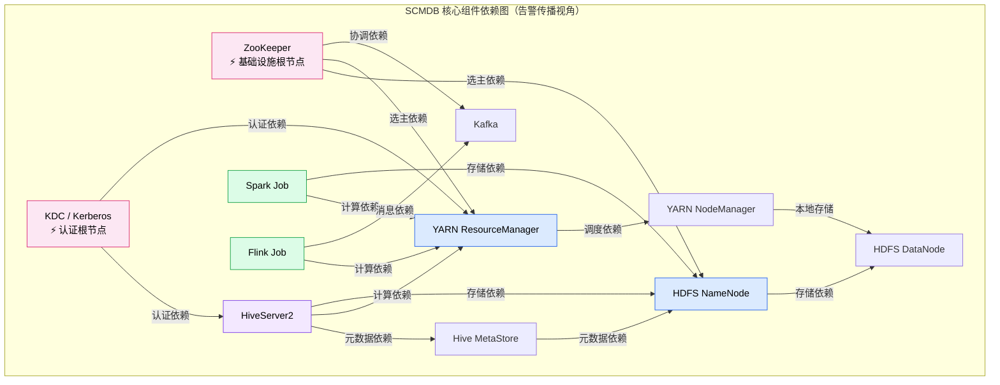
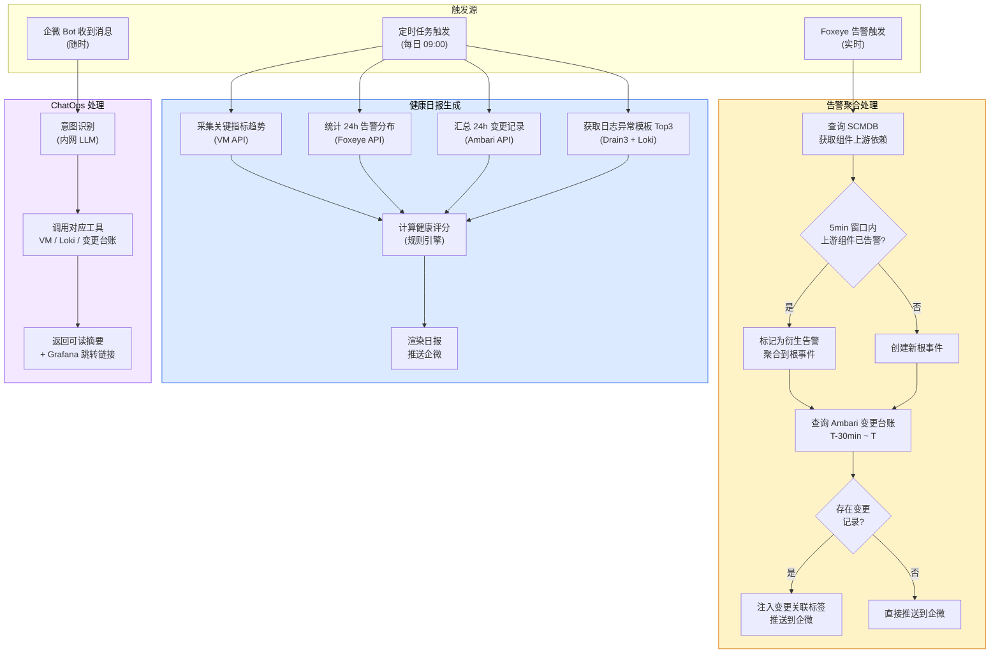
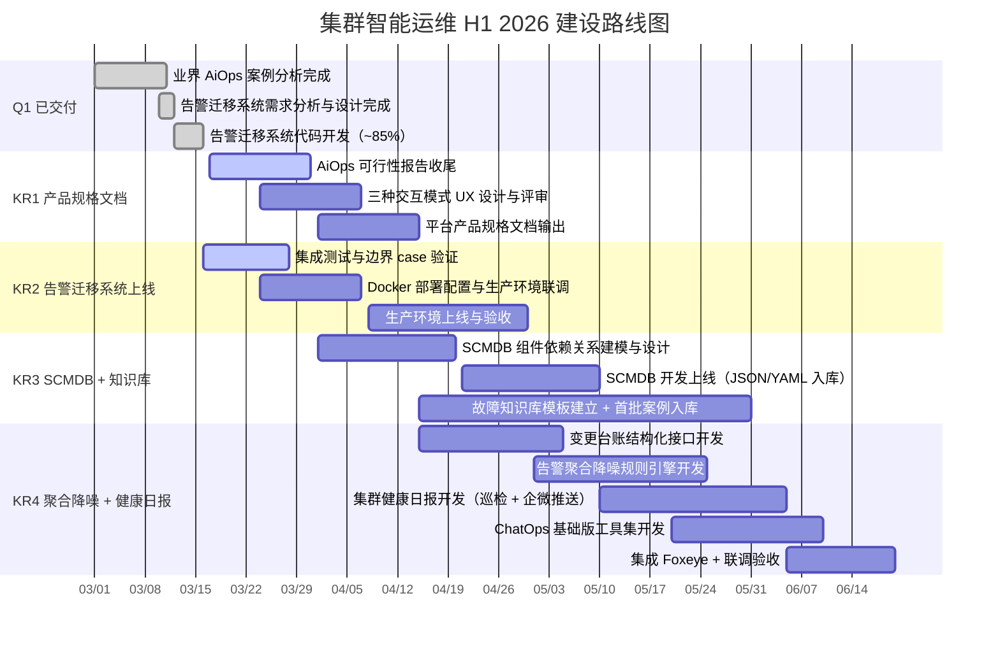

# 1 背景/现状

大数据集群 SRE 当前以**被动响应**为主要运维模式：告警触发 → 工程师人工筛查 → 手动登机排查 → 经验性处置。集群规模与业务复杂度持续增长，但运维效率工具链的智能化程度几乎停留在原点。当前状态如下：

- **可观测基础**：Foxeye（基于夜莺）承载告警与大盘，VictoriaMetrics 存储指标，Hadoop/HBase/HS2 Exporter 已上线（Q1 完成）；Loki 日志采集流水线建设中，Zabbix → Foxeye 告警迁移进行中，存量 500+ 条规则待迁移
- **已完成的 AiOps 准备工作**：业界 AiOps 案例深度分析完成（2026-03-11），覆盖小红书/腾讯/阿里云三大头部案例；AiOps 可行性分析报告进行中（进度 30%）；告警智能迁移系统（Multi-Agent 架构）完整设计文档输出（2026-03-12），代码开发进度 ~85%
- **核心缺失**：无组件依赖关系图（SCMDB），拓扑溯源无从建立；告警无聚合降噪，单次故障触发 50~200 条相关告警；无结构化故障知识库，排查经验沉淀在工程师个人记忆中；无集群健康主动播报机制，隐患发现滞后
- **产品形态空白**：尚无清晰的平台功能边界、交互模式设计与分阶段建设路线，智能运维方向处于「调研已完成、工程尚未启动」的窗口期

---

# 2 问题分析

**1. 告警风暴淹没值班工程师，被动运维效率极低**

- 单次集群故障（如 NameNode GC 风暴）级联触发 50~200 条相关告警，工程师需人工逐条筛查根因，**MTTR 中 60% 时间消耗在「看告警 + 翻大盘 + 查日志」**
- 告警与 Ambari 变更事件完全割裂，变更引发的故障无法自动识别，排查路径冗长
- 缺乏组件拓扑关系，NameNode 异常触发的 HiveServer2/Spark 下游告警与根因告警混杂，无法自动收敛

**2. 智能运维产品形态不清晰，工程方向无法落地**

- 现有 AiOps 规划停留在「能力层描述」（感知层/决策层/执行层），缺乏具体的**用户交互场景**、**功能边界**和 **Phase 路线图**
- 没有明确「工程师在哪里操作、看到什么、能做什么」，导致工程开发缺乏可执行的产品规格
- 功能边界模糊：LLM 根因分析与传统规则引擎的分工不清，H1 应做什么、H2 应做什么没有共识

**3. SCMDB 缺失，拓扑溯源无法启动**

- 告警聚合降噪的核心逻辑依赖**组件依赖关系**（NameNode → YARN RM → HiveServer2 → Spark Job），当前无任何组件依赖关系的结构化存储
- 缺乏 SCMDB，下游告警无法被标记为「上游根因的衍生症状」，告警压缩永远停留在理论层面
- 每次故障经验沉淀在工程师个人记忆中，结构化故障知识库为零，LLM RAG 无本地知识可检索

**4. 集群健康状态无主动播报，隐患发现完全被动**

- 工程师获取集群健康状态的唯一途径是：告警触发后登机查看，或主动打开 Grafana 大盘逐一检视，无**定时汇总播报**机制
- NameNode 堆内存水位趋势、HDFS 容量增长曲线、YARN 队列长期高水位等**慢性隐患**无法提前感知，只能等到触发阈值告警才被动响应

---

# 3 方案/目标

**Objective**：以告警智能迁移系统上线为起点，以 SCMDB 与故障知识库为数据地基，在 H1 完成告警聚合降噪引擎与集群健康日报的工程落地，将大数据集群智能运维平台从「调研阶段」推进到「Phase 1 核心能力验证」，构建清晰可讲、可演示、可度量的产品形态。

**已交付里程碑（Q1）**：

- ✅ **业界 AiOps 案例分析完成**（2026-03-11），深度覆盖小红书/腾讯/阿里云三大头部方案，明确大数据集群与微服务场景的核心差异
- ✅ **告警智能迁移系统完整设计文档输出**（2026-03-12），1060 行设计文档覆盖 Multi-Agent 架构、DB ER、40+ API 端点、前端页面，代码开发进度 ~85%

**待完成 KR**：

- **KR1**：完成 AiOps 可行性分析报告（从 30% 收尾至发布）并输出平台产品规格设计文档。**预计 4 月 15 日**，可行性报告正式发布，产品规格文档明确三种交互模式、功能边界、数据规范要求与 Phase 1/2/3 里程碑，作为 H2 工程开发的基准输入
- **KR2**：告警智能迁移系统（Multi-Agent 架构）完成集成测试并上线生产环境。**预计 4 月 30 日**，系统接入真实 Zabbix/Foxeye 数据，规则转换功能验收通过，500+ 条 Zabbix Trigger 可通过系统辅助完成 PromQL 迁移
- **KR3**：SCMDB MVP 上线，结构化故障知识库启动。**预计 5 月 31 日**，SCMDB 覆盖 ZK/KDC/NN/DN/RM/NM/HS2/HMS/Spark/Flink/Kafka 完整依赖关系入库；故障知识库模板建立，首批 ≥ 10 个高频故障案例结构化入库
- **KR4**：告警聚合降噪引擎 Phase 1 与集群健康日报上线，集成 Foxeye。**预计 6 月 20 日**，历史告警数据回测压缩率 ≥ 70%，变更↔告警自动关联上线；集群健康日报每日定时推送企微，覆盖关键指标趋势 + 告警分布 + 变更汇总 + 整体健康评分

---

## 3.1 平台产品规格设计（KR1）

通过完成 AiOps 可行性报告收尾和平台产品规格设计文档输出，为智能运维平台确立清晰的产品形态、功能边界与工程路线，消除后续开发的方向模糊性。

**平台定位与形态**：

- **平台定位**：不是独立的全新系统，而是**嵌入现有工作流的智能能力增强层**——数据接入 Foxeye/VictoriaMetrics/Loki/Ambari，增强告警处理流程，扩展企微 ChatOps 交互入口，不要求工程师切换工作台
- **三种交互模式**：
  - **被动增强模式**（Passive）：Foxeye 告警触发 → 平台自动聚合关联告警 + 注入变更上下文 → 推送结构化根事件摘要到企微，工程师看到的是「1 条聚合事件 + 3 条证据」而非「200 条告警」
  - **主动查询模式**（ChatOps）：工程师在企微输入自然语言 → Bot 调用 VictoriaMetrics/Loki/变更台账工具 → 返回可读摘要；典型场景：「NameNode 堆内存过去 6 小时趋势？」「昨天发生了哪些 Ambari 变更？」「现在有哪些活跃告警？」
  - **定时播报模式**（Daily Report）：每日定时触发集群巡检 → 采集关键指标、告警分布、变更记录 → 生成集群健康日报推送企微，工程师每天收到一份「集群健康摘要」
- **功能边界（H1 范围内）**：告警拓扑聚合降噪、变更↔告警自动关联、ChatOps 基础查询（Metrics + Logs + 变更台账）、集群健康日报、SCMDB MVP、结构化故障知识库启动
- **功能边界（H1 范围外，Phase 2+）**：LLM 根因推理与报告自动生成、L1/L2 自动执行 Runbook、作业异常检测（需作业画像数据基础）、微服务/K8s 场景扩展

---

## 3.2 告警智能迁移系统上线（KR2）

完成告警智能迁移系统（Multi-Agent 架构，Go + Eino + Vue 3）的集成测试与生产部署，作为 AiOps Phase 0 的核心工具，驱动 Zabbix → Foxeye 存量告警规则迁移。本系统同时是团队 Multi-Agent 工程能力的第一个生产验证。

**核心设计思路**：

- **Multi-Agent 分工**：Master Agent（DeepSeek-V3，ReAct 编排）统筹任务路径；Converter Agent（DeepSeek-R1，CoT 推理）负责 Zabbix 表达式 → PromQL 语义转换；Matcher Agent（DeepSeek-V3）对转换结果进行质量打分验证，三 Agent 协同保障转换准确率
- **三层匹配策略**：L1 Fingerprint（规则名称 + 阈值结构化匹配，定时自动执行）→ L2 LLM 语义匹配（Matcher Agent 打分，Fingerprint 未命中时触发）→ L3 人工绑定（管理页手动操作，兜底）
- **双跑验证**：`event_poll_job` 定时采集 Zabbix 与 Foxeye 双侧告警事件，自动关联比对；差异超阈值标记人工复核；双跑漏报率为零是验收核心标准
- **待完成项**：集成测试（边界 case 验证、端到端规则转换准确率验证）、Docker Compose 部署配置、生产环境联调

---

## 3.3 SCMDB MVP + 结构化故障知识库（KR3）

建立大数据集群组件依赖关系图（SCMDB）和结构化故障知识库，为 KR4 告警聚合降噪引擎提供拓扑数据支撑，同时为 H2 LLM 根因分析积累 RAG 检索素材。

**核心设计思路**：

- **SCMDB MVP 范围**：只覆盖静态依赖关系（10~15 个核心组件），不追求动态实时更新；数据模型：`Node{id, type, component, cluster}` + `Edge{source, target, relation, weight}`；初期以 JSON/YAML 文件入库，后期可演进为图数据库
- **依赖关系建模原则**：从「告警传播路径」反推依赖方向——NameNode 异常会引发哪些下游组件告警？这是 SCMDB 最核心的建模视角，而非完整的服务调用图
- **故障知识库模板**：每次故障处置后必须填写结构化记录，字段包括：故障 ID、时间、影响组件、影响业务、根因（一句话）、触发原因、解决方案、预防措施；H1 目标 ≥ 10 个案例，这是 H2 LLM RAG 的核心素材

---

## 3.4 告警聚合降噪引擎 + 集群健康日报（KR4）

基于 SCMDB 组件依赖关系，构建规则引擎实现告警拓扑聚合降噪和变更自动关联；同时实现定时触发的集群健康日报，主动推送集群巡检结果到企微。两个功能共用数据层，统一集成到 Foxeye 侧。

**核心设计思路**：

- **告警聚合策略**：以 5 分钟时间窗口为基准，查询 SCMDB 依赖图——若当前告警组件存在已触发告警的上游组件，则标记为「衍生告警」并聚合到上游根事件；聚合后推送到企微的是「1 条根事件 + N 条衍生症状」，而非原始告警流
- **变更↔告警关联**：查询 Ambari 变更台账，匹配当前告警触发时间 T-30min 内的变更记录，自动注入「变更关联」上下文标签；工程师在企微收到告警时即可看到「疑似由 XX 分钟前的变更触发」
- **集群健康日报内容**：每日定时（建议早 9:00）触发巡检，采集并汇总：①关键指标趋势（NameNode 堆内存 / HDFS 容量 / YARN 队列水位 / HS2 连接池 / Kafka Lag）；②近 24h 告警分布（按组件统计 Top N）；③近 24h Ambari 变更记录；④Loki Drain3 日志异常模板 Top 3；⑤整体健康评分（绿/黄/红，基于阈值规则）
- **ChatOps 基础版**：封装 VictoriaMetrics、Loki、Ambari 变更台账 API 为 LLM 工具；初期覆盖 ≥ 5 个固定查询场景（指标趋势、活跃告警、近期变更、日志关键词搜索、健康评分查询）；使用搜狐内网 LLM，生产数据不外发

---

# 4 关键事项拆解

| KR | 任务 | 时间 | 说明 |
|---|---|---|---|
| Q1 | ✅ 业界 AiOps 案例深度分析 | 3月1日 - 3月11日 | 覆盖小红书/腾讯/阿里云三大案例，明确大数据集群与微服务 AiOps 的核心差异 |
| | ✅ 告警智能迁移系统需求分析与完整设计 | 3月10日 - 3月12日 | 1060 行设计文档，Multi-Agent 架构 + DB ER + 40+ API 端点 + 前端页面 |
| | ✅ 告警迁移系统后端/前端代码开发（~85%） | 3月12日 - 3月16日 | 后端核心模块基本完成，前端 7 个路由页面框架完整 |
| KR1 | AiOps 可行性分析报告收尾（从 30% 至发布） | 3月17日 - 3月31日 | 可行性报告正式发布，覆盖技术选型、阶段路线、数据规范 |
| | 三种交互模式 UX 场景设计与内部评审 | 3月24日 - 4月7日 | 被动增强 / ChatOps / 健康日报三种交互模式的具体 UX 场景文档 |
| | 平台产品规格文档（PRD 级别）输出 | 4月1日 - 4月15日 | 明确功能边界（In/Out scope）、数据规范、Phase 路线图，作为 H2 工程基准文档 |
| KR2 | 告警迁移系统集成测试与边界 case 验证 | 3月16日 - 3月28日 | 规则转换端到端验证报告，双跑对比逻辑测试通过 |
| | Docker 部署配置与生产环境联调 | 3月24日 - 4月7日 | Docker Compose 部署包，生产环境 Zabbix/Foxeye 真实数据接入验证 |
| | 生产环境上线与规则迁移功能验收 | 4月8日 - 4月30日 | 系统正式上线，500+ 条 Zabbix Trigger 可通过系统辅助完成 PromQL 转换 |
| KR3 | SCMDB 组件依赖关系建模与方案设计 | 4月1日 - 4月20日 | 依赖关系建模文档（告警传播视角），Node/Edge 数据结构定义 |
| | SCMDB 开发上线（核心 11 个组件） | 4月21日 - 5月10日 | ZK/KDC/NN/DN/RM/NM/HS2/HMS/Spark/Flink/Kafka 依赖关系入库，提供查询 API |
| | 故障知识库模板建立 + 首批案例入库 | 4月15日 - 5月31日 | YAML 模板规范发布，≥10 个高频故障案例结构化入库，可供后续 LLM RAG 检索 |
| KR4 | Ambari 变更台账结构化接口开发 | 4月15日 - 5月5日 | 变更记录结构化解析入库，支持按组件 + 时间窗口查询的 API |
| | 告警聚合降噪规则引擎开发 | 5月1日 - 5月25日 | 基于 SCMDB 拓扑 + 5min 时间窗口的聚合引擎，历史数据回测压缩率 ≥ 70% |
| | 集群健康日报开发（巡检规则 + 企微推送） | 5月10日 - 6月5日 | 定时巡检服务上线，日报覆盖关键指标趋势 / 告警分布 / 变更汇总 / 健康评分 |
| | ChatOps 基础工具集开发（≥5 个查询场景） | 5月20日 - 6月10日 | 内网 LLM + VM/Loki/变更台账工具封装，企微 Bot 覆盖指标查询 / 活跃告警 / 近期变更等场景 |
| | 集成 Foxeye + 联调验收 | 6月5日 - 6月20日 | 聚合降噪 + 健康日报 + ChatOps 与 Foxeye 完成集成，端到端验收通过 |
