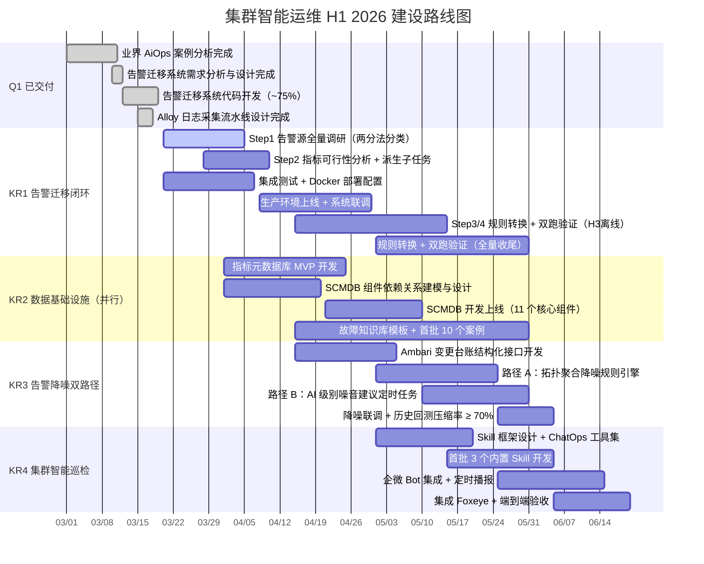

# 1 背景/现状

> **最后更新：2026-04-09**

大数据集群 SRE 当前以**被动响应**为主要运维模式：告警触发 → 工程师人工筛查 → 手动登机排查 → 经验性处置。集群规模与业务复杂度持续增长，但运维效率工具链的智能化程度几乎停留在原点。当前状态如下：

- **可观测基础**：Foxeye（基于夜莺）承载告警与大盘，VictoriaMetrics 存储指标，Hadoop/HBase/HS2 Exporter 已上线；Loki 日志采集流水线建设中（Alloy 部署方案 3.18 设计完成，Salt 模块开发完毕，阶段一上线进行中）；多平台告警源共存，全量迁移进行中
- **SRE Copilot 平台建设进度（截至 2026-04-09）**：平台已经历 16 次迭代，从"75% 代码完成度"演进为**功能完整、可生产接入**的智能运维平台（详见第 3 节已交付里程碑）。核心模块包括：Multi-Agent 告警迁移（指标类 + 日志类）、SSH 对话式排障、声明式集群巡检、Loki 日志联查、AI 根因分析、Skill 热重载、MCP Server 协议封装全部已上线
- **告警源现状**：多平台共存——Zabbix（存量主力，已全量同步入库，按服务/模板完成分类）、**Ambari/CDH 原生告警**（管理平台自带，含 NN Health Check、YARN Alert 等，已接入同步 Job）、Foxeye 自建规则（已同步，PromQL 字段已修复解析 n9e v7+ 格式）；指标元数据库（Metrics Catalog）已建立，支持从 VictoriaMetrics 按业务组增量同步，Agent 可自主查询可行性
- **核心能力现状（已建成）**：服务→组件双层分类体系（`service_mapping` 统一来源）已上线；AI 根因分析（`ai_analyses` 表 + AnalysisAgent）已上线；声明式集群巡检（`inspection_plans`/`inspection_reports`）已上线；SSH 安全排障（命令规则引擎 + 人工审批流）已上线；Loki 日志联查已上线；Skill 热重载 + Git 同步已上线；MCP Server（端口 8081）已上线
- **仍待推进**：SCMDB（组件依赖关系图）尚未建设，拓扑聚合降噪是当前最大缺口；告警降噪双路径（拓扑聚合 + AI 级别建议）均未上线；Zabbix → Foxeye 双跑验证与告警源收敛尚未正式推进；全量告警规则盘点（含 Ambari 告警详细分类报告）尚未产出

![[背景和现状 1.png]]

---

# 2 问题分析

**1. 告警源分散且类型混杂，迁移缺乏系统性框架**

- 告警源不止 Zabbix：Ambari 原生告警（NN Health Check、DataNode 健康状态、YARN 队列告警等）同样有效，但从未被纳入统一迁移视野，存在双轨并行的管理盲区
- 告警规则本质可归为两类：**指标类**（依赖 Prometheus/Zabbix 监控项的数值阈值）和**日志类**（依赖日志模式/关键字匹配）；两类规则迁移路径完全不同，Foxeye 分别对应 PromQL AlertRule 和 LogQL AlertRule，需差异化方案
- 缺少「先盘点→分析可行性→转换→验证」的系统性流水线，容易出现「某条告警转换后发现依赖的 Prometheus 指标根本不存在」的高成本返工

**2. 告警风暴淹没值班工程师，被动运维效率极低**

- 单次集群故障（如 NameNode GC 风暴）级联触发 50~200 条相关告警，工程师需人工逐条筛查根因，**MTTR 中 60% 时间消耗在「看告警 + 翻大盘 + 查日志」**
- 告警与 Ambari 变更事件完全割裂，变更引发的故障无法自动识别，排查路径冗长
- 缺乏组件拓扑关系，NameNode 异常触发的 HiveServer2/Spark 下游告警与根因告警混杂，无法自动收敛

**3. 降噪只有拓扑聚合一条路，存量噪音规则未被识别**

- 拓扑聚合降噪依赖 SCMDB（下游告警归并到上游根因），解决的是「一次故障产生一批关联告警」的问题，但还有另一个重要噪音来源：**存量规则本身的级别配置偏高**——高频触发但实际重要性不高的告警被错标为 Critical，拓扑聚合对此无能为力
- 当前无任何机制识别「哪些告警频繁触发但工程师总是快速关闭或忽略」，这类规则的 severity 或 notify channel 应当调整，但调整完全依赖人工经验积累

**4. SCMDB 与指标元数据库缺失，是告警迁移和降噪的双重阻塞点**

- 告警聚合降噪的核心逻辑依赖组件依赖关系（ZK → NN → DN → HMS → HS2 → Spark），当前无任何结构化存储
- 告警迁移的前置分析依赖「这个指标在 VictoriaMetrics 里有没有」，当前无 Metrics Catalog，只能人工逐条确认
- 每次故障经验沉淀在工程师个人记忆中，结构化故障知识库为零

**5. 集群健康状态无主动播报，巡检标准无法声明式定制**

- 工程师获取集群健康状态的唯一途径是告警触发后登机查看，或主动打开 Grafana 逐一检视；**NameNode 堆内存趋势、HDFS 容量增长、YARN 队列长期高水位等慢性隐患无法提前感知**
- 不同工程师关注的巡检项不同（HDFS 管理员关注 NN 堆内存和坏盘，YARN 管理员关注队列水位），固定模板的日报无法满足个性化巡检诉求；巡检应该是**可声明、可扩展的 Skill 插件**，而非硬编码的报告模板

---

# 3 方案/目标

**Objective**：以「告警两分法 + 4 步迁移流水线」构建系统性告警迁移闭环，以 SCMDB / 指标元数据库 / 故障知识库并行建设夯实数据地基，以「拓扑聚合 + AI 级别修正」双路径实现告警降噪，以声明式 Skill 框架实现集群智能巡检，在 H1 将大数据集群智能运维平台从「调研阶段」推进到「Phase 1 核心能力验证」，构建清晰可讲、可演示、可度量的产品形态。

**已交付里程碑**：

**Q1（2026-01 ~ 2026-03）**

- ✅ **业界 AiOps 案例分析完成**（2026-03-11），深度覆盖小红书/腾讯/阿里云三大头部方案，明确大数据集群与微服务场景的核心差异
- ✅ **告警智能迁移系统完整设计文档输出**（2026-03-12），1060 行设计文档覆盖 Multi-Agent 架构、DB ER、40+ API 端点、前端页面，代码开发进度 ~75%
- ✅ **Alloy 日志采集流水线设计完成**（2026-03-18），Salt 模块开发完毕，Pillar 分层架构就绪，host_jobs.sls 覆盖 60+ 台主机

**Q2（2026-04 迭代迭代一至十六，截至 2026-04-09）**

- ✅ **SSH 对话式安全排障**（迭代一）：SSH 连接池、命令黑白名单规则引擎、SRE 人工审批流（`approval_required` SSE 事件），前端审批卡片
- ✅ **Skill 热重载 & 自进化知识库**（迭代二/五）：eino Skill 系统上线，6 个内置运维技能，前端 Markdown 编辑器 + Git 同步 + 零停机热重载
- ✅ **全面迁移 Doris**（迭代三/五）：存储由 MySQL 切换为 Apache Doris（OLAP），AutoMigrate → 手动 DDL，解决 `_binary` 前缀、`LAST_INSERT_ID()` 等 Doris 兼容性问题
- ✅ **Loki 日志联查**（迭代五）：`loki_client.go` + `query_logs` Agent Tool + `/logs` 暗色终端前端页面，支持 `X-Scope-OrgID` 多租户鉴权
- ✅ **声明式集群巡检**（迭代五）：`inspection_plans`/`inspection_reports` 双表模型，巡检计划持久化 + 异步执行 + 报告查询，前端 `/inspections` 页面
- ✅ **MCP Server 协议封装**（迭代五）：端口 8081，动态映射全部 eino Agent 工具为 MCP 工具，支持 Cursor/Claude Desktop 直接接入
- ✅ **AI 根因分析**（迭代六）：`ai_analyses` 表 + AnalysisAgent（Zabbix/Ambari/Foxeye 三套独立 prompt），事件自动触发分析，支持补充信息追加对话
- ✅ **服务维度全链路打通**（迭代七~十二）：`service_mapping` 成为唯一标准来源，废弃 config.yaml `bgids`/`template_groups` 等硬编码，Zabbix 32 个服务模板 ID 完成初始化，全量同步支持按服务过滤
- ✅ **登录与认证**（迭代十）：前端登录链路修复（Auth Handler 上线），JWT 鉴权生效
- ✅ **匹配系统健壮性**（迭代十三~十六）：LLM 自动匹配状态修复（`matched` → `待确认`），Foxeye n9e v7+ PromQL 字段解析修复（`rule_config.queries[].prom_ql`），表达式对比抽屉，自动匹配分批并发（每批 20 条），全链路日志与超时控制

**方案总体思路**：

所有告警规则，无论来源（Zabbix / Ambari / CDH），本质上只有两种形式，这是整个体系的核心分类框架：

```
指标类告警 → 依赖监控项数值阈值 → 迁移为 Foxeye PromQL AlertRule
日志类告警 → 依赖日志关键词/正则 → 迁移为 Foxeye LogQL AlertRule
```

基于这个「**告警两分法**」，完整的建设逻辑形成一个闭环：

```
Step 1  告警源全量调研
        ↓ 盘点 Zabbix / Ambari / CDH 全量规则，标注指标类 / 日志类
Step 2  指标可行性分析
        ↓ 查询指标元数据库，标注「已有指标 → 直接转换」「缺失指标 → 派生 Exporter/Loki 任务」
Step 3  AI Agent 驱动的规则转换
        ↓ 指标类 → PromQL，日志类 → LogQL，LLM 保语义转换
Step 4  双跑验证与告警收敛
        ↓ Zabbix vs Foxeye 双跑，漏报率为零是验收标准

        ↓ 数据复用（双跑数据即降噪输入）

降噪路径 A：拓扑聚合（SCMDB + 时间窗口，收敛关联告警到根因事件）
降噪路径 B：AI 级别建议（6h 定时分析高频低价值告警，推送 severity/channel 调整建议）

        ↓ 主动运维

集群智能巡检：声明式 Skill 框架
        → 工程师声明关注点（如 HDFS NN 存储水位、坏盘数量）
        → AI 搜索指标元数据库，确认可行性
        → 调用 Foxeye/VictoriaMetrics API 查询
        → 生成巡检报告，标注潜在隐患
```

**4 个 KR（进度更新截至 2026-04-09）**：

- **KR1**：告警源全量调研完成，告警迁移系统集成测试并上线。**预计 4 月 30 日**
  - 🟡 **当前进度（~70%）**：迁移系统核心功能已上线（Multi-Agent 转换 + 三层匹配 + 双跑数据采集），Zabbix 规则全量同步入库并完成服务分类，PromQL 字段解析与匹配状态流转已修复；**待完成**：全量告警规则盘点 Excel 清单、Ambari 告警详细分类报告、日志类规则批量转换联调、生产双跑验证启动

- **KR2**：数据基础设施并行完成（SCMDB MVP + Metrics Catalog 服务 + 故障知识库首批）。**预计 5 月 31 日**
  - 🟡 **当前进度（~35%）**：Metrics Catalog 已建成（`metric_definitions` 表 + 三种导入模式 + 增量同步 Job + Agent 工具 `search_metrics`）；**待完成**：SCMDB（11 个核心组件拓扑关系图）尚未启动，此项是告警降噪（KR3 路径 A）的关键前置；故障知识库（结构化沉淀排障经验）尚未启动

- **KR3**：告警降噪双路径上线，历史回测告警压缩率 ≥ 70%。**预计 6 月 5 日**
  - 🔴 **当前进度（~10%）**：AI 根因分析（AnalysisAgent）已上线，作为降噪的辅助能力；**待完成**：拓扑聚合降噪（依赖 KR2 SCMDB，当前阻塞）、AI 级别建议（6h 定时分析高频低价值告警，推送 severity/channel 调整建议）均尚未实现，是整体 OKR 当前最大缺口

- **KR4**：集群智能巡检 Skill 框架上线，首批 ≥ 3 个内置 Skill，ChatOps 巡检交互可用。**预计 6 月 20 日**
  - 🟢 **当前进度（~85%）**：声明式巡检框架已上线（计划持久化 + 异步执行 + 报告查询），6 个内置运维 Skill（cpu/memory/network/disk/linux-admin/zabbix-migration）已上线，MCP Server 协议封装完成；**待完成**：HDFS/YARN/HBase 巡检专用 Skill（重点关注 NN 堆内存、HDFS 容量、YARN 队列水位等大数据特有关注点），企微 ChatOps 定时播报集成

---

> **与集群可观测建设 OKR 的分工说明**
>
> 两个 OKR 存在自然的层级分工：**可观测 OKR 负责基础设施管道**（工具、数据质量、Label 规范），**本 OKR 负责基于这些管道的智能化应用**（调研策略、AI 转换、降噪引擎、巡检框架）。具体分工如下：
>
> | 事项 | 主导 OKR | 本 OKR 定位 |
> |---|---|---|
> | 告警迁移系统工具开发与上线 | 可观测建设 KR1 | 扩展迁移范围（Step1 调研 + Ambari + 日志类告警），调用系统执行 Step3/4 |
> | Zabbix 4.30 下线里程碑 | 可观测建设 KR1 | 依赖方，Step1/2 产出作为输入 |
> | Alloy 日志采集基础设施 | 可观测建设 KR2 | Salt 模块由本 OKR 关联任务交付，服务级日志配置（host_jobs.sls）由本方向驱动 |
> | 日志 Pipeline 降噪（采集层） | 可观测建设 KR2 | 不涉及（属于数据管道层） |
> | Foxeye 日志告警新规则建设 | 可观测建设 KR3 | 不涉及（新规则建设属于可观测范畴）；本 OKR KR1 Step3 负责将**存量 Zabbix 日志规则**迁移为 LogQL |
> | 指标命名规范与元数据管理规范 | 可观测建设 Q1 **已完成** | 本 OKR KR2 的 Metrics Catalog 是在此规范基础上构建可 API 查询的目录服务，属于不同层次 |
> | SCMDB / 故障知识库 / 告警降噪引擎 | **本 OKR** | 智能化应用层，可观测 OKR 不涉及 |
> | 集群智能巡检 Skill 框架 | **本 OKR** | 智能化应用层，可观测 OKR 不涉及 |

---

## 3.1 告警源全量调研与迁移闭环（KR1）

以「告警两分法 + 4 步流水线」完成多平台告警规则向 Foxeye 的系统性迁移，Zabbix 存量规则 AI 辅助转换，Ambari 原生告警分析适配路径，双跑验证漏报率为零。

### Step 1：告警源全量调研（建立清单）

**目标**：建立完整的告警源清单，明确每条规则的类型（指标/日志）和迁移优先级。

**调研范围**：

| 平台 | 告警形式 | 调研方式 | 迁移路径 |
|---|---|---|---|
| Zabbix | 触发器（触发器表达式 + 监控项） | ZabbixFullSyncJob 已接入，通过告警迁移系统导出 | 指标类：PromQL；日志类：LogQL |
| Ambari 原生 | Alert Definition（Python Script / HTTP / PORT / METRIC 四种） | Ambari REST API `/api/v1/clusters/{cluster}/alert_definitions` | METRIC 类 → PromQL；Script/HTTP 类 → 方案设计（H2） |
| Foxeye 自建 | PromQL / LogQL 规则 | Foxeye API 导出 | 已在目标系统，仅需审查 |

**调研产出**：
- [ ] 全量告警规则 Excel 清单，字段：来源平台、规则名称、类型（指标/日志/脚本）、当前级别（Critical/Warning/Info）、触发频率（7日统计）、迁移状态
- [ ] Ambari 原生告警形式分类报告（明确 METRIC 类数量和脚本类数量，作为后续方案输入）
- [ ] H1 内可迁移规则范围确认（指标类 + 日志类，排除脚本类 Ambari 告警）

### Step 2：指标可行性分析（查指标元数据库）

**目标**：对每条「指标类」告警，查询 VictoriaMetrics 指标清单，标注可行性，派生阻塞任务。

**分析流程**：

```
对每条指标类告警规则：
  1. 提取依赖的指标名（Zabbix item key 或 Ambari metric name）
  2. 在指标元数据库中检索对应的 Prometheus 指标
  3. 分类标注：
     ├── 已有指标 → 进入 Step 3 直接转换
     ├── 指标缺失 → 标注「待开发 Exporter」，派生 Exporter 开发子任务
     └── 依赖日志 → 标注「待接入 Loki」，关联 Alloy 日志采集任务
```

**指标元数据库 MVP**（并行建设，见 KR2）：
- 数据来源：`curl http://vm:8428/api/v1/label/__name__/values` 动态查询
- 辅助信息：指标来源 Exporter、描述、单位、采集频率
- 提供 REST API 供告警迁移系统在 Step 2 自动化调用

**产出**：
- [ ] 指标可行性分析报告：可直接转换 N 条、需开发 Exporter N 条、需接入 Loki N 条
- [ ] 派生的 Exporter/Loki 子任务进入对应 Inbox

### Step 3：AI Agent 规则转换

**目标**：基于现有告警迁移系统（Multi-Agent 架构），完成指标类和日志类规则的自动化转换。

**指标类规则转换**（当前系统已支持）：

```
Zabbix Trigger Expression
  → Converter Agent (DeepSeek-R1, CoT 推导)
  → PromQL + 阈值 + duration
  → Matcher Agent 语义验证（VM 试查验证等价性）
  → Foxeye PromQL AlertRule
```

**日志类规则转换**（H1 新增扩展）：

```
Zabbix Log Item / Ambari Log 检查
  → Converter Agent（识别关键词/正则/级别过滤条件）
  → LogQL 表达式（{service_name, cluster} |= "keyword" | count_over_time）
  → 验证：Loki 中实际查询返回结果非空
  → Foxeye LogQL AlertRule
```

**三层匹配策略**（不变）：
- L1 Fingerprint：结构化自动匹配（定时执行）
- L2 LLM 语义：Matcher Agent 打分（L1 未命中时）
- L3 人工绑定：管理页手动操作（兜底）

**当前进度**：系统代码 ~75%，待完成集成测试、Docker 部署、生产联调

> **✅ 截至 2026-04-09 最新状态**：系统核心功能已完整上线。Metric Converter Agent + Log Converter Agent + Matcher Agent 全部可用；三层匹配策略（指纹/LLM/人工）完整运行；LLM 匹配状态流转已修复（pending_confirmation 中间态正常流转）；PromQL 解析已适配 Foxeye n9e v7+ 的 `rule_config.queries` 格式；Zabbix 全量规则同步 + Ambari 规则同步均正常运行；当前待推进的是**生产双跑验证**（Step 4）的正式启动

### Step 4：双跑验证与告警收敛

**目标**：Zabbix 与 Foxeye 双跑，漏报率为零，逐步关闭 Zabbix 存量告警。

- `event_poll_job` 定时采集双侧告警事件，自动关联比对
- 差异超阈值标记人工复核
- 双跑稳定 ≥ 2 周后，逐批关闭 Zabbix 对应规则，完成告警源收敛

> **⏳ 截至 2026-04-09 状态**：数据采集基础设施已就绪（`event_poll_job` 正常运行，`alert_events` 已落库双侧事件，`stats` 双跑看板已上线）。**当前阻塞点**：已匹配规则数量尚需通过逐步推进服务自动匹配来积累（当前 LLM 匹配修复后可批量执行）；正式的双跑比对分析与 Zabbix 规则收敛尚未启动，预计 4 月中旬启动首批服务（如 kafka、zookeeper）的双跑验证

![[告警迁移agent.png]]

---

## 3.2 数据基础设施并行建设（KR2）

SCMDB、指标元数据库、故障知识库三者**并行建设**，互不阻塞，共同服务于 KR3 降噪引擎和 KR4 智能巡检。三者都是 H2 LLM 根因分析的核心数据层。

### 2.1 SCMDB MVP（组件依赖关系图）

**建模原则**：从「告警传播路径」反推依赖方向，而非完整服务调用图。

- **范围**：11 个核心组件（ZK / KDC / NN / DN / RM / NM / HMS / HS2 / Spark / Flink / Kafka）
- **数据结构**：`Node{id, type, component, cluster}` + `Edge{source, target, relation, weight}`
- **存储形式**：初期 JSON/YAML 文件入库，提供 REST 查询 API；后期可演进为图数据库
- **核心用途**：KR3 降噪路径 A（拓扑聚合）、H2 LLM 根因分析的「骨架」

### 2.2 Metrics Catalog 服务（指标目录 API）

**定位说明**：可观测建设 OKR Q1 已完成「指标命名规范与元数据管理**规范**」（文档/规范层）。本 KR 要建设的是在此规范基础上的**实现层**——一个可 API 查询的 Metrics Catalog 服务，供 KR1 Step2（指标可行性分析）自动化调用和 KR4 智能巡检（AI 搜索指标库）交互使用。两者是规范层与实现层的依赖关系，不构成重复。

**建设目标**：让 Step 2 可行性分析自动化，同时为 KR4 智能巡检提供「AI 可搜索的指标目录」。

**MVP 实现**：
- **数据来源**：VictoriaMetrics `api/v1/label/__name__/values` 动态采集 + 可观测 Q1 规范文档中的描述信息
- **核心字段**：`metric_name`、`source_exporter`、`description`、`unit`、`labels`、`example_query`
- **接口**：关键词搜索 API（模糊匹配，供 KR4 AI 搜索）+ 批量可行性查询 API（供 KR1 Step2 调用）

### 2.3 结构化故障知识库

**建设目标**：H2 LLM RAG 检索的核心素材，同时是当前故障排查经验的沉淀机制。

- **模板字段**：故障 ID、时间、影响组件、影响业务范围、根因（一句话）、触发原因详情、处置步骤、预防措施
- **H1 目标**：模板规范发布，首批 ≥ 10 个高频故障案例结构化入库（NameNode GC 风暴、DataNode 磁盘满、ZK 选主超时、HiveServer2 连接池耗尽等）

![[SCMDB.png]]

---

## 3.3 告警降噪双路径（KR3）

降噪不只是拓扑聚合，还包括 AI 驱动的规则级别治理。两条路径互补：

- **路径 A**：解决「一次故障产生一批关联告警」——通过拓扑聚合，把衍生告警归并到根因事件，工程师看到 1 条根事件而非 50 条告警
- **路径 B**：解决「存量规则配置不合理」——通过 AI 分析高频低价值告警，推送 severity/channel 调整建议，治理告警质量

**北极星指标**：总告警事件压缩率 ≥ 70%（两条路径合计贡献）

### 路径 A：拓扑聚合降噪

基于 SCMDB 组件依赖图，在 5 分钟时间窗口内，将有上游告警的下游组件告警标记为「衍生症状」，聚合到根因事件。

- 聚合后推送到企微的是「1 条根事件 + N 条衍生症状摘要」
- 同步查询 Ambari 变更台账（T-30min 内），自动注入「变更关联」标签
- 前置依赖：SCMDB MVP 上线

### 路径 B：AI 告警级别噪音建议

**目标**：识别「高频触发但重要性低、或级别配置偏高」的规则，提供 AI 降噪建议。

**运行机制**（6h 定时任务）：

```
每 6 小时执行：
  1. 统计过去 6h 各规则触发频次
  2. 过滤高频告警（触发 > N 次 / 6h）
  3. 关联处置记录（快速 ACK / 无 ACK / 未产生工单）
  4. AI 分析：判断是否为「高频低价值」，推理 severity 偏高原因
  5. 生成降噪建议推送到企微：
     - 「规则 X 过去 6h 触发 15 次，均在 2 分钟内 ACK，建议从 Critical → Warning」
     - 「规则 Y 过去 7 天 0 人处置，建议静默或降低 notify channel」
  6. 工程师一键确认 / 忽略建议，确认后自动更新 Foxeye 规则配置
```

![[告警降噪策略.png]]

---

## 3.4 集群智能巡检（KR4）

从「固定模板日报」演进为「**声明式 Skill 插件框架**」——工程师可以声明自己关注的巡检项，AI 搜索指标库确认可行性，自动查询并生成巡检报告。

### 设计理念

```
工程师（运维视角）：「我要做 HDFS 集群巡检，重点关注 NameNode 存储水位、坏盘数量」
        ↓ 自然语言意图解析
Agent 搜索指标元数据库：
  - 「HDFS NameNode 存储水位」→ hadoop_namenode_filesystemstate_capacityremaining
  - 「坏盘数量」→ hadoop_namenode_filesystemstate_volumesfailed
        ↓ 确认指标可用后执行
调用 Foxeye / VictoriaMetrics API 查询当前值 + 趋势
        ↓ AI 生成报告
输出巡检报告：当前状态 + 趋势分析 + 潜在隐患预警（如「容量增速异常，按当前趋势 15 天后达阈值」）
```

### Skill 框架设计（H1 范围）

**H1 内只实现核心框架 + 首批内置 Skill，不追求完整插件注册中心**：

- **Skill 定义接口**：每个 Skill 声明「名称、关注指标列表、检查逻辑、报告模板」，可通过 YAML 声明
- **首批内置 Skill（≥3 个）**：
  - `hdfs-health`：NN 堆内存水位、HDFS 容量使用率趋势、DataNode 坏盘数量、Under-replicated blocks
  - `yarn-health`：队列待调度任务积压、ResourceManager 内存水位、NodeManager 失联节点数
  - `hbase-health`：RegionServer 内存水位、RIT（Regions In Transition）数量、GC 停顿时间趋势
- **企微 ChatOps 交互**：工程师输入「/巡检 hdfs」或「我想看 HDFS 健康状态」→ Bot 执行对应 Skill → 返回报告 + 告警跳转链接
- **定时播报**：每日早 9:00 自动执行所有已启用的 Skill，推送汇总日报到企微

### 巡检报告结构

```
【HDFS 集群巡检报告】2026-05-01 09:00
━━━━━━━━━━━━━━━━
🟢 整体状态：健康

[NameNode 堆内存]
  当前：12.3 GB / 20 GB (61.5%) ⬆️ 较昨日 +0.8GB
  趋势：近7日持续增长，预计3天后触达 80% 阈值
  ⚠️ 建议关注 NN GC 参数

[HDFS 容量]
  当前：78.2 TB / 120 TB (65.2%) 正常
  写入速度：近24h 均值 2.1 TB/day

[DataNode 健康]
  存活：247 / 250  💀 失联：3 节点
  坏盘：2 块（ddn013045 /data3, ddn013112 /data1）
  ⚠️ 建议及时更换

━━━━━━━━━━━━━━━━
📊 详细大盘：http://foxeye/grafana/hdfs
```

---

# 4 关键事项拆解



| KR | 任务 | 时间 | 说明 |
|---|---|---|---|
| Q1 | ✅ 业界 AiOps 案例深度分析 | 3.1-3.11 | 覆盖小红书/腾讯/阿里云三大案例，明确大数据集群与微服务 AiOps 的核心差异 |
| | ✅ 告警智能迁移系统需求分析与完整设计 | 3.10-3.12 | 1060 行设计文档，Multi-Agent 架构 + 40+ API + 前端 |
| | ✅ 告警迁移系统后端/前端代码开发（~75%） | 3.12-3.19 | 后端核心模块基本完成，前端 7 个路由页面框架完整 |
| | ✅ Alloy 日志采集流水线设计完成 | 3.15-3.18 | Salt 模块完毕，host_jobs.sls 覆盖 60+ 台主机 |
| KR1 | Step1：告警源全量调研（两分法分类建清单） | 3.20-4.5 | 盘点 Zabbix/Ambari/CDH 全量规则，建告警清单，标注指标类/日志类，输出 Ambari 原生告警形式分类报告 |
| | Step2：指标可行性分析 + 派生阻塞子任务 | 3.28-4.10 | 对每条指标类告警查询 VM，标注「可转换/需开发 Exporter/需接入 Loki」，输出可行性报告 |
| | 告警迁移系统集成测试与边界 case 验证 | 3.20-4.7 | 规则转换端到端验证，双跑对比逻辑测试通过 |
| | Docker 部署配置与生产环境联调 | 3.24-4.7 | 生产环境 Zabbix/Foxeye 真实数据接入验证 |
| | 生产环境上线与规则迁移功能验收 | 4.8-4.30 | 系统正式上线，H3 离线集群告警开始批量转换 |
| | Step3/4：H3 离线集群规则转换 + 双跑 | 4.15-5.15 | HDFS/YARN/Hive 三类核心组件规则优先完成 |
| | Step3/4：全量规则转换收尾 + 双跑稳定 | 5.1-5.31 | 其余集群规则补全，双跑漏报率为零 |
| KR2 | 指标元数据库 MVP 开发上线 | 4.1-4.25 | VM 指标动态采集 + 描述补充 + 搜索 API，供 KR1 Step2 和 KR4 巡检调用 |
| | SCMDB 组件依赖关系建模与方案设计 | 4.1-4.20 | 依赖关系建模文档（告警传播视角），Node/Edge 数据结构定义 |
| | SCMDB 开发上线（11 个核心组件） | 4.21-5.10 | ZK/KDC/NN/DN/RM/NM/HS2/HMS/Spark/Flink/Kafka 依赖关系入库，提供查询 API |
| | 故障知识库模板规范 + 首批案例入库 | 4.15-5.31 | YAML 模板发布，≥10 个高频故障案例结构化入库，可供后续 LLM RAG 检索 |
| KR3 | Ambari 变更台账结构化接口开发 | 4.15-5.5 | 变更记录结构化解析入库，支持按组件 + 时间窗口查询 API |
| | 路径 A：拓扑聚合降噪规则引擎开发 | 5.1-5.25 | 基于 SCMDB + 5min 时间窗口，衍生告警聚合到根事件，变更关联标签注入 |
| | 路径 B：AI 级别噪音建议定时任务开发 | 5.10-5.31 | 6h 定时分析高频低价值告警，AI 生成 severity/channel 调整建议，推送企微确认 |
| | 降噪联调 + 历史数据回测验收 | 5.25-6.5 | 双路径联调，历史告警回测压缩率 ≥ 70% |
| KR4 | Skill 框架设计 + ChatOps 基础工具集 | 5.1-5.20 | Skill 接口定义（YAML 声明），VM/Loki/变更台账工具封装，企微 Bot 意图识别接入内网 LLM |
| | 首批 3 个内置 Skill 开发（hdfs/yarn/hbase） | 5.15-6.5 | 每个 Skill 声明关注指标列表、检查逻辑、报告模板，支持 ChatOps 触发 + 定时播报 |
| | 企微 Bot 集成 + 定时播报上线 | 5.25-6.15 | 每日 9:00 自动执行并推送，工程师 /巡检 命令可手动触发 |
| | 集成 Foxeye + 端到端验收 | 6.5-6.20 | 聚合降噪 + 智能巡检与 Foxeye 完成集成，端到端验收通过 |
