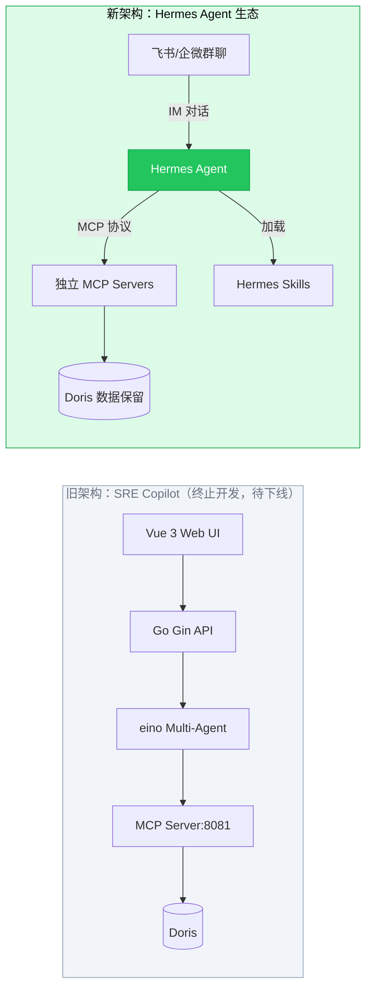
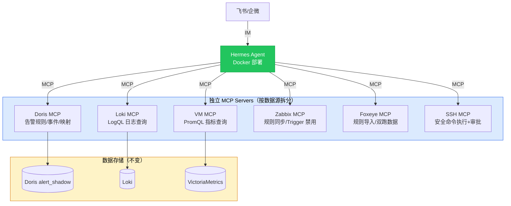
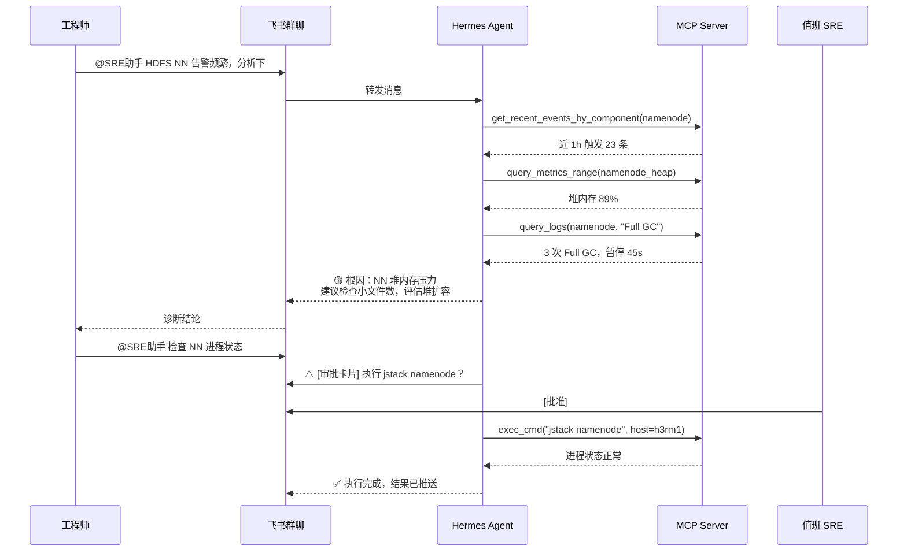
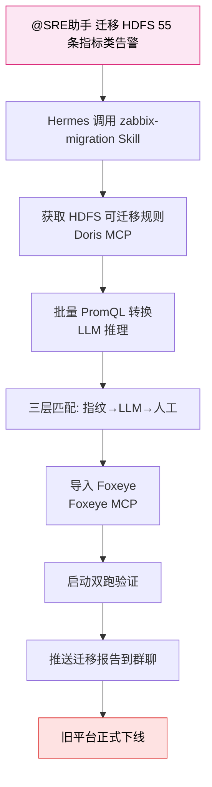
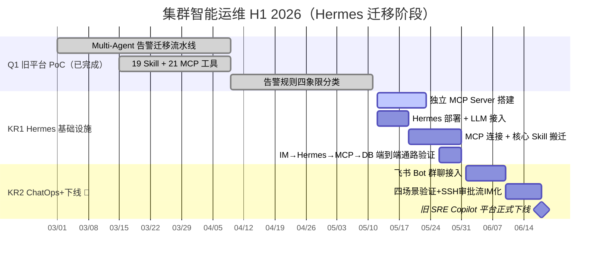

# 1 背景/现状

> **最后更新：2026-05-11**
> **重大方向调整**：终止自建 SRE Copilot 平台开发，转向 **Hermes Agent + Skill 生态**。

大数据集群智能运维此前基于自研 **SRE Copilot 平台**（Go + Gin + Vue 3 + eino Multi-Agent，代码位于 `zabbix-foxeye-transfer`）探索了 Multi-Agent 告警迁移、SSH 安全排障、声明式巡检、AI 根因分析等能力。该平台历经 16 次迭代，作为概念验证已充分证明了 AI 驱动运维的可行性，但其本质问题不可回避：

- **自建 Agent 框架投入产出比不可持续**：eino Multi-Agent、自定义 Web UI、A2UI 渲染器——每个都是独立工程领域，小团队无法与市面通用 Agent 产品竞争
- **交互路径不匹配**：自研 Chat UI 无法嵌入日常 IM 工作流，工程师需专门打开 Web 页面，导致功能使用率低
- **能力已有标准化替代**：Hermes Agent 原生提供 Skill 自进化、MCP 集成、20+ IM 平台接入，正是自建平台试图实现但受限于投入的能力

**当前状态**：

- **旧平台（SRE Copilot）**：功能可用但 PoC 使命已完成，即日起**终止新功能开发**，仅保留在线服务用于现有迁移流程过渡，待 Hermes 接管后正式下线
- **已验证核心能力**：告警迁移流水线（Multi-Agent 转换）、规则四象限分类、21 个 MCP 运维工具、19 个运维 Skill、声明式巡检框架——这些是 Hermes 迁移的**能力输入**，而非保留对象
- **数据资产**：Doris `alert_shadow` 中已积累的告警规则、规则映射、事件历史、分析报告等数据保留，搭建独立 MCP Server 供 Hermes 查询
- **Hermes 技术可行性**：已完成 Hermes Agent 调研（Skill 自进化、MCP 协议原生支持、飞书/企微/钉钉 20+ IM 平台集成），确认技术路线可行

---

# 2 问题分析

**1. 旧平台架构决定继续投入是资源错配**

- **交互层**：自研 Vue 3 Chat UI + A2UI 渲染器，与 Hermes 原生 IM 集成相比是劣势而非差异化
- **Agent 层**：自建 eino Multi-Agent 框架维护成本高，且无法享受社区生态（Skill 市场、MCP 工具库）
- **Skill 系统**：19 个 SKILL.md 绑定 eino 框架语法，不可跨平台移植
- **MCP Server**：21 个工具耦合在 Go 后端进程中，无法独立部署和扩展

**2. 运维交互入口缺失，能力无法触达一线工程师**

- 自研 Chat UI 需主动打开 Web 页面，无法嵌入值班 workflow
- 告警发生时工程师在飞书群聊收到 Zabbix/Foxeye 通知，却要切换到 Web 页面才能用 AI 诊断——割裂的体验
- Hermes 原生支持飞书/企微 Bot，可在群聊中直接 @ 触发运维操作，交互零摩擦

**3. 告警迁移流程依赖 Web UI，执行效率低**

- 当前流程：登录 → 选服务 → 筛规则 → 点击转换 → 等待 SSE → 人工核实
- Hermes 模式：群聊中 @机器人 "迁移 HDFS 的 55 条指标类告警" → Agent 自动执行全过程 → 推送统计报告
- 自建 Web UI 永远无法达到 IM 原生交互的便捷性

**4. 存量告警治理缺乏自动化闭环**

- 545 条 Zabbix 规则已按四象限分类，但迁移执行仍需人工逐批在 Web UI 触发
- 低风险高频噪音告警的识别和关闭需要 Agent 持续分析 + 推送建议，而非人工定期筛查
- Hermes 的定时调度 + Skill 自进化能力天然适合「持续分析 → 推送建议 → 一键确认 → 自动执行」的闭环

---

# 3 方案/目标

**Objective**：终止自建 SRE Copilot 平台投入，将已验证的告警迁移、故障诊断、集群巡检能力全量迁移到 Hermes Agent 生态，通过 IM 原生交互实现 ChatOps 化，交付真正嵌入工程师工作流的智能运维体验，旧平台在能力等价迁移后正式下线。

**已交付里程碑（Q1，旧平台 PoC 验证阶段）**：

- ✅ **Multi-Agent 告警迁移流水线**（2026-03 ~ 04）：Zabbix → Foxeye 规则自动转换（指标类 PromQL + 日志类 LogQL），三层匹配策略验证通过
- ✅ **19 个运维 Skill**（2026-03 ~ 04）：覆盖告警诊断/日志查询/指标查询/集群巡检/SSH 排障，SKILL.md 格式定义完整
- ✅ **21 个 MCP 运维工具**（2026-04）：告警/指标/日志/SSH/巡检五类工具，经验证可被外部 Agent 调用（已验证 Claude Desktop 接入）
- ✅ **告警规则四象限分类**（2026-05）：545 条 Zabbix 规则逐条标注类型（指标/日志/配置变更/硬件）和迁移状态，依赖关系清晰
- ✅ **Hermes 技术可行性确认**（2026-05-11）：Skill 自进化 + MCP 协议 + 飞书/企微/钉钉 IM 集成的技术路线已验证可行

**三个 KR**：

- **KR1**：Hermes 基础设施部署 + 核心 Skill 搬迁。**预计 5 月 31 日**，👤 Hermes 上线并连接 ≥ 3 个独立 MCP Server，≥ 3 个核心 Skill 可用；🔗 飞书 Bot 审批需企业管理员配合
- **KR2**：IM ChatOps 上线 + 旧平台下线。**预计 6 月 18 日**，👤 飞书/企微群聊中 ≥ 4 个运维场景可用，SSH 审批流 IM 化闭环，旧 SRE Copilot 正式停服

> **告警迁移**是独立的业务线，由 [[2026-H1-告警迁移OKR]] 独立追踪。本 OKR 聚焦将运维能力的**交互方式**从 Web UI 迁移到 Hermes IM ChatOps。

---

## 3.1 Hermes 基础设施 + 核心 Skill 搬迁（KR1）

部署 Hermes Agent，搭建独立 MCP Server，将旧平台核心 Skill 重写为 Hermes 原生格式。本 KR 是后续告警迁移和 ChatOps 的基础设施。

**核心设计思路**：

- **MCP 工具独立化**：将旧平台耦合在 Go 进程中的 21 个工具，按数据源拆分为独立 MCP Server，每个 Server 专注一个后端（Doris/Loki/VictoriaMetrics/Zabbix/Foxeye/SSH），独立部署、独立扩展
- **Hermes 部署**：Docker 方式在内网服务器部署 Hermes Agent，接入内网 DeepSeek LLM（`aix-internal.panther.sohurdc.com`），配置 MCP 连接和 IM 网关
- **数据完整保留**：Doris `alert_shadow` 18 张表不做任何变更，独立 MCP Server 通过 MySQL 协议直连
- **旧平台过渡期**：SRE Copilot（端口 8080/8081）保持运行，仅作为当前迁移流程的过渡工具，不投入新开发

**关键任务**：

- [ ] 从旧平台提取 MCP 工具逻辑，搭建独立 MCP Server（优先 Doris/Loki/Zabbix 三个，覆盖告警迁移核心链路）
- [ ] Docker 化部署 Hermes Agent，配置内网 LLM 后端
- [ ] Hermes 连接独立 MCP Server，验证工具可发现、可调用
- [ ] 飞书/企微 Bot 申请与对接
- [ ] 端到端通路验证：IM → Hermes → MCP → DB 至少一条链路跑通

---

## 3.2 IM ChatOps 上线（KR2）

通过 Hermes 原生 IM 集成，将运维操作嵌入飞书/企微群聊对话，实现零摩擦的 ChatOps 体验。

**核心设计思路**：

- **交互入口**：飞书 SRE 值班群 + 企微运维群，@SRE助手 触发对话，无需离开 IM
- **三个核心场景**：告警自动推送 → 一键诊断 → 结论推送（诊断场景）；每日定时或手动触发巡检 → 报告推送（巡检场景）；自然语言查询日志 → 结果推送（日志场景）
- **SSH 审批流 IM 闭环**：涉及生产变更的操作，审批卡片推送飞书，值班 SRE 在飞书内一键审批/拒绝，审批记录入审计日志，不依赖任何旧平台 Web UI

**关键任务**：

- [ ] 飞书 Bot 创建 + 权限配置 + 加入 SRE 值班群
- [ ] 告警诊断场景端到端验证（收到告警 → IM 对话诊断 → 结论推送群聊）
- [ ] 集群巡检场景端到端验证（"巡检 HDFS 集群" → 巡检报告推送）
- [ ] 日志查询场景端到端验证（"查 HS2 最近 OOM 日志" → 结果推送）
- [ ] SSH 审批流 IM 化（审批卡片推送 + 飞书内一键审批 + 审计日志落库）

---

## 3.3 旧平台下线（KR3）

将告警迁移全流程从 Web UI 驱动改为 IM 对话驱动，能力等价迁移后正式下线旧 SRE Copilot 平台。

**核心设计思路**：

- **迁移流程 IM 化**：群聊发起 → Hermes 调用 convert_rules_workflow → 实时回报进度到群聊 → 完成后推送统计报告
- **双跑验证保留**：event_poll_job 逻辑提取为独立 Cron Job（不依赖旧平台），双跑数据通过 Doris MCP 查询
- **旧平台下线**：KR4 完成后，SRE Copilot（端口 8080/8081）正式停服，Doris 数据完整保留

**关键任务**：

- [ ] 告警迁移 Skill 封装（convert_rules_workflow + match_rules + 双跑统计）
- [ ] 指标类试点：IM 对话完成 HDFS 55 条告警迁移
- [ ] 日志类试点：IM 对话完成日志类告警迁移
- [ ] 旧平台能力对照检查清单（逐项确认 Hermes 侧已复现）
- [ ] SRE Copilot（端口 8080/8081）正式停服下线

---

# 4 关键事项拆解

| KR | 任务 | 时间 | 说明 |
|---|---|---|---|
| **Q1** | ✅ Multi-Agent 告警迁移流水线 | 3.1 - 4.9 | 旧平台 PoC：指标类 PromQL + 日志类 LogQL 自动转换 |
| | ✅ 19 Skill + 21 MCP 工具 | 3.15 - 4.9 | 旧平台 PoC：覆盖诊断/迁移/巡检/日志/SSH 场景 |
| | ✅ 告警规则四象限分类 | 4.9 - 5.11 | 545 条规则逐条标注类型+状态，依赖关系清晰 |
| **KR1** | Doris/Loki/Zabbix 独立 MCP Server 搭建 | 5.12 - 5.23 | 从旧平台提取工具逻辑，独立部署 |
| | Hermes Docker 部署 + 内网 LLM 接入 | 5.12 - 5.19 | 接入 aix-internal DeepSeek，配置 MCP 连接 |
| | 核心 Skill 搬迁（alert-diagnosis/migration/log-query） | 5.19 - 5.31 | ≥3 个核心 Skill Hermes 可用 |
| | IM→Hermes→MCP→DB 端到端通路验证 | 5.26 - 5.31 | 首条链路跑通 |
| **KR2** | 👤 飞书 Bot 群聊接入 + 四场景验证 | 6.1 - 6.18 | 诊断+巡检+日志+迁移四场景 + SSH 审批流 IM 化 |
| | 👤 **旧 SRE Copilot 平台正式下线** | **6.18** | 端口 8080/8081 停服，Doris 数据保留 |
| | 🔗 飞书 Bot 审批 | 5.12 - 5.23 | 外部依赖，需企业管理员审批 |
