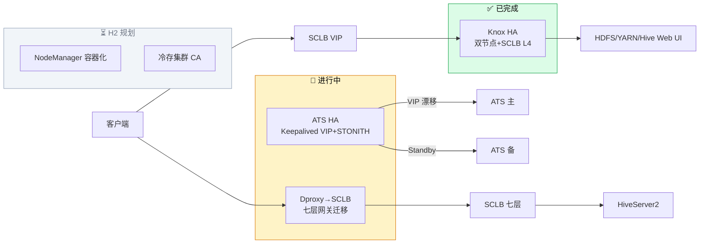
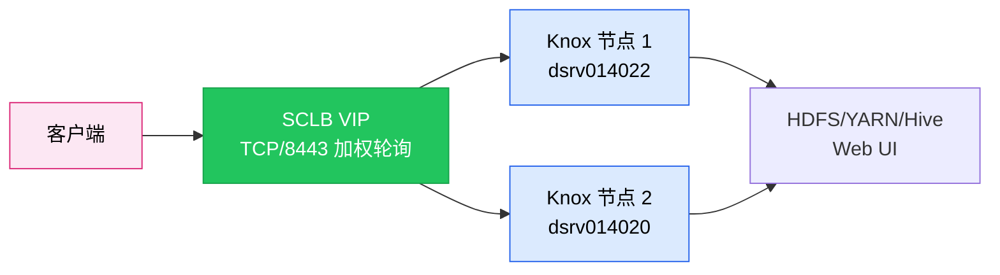
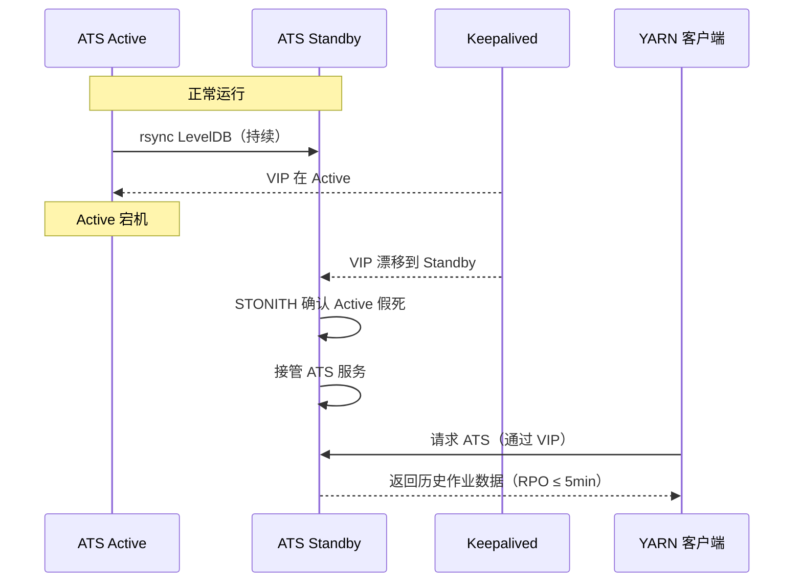
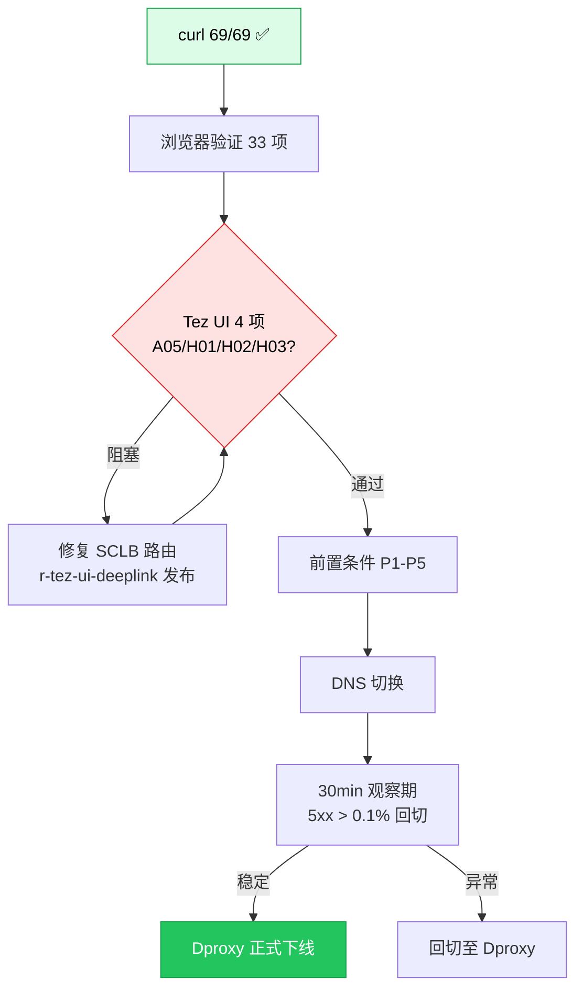
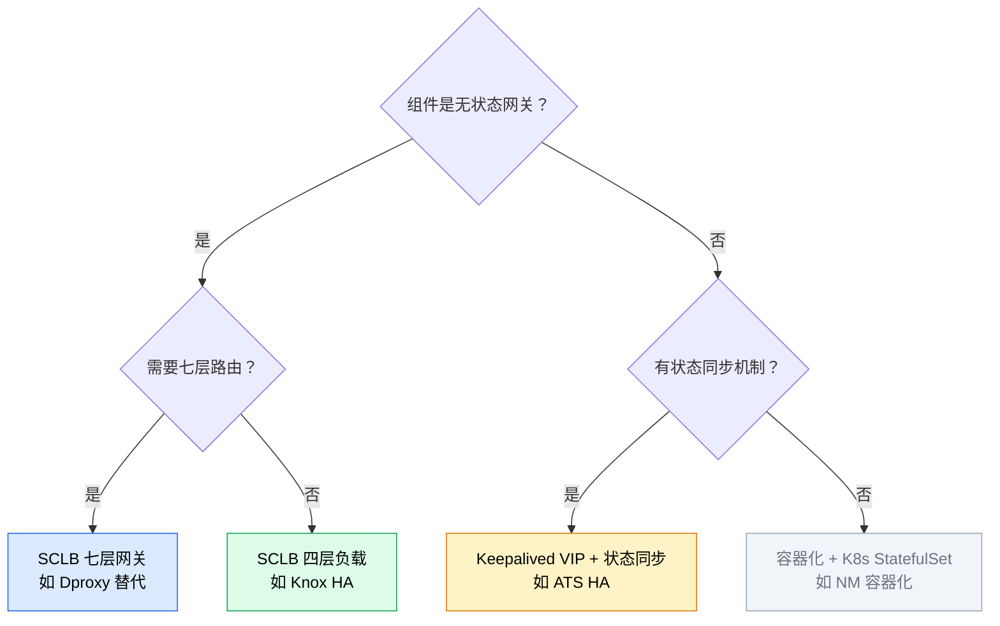
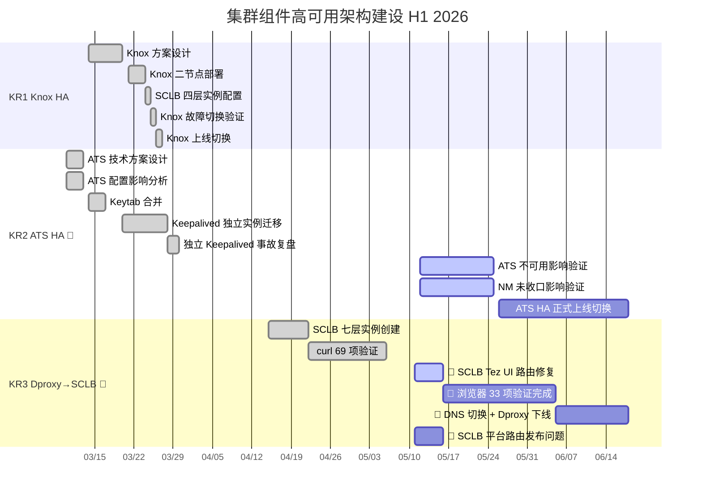

# 1 背景/现状

> **最后更新：2026-05-11**

大数据集群中存在多个关键单点组件，其可用性直接决定上层计算/存储/查询链路的稳定性。当前已识别并推进三个核心组件的高可用建设：

- **Knox 网关高可用**（✅ 已上线）：双节点 + SCLB 四层负载（TCP/8443 加权轮询），故障切换验证通过，客户端无感
- **TimelineServer（ATS）高可用**（🔄 建设中）：Keepalived VIP 漂移 + STONITH，RPO≈5min，RTO<60s；独立 keepalived 实例迁移已完成，待完成 NM 收口影响验证与作业级影响验证（DDL 已延至 06-15）
- **Dproxy → SCLB 七层网关迁移**（🔄 进行中）：SCLB 七层实例已创建，curl 69/69 已通过；浏览器业务级验证（33 项）进行中，Tez UI deep-link 路由 SCLB 平台异常阻塞（A05/H01/H02/H03 4 项未通过）
- **NodeManager 容器化 / 冷存集群 CA 方案**（⏳ 待办）：H2 规划

---

# 2 问题分析

**1. 单点故障风险是集群稳定性的最大威胁**

- **Knox** 作为所有 Web UI 的统一入口网关，单节点宕机导致全部 Web 访问中断
- **TimelineServer** 单节点模式下，ATS 宕机导致历史作业信息不可查询、**Spark History Server** 失联
- **Dproxy** 自身是单点且不支持七层路由策略，所有 **HiveServer2** 流量经过它

**2. HA 建设缺乏统一规划与经验复用**

- Knox HA 用 SCLB 四层负载、ATS HA 用 Keepalived VIP、Dproxy 用 SCLB 七层——三个项目各自探索，方案选型经验未互通
- Keepalived 独立实例迁移中暴露操作顺序敏感性（事故：VRRP 选举冲突 → ATS 反复重启 5 分钟 + Ambari 误覆盖配置文件）
- 缺少统一的「组件 HA 方案选型决策树」

**3. HA 切换对下游组件的影响未充分验证**

- ATS 切换到 HA 域名后，**NodeManager** 是否硬编码旧地址？
- ATS 不可用对各类型作业（**Tez/Spark/MR**）的实际影响边界不清
- HA 切换后相关组件重启策略未标准化

---

# 3 方案/目标

**Objective**：以 Knox HA 为成熟范本，以 ATS HA 为攻坚重点，以 Dproxy 七层迁移为收口，建立「组件 HA 方案选型决策树」与「HA 切换标准化 SOP」，在 H1 内完成大数据集群三大关键单点组件的 HA 消除。

**已交付里程碑**：

- ✅ **Knox HA 全链路交付**（2026-03）：方案设计 → 二节点部署 → SCLB 配置 → 故障切换验证 → 上线切换，5 个子任务全部完成
- ✅ **ATS HA 技术方案 + 事故复盘**（2026-03）：Keepalived VIP + STONITH 方案设计，三大技术隐患识别，事故复盘经验沉淀
- ✅ **ATS HA Keytab 合并 + Keepalived 独立实例迁移**（2026-03）
- ✅ **Dproxy SCLB 七层实例创建 + curl 验证**（2026-04）：实例就绪，69 项 curl 测试全部通过
- ✅ **Dproxy 浏览器业务级验证清单**（2026-05）：33 项验证清单已建立，21 项 HTTP/资源级已收敛

**三个 KR（KR2/KR3 并行推进，HA 方法论作为各 KR 的沉淀产出）**：

- **KR1**：Knox 网关高可用。**已完成（100%）**，5 个子任务全部交付，Web UI 入口单点故障已消除。交付物含 HA 方案选型参考（SCLB 四层负载模式）
- **KR2**：TimelineServer 高可用上线。**预计 6 月 18 日**，👤 ATS 不可用影响验证 + NM 收口验证 + HA 正式切换，RTO<60s 验收通过
- **KR3**：Dproxy → SCLB 七层网关全量迁移。**预计 6 月 18 日**，👤 完成 Tez UI 路由修复 + 浏览器 33 项验证 + DNS 切换 + Dproxy 下线；🔗 SCLB 平台路由发布问题需平台侧配合

---

## 3.1 Knox 网关高可用（KR1）✅ 已完成

Knox 是大数据集群所有 Web UI 的统一入口网关。采用双节点 + SCLB 四层负载方案，故障切换客户端无感。

**核心设计思路**：

- **双节点部署**：Knox 在两台主机上对称部署，配置通过 Ambari 配置组同步
- **SCLB 四层负载**：TCP/8443 加权轮询，健康检查端口探测，失败自动摘除
- **故障切换验证**：主动关闭节点 1 → SCLB 自动转发到节点 2，客户端无明显感知

---

## 3.2 TimelineServer 高可用（KR2）🔄 进行中

ATS 是 YARN 的作业历史服务，Spark History Server 依赖它查询已完成作业。采用双节点 + Keepalived VIP 漂移 + LevelDB 同步 + STONITH 防脑裂。

**核心设计思路**：

- **Keepalived VIP 漂移**：双节点运行独立 Keepalived 实例，virtual_router_id 54，VIP 在 Active 节点上
- **LevelDB 准实时同步**：rsync + inotify 同步 `/var/lib/hadoop-yarn/timeline/`，RPO 接受 5min
- **STONITH 防脑裂**：Standby 检测到 Active 假死后，SSH 强制关机后接管
- **事故教训**：两个 Keepalived 进程同时管理同一 VRRP 实例会触发选举冲突；Ambari 重启 ATS 可能覆盖配置文件。SOP 已更新：先停旧 → 验证 VIP 释放 → 再启新

---

## 3.3 Dproxy → SCLB 七层网关迁移（KR3）🔄 进行中

HiveServer2 当前通过 Dproxy 代理访问，Dproxy 自身是单点且缺乏七层路由能力。目标用 SCLB 七层网关替代。

**核心设计思路**：

- **业务验证先行**：33 项浏览器验证清单（按 A-I 模块覆盖 Knox/Tez UI/Timeline/Flink/JHS/日志白名单），逐项新旧对比验证
- **当前阻塞**：Tez UI deep-link 静态资源路由在 SCLB 平台存在生效异常（`r-tez-ui-deeplink-assets` / `r-tez-ui-deeplink-pages` 长期"发布中"），已创建跟进任务 [[SCLB Tez UI Deep-Link 静态资源路由修复]]
- **切换路径**：33 项验证全部通过 → DNS 切换前置条件满足（P1-P5）→ 与平台协调切换地址 → Dproxy 域名切换 → 30 分钟观察期 → Dproxy 下线

---

## 3.4 HA 建设方法论沉淀（KR4）

将三个项目的实践经验提炼为可复用的方法论，指导后续 HA 建设决策。

**核心设计思路**：

- **组件 HA 方案选型决策树**：按组件类型（无状态网关 / 有状态服务 / 计算组件）→ 按路由需求（L4/L7）→ 按状态同步机制 → 推荐方案
- **HA 切换标准化 SOP**：预检（双节点一致性）→ 切换（按组件类型执行）→ 验证（功能+性能）→ 监控（追加 HA 告警）→ 回滚

---

# 4 关键事项拆解

| KR       | 任务                                 | 时间          | 说明                          |
| -------- | ---------------------------------- | ----------- | --------------------------- |
| **KR1**  | ✅ Knox 高可用方案设计                     | 3.14 - 3.20 | 双节点 + SCLB 四层方案技术选型         |
|          | ✅ Knox 二节点部署与配置同步                  | 3.21 - 3.24 | Ambari 配置组对齐，HA 域名生效        |
|          | ✅ Knox-SCLB 四层实例配置                 | 3.24 - 3.25 | TCP/8443 加权轮询，健康检查上线        |
|          | ✅ Knox-HA 故障切换验证                   | 3.25 - 3.26 | 主动/被动切换验证通过，客户端无感           |
|          | ✅ Knox-HA 上线切换与监控                  | 3.26 - 3.27 | 生产切换完成                      |
| **KR2**  | ✅ ATS 技术方案 + 配置影响分析                | 3.10 - 3.13 | Keepalived VIP + STONITH 方案 |
|          | ✅ Keytab 合并 + Keepalived 迁移 + 事故复盘 | 3.14 - 3.30 | 独立实例迁移 + SOP 更新             |
|          | 👤 ATS 不可用影响验证 + NM 收口验证           | 5.12 - 5.25 | 两任务并行，验证 ATS HA 切换安全性       |
|          | 👤 ATS HA 正式上线切换                   | 5.26 - 6.18 | 生产切换 + 监控告警追加               |
| **KR3**  | ✅ SCLB 实例创建 + curl 验证              | 4.15 - 5.6  | 69/69 通过                    |
|          | 👤 SCLB Tez UI 路由修复                | 5.11 - 5.16 | 协调 SCLB 平台修复路由发布异常          |
|          | 👤 浏览器 33 项验证 + DNS 切换 + Dproxy 下线 | 5.16 - 6.18 | 全量验证通过后切换，30min 观察期         |
|          | 🔗 SCLB 平台路由发布问题                   | 5.11 - 5.16 | 外部依赖，需 SCLB 平台侧配合           |
| *HA 方法论* | 随 KR1-KR3 产出（非独立 KR）               | 6.18 前      | 决策树 + SOP 作为三个项目的自然沉淀       |
