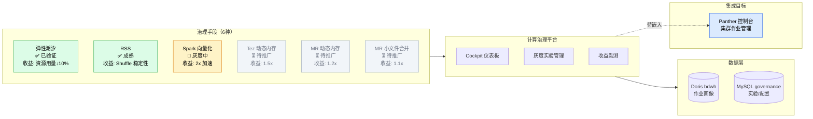
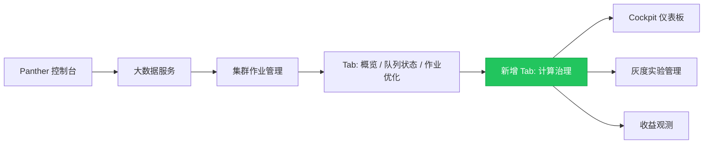
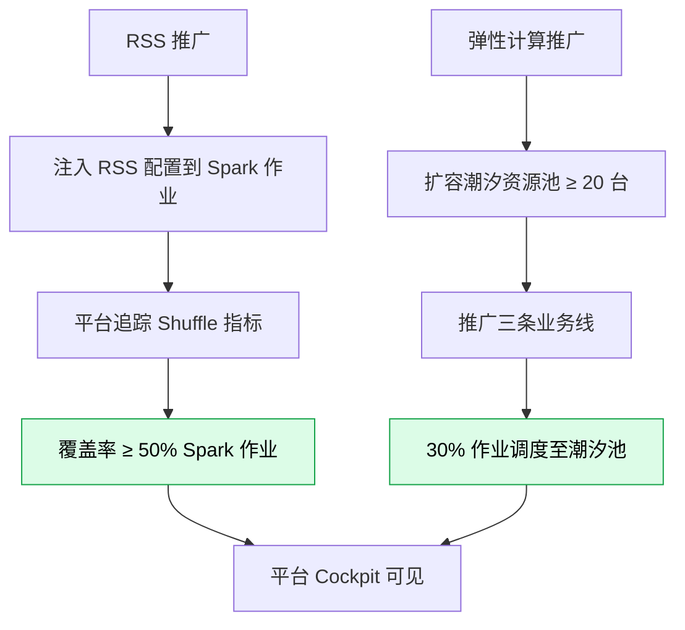
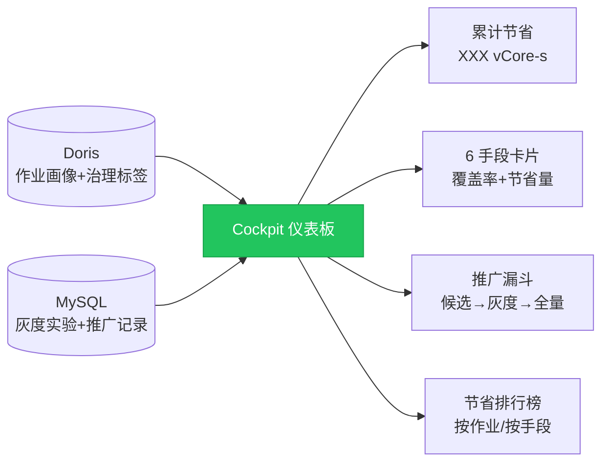
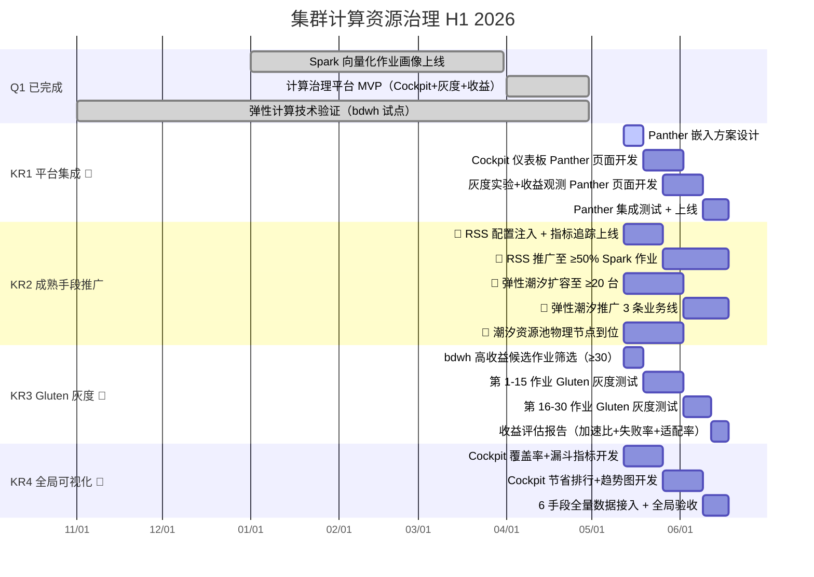

# 1 背景/现状

> **最后更新：2026-05-11**

大数据集群面临「夜间紧张、白天浪费」的结构性资源矛盾：夜间高峰（1:00-7:00）CPU 和内存利用率峰值超 90%，白天利用率不足 60%。集群计算资源治理通过多种技术手段优化作业资源效率，当前已识别 6 种治理手段，成熟度差异显著：

- **弹性计算（潮汐调度）**：基于 YARN Node Labels 分区机制，将离线集群闲置节点划入弹性资源池（elastic-ec-exclusive 标签），通过 Panther 平台规则在夜间高峰动态调度 NodeManager，白天回收。spark/mr 调度脚本已开发完成，bdwh 部分作业已使用潮汐调度。常驻 4 台 + 潮汐 3 台，可扩容 30 台。技术可行性已验证，缺大规模铺开
- **RSS（Remote Shuffle Service）**：Spark 作业 Shuffle 数据远程存管，减少本地磁盘压力，shuffle 稳定性提升。技术成熟，可大规模推广
- **Spark 向量化（Gluten）**：通过 Spark Plugin 替换原生执行引擎为向量化引擎（Velox/ClickHouse），理论加速 2x。作业画像系统已上线，灰度实验工作流已就绪（候选筛选 → 命令转换 → SSH 远程执行 → 指标对比）。高风险高收益，需优化引擎正确识别适配作业
- **Tez 引擎优化**：动态内存调整，理论加速 1.5x
- **MR 动态内存**：MapReduce 作业 JVM 参数动态调整，理论收益 1.2x
- **MR 小文件合并**：减少小文件碎片对计算效率的影响，理论收益 1.1x

**计算治理平台（visual-compute-governance）**：
- 技术栈：React 18 + TypeScript + Spring Boot 3.2 + MyBatis 双数据源（Doris 只读 + MySQL 业务库）
- 已建成：Cockpit 治理仪表板（6 手段卡片 + 累计节省 + 覆盖率趋势 + 排行榜）、灰度实验管理（候选发现 → 命令转换 → SSH 执行 → 指标对比）、收益观测（资源趋势 + 作业反查）
- Panther 集成：通过 Cookie 认证自动获取 spark-submit 命令，已打通但未嵌入 Panther 控制台
- 本地开发运行（端口 18080/13000），未生产部署

---

# 2 问题分析

**1. 治理手段成熟度差异大，但缺乏统一的推广决策框架**

- RSS 和弹性计算技术已验证、收益明确，但大规模推广进度不可见，覆盖了多少作业/多少资源节省说不清
- Spark 向量化收益高但风险也高（引擎兼容性、作业失败回退），需要更严谨的灰度验证和收益评估
- Tez/MR 等传统手段收益较小，优先级排不上，但积少成多仍有价值
- 缺少一个全局视图来回答「我们在治理上到底省了多少资源」

**2. 计算治理平台能力就绪但未嵌入日常工作流**

- Cockpit 仪表板只能在本地 dev 环境看，团队其他成员和业务方看不到
- Panther 控制台已有「集群作业管理」入口，是天然的平台集成点
- 灰度实验工作流功能完整，但操作仍在独立平台，未与 Panther 作业浏览器打通

**3. 弹性计算规模不足，潮汐资源池容量有限**

- 当前常驻 4 台 + 潮汐 3 台，可分配机器 30 台，整体容量偏小
- 30% 作业调度至潮汐资源池的目标差距大
- NM on CVM 性能问题未解决，制约潮汐资源池弹性扩容

---

# 3 方案/目标

**Objective**：以计算治理统一可视化平台为核心，将 6 种治理手段的覆盖度、收益、实验进度统一纳管，成熟手段（RSS/弹性计算）重点推动大规模铺开，高风险手段（Spark 向量化）严谨灰度验证，平台嵌入 Panther 控制台实现全局可见。

**已交付里程碑**：

- ✅ **Spark 向量化作业画像上线**（2026-03），14 个 SQL 级 UDF，GSS 评分 0-100 分
- ✅ **计算治理平台 MVP**（2026-04）：Cockpit 仪表板 + 灰度实验管理 + 收益观测，6 治理手段卡片，Doris + MySQL 双数据源
- ✅ **灰度测试 V2**（2026-04）：候选发现 → 命令转换 → SSH 执行 → 指标对比 → 雷达图，参数化 expr 求值器
- ✅ **弹性计算技术验证**（2025-11）：spark/mr 调度脚本完成，bdwh 部分作业已使用潮汐调度

**四个 KR（KR1/KR2 并行推进，KR3 灰度验证贯穿）**：

- **KR1**：计算治理平台嵌入 Panther 控制台。**预计 6 月 18 日**，👤 Cockpit 仪表板 + 灰度实验管理作为 Panther「集群作业管理」子页面嵌入，团队和业务方可直接访问
- **KR2**：成熟治理手段大规模推广（RSS + 弹性计算）。**预计 6 月 18 日**，👤 RSS 覆盖 ≥ 50% Spark 作业；弹性潮汐扩容至 ≥ 20 台 + 覆盖 bdwh/panther/智能平台三条业务线；🔗 潮汐资源池扩容依赖冷存/闲置节点到位
- **KR3**：高风险手段严谨灰度验证（Spark 向量化 Gluten）。**预计 6 月 18 日**，👤 完成 ≥ 30 个 bdwh 高收益作业 Gluten 灰度测试，输出收益评估报告（含加速比 + 失败率 + 适配率）
- **KR4**：全局治理收益可视化 + 覆盖度追踪。**预计 6 月 18 日**，👤 Cockpit 仪表板可实时展示 6 手段的覆盖率、累计资源节省、推广进度，作为全局治理决策依据

---

## 3.1 平台 Panther 集成（KR1）

将计算治理平台从本地 dev 环境嵌入 Panther 控制台「集群作业管理」，实现全局可见。

**核心设计思路**：

- **集成方式**：复用 Panther 现有认证体系（Cookie），前端打包为 Panther 子应用或独立部署嵌入 iframe
- **嵌入位置**：Panther 控制台 → 大数据服务 → 集群作业管理 → 新增「计算治理」Tab（含 Cockpit + 灰度测试 + 收益观测）
- **权限对齐**：Panther 登录态自动传递，无需独立用户体系

---

## 3.2 成熟手段大规模推广（KR2）

RSS 和弹性计算技术已验证，H1 重点推动大规模铺开，直接产生可量化资源节省。

**核心设计思路**：

- **RSS 推广**：在 Spark 作业提交参数中注入 RSS 配置 → 灰度平台追踪开启 RSS 前后的 Shuffle 指标（溢写量/失败率/耗时）→ 平台统计覆盖率
- **弹性计算推广**：扩容潮汐资源池（冷存未分配 + 离线闲置）→ 推广至 panther/智能平台/集团商业部三条业务线 → 平台统计弹性作业比例和资源节省
- **外部依赖明确**：潮汐资源池扩容依赖物理节点到位；RSS 服务端由基础设施团队维护

---

## 3.3 高风险手段灰度验证（KR3）

Spark 向量化（Gluten）收益预期最高但风险最大，需要严谨的灰度验证流程。灰度实验工作流已就绪，H1 聚焦 bdwh 高收益作业的批量验证。

**核心设计思路**：

- **候选筛选**：基于作业画像 GSS 评分 + bdwh 白名单，筛选 ≥ 30 个高收益低风险候选作业
- **灰度执行**：Spark 命令自动注入 Gluten 参数 → SSH 远程提交 → 实时日志监控 → 指标对比（运行时间/CPU/内存/Shuffle 量）
- **验收标准**：加速比 ≥ 1.5x + 失败率 < 10% + 适配率 > 70%，输出收益评估报告

---

## 3.4 全局收益可视化（KR4）

Cockpit 仪表板作为全局治理决策依据，实时展示 6 手段的覆盖率、资源节省、推广进度。

**核心设计思路**：

- **仪表板指标**：Hero 数字（累计节省 vCore-s / CPU 年）+ 6 手段卡片（覆盖率+节省量）+ 漏斗图（候选→灰度→推广→全量）+ 覆盖率趋势 + 节省排行榜
- **数据来源**：Doris 作业画像表（标签数据）+ MySQL 灰度实验表（实验进度）+ 手动配置的策略收益系数
- **全局可见**：嵌入 Panther 后，任何有权限的团队成员和业务方都能看到治理全貌

---

# 4 关键事项拆解

| KR | 任务 | 时间 | 说明 |
|---|---|---|---|
| **Q1** | ✅ Spark 向量化作业画像上线 | 1.1 - 3.31 | 14 个 SQL UDF，GSS 评分 0-100 |
| | ✅ 计算治理平台 MVP | 4.1 - 4.30 | Cockpit + 灰度测试 + 收益观测，v0.4 |
| | ✅ 弹性计算技术验证 | 2025.11 - 4.30 | bdwh 部分作业已使用潮汐调度 |
| **KR1** | 👤 Panther 嵌入方案设计 | 5.12 - 5.19 | 嵌入方式（子应用/iframe）+ 权限方案（1w） |
| | 👤 Cockpit 仪表板 Panther 页面开发 | 5.19 - 6.2 | Hero 数字 + 6 手段卡片 + 覆盖率趋势（2w） |
| | 👤 灰度实验+收益观测 Panther 页面开发 | 5.26 - 6.9 | 命令转换 + SSH 执行 + 指标对比 + 收益趋势（2w） |
| | 👤 Panther 集成测试 + 上线 | 6.9 - 6.18 | 「集群作业管理→计算治理」Tab 可用（1.5w） |
| **KR2** | 👤 RSS 配置注入 + 平台追踪指标上线 | 5.12 - 5.26 | Spark 参数注入 RSS 配置 + Cockpit 展示覆盖率（2w） |
| | 👤 RSS 推广至 ≥ 50% Spark 作业 | 5.26 - 6.18 | 逐作业开启 RSS + 监控 Shuffle 指标稳定性（3w） |
| | 👤 弹性潮汐扩容至 ≥ 20 台 | 5.12 - 6.2 | 冷存未分配 + 离线闲置节点加入潮汐池（3w） |
| | 👤 弹性潮汐推广 3 条业务线 | 6.2 - 6.18 | panther/智能平台/集团商业部（2.5w） |
| | 🔗 潮汐资源池物理节点到位 | 5.12 - 6.2 | 外部依赖：冷存/闲置节点协调到位 |
| **KR3** | 👤 bdwh 高收益候选作业筛选 | 5.12 - 5.19 | GSS 评分 + 画像数据筛选 ≥ 30 候选作业（1w） |
| | 👤 第 1-15 作业 Gluten 灰度测试 | 5.19 - 6.2 | SSH 远程提交 + 指标采集 + 对比分析（2w） |
| | 👤 第 16-30 作业 Gluten 灰度测试 | 6.2 - 6.12 | 第二批灰度执行 + 指标采集（1.5w） |
| | 👤 收益评估报告输出 | 6.12 - 6.18 | 加速比/失败率/适配率量化 + 推广建议（1w） |
| **KR4** | 👤 Cockpit 覆盖率+漏斗指标开发 | 5.12 - 5.26 | 候选→灰度→推广→全量漏斗 + 手段覆盖率（2w） |
| | 👤 Cockpit 节省排行+趋势图开发 | 5.26 - 6.9 | 按作业/按手段排行榜 + 资源趋势对比（2w） |
| | 👤 6 手段全量数据接入 + 全局验收 | 6.9 - 6.18 | Panther 嵌入后团队/业务方可访问（1.5w） |
