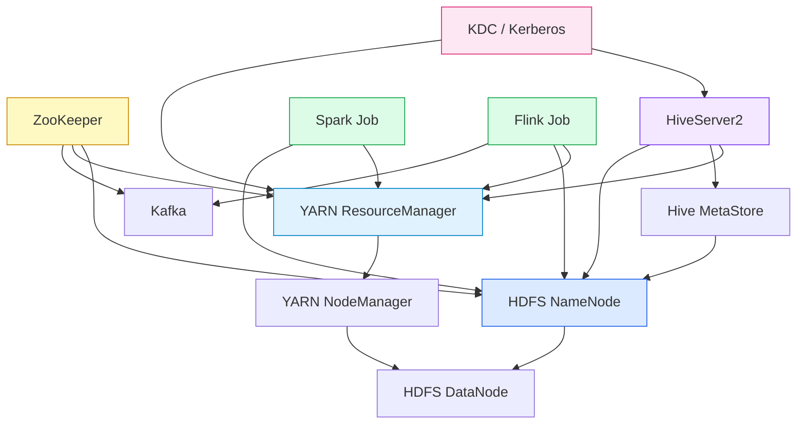
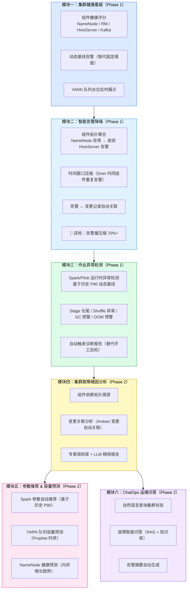
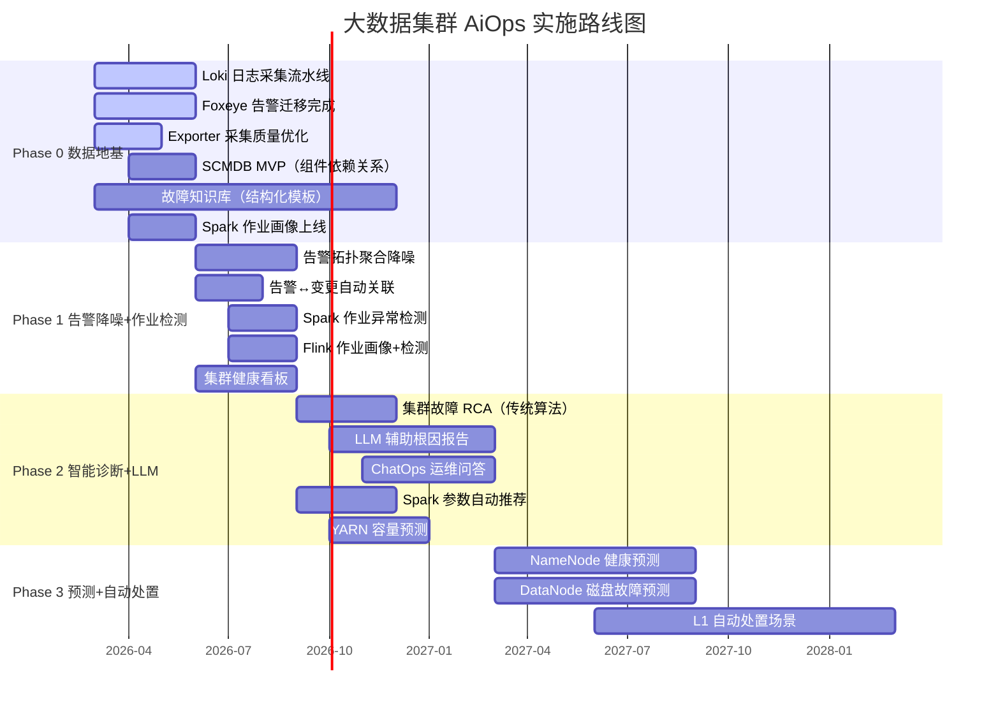
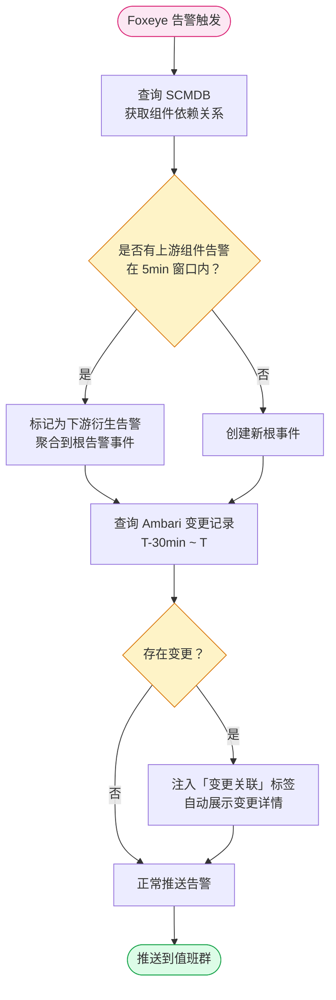
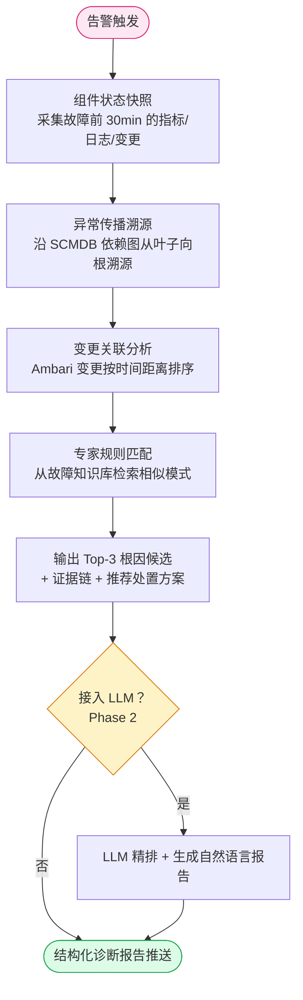
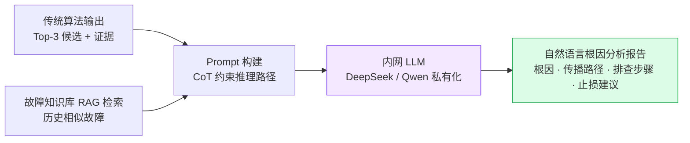

# 大数据集群 AiOps 可行性分析报告

> 作者：汀（搜狐 RDC SRE）
> 日期：2026-03-11
> 背景：基于业界案例调研 + 当前团队基础设施现状，评估我团队 AiOps 项目的可行性、实施路径和产品形态

---

## 一、我们的 AiOps 与业界有什么本质不同？

业界大多数 AiOps 案例（小红书、腾讯、美团）都是面向**微服务+云原生架构**的，其核心能力建立在 HTTP 调用链（Trace）之上。而我们运维的是**大数据集群基础设施**，两者有根本差异：

| 维度 | 互联网公司 AiOps（微服务） | 我们（大数据集群 AiOps） |
|---|---|---|
| **拓扑基础** | HTTP 调用链 Trace（可追踪每次请求） | 无 HTTP Trace，依赖组件依赖关系图（HDFS→YARN→HiveServer/Spark） |
| **故障单元** | 微服务 Pod/实例 | 集群组件（NameNode/DataNode/RM/NM）+ 批处理作业（Spark/Flink Job） |
| **故障类型** | HTTP 超时、服务 OOM、依赖服务抖动 | NameNode GC 风暴、DataNode 磁盘坏道、YARN 队列饱和、Spark OOM/数据倾斜、Hive 慢查询、Kerberos 票据过期 |
| **变更主要来源** | 代码发布、配置变更 | Ambari 配置变更、集群扩缩容、参数调整、组件升级 |
| **资源调度** | K8s Pod 弹性调度 | YARN 队列容量静态分配 + 动态调整 |
| **作业生命周期** | 无状态 HTTP 请求（毫秒级） | 批处理作业（分钟~小时级）、流处理作业（长期运行） |

**核心结论：我们不能照搬微服务 AiOps 方案，需要设计适合大数据集群运维场景的专属 AiOps 体系。**

---

## 二、当前基础设施现状评估

### 2.1 可观测体系（数据地基）

```
可观测成熟度评估：★★★☆☆（建设中）

指标（Metrics）
  [✅ 有] Prometheus + Exporter（Hadoop/Kafka/Spark JMX Exporter）
  [⚠️ 在建] Exporter 采集逻辑优化（数据质量有待提升）
  [❓ 缺失] 统一动态基线，当前主要依赖静态阈值告警

日志（Logs）
  [⚠️ 在建] Loki 日志采集流水线设计与开发
  [❌ 未做] 日志模板化（Drain 等），日志告警规则刚开始接入 Foxeye

链路（Traces）
  [❌ 不适用] 大数据集群无 HTTP 调用链
  [⚠️ 部分] 作业 DAG（Spark/Flink UI 有，但未结构化入库）
  [⚠️ 规划中] SCMDB 服务自动发现（组件依赖关系图的基础）
```

### 2.2 告警体系

```
告警成熟度评估：★★★☆☆（升级中）

[✅ 有] Ambari 原生告警（已有完整规则集）
[✅ 完成] Ambari 配置变更审计邮件（变更追踪的基础）
[⚠️ 在建] 告警智能迁移：Ambari → Foxeye（双跑验证系统开发中）
[⚠️ 在建] Foxeye 基于 Loki 日志的告警规则添加
[❌ 缺失] 告警聚合降噪能力（多个相关告警无法自动收敛）
[❌ 缺失] 告警与变更记录的自动关联
```

### 2.3 作业画像与服务治理

```
作业画像成熟度评估：★★★☆☆（有基础）

[✅ 有] Spark 向量化作业画像系统（开发中，有基础数据积累）
[⚠️ 在建] 作业画像优化 & 测试
[❌ 缺失] Flink 作业画像
[❌ 未建] SCMDB（服务自动发现方案已设计，未实施）
[❌ 未建] 历史故障知识库
```

### 2.4 自动化与处置能力

```
自动化成熟度评估：★★☆☆☆（基础阶段）

[✅ 有] Ambari 提供组件级别的启停操作
[✅ 有] Knox 网关（安全访问入口）
[⚠️ 规划中] NodeManager 容器化（为自动化弹性提供基础）
[❌ 缺失] 统一自动化操作台（Runbook 编排）
[❌ 缺失] 故障处置 SOP 数字化
```

### 2.5 综合评估

| 维度 | 现状 | 距 AiOps 就绪的 Gap |
|---|---|---|
| 指标数据 | 有，但质量待提升 | 优化 Exporter 采集精度，建立动态基线 |
| 日志数据 | Loki 在建 | 完成流水线建设 + 日志模板化 |
| 服务拓扑 | 无 CMDB | 建设 SCMDB，至少覆盖 HDFS/YARN/Hive/Spark/Flink 依赖关系 |
| 变更记录 | Ambari 审计邮件（结构化不足） | 建设结构化变更台账，关联到组件 |
| 告警系统 | 迁移中 | 完成 Ambari→Foxeye 迁移后接入 AiOps |
| 作业画像 | Spark 有基础 | 扩展到 Flink，完善画像指标 |
| 故障知识库 | 无 | 从现在开始沉淀每次故障的结构化记录 |

---

## 三、前置依赖分析

### 3.1 阻塞级依赖（必须先完成，否则 AiOps 无法启动）

#### 依赖 1：Loki 日志采集流水线上线
- **为什么是阻塞项**：日志是 AiOps 感知层最重要的数据源。没有结构化日志，无法做日志异常检测，LLM 也没有输入素材。
- **具体要求**：
  - NameNode/DataNode/ResourceManager/NodeManager 日志全量采集
  - HiveServer2/Spark Driver/Executor 日志采集
  - 日志必须携带关键标签：`component`, `hostname`, `cluster`, `job_id`（便于后续关联分析）
- **当前状态**：设计开发中，需要推进完成

#### 依赖 2：Foxeye 告警迁移完成 + 基础规则稳定
- **为什么是阻塞项**：AiOps 的感知层依赖告警作为触发信号。告警系统不稳定，AiOps 会被误告警驱动，浪费资源。
- **具体要求**：
  - Ambari→Foxeye 迁移完成，双跑验证通过
  - 历史僵尸告警清理完毕（"从不触发价值动作"的告警全部删除）
  - 告警必须携带：`component`, `severity`, `cluster`, `timestamp`
- **当前状态**：需求分析设计中，代码开发待启动

#### 依赖 3：Exporter 采集质量达标
- **为什么是阻塞项**：垃圾数据进 → 垃圾洞察出（Garbage in, garbage out）。异常检测算法在低质量数据上会产生大量误报，反而增加值班负担。
- **具体要求**：核心指标采集延迟 < 30s，缺失率 < 1%，指标命名规范统一

### 3.2 强烈推荐（加速 AiOps 落地，不阻塞启动）

#### 推荐 1：SCMDB 服务自动发现（组件关系图谱）
- **价值**：这是根因分析的"骨架"。没有组件拓扑关系，告警聚合只能靠时间窗口，无法做因果推断。
- **最小化 MVP**：不需要完整 CMDB，只需要记录组件依赖关系（见第四章组件拓扑图）
- **建议工具**：开源 CMDB（CMDB-X / OpenCMDB）或自研简单关系数据库

#### 推荐 2：结构化故障知识库建设
- **价值**：这是 LLM RAG 的核心素材。没有历史故障案例，LLM 的推理会依赖通用知识，无法理解我们集群的特有故障模式。
- **最小化 MVP**：每次故障后必须填写结构化复盘模板：
  ```yaml
  故障ID: INC-2026-XXX
  时间: 2026-XX-XX XX:XX
  影响组件: [NameNode, HiveServer2]
  影响业务: [数仓 ETL, OLAP 查询]
  根因: NameNode Full GC 导致 RPC 队列积压
  触发原因: 集群文件数增长超过堆内存预警线
  解决方案: 调大 NameNode 堆内存 + 开启 Small Files 合并
  预防措施: 添加文件数预警阈值告警
  ```

#### 推荐 3：Spark 作业画像完善 + Flink 作业画像建设
- **价值**：作业画像是作业异常检测和参数推荐的基础数据。已有 Spark 画像基础，需要补充 Flink。
- **关键指标**：作业 P50/P90/P99 执行时长、历史 OOM 率、Shuffle 量分布、资源申请 vs 实际使用比例

---

## 四、产品形态设计

### 4.1 设计原则

1. **大数据集群优先**：不照搬微服务 AiOps，专注 HDFS/YARN/Hive/Spark/Flink/Kafka
2. **从降噪开始，不从 RCA 开始**：告警收敛是价值最即时、风险最低的切入点
3. **渐进式引入 LLM**：先用传统算法建立信任，再用 LLM 提升深度
4. **可解释性优先**：每一个诊断结论都要有可验证的证据链，不能是黑盒
5. **工程可维护性**：不要追求算法复杂度，优先选择稳定、可调试的方案

### 4.2 集群组件依赖拓扑（SCMDB MVP 参考）



### 4.3 产品模块设计



### 4.4 关键技术选型建议

| 能力 | 推荐技术 | 理由 |
|---|---|---|
| 时序异常检测 | Prophet（趋势/周期） + Isolation Forest（稳定型） | 开箱即用，适合集群指标特征 |
| 日志模板化 | **Drain3**（Python 库，3 行代码跑起来） | 工业界标准，解析速度快 |
| 日志异常检测 | 模板计数 + 5min 时间窗口比较（极简方案） | 稳定、可解释，先于 LLM 做粗筛 |
| 告警聚合 | 基于组件拓扑 + 时间窗口的规则引擎 | 可控、可解释，不依赖 ML |
| 作业异常检测 | 基于历史 P90 基线的统计检测 | 与作业画像系统复用数据 |
| 向量数据库 | **Milvus**（公司已有） | 日志模板向量化、历史故障 RAG 检索 |
| LLM 接入 | 搜狐内部 LLM 服务（保护数据隐私） | 生产数据不能外发，必须内网部署 |
| 可观测数据查询 | Prometheus API + Loki API | 已有基础，直接封装为 LLM Tools |
| 图数据库（可选） | Neo4j / JanusGraph | 组件依赖关系图，Phase 2 再考虑 |

---

## 五、实施路径（三阶段）

### 总览



### Phase 0：补齐数据地基（0~3 个月，与现有项目并行推进）

**目标**：让 AiOps 所需的数据管道都通起来。这不是"新项目"，而是现有项目的推进。

| 任务 | 现有对应项目 | 优先级 |
|---|---|---|
| 完成 Loki 日志采集流水线 | Loki 日志采集流水线设计与开发（进行中） | 🔴 P0 |
| 完成 Foxeye 告警迁移 + 双跑验证 | 告警智能迁移与双跑验证系统（进行中） | 🔴 P0 |
| 优化 Exporter 采集质量 | Exporter 采集逻辑优化（进行中） | 🔴 P0 |
| 建设 SCMDB MVP（组件依赖关系） | SCMDB 服务自动发现方案设计（待做） | 🟡 P1 |
| 开始沉淀故障知识库（结构化模板） | 新建（轻量级，Markdown + YAML 即可） | 🟡 P1 |
| Spark 作业画像上线 | Spark 向量化作业画像上线（待做） | 🟡 P1 |

**交付物**：可用的数据底座 + 20 个高频故障场景 SOP（文档形式）

---

### Phase 1：告警降噪 + 作业健康检测（3~6 个月）

**目标**：让值班工程师从告警风暴中解脱出来，同时对异常作业有感知。

#### 1.1 智能告警降噪流程



**预期效果**：告警数量压缩 60~70%，MTTD（发现时间）缩短 50%

#### 1.2 作业异常检测（基于作业画像动态基线）

```
作业 X 今天运行时长 > 历史 P90 × 1.5 → 触发长尾告警
作业 X Shuffle 量 > 历史 P90 × 2 → 触发数据倾斜告警
作业 X GC 时间占比 > 20% → 触发内存不足预警
作业 X Executor 失败率 > 5% → 触发 OOM 预警
```

**产出**：自动生成诊断摘要，推送到钉钉/企业微信群（替代手工巡检）

**交付物**：告警降噪上线（70% 压缩率）+ 作业异常告警 + 日报自动化

---

### Phase 2：智能诊断 + LLM 增强（6~12 个月）

**目标**：从"知道有问题"升级到"知道是什么问题、建议怎么解决"。

#### 2.1 集群故障根因分析（传统算法先行）



#### 2.2 LLM 辅助根因报告



#### 2.3 ChatOps 运维问答

将现有监控数据查询接口封装为 LLM 可调用的 Tools：
```python
@tool("query_cluster_metrics")
def query_metrics(component: str, metric: str, time_range: str):
    """查询集群组件指标，例如 NameNode 的 GC 时间"""
    return prometheus_client.query(...)

@tool("query_component_logs")
def query_logs(component: str, level: str, time_range: str):
    """查询组件日志，自动过滤 ERROR/WARN 级别"""
    return loki_client.query(...)

@tool("get_recent_ambari_changes")
def get_changes(component: str, hours: int):
    """获取最近 N 小时内的 Ambari 配置变更记录"""
    return ambari_audit_client.query(...)
```

**交付物**：根因分析报告自动生成 + ChatOps 问答上线（覆盖 10 个常见问题）

---

### Phase 3：预测性运维 + 自动处置（12~24 个月）

**目标**：从"出了问题再诊断"升级到"出问题之前就预防"，并对低风险动作实现自动化。

#### 3.1 预测性运维

| 预测场景 | 模型方案 | 触发阈值 |
|---|---|---|
| NameNode 堆内存耗尽预测 | LSTM 时序预测（基于文件数/Block 数增长趋势） | 预测 7 天内将 OOM → 提前告警 |
| YARN 队列容量饱和预测 | Prophet（季节性分解） | 预测 24h 内队列利用率 > 90% → 提前扩容 |
| DataNode 磁盘故障预测 | Random Forest（SMART 属性） | 7 天前预警 → 提前迁移副本 |
| Spark 作业 OOM 预测 | 基于历史画像 + 当前输入数据量估算 | 启动前预警 + 自动推荐参数 |

#### 3.2 自动处置风险分级

```mermaid
graph LR
    subgraph L0["L0 — 自动执行（无需确认）"]
        LA["发送告警通知"]
        LB["生成诊断报告"]
        LC["触发 Runbook 查询"]
    end
    subgraph L1["L1 — 一键确认"]
        LD["重启 HiveServer2 实例"]
        LE["调整 YARN 队列容量（可回滚）"]
        LF["Spark 参数调整并重试"]
    end
    subgraph L2["L2 — 人工审批"]
        LG["NameNode HA 主备切换"]
        LH["DataNode 下线与副本迁移"]
        LI["集群配置文件修改"]
    end
    subgraph L3["L3 — 禁止自动执行"]
        LJ["⛔ 数据删除操作"]
        LK["⛔ 跨集群迁移"]
        LL["⛔ 核心组件版本升级"]
    end

    L0 --> L1 --> L2 --> L3

    style L0 fill:#dcfce7,stroke:#16a34a,color:#000
    style L1 fill:#fef9c3,stroke:#ca8a04,color:#000
    style L2 fill:#fef3c7,stroke:#d97706,color:#000
    style L3 fill:#fee2e2,stroke:#dc2626,color:#000
```



**交付物**：5+ 场景预测上线 + 3+ 场景 L1 自动处置

---

## 六、风险与挑战

### 6.1 数据质量风险（最高风险）

**风险**：当前 Exporter 采集有缺失，Loki 流水线还在建设，历史故障数据未结构化沉淀。

**缓解**：Phase 0 必须聚焦数据治理，不急于上 AiOps 功能。数据质量不达标，宁可延后。

### 6.2 团队能力风险（中等风险）

**风险**：AiOps 需要 SRE 领域知识 + 算法能力 + LLM 工程能力的交叉。当前团队以 SRE 为主，算法/LLM 工程经验不足。

**缓解**：
- Phase 1 只用传统统计方法（Isolation Forest、Prophet），门槛不高
- Phase 2 引入 LLM 时，优先使用 LangChain 等框架降低工程门槛
- 建议至少配置 0.5 个熟悉 Python ML 的工程师

### 6.3 LLM 数据隐私风险（必须规避）

**风险**：集群日志、作业数据包含敏感业务数据，不能发送至外部 LLM API（OpenAI/阿里云等）。

**缓解**：必须使用内网部署的 LLM（DeepSeek/Qwen 私有化部署，或接入搜狐内部 AI 服务）。这是**硬性约束**，不可绕过。

### 6.4 大模型幻觉风险（需要工程约束）

**风险**：LLM 可能生成听起来合理但错误的根因分析，导致值班工程师被误导，延长 MTTR。

**缓解**：
- LLM 输出必须附带"证据链"，工程师可以验证每一条证据
- 初期 LLM 输出只做参考，不做决策依据
- 建立反馈机制：工程师标注"正确/错误"，持续优化 Prompt 和知识库

### 6.5 作业场景与微服务差异风险（架构风险）

**风险**：直接套用微服务 AiOps 框架（如引入 Jaeger Trace）会走弯路。

**缓解**：在架构设计上始终区分"集群健康 AiOps"和"作业运行 AiOps"两个子域，分别建设。

---

## 七、KPI 与成功标准

| 阶段 | 指标 | 目标 |
|---|---|---|
| Phase 1 完成 | 告警压缩率 | ≥ 70% |
| Phase 1 完成 | 作业异常检测覆盖率 | Spark/Flink 核心作业 100% 覆盖 |
| Phase 1 完成 | 值班工程师使用率 | > 80% 的告警处理通过平台查看诊断摘要 |
| Phase 2 完成 | 根因分析准确率（AC@3） | ≥ 60%（初期，持续迭代） |
| Phase 2 完成 | MTTR 缩短 | 相比 Phase 0 缩短 40% |
| Phase 2 完成 | ChatOps 覆盖场景 | ≥ 10 个常见问题 |
| Phase 3 完成 | 自动处置场景数 | ≥ 3 个 L1 场景 |
| Phase 3 完成 | 预测性告警准确率 | NameNode 内存预测误差 ≤ 20% |

---

## 八、结论与建议

### 总体可行性判断：**可行，但前置依赖的完成质量决定成败。**

1. **现在不适合直接启动 AiOps 产品开发**。当前 Loki 流水线未完成、告警迁移未完成、SCMDB 未建设，数据地基不具备 AiOps 的最低要求。

2. **现在应该做的事**：把 Phase 0 的数据地基任务与现有工程项目对齐，确保这些"前置工作"能在 3 个月内完成，并且按照 AiOps 的数据规范来做（标签、格式、关联关系）。

3. **Phase 1 的切入点推荐**：**告警降噪**。这是成本最低、价值最即时的能力。在 Foxeye 告警迁移完成后，立即叠加告警聚合降噪逻辑，第一个月就能让值班工程师感受到 AiOps 的价值。

4. **LLM 接入时机**：等 Phase 1 的传统方案跑稳（准确率和误报率都可接受）之后再接入 LLM，不要过早引入，避免在不稳定的数据基础上增加 LLM 的不确定性。

5. **大数据集群 AiOps 的核心差异化**：不是 Trace，而是**作业生命周期管理**（Spark/Flink 作业异常检测和参数推荐）。这是我们独有的场景，也是团队最有领域知识积累的地方，应该作为核心差异化能力重点建设。
