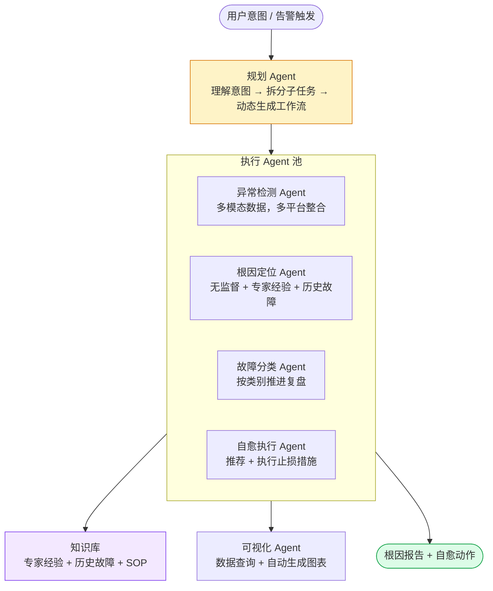
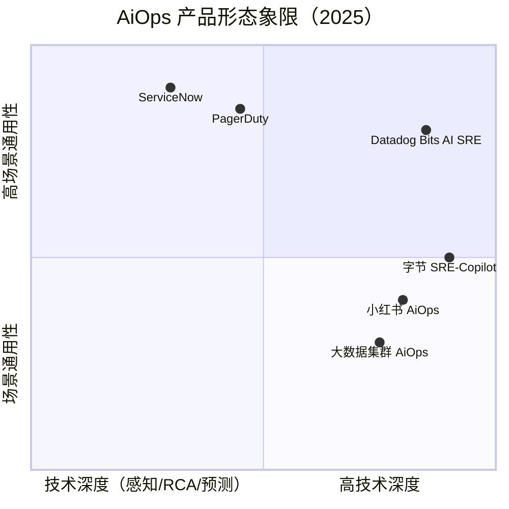
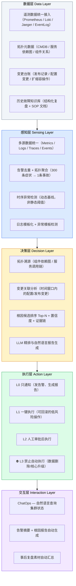
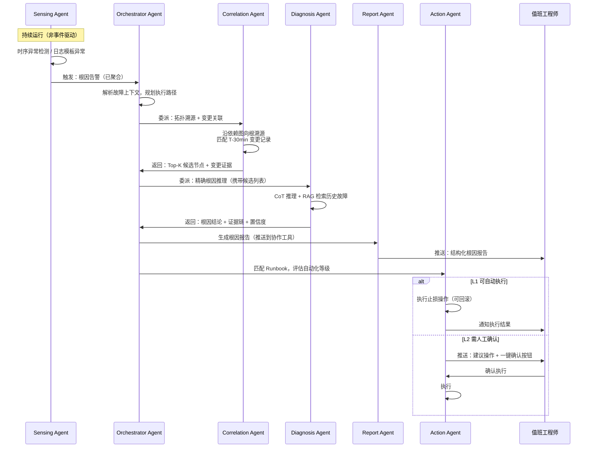
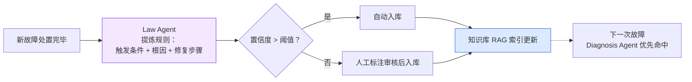
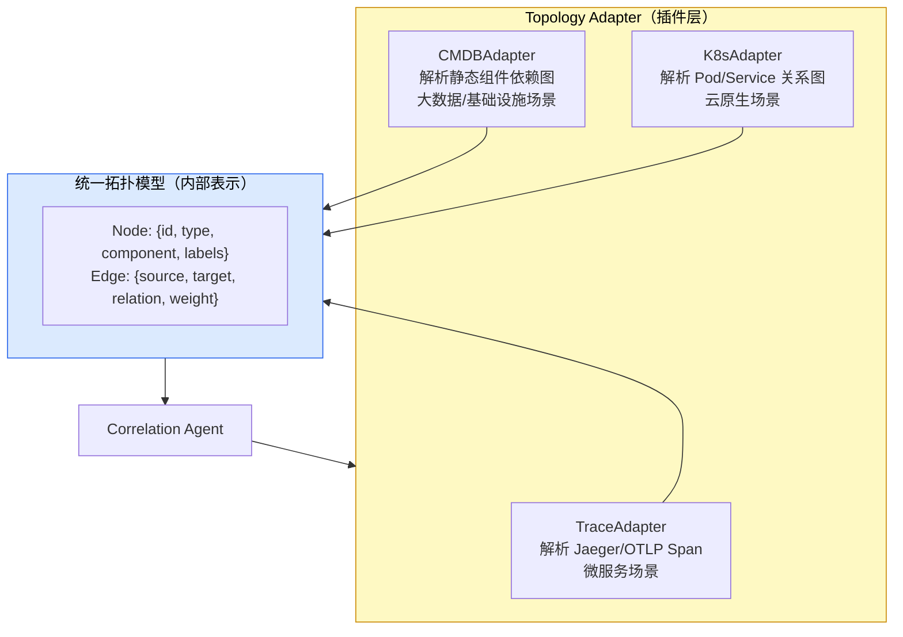
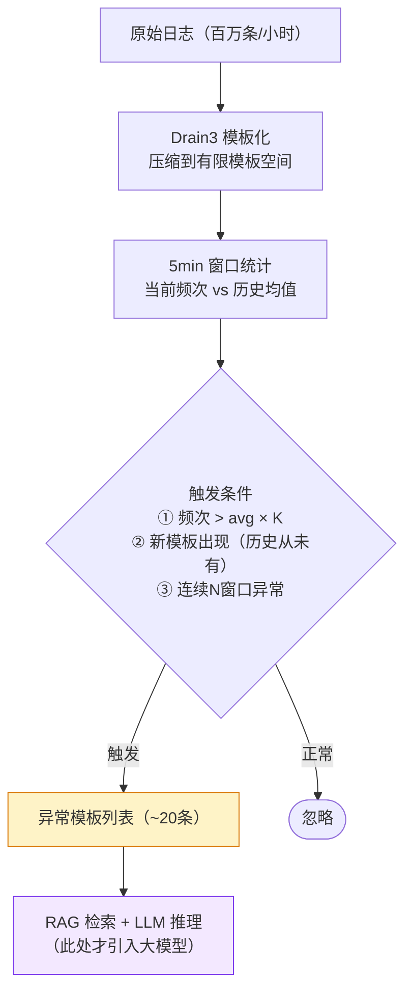
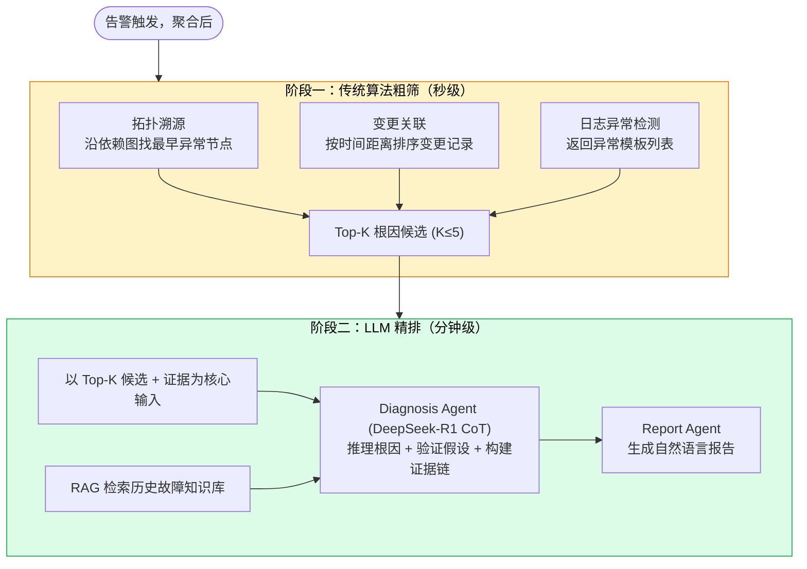

# 通用 AiOps 产品形态分析与初步设计

> 作者：汀（搜狐 RDC SRE）
> 日期：2026-03-12
> 依据：《业界 AiOps 案例分析报告》《大数据集群 AiOps 可行性分析报告》+ 头部商业产品与国内互联网公司最新实践
> 定位：超越大数据集群专项场景，抽象通用 AiOps 产品的核心能力、架构范式和建设路径

---

## 一、从场景特化到通用产品：动机与边界

前两份报告均以大数据集群运维为主要场景，结论也有较强的领域约束（无 HTTP Trace、以作业生命周期为核心）。本文的目标是向上抽一层，回答三个问题：

1. **通用 AiOps 产品应该具备哪些核心能力？**（能力图谱）
2. **头部公司怎么做的？** （商业产品 + 互联网自研对比）
3. **如何设计一个能适配不同基础设施场景的架构？**（插件化 + Multi-Agent）

"通用"不意味着"什么都做"——而是指**核心能力抽象不绑定具体基础设施技术栈**，通过可插拔的拓扑适配器和领域知识层，覆盖微服务、大数据、云原生等多类场景。

---

## 二、头部产品形态对比分析

### 2.1 商业产品：Datadog Bits AI SRE（2025.12 发布）

Datadog 是 2025 年 Forrester Wave AiOps Platforms 评选的 Leader，其架构演进最能代表商业 AiOps 产品的当前形态：

**产品分层**：

| 层次  | 产品/能力            | 说明                                                                      |
| --- | ---------------- | ----------------------------------------------------------------------- |
| 数据层 | 全栈遥测采集           | Metrics + Logs + Traces + RUM + Profiler + Network Path + DB Monitoring |
| 感知层 | Watchdog         | 平台级 AI，自动检测全环境的异常和离群值                                                   |
| 关联层 | Event Management | 跨来源告警聚合、关联、降噪，结合 CMDB 上下文                                               |
| 决策层 | Bits AI SRE      | 自主 Agent，多步推理根因，2025.12 发布                                              |
| 执行层 | Action Catalog   | 触发调查、创建事件、调用 Runbook、通知协作工具                                             |
| 交互层 | Bits AI Chat     | 自然语言查询 + 报告生成                                                           |

**Bits AI SRE 的核心设计理念**：

- **深度研究 Agent，而非对话助手**：不需要用户一步一步 prompt，而是自主执行多步推理（形成假设 → 验证假设 → 输出结论）
- **数据 Grounding 是根本**：Bits 基于真实的数以万计客户环境的遥测数据训练，理解"正常系统该如何表现"，而非依赖合成故障案例
- **跨层关联能力**：一个 API 延迟告警，可以穿透到用户会话（RUM）、后端服务依赖、数据库查询、网络链路，评估多层因果交互
- **RBAC + 企业合规**：支持 HIPAA 合规工作负载，角色权限控制，企业级安全

**实测数据**：根因定位速度提升 90%，部分团队的故障解决时间缩短 95%，已在 2000+ 客户环境运行超万次调查。

### 2.2 互联网自研：字节跳动 SRE-Copilot

字节 SRE-Copilot 是 2023 年 CCF 国际 AiOps 挑战赛冠军方案，也是国内互联网 AiOps 工程化程度最高的案例之一。

**架构核心**：以 LLM 为中枢，Multi-Agent 协同编排，覆盖从感知到自愈的全链路。



**关键指标**：故障自愈率 85%，人工干预时间减少 70%。

**与 Datadog 的根本差异**：Datadog 是黑盒商业产品（数据必须上云），字节是企业内网完全自主可控，更重要的是字节的 Agent 粒度更细（专门的分类 Agent、可视化 Agent），具备更强的领域规则注入能力。

### 2.3 PagerDuty & ServiceNow：ITSM 集成视角

| 产品 | 核心定位 | AiOps 切入角度 |
|------|----------|----------------|
| PagerDuty | 事件管理与值班协作 | 智能告警分组 + 自动化事件响应流程 |
| ServiceNow | ITSM 工单系统 | 告警→工单闭环 + AI 辅助变更风险评估 |

这两类产品的 AiOps 切入点是**流程侧**而非**技术侧**，强调故障响应的工单化、协作化和度量闭环，适合 IT 部门场景，但在技术深度（RCA、异常检测精度）上弱于 Datadog 和互联网自研方案。

### 2.4 对比总结



**结论**：技术深度与场景通用性之间存在天然张力。商业产品（Datadog）通过统一遥测平台拉高通用性，互联网自研（字节）通过深度领域化提升技术深度，两者的共同方向都是 **Multi-Agent + 深度数据 Grounding**。

---

## 三、通用 AiOps 能力图谱

基于业界实践抽象，通用 AiOps 产品的核心能力分五层，各层职责清晰且可独立演进：



**北极星指标**：不是模型准确率，而是 **MTTD 缩短 + MTTR 缩短 + 告警压缩率**。

---

## 四、Multi-Agent 架构设计

### 4.1 Agent 角色划分

通用 AiOps 系统的 Agent 按职责划分为六类，每类 Agent 职责单一、可独立升级：

| Agent | 职责 | 核心能力 | 推荐模型 |
|-------|------|----------|---------|
| **Orchestrator Agent** | 任务编排、意图解析、路径规划 | ReAct / 工具调用 | 通用大模型（DeepSeek-V3） |
| **Sensing Agent** | 数据采集、异常检测、告警聚合 | 时序算法 + 规则引擎（不依赖 LLM） | 传统算法为主 |
| **Correlation Agent** | 拓扑溯源、变更关联、影响面分析 | 图算法 + 时间窗口匹配 | 传统算法为主 |
| **Diagnosis Agent** | 根因推理、证据链构建 | CoT 推理 + RAG 知识检索 | 推理模型（DeepSeek-R1） |
| **Report Agent** | 根因报告、告警摘要、复盘素材生成 | 结构化文本生成 | 通用大模型 |
| **Action Agent** | Runbook 执行、审批工作流管理 | 工具调用 + 权限校验 | 通用大模型 + 规则约束 |

### 4.2 故障响应全链路流程



### 4.3 知识自增强：Law Agent 机制

借鉴腾讯 FastReject 方案的 Law Agent 设计，每次故障处置完成后，自动从本次故障中提炼规则注入知识库，形成正反馈闭环：



---

## 五、可插拔拓扑适配器：通用化的关键设计

通用 AiOps 与大数据专项方案最核心的架构差异，在于**如何处理不同基础设施的拓扑表示**。

业界两类主要拓扑来源本质不同：

| 场景 | 拓扑来源 | 故障传播模型 |
|------|----------|-------------|
| 微服务 / 云原生 | HTTP 调用链 Trace（Jaeger/Zipkin） | 请求级因果链，毫秒级 |
| 大数据集群 | 组件静态依赖图 + 作业 DAG | 组件级依赖，分钟~小时级 |
| 混合云基础设施 | CMDB + 网络拓扑图 | 物理/逻辑分层 |

**设计方案：拓扑适配器接口（Topology Adapter）**



Correlation Agent 只操作统一拓扑模型，不感知具体基础设施差异。新增一种基础设施类型只需实现对应 Adapter，无需修改上层逻辑。

---

## 六、感知层设计：传统算法优先，LLM 做最后一公里

**核心原则**：不要让 LLM 当侦探，先用最稳定的工程方法把嫌疑人名单缩到 20 个以内。

### 6.1 时序异常检测

```
指标类型          → 推荐算法
─────────────────────────────────────────
有周期性趋势指标   → Prophet（季节性分解）
稳定型基线指标     → Isolation Forest
单机离群检测       → DBSCAN + DTW 距离
QPS / 流量突变     → SR-CNN（频域变换放大变点）
```

### 6.2 日志异常检测流水线



### 6.3 告警聚合降噪

基于拓扑的聚合策略，将告警风暴压缩为单一根事件：

1. **拓扑聚合**：下游组件告警在 5min 窗口内被上游组件告警覆盖时，标记为衍生告警
2. **时间窗口去重**：同组件同类型告警在 2min 内去重
3. **变更关联**：T-30min 内存在变更记录时自动注入「变更触发」标签

目标：**告警压缩率 ≥ 70%**，这是 Phase 1 最重要的单一指标。

---

## 七、决策层设计：传统算法粗筛 + LLM 精排



**LLM 输入的数据结构（避免 Token 浪费）**：

```
[故障上下文]
时间: 2026-XX-XX XX:XX
告警: NameNode RPC 队列积压 (当前: 8200, 阈值: 5000)

[传统算法粗筛结果]
候选1: NameNode JVM GC 时间突增（Mixed GC: 42s, 超历史P99的6倍）
候选2: 30分钟前 Ambari 配置变更（调整了 NameNode Heap 参数）

[相关指标摘要]（计算下推，非原始时序）
NameNode GC 时间: 正常均值 0.8s → 当前 42s
RPC 队列长度: 正常均值 200 → 当前 8200
内存使用: 178G / 200G（89%）

[历史相似故障（RAG检索）]
INC-2025-0318: NameNode Full GC 导致 RPC 积压，根因为文件数超过堆内存预警线
```

---

## 八、执行层：自动化分级与风险管控

```mermaid
graph LR
    subgraph L0["L0 — 自动执行，无需确认"]
        a["推送告警通知 (Slack/企业微信)"]
        b["生成根因分析报告"]
        c["触发 Runbook 查询推荐"]
    end
    subgraph L1["L1 — 一键确认后执行（可回滚）"]
        d["重启单个服务实例"]
        e["调整队列/限流参数"]
        f["Spark 参数调整后重试"]
    end
    subgraph L2["L2 — 人工审批"]
        g["主备切换（HA Failover）"]
        h["下线节点 + 副本迁移"]
        i["配置文件持久化修改"]
    end
    subgraph L3["L3 — 禁止自动执行"]
        j["⛔ 任何数据删除操作"]
        k["⛔ 跨环境迁移"]
        l["⛔ 核心组件版本升级"]
    end

    L0 --> L1 --> L2 --> L3

    style L0 fill:#dcfce7,stroke:#16a34a,color:#000
    style L1 fill:#fef9c3,stroke:#ca8a04,color:#000
    style L2 fill:#fed7aa,stroke:#ea580c,color:#000
    style L3 fill:#fee2e2,stroke:#dc2626,color:#000
```



**Action Agent 执行前必须校验**：
1. 操作是否在白名单范围内
2. 当前操作的影响面评估（影响哪些下游组件）
3. 是否有对应的回滚方案

---

## 九、与大数据集群场景的映射关系

本文档设计的通用架构可直接覆盖《大数据集群 AiOps 可行性分析报告》中的所有模块，核心差异体现在适配层：

| 通用层 | 大数据集群适配 | 微服务场景适配 |
|--------|---------------|----------------|
| 拓扑适配器 | CMDBAdapter（HDFS→YARN→Hive→Spark 静态依赖图） | TraceAdapter（Jaeger HTTP 调用链） |
| 变更数据源 | Ambari 配置审计日志 | 代码发布系统 / Kubernetes ConfigMap 变更 |
| 异常检测目标 | 组件 JMX 指标 + 作业 EventLog 指标 | 服务 QPS / 延迟 / 错误率 |
| 日志来源 | NameNode/RM/Hive GC 日志（Loki） | 应用服务日志（Loki / ELK） |
| 根因知识库 | NameNode GC、DataNode 磁盘、YARN 队列等故障模式 | 服务超时、OOM、依赖抖动等微服务故障模式 |

---

## 十、建设优先级与路线建议

根据各层的价值密度与实现难度，建议按以下顺序推进：

```mermaid
gantt
    title 通用 AiOps 建设优先级路线
    dateFormat YYYY-QQ
    axisFormat Q%q %Y

    section Phase 0 数据地基（必须先行）
    遥测数据统一接入（Metrics+Logs）    :done, 2026-Q1, 2026-Q2
    拓扑适配器 MVP（组件依赖图）        :2026-Q2, 2026-Q3
    变更台账结构化                      :2026-Q2, 2026-Q3
    历史故障知识库初始化                :2026-Q1, 2027-Q1

    section Phase 1 感知层（最高 ROI）
    告警聚合降噪（目标70%压缩率）       :2026-Q3, 2026-Q4
    时序异常检测（动态基线替代静态阈值）:2026-Q3, 2026-Q4
    日志模板化流水线（Drain3）          :2026-Q3, 2027-Q1

    section Phase 2 决策层
    拓扑溯源 + 变更关联（传统算法）     :2026-Q4, 2027-Q1
    LLM 根因精排 + 报告生成            :2027-Q1, 2027-Q2
    Law Agent 知识自增强               :2027-Q1, 2027-Q3

    section Phase 3 执行层 + 交互层
    L1 场景自动化处置（≥3个场景）      :2027-Q2, 2027-Q4
    ChatOps 自然语言查询               :2027-Q2, 2027-Q4
    预测性运维（容量/故障预测）         :2027-Q3, 2028-Q2
```

---

## 十一、关键设计原则总结

1. **数据 Grounding 决定 Agent 能力上限**。Datadog 的核心壁垒不是模型，而是在万级客户环境中积累的遥测元数据。自研系统必须从第一天起就重视数据质量和结构化。

2. **传统算法是 LLM 的前置滤波器**，不是竞争关系。先让传统算法把噪音从千条压到十条，再让 LLM 做最后一公里推理，既省成本又提准确率。

3. **拓扑元数据是根因分析的骨架**。没有组件依赖关系图，告警聚合和拓扑溯源都无法进行，这是优先级最高的数据地基工程。

4. **Agent 职责必须单一，流水线必须可观测**。多 Agent 系统最大的运维噩梦是调试困难，每个 Agent 的输入/输出、推理过程、工具调用结果都必须可记录、可回溯。

5. **自动化执行必须有风险分级和回滚机制**。L1 操作的接受度取决于工程师对"出错能否快速恢复"的信心，回滚方案比执行速度更重要。

6. **告警压缩率是 Phase 1 的唯一核心 KPI**。在根因分析准确率达到可信赖水平之前，先让值班工程师从告警风暴中解脱出来，是建立团队对 AiOps 信任的最快路径。

---

## 参考来源

- [Datadog Bits AI SRE 产品发布（2025.12）](https://www.datadoghq.com/blog/bits-ai-sre/)
- [Datadog: How we built an AI SRE agent](https://www.datadoghq.com/blog/building-bits-ai-sre/)
- [字节跳动 SRE-Copilot CCF AiOps 2023 冠军方案](https://blog.csdn.net/ByteDanceTech/article/details/135420707)
- [A Survey of AIOps in the Era of Large Language Models (ACM, 2025)](https://dl.acm.org/doi/10.1145/3746635)
- [A Practical Approach to Defining a Framework for Developing an Agentic AIOps System (MDPI, 2025)](https://www.mdpi.com/2079-9292/14/9/1775)
- 《业界 AiOps 案例分析报告》（本团队）
- 《大数据集群 AiOps 可行性分析报告》（本团队）
