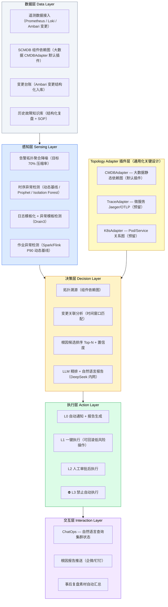
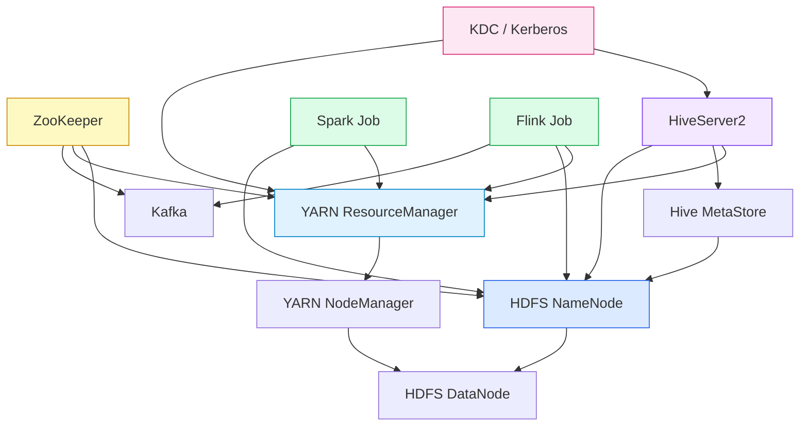
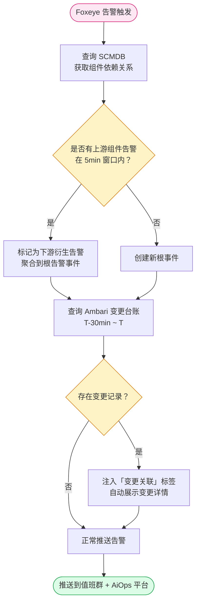
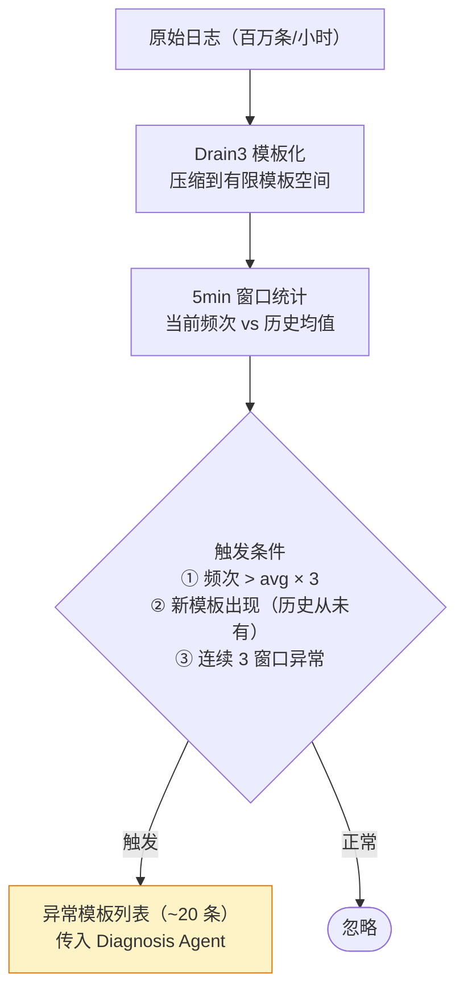
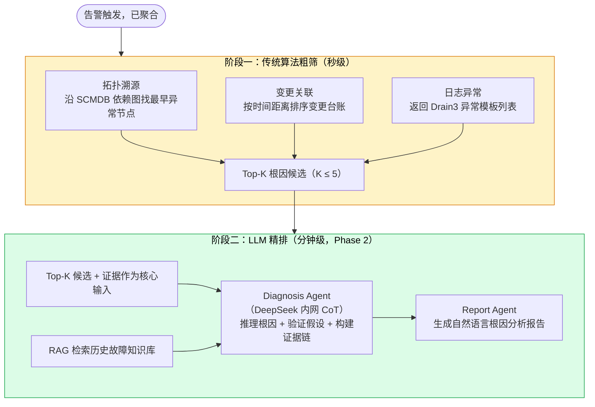
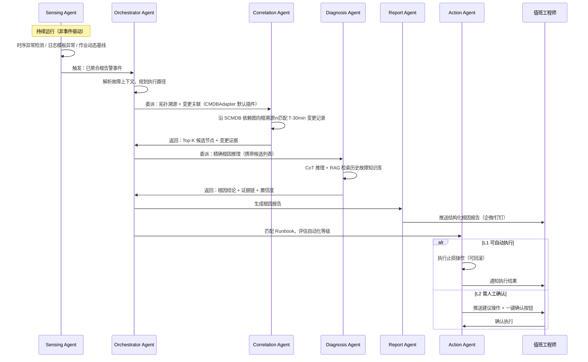
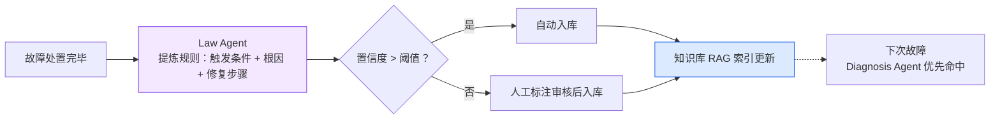
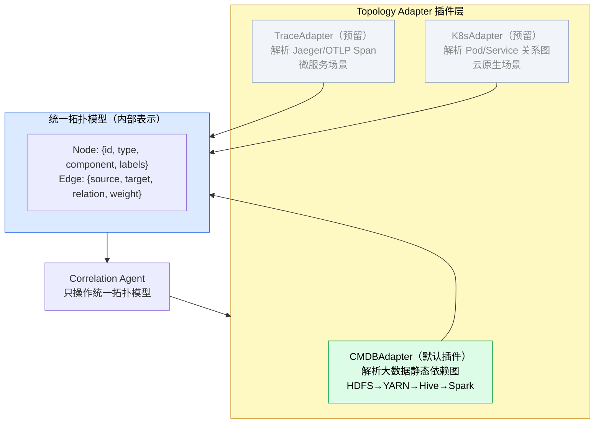
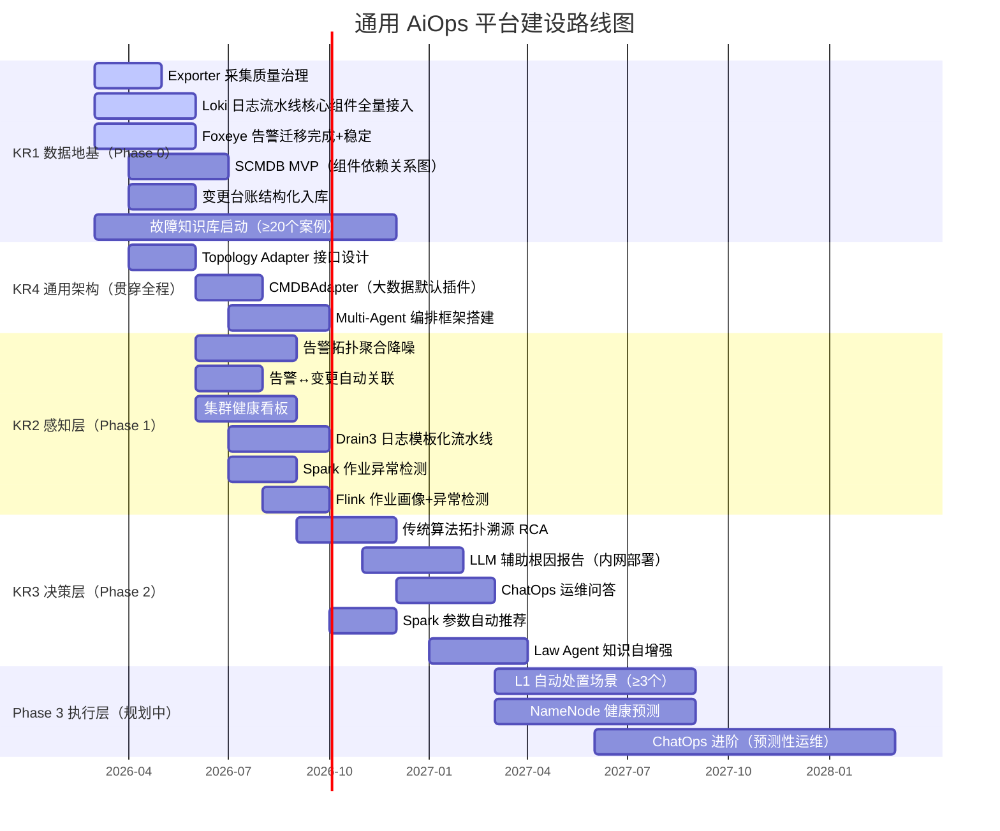

# 通用 AiOps 平台建设 OKR

> 作者：汀（搜狐 RDC SRE）
> 日期：2026-03-13
> 依据：《通用 AiOps 产品形态分析与初步设计》《大数据集群 AiOps 可行性分析报告》
> 定位：以通用 AiOps 平台为建设目标，大数据集群为默认插件场景，可扩展覆盖微服务、云原生等多类场景

---

# 1 背景/现状

Foxeye 可观测平台已建立指标监控体系，大数据集群 Exporter 部署完成，Loki 日志采集流水线在建，Ambari 告警向 Foxeye 迁移进行中。当前可观测能力已初步就绪，具备启动 AiOps 建设的前置条件窗口。

但整体运维模式仍是**被动响应**：告警触发 → 工程师人工排查 → 手工处置。核心痛点如下：

- **告警风暴**：单次集群故障产生 50~200 条相关告警，无聚合降噪，值班工程师需手工筛选根因
- **MTTR 居高**：平均故障处理时间 20~40 分钟，其中 60% 时间消耗在「看告警 + 翻监控 + 查日志」
- **知识不可复用**：故障经验沉淀在工程师脑中，每次排查从零开始，无历史故障知识库
- **作业感知盲区**：Spark/Flink 作业长尾、OOM、数据倾斜等异常依赖人工巡检，响应滞后
- **架构不可扩展**：现有能力强绑定大数据集群，无法复用到微服务或云原生场景

业界已有成熟路径可参考（Datadog Bits AI SRE：根因定位提速 90%；字节 SRE-Copilot：故障自愈率 85%），核心价值链路为：**告警聚合降噪 → 拓扑溯源 → LLM 精排根因 → 自动处置**。

---

# 2 问题分析

## 2.1 数据地基不完整（最高优先级，阻塞 AiOps 启动）

| 数据维度        | 当前状态               | AiOps 就绪 Gap                        |
| ----------- | ------------------ | ----------------------------------- |
| 指标（Metrics） | 有，Exporter 覆盖主要组件  | 采集精度待提升，缺失率需 < 1%                   |
| 日志（Logs）    | Loki 流水线在建         | 需完成核心组件（NN/RM/HS2/Spark）全量接入 + 标签规范 |
| 组件拓扑（SCMDB） | 未建设                | **无 SCMDB = 无法做拓扑溯源**，这是根因分析的骨架     |
| 变更台账        | Ambari 审计邮件（结构化不足） | 需结构化入库，关联到组件，支持时间窗口查询               |
| 历史故障知识库     | 零                  | LLM RAG 无本地知识可检索，需从现在开始沉淀           |

## 2.2 感知能力弱（Phase 1 核心问题）

- 告警无聚合降噪：相关告警无法自动收敛为一个根事件，值班工程师被告警风暴淹没
- 告警与变更未关联：变更触发故障无法自动发现，排查路径漫长
- 作业异常无主动检测：Spark/Flink 长尾、OOM 等异常仅在用户投诉后才感知

## 2.3 诊断能力缺失（Phase 2 核心问题）

- 无拓扑溯源：告警之间的因果关系全靠工程师经验判断
- 无 LLM 辅助：根因报告需手写，质量参差不齐
- 无 ChatOps：无法自然语言查询集群状态，信息获取路径长

## 2.4 可扩展性不足（架构层面）

- 所有能力强绑定大数据集群，微服务或云原生场景无法复用
- 拓扑适配层缺失，新场景接入需从零重建
- Agent 编排逻辑与领域规则耦合，难以独立升级

---

# 3 方案/目标

**Objective**：构建通用 AiOps 平台（大数据场景为默认插件），2026 年将值班告警处理量压缩 70%、MTTR 缩短 40%，并建立可扩展的多场景智能运维架构基座，为后续微服务等场景接入提供零上层改动的插件接口。

- **KR1**（数据地基，2026-Q2 完成）：Loki 日志流水线完成核心组件全量接入，标签覆盖率 100%；SCMDB MVP 上线，记录大数据组件完整依赖关系；结构化故障知识库启动，完成 ≥ 20 个高频故障案例入库；Exporter 核心指标缺失率 < 1%
- **KR2**（感知层，2026-Q3 完成）：告警拓扑聚合降噪上线，**告警压缩率 ≥ 70%**；Spark/Flink 核心作业异常检测覆盖率 100%；告警↔变更自动关联上线；Drain3 日志模板化流水线完成
- **KR3**（决策层，2027-Q1 完成）：传统算法拓扑溯源根因分析上线（AC@3 ≥ 50%）；LLM 辅助根因报告自动生成（相比 Phase 1 MTTR 再缩短 30%）；ChatOps 上线覆盖 ≥ 10 个常见问题场景
- **KR4**（通用架构，2026-Q2 起持续推进）：CMDBAdapter（大数据默认插件）上线；Topology Adapter 接口设计完成，新场景接入不修改上层逻辑；Multi-Agent 编排框架（Orchestrator + Sensing + Correlation + Diagnosis + Report + Action）搭建完成

---

## 3.1 整体架构设计（通用 + 插件化）

平台分五层，各层职责独立可单独演进；可插拔的 Topology Adapter 是通用化的关键设计。



**Topology Adapter 通用化设计**：Correlation Agent 只操作统一拓扑模型（`Node{id, type, component}` + `Edge{source, target, relation}`），不感知具体基础设施差异。大数据集群用 CMDBAdapter 解析 HDFS→YARN→Hive→Spark 静态依赖图；新增微服务场景只需实现 TraceAdapter，上层 RCA 逻辑零改动。

---

## 3.2 KR1 详细方案 — 数据地基

数据地基是 AiOps 一切能力的前置条件，本阶段不开发 AiOps 功能，专注让数据管道按 AiOps 规范通起来。

**Loki 日志流水线规范（核心组件必须采集的标签）**：

| 组件 | 必须携带的标签 |
|---|---|
| NameNode / DataNode | `component`, `hostname`, `cluster`, `log_level` |
| ResourceManager / NodeManager | `component`, `hostname`, `cluster`, `queue`, `log_level` |
| HiveServer2 | `component`, `hostname`, `session_id`, `log_level` |
| Spark Driver / Executor | `component`, `job_id`, `app_name`, `stage_id`, `log_level` |

**SCMDB MVP 组件依赖关系图**（这是根因分析的骨架，优先级最高）：



**结构化故障知识库模板**（每次故障后必须填写，这是 LLM RAG 的核心素材）：

```yaml
故障ID: INC-2026-XXX
时间: 2026-XX-XX XX:XX
影响组件: [NameNode, HiveServer2]
影响业务: [数仓 ETL, OLAP 查询]
根因: NameNode Full GC 导致 RPC 队列积压
触发原因: 集群文件数增长超过堆内存预警线
解决方案: 调大 NameNode 堆内存 + 开启 Small Files 合并
预防措施: 添加文件数预警阈值告警
```

---

## 3.3 KR2 详细方案 — 感知层

### 3.3.1 告警拓扑聚合降噪



**目标**：告警压缩率 ≥ 70%，这是 Phase 1 的唯一核心 KPI。

### 3.3.2 作业异常检测（基于画像动态基线）

作业画像中沉淀的 P90 历史基线作为动态阈值，替代固定阈值告警：

```
作业 X 运行时长 > 历史 P90 × 1.5   → 触发「长尾作业」告警
作业 X Shuffle 量 > 历史 P90 × 2.0  → 触发「数据倾斜」告警
作业 X GC 时间占比 > 20%            → 触发「内存不足」预警
作业 X Executor 失败率 > 5%         → 触发「OOM」预警
```

### 3.3.3 日志异常检测流水线（Drain3）



---

## 3.4 KR3 详细方案 — 决策层

### 3.4.1 故障根因分析全链路（传统算法粗筛 + LLM 精排）



### 3.4.2 Multi-Agent 编排架构



### 3.4.3 知识自增强：Law Agent

每次故障处置完成后，Law Agent 自动从本次故障提炼规则入库，形成正反馈闭环：



---

## 3.5 KR4 详细方案 — 通用架构（插件化 Topology Adapter）

通用化的核心设计：Correlation Agent 只操作统一拓扑模型，不感知具体基础设施差异。



**Agent 角色与分工**：

| Agent | 职责 | 是否依赖 LLM | 推进阶段 |
|---|---|---|---|
| Orchestrator Agent | 任务编排、意图解析、路径规划 | 是（ReAct/工具调用） | Phase 2 |
| Sensing Agent | 数据采集、异常检测、告警聚合 | 否（传统算法） | Phase 1 |
| Correlation Agent | 拓扑溯源、变更关联、CMDBAdapter 调用 | 否（图算法） | Phase 1 基础，Phase 2 完善 |
| Diagnosis Agent | 根因推理、CoT 推理 + RAG 检索 | 是（DeepSeek 内网） | Phase 2 |
| Report Agent | 根因报告、摘要、复盘素材生成 | 是（通用大模型） | Phase 2 |
| Action Agent | Runbook 执行、审批工作流、风险校验 | 是（规则约束） | Phase 3 |

**自动化执行风险分级**（Action Agent 执行前必须校验等级）：

```mermaid
graph LR
    subgraph L0["L0 — 自动执行，无需确认"]
        a["推送告警通知（企微/钉钉）"]
        b["生成根因分析报告"]
        c["推荐 Runbook"]
    end
    subgraph L1["L1 — 一键确认后执行（可回滚）"]
        d["重启 HiveServer2 实例"]
        e["调整 YARN 队列容量"]
        f["Spark 参数调整后重试"]
    end
    subgraph L2["L2 — 人工审批"]
        g["NameNode HA 主备切换"]
        h["DataNode 下线 + 副本迁移"]
        i["集群配置文件持久化修改"]
    end
    subgraph L3["L3 — 禁止自动执行"]
        j["⛔ 任何数据删除操作"]
        k["⛔ 跨集群迁移"]
        l["⛔ 核心组件版本升级"]
    end

    L0 --> L1 --> L2 --> L3

    style L0 fill:#dcfce7,stroke:#16a34a,color:#000
    style L1 fill:#fef9c3,stroke:#ca8a04,color:#000
    style L2 fill:#fed7aa,stroke:#ea580c,color:#000
    style L3 fill:#fee2e2,stroke:#dc2626,color:#000
```



---

## 3.6 整体建设路线（时间轴）



---

# 4 关键事项拆解

| KR | 任务 | 截止时间 | 交付物 | 优先级 |
|---|---|---|---|---|
| **KR1** | Exporter 核心指标采集质量治理 | 2026-05-15 | 指标缺失率 < 1%，命名规范统一的 Exporter 版本 | 🔴 P0 |
| **KR1** | Loki 日志流水线：NameNode / DataNode / RM / NM 全量接入 | 2026-05-31 | 4 个组件日志 100% 接入，标签覆盖完整 | 🔴 P0 |
| **KR1** | Loki 日志流水线：HiveServer2 / Spark Driver+Executor 接入 | 2026-06-20 | 2 类作业日志接入，携带 job_id / app_name 标签 | 🔴 P0 |
| **KR1** | Foxeye 告警迁移完成 + 僵尸告警清理 | 2026-06-15 | Ambari → Foxeye 迁移完成，双跑验证通过，僵尸告警清零 | 🔴 P0 |
| **KR1** | SCMDB MVP 设计与开发 | 2026-06-30 | 覆盖 ZK/KDC/NN/DN/RM/NM/HS2/HMS/Spark/Flink/Kafka 依赖关系入库 | 🟡 P1 |
| **KR1** | 变更台账结构化入库接口 | 2026-06-15 | Ambari 变更记录解析入库，支持按组件 + 时间窗口查询 | 🟡 P1 |
| **KR1** | 故障知识库建设（持续进行） | 2026-12-31 | ≥ 20 个高频故障案例结构化入库（YAML 模板），可供 RAG 检索 | 🟡 P1 |
| **KR4** | Topology Adapter 接口设计 + CMDBAdapter 大数据实现 | 2026-07-31 | 接口文档 + CMDBAdapter 代码，统一拓扑模型 Node/Edge 结构确定 | 🟡 P1 |
| **KR4** | Multi-Agent 编排框架搭建（Orchestrator + Sensing + Correlation） | 2026-09-30 | Phase 1 三个 Agent 可协同运行，输入输出结构化可记录 | 🟡 P1 |
| **KR2** | 告警拓扑聚合降噪引擎开发上线 | 2026-08-31 | 降噪引擎上线，告警压缩率 ≥ 70%（以 Foxeye 历史数据验证） | 🔴 P0 |
| **KR2** | 告警↔变更自动关联模块 | 2026-08-15 | T-30min 变更自动关联到告警事件，展示在 Foxeye 告警详情页 | 🟡 P1 |
| **KR2** | 集群健康看板（基于动态基线替代静态阈值） | 2026-09-15 | 核心组件（NN/RM/HS2/Kafka）健康评分大盘上线，使用 Prophet/Isolation Forest 动态基线 | 🟡 P1 |
| **KR2** | Drain3 日志模板化流水线 + 日志异常检测 | 2026-09-30 | Drain3 接入 Loki 数据，5min 窗口异常模板检测上线，误报率 < 10% | 🟡 P1 |
| **KR2** | Spark 作业异常检测（基于 P90 动态基线） | 2026-09-15 | 覆盖 bdwh/panther 核心作业，长尾/OOM/倾斜自动告警上线 | 🟡 P1 |
| **KR2** | Flink 作业画像建设 + 异常检测 | 2026-10-15 | Flink 作业 P50/P90 画像入库，异常检测覆盖流处理核心作业 | 🟢 P2 |
| **KR3** | 传统算法拓扑溯源 RCA 模块 | 2026-11-30 | 基于 SCMDB 依赖图的告警溯源上线，AC@3 ≥ 50%（以历史故障验证） | 🟡 P1 |
| **KR3** | 内网 LLM 接入方案（DeepSeek 私有化部署评估） | 2026-11-15 | LLM 接入技术方案确定（内网部署 or 接入搜狐内部 AI 服务），数据隐私合规验证 | 🟡 P1 |
| **KR3** | LLM Diagnosis Agent + Report Agent 开发上线 | 2027-01-31 | CoT 根因推理上线，自然语言根因报告自动推送企微，MTTR 相比 Phase 1 再降 30% | 🟡 P1 |
| **KR3** | ChatOps 工具接口开发（Prometheus/Loki/变更查询封装为 LLM Tools） | 2027-02-28 | ≥ 10 个常见问题场景可通过自然语言查询集群状态 | 🟢 P2 |
| **KR3** | Law Agent 知识自增强机制 | 2027-03-31 | 故障处置后自动规则提炼 + 知识库入库，RAG 命中率提升验证 | 🟢 P2 |
| **KR3** | Spark 参数自动推荐（基于历史画像 + 当前输入估算） | 2026-12-31 | 启动前自动推荐内存/并行度参数，OOM 率降低 20% | 🟢 P2 |

---

# 5 成功标准与 KPI

| 里程碑 | 核心 KPI | 目标值 |
|---|---|---|
| Phase 0 完成（Q2 2026） | 核心指标缺失率 | < 1% |
| Phase 0 完成（Q2 2026） | 故障知识库案例数 | ≥ 20 个 |
| Phase 1 完成（Q3 2026） | **告警压缩率** | **≥ 70%**（Phase 1 唯一核心 KPI） |
| Phase 1 完成（Q3 2026） | 作业异常检测覆盖率 | Spark/Flink 核心作业 100% |
| Phase 1 完成（Q3 2026） | 值班工程师使用率 | > 80% 的告警处理通过平台查看诊断摘要 |
| Phase 2 完成（Q1 2027） | 根因分析准确率（AC@3） | ≥ 50%（初期，持续迭代） |
| Phase 2 完成（Q1 2027） | MTTR 缩短幅度 | 相比 Phase 0 基准缩短 ≥ 40% |
| Phase 2 完成（Q1 2027） | ChatOps 覆盖场景数 | ≥ 10 个常见问题 |
| 架构目标（Q2 2026~） | Topology Adapter 新场景接入成本 | 上层逻辑零改动，只需实现对应 Adapter |

---

# 6 风险与管控

| 风险 | 等级 | 缓解措施 |
|---|---|---|
| 数据质量不达标（Exporter/Loki 缺失） | 🔴 最高 | Phase 0 专注数据治理，不达标宁可延后 Phase 1 |
| LLM 数据隐私（生产数据外发） | 🔴 硬性约束 | 必须使用内网部署 LLM（DeepSeek/Qwen 私有化 or 搜狐内部 AI 服务），不可绕过 |
| LLM 幻觉导致根因误判 | 🟡 中等 | LLM 输出必须附带可验证证据链；初期仅做参考，不做决策依据；建立工程师标注反馈机制 |
| SCMDB 维护成本过高 | 🟡 中等 | Phase 0 只做静态依赖关系（10~15 个核心组件），不追求动态实时更新 |
| Phase 1 误报率过高损耗信任 | 🟡 中等 | 先在小范围（bdwh 集群）灰度验证，误报率 < 10% 才全量推广 |
| 团队 LLM 工程经验不足 | 🟢 较低 | Phase 1 只用传统统计方法；Phase 2 引入 LLM 时使用 LangChain 等框架降低门槛 |
