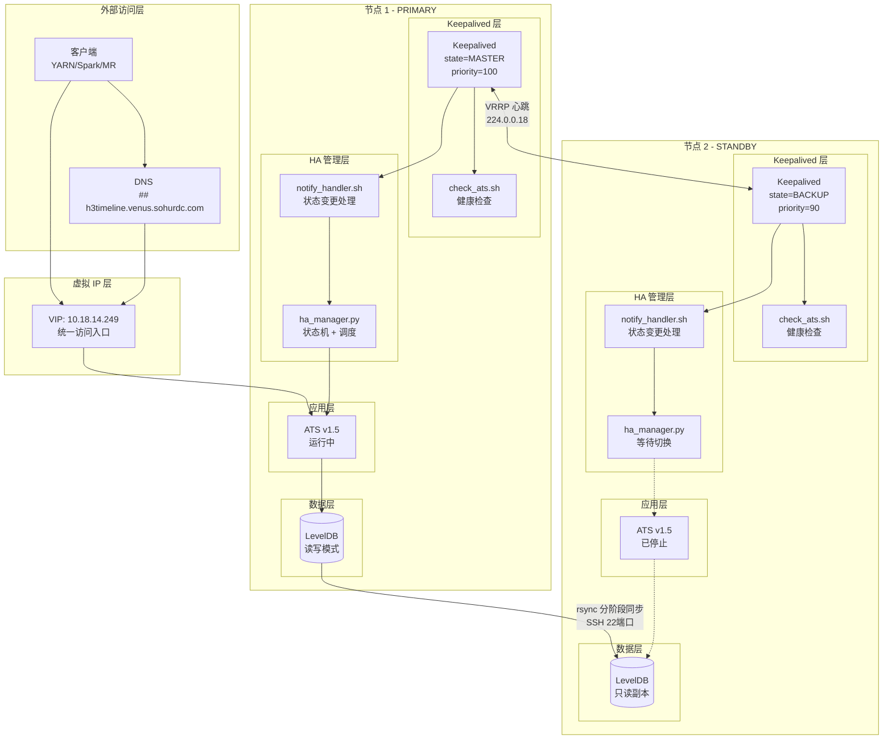
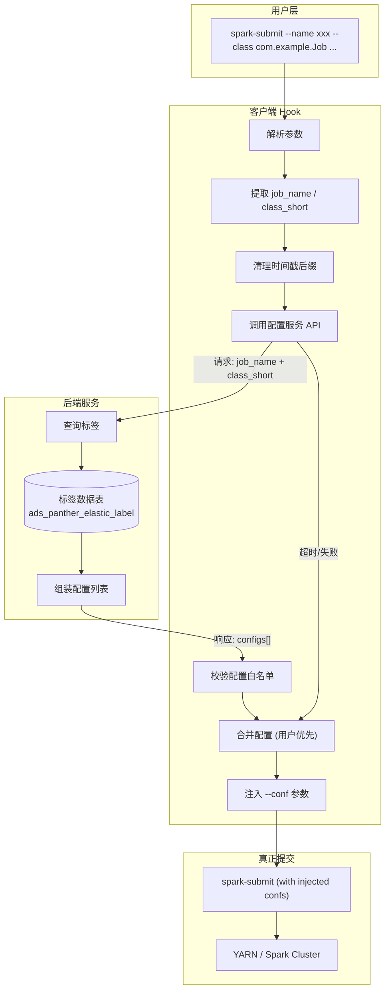

# 幻灯片 1：封面
- 标题：基础架构组试用期转转正述职报告
- 副标题：大数据集群稳定性保障与计算治理工程实践
- 汇报人：李浩鹏
- 岗位：SRE
- 布局建议：居中排版，极简商务科技风格。

# 幻灯片 2：试用期工作总览 (Executive Summary)
- 标题：试用期核心工作矩阵
- 布局建议：使用极简的四宫格卡片布局展现。
- 内容摘要：
  - 架构高可用：落地 YARN Timeline Server (ATS) V1.5 HA 方案，消除核心组件单点故障。
  - 计算资源治理：开发 Spark 动态参数注入系统，推进 RSS (Uniffle) 与向量化引擎灰度上线。
  - 全链路可观测：构建大数据 Exporter 矩阵，完成 Zabbix 到 Foxeye 告警规则迁移，探索落地云原生日志采集组件Loki。
  - 深度排障与 AIOps：定位并修复 NameNode GC 停顿与 Hive UDF 连接泄漏；开发告警迁移 AI Agent。

# 幻灯片 3：架构演进 - ATS V1.5 高可用落地
- 标题：YARN Timeline Server (ATS) 高可用架构落地
- 布局建议：左侧文字，右侧生成 Draw.io 风格的 Keepalived VIP 漂移与主备架构图，架构图原型参考。

- 核心设计：
  - 引入 Controller 模式，采用 Edge-Triggered 与 Level-Triggered 双触发机制，实现状态机调和与自愈。
  - 设计 LevelDB 分阶段 Rsync 同步策略（SSTable -> MANIFEST -> WAL），确保底层状态数据最终一致性。
- 落地成果：
  - 成功消除核心调度链路的单点故障。
  - RTO 控制在 60 秒内，提供基于 STONITH 的防脑裂强杀机制。

# 幻灯片 4：计算治理 (一) - 动态参数注入系统
- 标题：Spark 动态参数注入系统与引擎透明化
- 布局建议：左侧陈述技术逻辑，右侧生成极简的 Client Hook 拦截流程图 (几何矩形与箭头)架构图原型如下。

- 核心设计：
  - 基于 Client Hook 机制拦截 Spark 作业提交 (spark-submit)，提取 `job_name` 标识。
  - 联动后端标签数据库，获取指定作业的配置白名单。
  - 在作业真正提交前，将动态配置合并注入 `--conf` 参数。
- 业务价值：
  - 实现计算引擎底层优化的业务无感知接入，收敛配置修改权限。

# 幻灯片 5：计算治理 (二) - 下一代计算引擎演进
- 标题：面向弹性的计算引擎演进：RSS 与向量化
- 布局建议：左右两栏结构，分别陈述 RSS 和向量化，辅以极简的对比列表。
- RSS (Apache Uniffle) 落地：
  - 独立完成 Uniffle v0.11 集群部署、基准性能测试与最大容量压测。
  - 开发 RSS 动态配置引擎，增加离线大Shuffle作业的弹性容错性。
- Spark 向量化引擎 (Gluten+Velox) 探索：
  - 推进向量化引擎基准测试与参数调优。
  - 开发作业画像分析工具，根据事件日志筛选并灰度符合向量化边界的业务作业。

# 幻灯片 6：可观测性 - 基础设施监控重构
- 标题：全链路可观测性版图完善
- 布局建议：上下分层布局，上方横向集群可观测全局架构，下方陈述业务价值。
- 可观测全局架构：
  - 指标采集：独立开发与部署 Hadoop , Hive Server, Timeline Server, HBase 等核心组件的 Prometheus Exporter
  - 日志采集：调研云原生日志采集方案，上线 Loki 日志体系。
  - 告警：基于Zabbix已有告警规则和业界最佳实践，上线Foxeye告警配置

# 幻灯片 7：AIOps 探索 - 告警规则自动化迁移
- 标题：AIOps 工程实践：基于 Agent 的告警规则迁移
- 布局建议：左侧展示 Eino 框架下的数据流转图 (纯线框风格)，右侧罗列收益。
- 核心设计：
  - 基于 Go 语言与 Eino 框架，设计开发告警规则语义转换智能体 (AI Agent)。
  - 解析非结构化的存量 Zabbix 规则，通过大模型重写为 Foxeye 平台标准格式。
- 业务价值：
  - 摒弃海量规则的“人肉翻译”，将重复性运维工作转化为自动化工具流。
  - 大幅降低告警迁移人力投入，提升规则转换准确率，构建组内 AIOps 闭环。

# 幻灯片 8：深度排障 (RCA) 一 - NameNode 与内核机制冲突
- 标题：底层排障：NameNode G1GC 与 OS Swap 交互引发主备切换
- 布局建议：问题现象 -> 根因穿透 -> 修复方案。
- 故障现象：物理内存充足环境下，NameNode 突发 ZKFC 脑裂。Mixed GC 耗时飙升至 62 秒（Scan RS 阶段耗时 41 秒）。
- 根因分析：
  - JVM 老年代长期未访问的内存页被 Linux 内核 LRU 算法换出至 Swap 分区。
  - G1 混合 GC 在 Scan RS 阶段随机访问全堆对象引用，触发海量 Major Page Faults，纳秒级内存访问劣化为毫秒级磁盘 I/O。
- 修复方案：
  - 调整内核参数 `vm.swappiness=1` 降低换出倾向；优化 JVM 参数提高Mixed GC阈值。

# 幻灯片 9：深度排障 (RCA) 二 - Hive UDF 编译期资源泄漏
- 标题：底层排障：Hive UDF 设计缺陷引发句柄泄漏
- 布局建议：缺陷现象 -> RCA 根因定位 -> 代码重构方案对比。
- 故障现象：HiveServer2 服务崩溃，系统抛出 `Too many open files`，累计泄漏超 3 万个文件描述符 (FD)。
- 根因分析：
  - Hive SQL 在编译优化阶段的“常量折叠”机制会频繁实例化临时 UDF。
  - 业务自定义 Redis UDF 存在设计缺陷：连接池未设计为静态共享。临时 UDF 实例被 GC 回收后，底层 TCP 长连接未触发关闭。
- 修复方案：
  - 建议用户重构 UDF 底层代码，引入 `static final ConcurrentHashMap` 实现 JVM 级别全局单例连接池，并下调最小空闲连接数。

# 幻灯片 10：总结与 2026 上半年规划
- 标题：总结与 H1 OKR 展望
- 布局建议：左右两栏卡片结构。
- 试用期总结：
  - 立足 集群SRE 本职，完成多起复杂底层故障根因定位，沉淀高质量排障规范。
  - 推动计算架构弹性化，构建端到端可观测性，落地 AIOps 工具链提升效能。
- 2026 H1 规划：
  - 大数据与 AI 深度融合：根据作业画像，扩大 Spark 向量化与 RSS 覆盖率。
  - AIOps 场景拓宽：推进集群故障根因分析智能体开发，探索集群存量告警降噪机制。