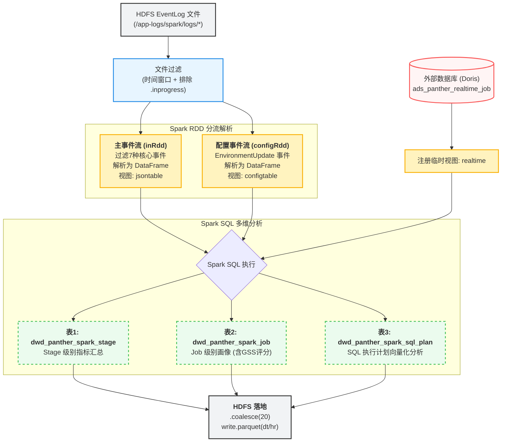

> 本文档覆盖：整体架构 → 数据流 → UDF 注册 → 三张输出表的 SQL 逻辑 → 关键概念

---

## 目录

1. [整体架构一览](#1-整体架构一览)
2. [入口参数与时间计算（第27-67行）](#2-入口参数与时间计算)
3. [Spark Session 与 HDFS 文件扫描（第59-71行）](#3-spark-session-与-hdfs-文件扫描)
4. [UDF 函数定义详解（第72-585行）](#4-udf-函数定义详解)
5. [数据加载：读取 EventLog（第587-623行）](#5-数据加载读取-eventlog)
6. [第一张输出表：Stage 指标表（第626-709行）](#6-第一张输出表stage-指标表)
7. [第二张输出表：Job 画像表（第711-924行）](#7-第二张输出表job-画像表)
8. [第三张输出表：SQL 执行计划分析表（第972-1161行）](#8-第三张输出表sql-执行计划分析表)
9. [Spark SQL 核心概念速查](#9-spark-sql-核心概念速查)

---

## 1. 整体架构一览



---

## 2. 入口参数与时间计算

```scala
def main(args: Array[String]): Unit = {
  val dthr = args(0)       // 例如 "2025120201"  → 2025年12月02日01时
  val outputPath = args(1) // 输出路径（预留，当前代码未直接使用）

  val dt  = dthr.substring(0, 8)  // "20251202"
  val hr  = dthr.substring(8, 10) // "01"
  val day = "2025-12-02"          // 格式化为 yyyy-MM-dd，用于 SQL 过滤 Doris 数据

  // 计算"昨天"（用于 Doris 查询的时间范围下限）
  val calendar = Calendar.getInstance
  calendar.setTime(DateUtils.parseDate(dt, "yyyyMMdd"))
  calendar.add(Calendar.DAY_OF_YEAR, -1)  // 减去1天
  val yestoday    = "20251201"            // 昨天的 yyyyMMdd
  val yestoday_z  = "2025-12-01"         // 格式化版本
```

**要点**：`dthr` 是调度框架传入的"数据时间"，格式为 `yyyyMMddHH`。这是批处理作业的标准参数设计——用时间分区来指定处理哪个小时的数据。

---

## 3. Spark Session 与 HDFS 文件扫描

```scala
// 初始化 Hadoop 文件系统客户端
val conf = new Configuration()
val fs   = FileSystem.get(conf)
val hdfsPath = new Path("/app-logs/spark/logs/*")  // 通配符路径

val oneHourInMillis = 3600000L  // 1小时 = 3,600,000 毫秒

// globStatus 展开通配符，列出所有匹配的文件/目录状态
val fileStatuses = fs.globStatus(hdfsPath)

// 把 dthr（如"2025120201"）解析为毫秒时间戳，用于精确的时间窗口过滤
val currentTime = LocalDateTime
  .parse(dthr, DateTimeFormatter.ofPattern("yyyyMMddHH"))
  .atZone(ZoneId.of("Asia/Shanghai"))
  .toInstant().toEpochMilli()

// 只保留：修改时间在 [currentTime, currentTime+1小时) 内 且 不以 .inprogress 结尾的文件
val recentFiles = fileStatuses.filter(fileStatus => {
  val modificationTime = fileStatus.getModificationTime
  modificationTime >= currentTime &&
  modificationTime <  currentTime + oneHourInMillis &&
  !fileStatus.getPath.getName.endsWith(".inprogress")
}).map(_.getPath.toString)  // 转为文件路径字符串数组
```

**为什么要过滤 `.inprogress`？**
Spark 在写 EventLog 时，文件名会先加 `.inprogress` 后缀，写完才改名。读到 `.inprogress` 文件意味着 Spark 作业还没结束，日志不完整，需要排除。

```scala
// 获取或创建 Spark Session（实际运行时已存在，直接复用）
val spark = SparkSession.builder.getOrCreate()
import spark.implicits._   // 允许用 $"col" 语法引用列
```

---

## 4. UDF 函数定义详解

### 什么是 UDF？

UDF（User Defined Function，用户自定义函数）让你可以在 Spark SQL 中调用自己写的 Scala 函数，就像调用 `upper()`、`length()` 这些内置函数一样。

注册方式：
```scala
spark.udf.register("函数名", 函数引用 _)
// 之后就可以在 spark.sql(...) 中用 函数名(列名) 调用
```

### 通用辅助 UDF

#### `getAppId(fileurl: String): String`（第72-89行）

```scala
// 输入：HDFS文件完整路径
// 例："/app-logs/spark/logs/application_1234_5678_1"
// 输出：Application ID，例："application_1234_5678"

val lastIndex = fileurl.lastIndexOf("/")       // 找最后一个 /
val filetmp   = fileurl.substring(lastIndex+1)  // 取文件名部分 "application_1234_5678_1"
if (filetmp.endsWith("_1")) {                  // EventLog 重命名时会加 _1 后缀
  val lastunder = filetmp.lastIndexOf("_")
  filetmp.substring(0, lastunder)              // 去掉 _1 → "application_1234_5678"
} else {
  filetmp                                      // 直接返回
}
```

#### `getClassName(str: String): String`（第91-104行）

```scala
// 输入：Stage Name，格式为 "xxx at com.example.MyClass:42"
// 输出：类名+文件名，例："com.example.MyClass"

val lastIndex = str.indexOf(" at ")           // 定位 " at " 的位置
val filetmp   = str.substring(lastIndex + 4)  // 取 " at " 后面的部分
val lastunder = filetmp.lastIndexOf(":")       // 找最后一个冒号（后面是行号）
filetmp.substring(0, lastunder)               // 去掉行号
```

#### `toDateTime(str: String): Timestamp`（第106-109行）

```scala
// 将毫秒时间戳字符串转为 SQL Timestamp
// Spark SQL 中的时间字段通常存为 Long 型的毫秒时间戳
// 输入："1701475200000"
// 输出：2023-12-02 01:00:00.0
new Timestamp(str.toLong)
```

#### `getUniqName(str: String): String`（第111-114行）

```scala
// 去除字符串中所有数字，用于将"带时间戳的SQL描述"归一化为作业唯一标识
// 输入："SELECT * FROM table_20251202"
// 输出："SELECT * FROM table_"
str.replaceAll("\\d", "")
```

#### `getJobName(str: String): String`（第116-119行）

```scala
// 去除字符串末尾的时间戳/版本号后缀，用于作业名称归一化
// 正则：[-,_][0-9,-,:,.]+$  意为：末尾以 - 或 _ 开头的纯数字/时间字符串
// 输入："my-etl-job_20251202_01"
// 输出："my-etl-job"
str.replaceAll("[-,_][0-9,-,:,.]+$", "")
```

#### `sqlParserFrom` / `sqlParserTo`（第126-134行）

```scala
// 调用 SqlParser 工具类，从 SQL 语句中解析出：
//   from_tables：读取的表（FROM/JOIN 子句中的表）
//   to_tables  ：写入的表（INSERT INTO/CREATE TABLE AS 等）
def sqlParserFrom(sql: String) = SqlParser.extractFromAndToTables(sql)._1
def sqlParserTo(sql: String)   = SqlParser.extractFromAndToTables(sql)._2
```

### GSS 评分相关 UDF

GSS = Gluten Suitability Score，即 Gluten 向量化引擎适配性评分。

#### `extractInputFormat(plan: String): String`（第150-178行）

从物理执行计划文本中扫描数据源格式关键词。注意这里扫描的是小写后的文本：

| 检测字符串 | 识别格式 | 说明 |
|---|---|---|
| `"scan parquet"` | parquet | 兼容 FileScan/Scan/BatchScan 三种写法 |
| `"scan orc"` | orc | 同上 |
| `"scan csv"` | csv | 行式存储，无法向量化 |
| `"scan text"` | text | 行式存储 |
| `"scan json"` | json | 半结构化，性能较差 |
| `"hivetablescan"` | hive | Hive 表扫描 |

混合格式判断逻辑：
```
只有1种格式 → 直接返回该格式名
多种格式且含行式（csv/json/text/hive） → "mixed_with_row"（风险警告）
多种格式但都是列式（parquet+orc） → "mixed_columnar"（仍可受益）
```

#### `detectSandwichPattern(plan: String): Boolean`（第192-197行）

```scala
// "三明治"结构检测：执行计划中同时出现 ColumnarToRow 和 RowToColumnar
// 意味着数据在列式内存和行式对象之间反复来回拷贝
val hasC2R = plan.contains("ColumnarToRow") || plan.contains("VeloxColumnarToRowExec")
val hasR2C = plan.contains("RowToColumnar") || plan.contains("GlutenRowToArrowColumnar")
hasC2R && hasR2C  // 两者都有才算三明治
```

#### `calculateGSSBaseScore(...): Int`（第392-442行）

这是 SQL 级别的评分核心，基础分 50 分，范围 0-100。

```
基础分: 50

输入格式加减分：
  parquet/orc      → +20  （列式存储，Velox 最爱）
  mixed_columnar   → +15  （多列式混合）
  mixed_with_row   → -15  （含行式数据源）
  csv/text         → -20  （纯行式，无法向量化）
  json             → -10  （半结构化）

行列转换惩罚（阶梯式）：
  每次 ColumnarToRow 或 RowToColumnar → -15分，最多扣60分
  （transitionCount × 15, 上限60）

特定算子惩罚：
  包含 Hive UDF    → -30  （必须回退JVM）
  包含 Pandas UDF  → -20  （需要Python进程间通信）
  包含 Window 函数 → -15  （部分不支持）

Shuffle 密集度惩罚：
  每个 Exchange 节点 → -5分，最多扣20分

Join 复杂度加减分：
  1-3个 Join  → +10  （最优区间，向量化收益明显）
  >5个 Join   → -10  （内存压力大）

Aggregate 加分：
  有 HashAggregate → +10  （Velox最快的算子）

原生向量化读取：
  Batched: true  → +10  （Schema干净，Gluten接入平滑）

复杂嵌套类型：
  含 map< 或 array< → -15  （Velox Fallback诱因）

最终：clamp 到 [0, 100]
```

#### `calculateJobLevelGSS(...): Int`（第486-556行）

Job 级别评分，可以评估所有类型的作业（包括非SQL作业）。

```
基础分: 50

作业类型加减分：
  type=2(SQL CLI) / type=4(Kyuubi) → +15
  type=5(Dataset API)              → +10
  type=1(Streaming)                → -40  （micro-batch初始化开销大）
  type=3(其他)                     →  0

RDD API 检测（一票否决级别）：
  调用栈含 RDD 类 且 不含 SQL/Dataset/Kyuubi → -50
  （纯RDD不经过Catalyst，Gluten完全无效）

Python 作业：
  spark.yarn.isPython = true → -25

CPU 密集度：
  > 0.5  → +15  （计算密集型，SIMD加速效果最大）
  0.3-0.5 → +5
  < 0.1  → -10  （IO密集型，向量化收益有限）

SQL 执行计划存在性：
  有SQL计划 → +10  （走了Catalyst，Gluten可拦截）
  无SQL计划 → -15

ANSI 模式：
  ansi.enabled=true → -5  （Gluten对ANSI支持有限）
  否则            → +5
```

---

## 5. 数据加载：读取 EventLog

### 第一路数据：主事件流（第605-617行）

```scala
// Step1: 用 sparkContext.textFile 读取多个 HDFS 文件为 RDD[String]
//        每行是一个 JSON 字符串（EventLog 格式）
//        recentFiles.mkString(",") 将文件路径数组拼成逗号分隔的字符串
val inRdd = spark.sparkContext.textFile(recentFiles.mkString(","))
  .filter(x => {
    // Step2: 只保留7种事件类型，其他行直接丢弃（减少内存和解析压力）
    x.contains("\"Event\":\"SparkListenerStageCompleted\"") ||
    x.contains("\"Event\":\"SparkListenerLogStart\"")       ||
    x.contains("\"Event\":\"SparkListenerJobStart\"")       ||
    x.contains("\"Event\":\"SparkListenerApplicationStart\"") ||
    x.contains("\"Event\":\"...SQLExecutionStart\"") ||
    x.contains("\"Event\":\"...SQLExecutionEnd\"")   ||
    x.contains("\"Event\":\"...GlutenPlanFallbackEvent\"")
  })

// Step3: spark.read.json 将 RDD[String] 中的每行 JSON 解析为 DataFrame
//        Spark 会自动推断 Schema（合并所有行的字段）
val ds = spark.read.json(inRdd)

// Step4: 添加 filename 列（记录每行数据来自哪个文件）
//        functions.input_file_name() 是内置函数，返回当前行所在文件路径
val jsontable = ds
  .withColumn("filename", functions.input_file_name())
  .where("filename not like '%.inprogress'")  // 再次过滤（双重保障）

// Step5: 注册为临时视图，后续 spark.sql(...) 可以用 SQL 查询它
jsontable.createOrReplaceTempView("jsontable")
```

**关键概念：临时视图（TempView）**
`createOrReplaceTempView("jsontable")` 把 DataFrame 注册成一张"虚拟表"，名字叫 `jsontable`。这张表只存在于当前 SparkSession 中，不落地到磁盘。后面所有 `spark.sql("select ... from jsontable")` 都是在查这张内存中的虚拟表。

### 第二路数据：配置事件流（第619-623行）

```scala
// 单独读取 SparkListenerEnvironmentUpdate 事件
// 该事件包含完整的 Spark 配置参数（spark.executor.memory, spark.plugins 等）
val configRdd = spark.read.json(
    spark.sparkContext.textFile(recentFiles.mkString(","))
      .filter(_.contains("\"Event\":\"SparkListenerEnvironmentUpdate\""))
  )
  .withColumn("filename", functions.input_file_name())
  .where("filename not like '%.inprogress'")

configRdd.printSchema()  // 打印 Schema，方便调试时查看字段结构
configRdd.createOrReplaceTempView("configtable")
```

**为什么要单独读取？**
`SparkListenerEnvironmentUpdate` 事件的 JSON 结构与其他事件差异很大（它有个巨大的 `Spark Properties` 嵌套对象），如果和其他事件混在一起推断 Schema，会产生字段冲突或结构不匹配。单独解析可以得到清晰的 Schema。

### 第三路数据：Doris 数据库（第587-595行）

```scala
val dbProperties = new Properties()
dbProperties.put("user", ...)
dbProperties.put("password", ...)
dbProperties.put("driver", ...)   // 使用 JDBC Driver

// spark.read.jdbc 通过 JDBC 连接读取数据库，括号内是子查询
// 这里读取最近两天的实时作业数据（用于获取 memory_seconds, vcore_seconds）
spark.read.jdbc(
  url,
  "(select * from ads_panther_realtime_job " +
  "where event_time>='" + yestoday_z + "' " +
  "and event_time<='" + day + "') t",   // ← 必须有括号和别名 t
  dbProperties
).createOrReplaceTempView("realtime")
```

---

## 6. 第一张输出表：Stage 指标表

**目标**：把 `SparkListenerStageCompleted` 事件中的 `Accumulables`（累加器数组）展平，聚合成每个 Stage 的指标汇总。

**输出路径**：`/user/bdwh/panther/dwd/dwd_panther_spark_stage/dt=.../hr=...`

### SQL 结构分析

整个 SQL 是三层嵌套：

```
最外层（第626-709行）: 按 app_id+stage_id 分组，对每个指标取 max
    └── 中间层（第664-707行）: 将每个指标字段从"行"的形式提取出来
            └── 最内层（第695-706行）: 用 explode 把 Accumulables 数组展开
```

#### 最内层：explode 展开累加器数组

```sql
select
  getAppId(filename) app_id,                     -- 从文件路径提取 AppID
  `Stage Info`.`Stage ID`          stage_id,      -- 注意反引号，字段名含空格时必须用
  `Stage Info`.`Stage Attempt ID`  stage_attempt_id,
  `Stage Info`.`Stage Name`        stage_name,
  `Stage Info`.`Number of Tasks`   task_num,
  `Stage Info`.`Submission Time`   submission_time,
  `Stage Info`.`Completion Time`   completion_time,
  explode_outer(`Stage Info`.Accumulables) as accu  -- 关键：展开数组
from jsontable
where Event = 'SparkListenerStageCompleted'
```

**`explode_outer` 是什么？**

设想 `Accumulables` 原本是这样的数组：
```json
[
  {"Name": "internal.metrics.executorRunTime", "Value": 12345},
  {"Name": "internal.metrics.executorCpuTime", "Value": 6789},
  {"Name": "number of output rows",             "Value": 1000}
]
```

`explode_outer(Accumulables)` 会把这个数组"炸开"成多行：

| stage_id | accu.Name                        | accu.Value |
| -------- | -------------------------------- | ---------- |
| 1        | internal.metrics.executorRunTime | 12345      |
| 1        | internal.metrics.executorCpuTime | 6789       |
| 1        | number of output rows            | 1000       |

`explode` 和 `explode_outer` 的区别：如果数组为空，`explode` 会删掉该行，`explode_outer` 会保留该行但 `accu` 为 null。

#### 中间层：CASE WHEN 行转列

展开后每行代表一个指标，用 CASE WHEN 把它"还原"到对应列：

```sql
select
  app_id, stage_id, ...,

  -- 如果本行的指标名是 'number of output rows'，就把 Value 填入此列，否则填 0
  case when accu.Name = 'number of output rows'
       then accu.Value
       else 0L           -- 0L 表示 Long 类型的 0
  end number_of_output_rows,

  case when accu.Name = 'internal.metrics.executorRunTime'
       then accu.Value else 0L
  end internal_metrics_executor_runtime,

  -- ... 依此类推，共约30个指标列
from (/* 最内层 */) a
left join (/* ApplicationStart获取username */) u on a.app_id = u.applicationid
```

此时每个 Stage 仍然有多行（每个指标一行），只不过每行只有一个列有非零值：

| stage_id | number_of_output_rows | executor_runtime | executor_cputime |
|---|---|---|---|
| 1 | 1000 | 0 | 0 |
| 1 | 0 | 12345 | 0 |
| 1 | 0 | 0 | 6789 |

#### 最外层：GROUP BY + MAX 聚合

```sql
select
  app_id, stage_id, stage_attempt_id, stage_name, task_num, username,
  max(submission_time)                         submission_time,
  max(completion_time)                         completion_time,
  max(number_of_output_rows)                   number_of_output_rows,
  max(internal_metrics_executor_runtime)       internal_metrics_executor_runtime,
  -- ... 对所有指标列取 max
from (/* 中间层 */) b
group by app_id, stage_id, stage_attempt_id, stage_name, task_num, username
```

因为只有一行有真实值，其余行是 0，所以 `max()` 就等价于"取真实值"。这是一个经典的 **行转列（Pivot）** 技巧。

最终每个 Stage 变为**一行**，包含所有指标。

#### 写出结果

```scala
.coalesce(20)             // 将输出文件数合并为20个（避免小文件过多）
.write.parquet(...)       // 以 Parquet 列式格式写到 HDFS
```

---

## 7. 第二张输出表：Job 画像表

**目标**：以 `SparkListenerJobStart` 事件为主，关联多个事件和外部数据，生成每个 Job 的完整画像，包含 GSS 评分。

**输出路径**：`/user/bdwh/panther/dwd/dwd_panther_spark_job/dt=.../hr=...`

### SQL 整体结构

```sql
select
  <大量字段...>
from jsontable j                           -- 主表：JobStart 事件
left join (...) v on j.filename = v.filename  -- 关联 LogStart：获取 Spark 版本
left join (...) u on j.filename = u.filename  -- 关联 ApplicationStart：获取用户名
left join (...) r on getAppId(j.filename) = r.id  -- 关联 Doris：获取资源消耗
left join (...) c on getAppId(j.filename) = c.id  -- 关联 configtable：获取 Spark 配置
left join (...) stg on getAppId(j.filename) = stg.app_id  -- 关联 Stage 聚合：CPU密集度
left join (...) sqlcnt on getAppId(j.filename) = sqlcnt.app_id  -- 关联 SQL计划计数
where j.Event = 'SparkListenerJobStart'    -- 主表只看 JobStart 事件
```

### 关键字段详解

#### 作业类型识别（app_type）

```sql
case
  when `Stage Infos`[0].Details like '%SparkSQLCLIDriver%'    then 2  -- SQL CLI 作业
  when `Stage Infos`[0].Details like '%DataStreamWriter%'     then 1  -- Streaming 作业
  when `Stage Infos`[0].Details like '%org.apache.kyuubi.%'   then 4  -- Kyuubi 作业
  when `Stage Infos`[0].Details like '%sql.Dataset.%'         then 5  -- Dataset API 作业
  else 3                                                               -- 其他
end app_type
```

**`Stage Infos`[0].Details 是什么？**
`SparkListenerJobStart` 事件中包含一个 `Stage Infos` 数组，每个 Stage 有个 `Details` 字段，内容是触发这个 Stage 的 Java 调用栈（stack trace）。通过检查调用栈里是否包含特定类名，就能判断这个 Job 是什么类型的应用提交的。

例如，一个 HiveServer2 提交的 SQL 作业，调用栈会包含 `org.apache.spark.sql.hive.thriftserver.SparkSQLCLIDriver`。

**`[0]` 的意思**：取数组的第0个元素（第一个 Stage）。这里假设第一个 Stage 的调用栈足以判断作业类型。

#### 作业唯一名称（uniq_name）

```sql
case
  when spark_prop.`spark.app.name` is not null
       then getJobName(spark_prop.`spark.app.name`)      -- 优先：用 spark.app.name
  when getClassName(`Stage Infos`[0].`Stage Name`) is not null
       then getClassName(`Stage Infos`[0].`Stage Name`)  -- 其次：从 Stage Name 提取类名
  when 是SQL CLI 且有 job.description
       then getUniqName(Properties.`spark.job.description`) -- 再次：去数字后的SQL描述
  else getAppId(j.filename)                              -- 兜底：用 AppID
end uniq_name
```

这个优先级设计保证了：提交时指定了 app name 的 Spark 程序能被识别出"业务名"，而匿名 SQL 也不会为空。

#### Stage 调用栈聚合（stageDetails 用于 calculateJobLevelGSS）

注意 `calculateJobLevelGSS` 的第三个参数 `Stage Infos`[0].Details —— 这是直接从事件原始字段传入的，不是一个子查询聚合结果，因为 `JobStart` 事件本身就包含了 Stage 的调用栈。

#### CPU 密集度子查询（stg）

```sql
left join (
  select
    app_id,
    -- CPU密集度 = CPU时间 / (运行时间 × 1,000,000)
    -- 注意单位换算：executorCpuTime 是纳秒，executorRunTime 是毫秒
    -- 1毫秒 = 1,000,000纳秒，所以分母要乘以 1,000,000
    case when sum(internal_metrics_executor_runtime) > 0
      then cast(sum(internal_metrics_executor_cputime) as double) /
           (cast(sum(internal_metrics_executor_runtime) as double) * 1000000.0)
      else 0.0 end cpu_intensity
  from (
    -- 内层：先按 Stage 维度聚合（避免同一Stage多次计算）
    select getAppId(filename) app_id,
      max(case when accu.Name='internal.metrics.executorRunTime'  then accu.Value else 0L end) internal_metrics_executor_runtime,
      max(case when accu.Name='internal.metrics.executorCpuTime'  then accu.Value else 0L end) internal_metrics_executor_cputime
    from (
      -- 最内层：explode 展开累加器（与表1内层结构相同）
      select filename,
        `Stage Info`.`Stage ID` stage_id,
        `Stage Info`.`Stage Attempt ID` stage_attempt_id,
        explode_outer(`Stage Info`.Accumulables) as accu
      from jsontable where Event = 'SparkListenerStageCompleted'
    ) stage_raw
    group by getAppId(filename), stage_id, stage_attempt_id  -- 先按Stage聚合
  ) stage_agg
  group by app_id  -- 再按App聚合求CPU密集度
) stg on getAppId(j.filename) = stg.app_id
```

#### SQL 执行计划计数子查询（sqlcnt）

```sql
left join (
  select
    getAppId(filename) app_id,
    count(distinct executionId) sql_plan_count  -- 统计该App有多少个不同的SQL执行计划
  from jsontable
  where Event = 'org.apache.spark.sql.execution.ui.SparkListenerSQLExecutionStart'
  group by getAppId(filename)
) sqlcnt on getAppId(j.filename) = sqlcnt.app_id
```

这个子查询的目的是回答："这个 Application 有没有走 Spark SQL / Catalyst 优化器？"
有 SQL 执行计划 = 有 `SQLExecutionStart` 事件 = 走了 Catalyst = Gluten 可以拦截。

#### GSS Job 级评分及等级标签

```sql
-- 评分值
calculateJobLevelGSS(
  <app_type>,                           -- 作业类型 1-5
  spark_prop.`spark.yarn.isPython`,     -- 是否Python作业
  `Stage Infos`[0].Details,            -- 调用栈（用于RDD检测）
  coalesce(stg.cpu_intensity, 0.0),    -- CPU密集度（找不到时默认0）
  coalesce(sqlcnt.sql_plan_count, 0),  -- SQL计划数（找不到时默认0）
  spark_prop.`spark.sql.ansi.enabled`  -- ANSI模式
) job_gss_score,

-- 等级标签（与评分值完全相同的 CASE，用于下游直接筛选）
case
  when calculateJobLevelGSS(...) >= 70 then 'RECOMMENDED'     -- 建议开启
  when calculateJobLevelGSS(...) >= 40 then 'CAUTIOUS'        -- 谨慎评估
  else                                      'NOT_RECOMMENDED'  -- 不建议开启
end job_gss_label
```

注意：评分计算了两次（分别给 score 字段和 label 字段），这是因为 Spark SQL 不支持在 SELECT 中引用同 SELECT 列表里的其他列别名。这是 SQL 标准的限制，不是代码缺陷。

---

## 8. 第三张输出表：SQL 执行计划分析表

**目标**：以 `SparkListenerSQLExecutionStart` 事件为主，解析物理执行计划，计算 GSS 基础评分。

**输出路径**：`/user/bdwh/panther/dwd/dwd_panther_spark_sql_plan/dt=.../hr=...`

### SQL 整体结构

```sql
select
  <字段列表...>
from (
  -- 子查询 s：主数据，SparkListenerSQLExecutionStart
  select
    getAppId(filename) app_id,
    executionId        execution_id,
    description        sql_description,
    -- 截取前 50000 字符，防止超大执行计划导致 Parquet 文件膨胀
    substring(physicalPlanDescription, 1, 50000) physical_plan,
    case when length(physicalPlanDescription) > 50000 then 1 else 0 end is_plan_truncated,
    time
  from jsontable
  where Event = 'org.apache.spark.sql.execution.ui.SparkListenerSQLExecutionStart'
) s

left join (...) e   on s.app_id = e.app_id and s.execution_id = e.execution_id  -- SQLExecutionEnd
left join (...) u   on s.app_id = u.app_id                                      -- ApplicationStart
left join (...) c   on s.app_id = c.id                                          -- 配置表
left join (...) g   on s.app_id = g.app_id and s.execution_id = g.execution_id  -- GlutenFallback
left join (...) stg on s.app_id = stg.app_id                                    -- Stage指标
```

**关键：为什么用 `(app_id, execution_id)` 作为 JOIN 条件？**
一个 Application 可能执行多条 SQL，每条 SQL 有唯一的 `executionId`。`SQLExecutionEnd` 事件用相同的 `executionId` 记录结束时间，必须同时用两个字段关联才能精确匹配。

### 向量化特征字段（由 UDF 计算）

```sql
extractInputFormat(s.physical_plan)    input_format,        -- 数据源格式
detectSandwichPattern(s.physical_plan) has_sandwich_pattern, -- 三明治结构
detectHiveUDF(s.physical_plan)         has_hive_udf,         -- Hive UDF
detectPandasUDF(s.physical_plan)       has_pandas_udf,       -- Pandas UDF
detectWindowFunction(s.physical_plan)  has_window_function,  -- Window函数
isNativeVectorized(s.physical_plan)    is_native_vectorized, -- Batched:true
detectComplexTypes(s.physical_plan)    has_complex_types,    -- Map/Array类型

countFileScanNodes(s.physical_plan)    file_scan_count,      -- 扫描节点数
countShuffleNodes(s.physical_plan)     shuffle_count,        -- Shuffle节点数
countJoinNodes(s.physical_plan)        join_count,           -- Join节点数
countAggregateNodes(s.physical_plan)   aggregate_count,      -- Aggregate节点数
countColumnarToRow(s.physical_plan)    columnar_to_row_count, -- C2R次数
countRowToColumnar(s.physical_plan)    row_to_columnar_count, -- R2C次数
```

### GSS 基础评分

```sql
calculateGSSBaseScore(
  extractInputFormat(s.physical_plan),    -- 输入格式
  detectHiveUDF(s.physical_plan),         -- Hive UDF
  detectPandasUDF(s.physical_plan),       -- Pandas UDF
  detectWindowFunction(s.physical_plan),  -- Window函数
  countShuffleNodes(s.physical_plan),     -- Shuffle数
  countJoinNodes(s.physical_plan),        -- Join数
  countAggregateNodes(s.physical_plan),   -- Aggregate数
  -- C2R次数 + R2C次数 = 总行列转换次数
  countColumnarToRow(s.physical_plan) + countRowToColumnar(s.physical_plan),
  isNativeVectorized(s.physical_plan),    -- 原生向量化
  detectComplexTypes(s.physical_plan)     -- 复杂类型
) gss_base_score,
```

### SQL 执行时长计算

```sql
e.end_time,
case when e.end_time is not null and s.time is not null
  then (e.end_time - s.time)
  else null
end duration_ms  -- 毫秒级时长 = 结束时间戳 - 开始时间戳
```

`s.time` 是 `SparkListenerSQLExecutionStart` 事件的时间戳，`e.end_time` 是 `SparkListenerSQLExecutionEnd` 的时间戳。两者都是 Unix 毫秒时间戳，直接相减就是执行时长。

### GlutenPlanFallbackEvent 关联

```sql
left join (
  select
    getAppId(filename) app_id,
    executionId        execution_id,
    max(fallbackInfo)  fallback_info  -- 取 max 是为了去重（同一SQL可能有多个回退事件）
  from jsontable
  where Event = 'org.apache.gluten.events.GlutenPlanFallbackEvent'
  group by getAppId(filename), executionId
) g on s.app_id = g.app_id and s.execution_id = g.execution_id
```

**注意**：只有当 Spark 集群已经开启 Gluten 插件时，才会产生 `GlutenPlanFallbackEvent` 事件。对于尚未开启 Gluten 的作业，这个 `left join` 的结果是 null，`gluten_fallback_info` 为空，这是正常现象。

---

## 9. Spark SQL 核心概念速查

### 临时视图（TempView）

```scala
df.createOrReplaceTempView("myview")  // 注册
spark.sql("select * from myview")     // 使用
```
临时视图是 DataFrame 的一个别名，不存储数据，只是给 SQL 引擎一个"入口"。数据实际上还在原来的 DataFrame（或 RDD）里。

### LEFT JOIN 的语义

```sql
from 主表 A
left join 附表 B on A.id = B.id
```
以 A 为主，保留 A 的所有行。如果 B 中找不到匹配，对应的 B 字段全为 null。本代码大量使用 left join，保证主事件的每条记录都会输出，关联信息缺失时不会丢失主记录。

### COALESCE 函数

```sql
coalesce(stg.cpu_intensity, 0.0)
```
`coalesce` 返回第一个非 null 的值。当 `stg.cpu_intensity` 为 null（该 App 没有 Stage 数据）时，返回 0.0。这是处理 left join 后可能产生 null 的标准写法。

### 反引号（`` ` ``）引用包含空格/特殊字符的字段名

```sql
`Stage Info`.`Stage ID`     -- 字段名包含空格，必须用反引号
`spark.app.name`            -- 字段名包含点，必须用反引号
```
SparkListenerJobStart 的 JSON 事件中字段名本身就含有空格（如 "Stage ID"），Spark 在解析 JSON 时会保留原始字段名，引用时必须用反引号。

### EXPLODE 函数

```sql
explode_outer(array_column) as element
```
将一行中的数组字段展开为多行，每个数组元素一行。`explode_outer` 比 `explode` 多一个"数组为空时保留原行（element为null）"的特性。

### LIKE 模糊匹配

```sql
column like '%SparkSQLCLIDriver%'  -- % 是通配符，匹配任意字符串
```
等价于 Java 的 `contains("SparkSQLCLIDriver")`，但用在 SQL 中。

### CASE WHEN 表达式

```sql
case
  when 条件1 then 结果1
  when 条件2 then 结果2
  else       默认结果
end
```
SQL 中的 if-else。可以在 SELECT 列表、WHERE 子句、函数参数中使用。

### MD5 函数

```sql
md5(getJobName(spark_prop.`spark.app.name`))
```
Spark SQL 内置的 MD5 哈希函数，对字符串取 MD5，得到一个 32 位十六进制字符串。这里用于生成作业的唯一标识 `uniq_name_md5`，便于下游做跨时间段的去重统计。

---

*文档生成时间：2026-03-17*
*对应源文件：`src/main/scala/com/sohu/datacenter/tornado/jobmanage/PantherSparkEventGSSJob.scala`*
