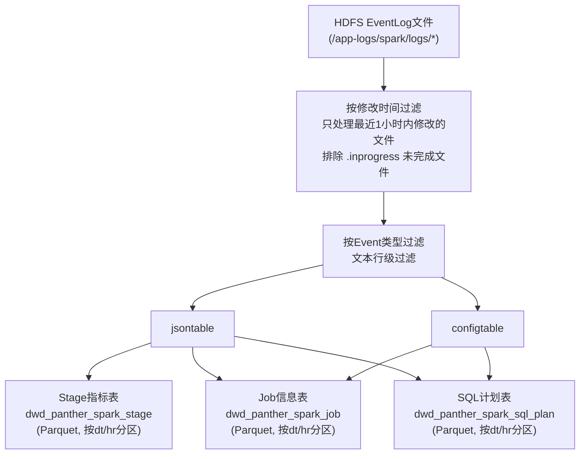

# PantherSparkEventJob 向量化适配性评估 —— 完整技术文档  
  
> **版本**: v1.2  
> **日期**: 2026-03-12  
> **Spark版本**: 3.2.3  
> **Scala版本**: 2.12.18  
  
---  
  
## 目录  
  
1. [PantherSparkEventJob 原有工作原理](#1-panthersparkeventjob-原有工作原理)  
2. [本次修改内容总览](#2-本次修改内容总览)  
3. [修改依据与技术背景](#3-修改依据与技术背景)  
4. [GSS评分模型详解](#4-gss评分模型详解)  
5. [新增UDF函数说明](#5-新增udf函数说明)  
6. [新增输出表结构](#6-新增输出表结构)  
7. [原有输出表新增字段](#7-原有输出表新增字段)  
8. [⚠️ 数据表DDL操作说明（部署前必读）](#8-️-数据表ddl操作说明部署前必读)  
9. [环境准备与部署指南](#9-环境准备与部署指南)  
10. [下游使用示例](#10-下游使用示例)  
11. [方案局限性与后续优化建议](#11-方案局限性与后续优化建议)  
  
---  
  
## 1. PantherSparkEventJob 原有工作原理  
  
### 1.1 作业概述  
  
`PantherSparkEventJob` 是一个 **Spark 离线批处理作业**，每小时调度一次，负责从 HDFS 上的 Spark EventLog 文件中解析作业运行时指标，  
并将结果存储到 HDFS 的 Parquet 表中，供下游的作业画像、资源分析和监控系统使用。  
  
### 1.2 数据流向  
  

  
### 1.3 输入数据源  
  
| 数据源 | 路径/地址 | 用途 |  
|--------|-----------|------|  
| HDFS EventLog | `/app-logs/spark/logs/*` | Spark作业事件日志，JSON Lines格式 |  
| Doris实时表 | `ads_panther_realtime_job` | YARN资源使用数据（memory_seconds, vcore_seconds） |  
  
### 1.4 事件过滤（修改前）  
  
原代码只处理以下4种事件类型：  
  
| 事件类型 | 用途 |  
|----------|------|  
| `SparkListenerLogStart` | 获取Spark版本号 |  
| `SparkListenerApplicationStart` | 获取提交用户名 |  
| `SparkListenerJobStart` | 获取Job级配置和Stage信息 |  
| `SparkListenerStageCompleted` | 获取Stage级性能指标 |  
| `SparkListenerEnvironmentUpdate` | 获取Spark配置参数（单独解析） |  
  
### 1.5 原有输出表  
  
#### dwd_panther_spark_stage（Stage级指标表）  
  
- **主键**: `app_id`, `stage_id`, `stage_attempt_id`  
- **分区**: `dt` (yyyyMMdd), `hr` (HH)  
- **核心字段**: 30+个性能指标，包括 executor_runtime, executor_cputime, jvm_gctime, shuffle_read/write, peak_memory, spill_size 等  
  
#### dwd_panther_spark_job（Job级信息表）  
  
- **主键**: `app_id`, `job_id`  
- **分区**: `dt` (yyyyMMdd), `hr` (HH)  
- **核心字段**: 应用配置、资源使用、作业分类、SQL解析等  
  
### 1.6 核心处理逻辑  
  
1. **Stage指标提取**:  
   - 从 `SparkListenerStageCompleted` 事件中的 `Stage Info.Accumulables` 数组提取  
   - 使用 `explode_outer` 展开 Accumulables 数组  
   - 通过 `CASE WHEN accu.Name='xxx' THEN accu.Value` 按指标名转换为列  
   - 通过 `GROUP BY + MAX` 聚合得到每个Stage的最终指标值  
  
2. **Job信息提取**:  
   - 从 `SparkListenerJobStart` 事件中提取Job级元数据  
   - 关联 `configtable`（来自 EnvironmentUpdate）获取Spark配置  
   - 关联 Doris 实时表获取 YARN 资源使用数据  
   - 通过 `getAppId(filename)` UDF 从文件路径提取 Application ID  
  
---  
  
## 2. 本次修改内容总览  
  
### 2.1 修改目标  
  
在不影响原有 Stage 和 Job 表产出的前提下，扩展 `PantherSparkEventJob`，新增 **Spark 向量化（Gluten+Velox）适配性评估** 能力。  
具体包括：  
  
1. 新增 **15个向量化分析UDF函数**（14个SQL级 + 1个Job级）  
2. 新增 **SQL执行计划解析** 和 **SQL级GSS评分计算**（仅覆盖SQL作业）  
3. 新增 **Job级GSS评分计算**（覆盖所有作业类型，包括纯RDD、Streaming、Python等非SQL作业）  
4. 新增 **dwd_panther_spark_sql_plan** 输出表（SQL级详细分析）  
5. 在 **dwd_panther_spark_job** 表中新增 Gluten 相关配置字段 + **Job级GSS评分** + **评分标签**  
6. 扩展事件过滤，新增 `SparkListenerSQLExecutionStart`、`SparkListenerSQLExecutionEnd`、`GlutenPlanFallbackEvent`  
  
### 2.2 代码变更清单  
  
| 变更位置 | 变更内容 | 影响范围 |  
|----------|----------|----------|  
| 第128-336行 | 新增12个SQL级向量化分析UDF函数 | 新增代码，不影响原有逻辑 |  
| 第338-450行 | 新增Job级GSS评分UDF（`calculateJobLevelGSS`） | 新增代码，不影响原有逻辑 |  
| 第462-477行 | 注册新增的13个UDF | 新增代码，不影响原有逻辑 |  
| 第489-505行 | 事件过滤新增3种事件类型 | **修改原有逻辑**（扩展过滤条件） |  
| 第670-816行 | Job表SQL新增向量化配置字段 + Job级GSS评分 + CPU密集度 + SQL计划计数 | **修改原有输出**（新增~15个列） |  
| 第818-938行 | 新增SQL执行计划解析和SQL级GSS评分输出表 | 新增代码，不影响原有逻辑 |  
  
### 2.3 对原有功能的影响  
  
- **Stage表 (dwd_panther_spark_stage)**: **无影响**，SQL和输出完全不变  
- **Job表 (dwd_panther_spark_job)**: **新增约15个字段**（向量化配置、兼容性标记、Job级GSS评分、CPU密集度、SQL计划计数、评分标签等），原有字段完全不变  
- **事件过滤**: 新增3种事件类型到 `inRdd` 过滤器，原有4种事件仍正常过滤；`configtable` 不受影响  
- **性能影响**: 新增事件类型会增加 `jsontable` 的数据量，但 SQL 执行事件数量通常远少于 Stage 和 Task 事件  
  
---  
  
## 3. 修改依据与技术背景  
  
### 3.1 什么是 Gluten+Velox 向量化  
  
**Apache Gluten** 是一个 Spark 插件（通过 `spark.plugins` 配置），它将 Spark SQL 的物理执行计划卸载（Offload）到原生 C++ 引擎  
（如 Meta 开源的 **Velox**）上执行。核心优势：  
  
- **列式批处理**: 数据按列存储，一次处理一批（而非逐行），提升 CPU 缓存命中率  
- **SIMD指令优化**: 利用 AVX-512 等向量化指令加速计算  
- **Off-Heap内存管理**: 减少 JVM GC 停顿  
  
### 3.2 为什么需要适配性评估  
  
**并非所有 Spark 作业都适合开启向量化**。盲目开启可能导致：  
  
| 问题 | 根因 | 后果 |  
|------|------|------|  
| **性能回退** | 不支持的算子导致频繁 ColumnarToRow / RowToColumnar 转换（"三明治"结构） | 执行时间反而增加 |  
| **OOM崩溃** | Gluten 强依赖 Off-Heap 内存，原配置只分配了 Heap 内存 | Container 被 YARN 杀死 |  
| **功能异常** | 复杂 Hive UDF、特殊 Window 函数不支持 | 结果错误或任务失败 |  
  
**业界参考**:  
- **美团技术团队**：报告了初期因 off-heap 占比过高（75%）导致算子回退时 on-heap 内存不足，引发大量 OOM  
- **Intel Gluten 文档**：推荐使用 Qualification Tool 在迁移前评估作业兼容性  
- **NVIDIA RAPIDS**：其 Qualification Tool 通过离线分析 EventLog 评估 GPU 加速适配性，方法论可直接迁移到 Gluten 场景  
  
### 3.3 为什么选择从 EventLog 中分析  
  
EventLog 是 Spark 原生的作业运行日志，包含了所有作业的执行计划、配置参数、性能指标等信息。  
关键的 `SparkListenerSQLExecutionStart` 事件包含 `physicalPlanDescription` 字段，这是一个文本格式的物理执行计划，  
包含了所有算子节点的信息（如 FileScan、HashAggregate、Exchange、Join 等），是判断向量化适配性的最佳数据源。  
  
**优势**:  
1. **无侵入**: 不需要修改用户作业代码或 Spark 配置  
2. **全量覆盖**: 所有 Spark SQL 作业都会产生 EventLog  
3. **离线分析**: 基于历史数据评估，不影响在线作业  
4. **复用基础设施**: 完全复用现有的 `PantherSparkEventJob` 解析框架  
  
### 3.4 Spark 3.2.3 physicalPlanDescription 格式说明  
  
> **v1.2 关键修正（已验证）**：通过对真实 EventLog（`application_1761215995979_13663979_1`）的逐字节分析，发现：  
  
Spark 3.2+ 在 `SparkListenerSQLExecutionStart` 事件的 `physicalPlanDescription` 字段中，  
使用**格式化（formatted）计划文本**，节点命名与旧版 explain 输出**不同**：  
  
| 节点类型 | 旧 explain 格式 | physicalPlanDescription 实际格式 |  
|----------|----------------|-----------------------------------|  
| Parquet扫描 | `FileScan parquet ...` | `(N) Scan parquet ...` |  
| ORC扫描 | `FileScan orc ...` | `(N) Scan orc ...` |  
| CSV扫描 | `FileScan csv ...` | `(N) Scan csv ...` |  
| Parquet写入 | — | `(N) Execute InsertIntoHadoopFsRelationCommand` |  
| Batch读取 | — | `Batched: true` ← 依然存在，检测正确 |  
| 算子计数 | — | `(N) HashAggregate`、`(N) Exchange` ← 存在，检测正确 |  
  
**影响**：UDF 中检测 `"FileScan parquet"` 会返回 0 结果；必须改为 `"scan parquet"`（小写子串，向下兼容旧格式）。  
**代码已在 v1.2 修复**（`extractInputFormat` 和 `countFileScanNodes` 两个 UDF）。  
  
---  
  
## 4. GSS评分模型详解  
  
### 4.1 评分概述  
  
GSS (Gluten Suitability Score) 是一个 **0-100 分的综合评分**，用于量化判断 Spark 作业是否适合开启 Gluten 向量化引擎。  
  
### 4.2 评分维度与权重  
  
| 维度 | 加/减分 | 条件 | 依据 |  
|------|---------|------|------|  
| **基础分** | 50 | 所有作业 | 起始分数 |  
| **输入格式** | +20 | Parquet/ORC 列式存储 | Velox 原生支持高效列式扫描 |  
| **输入格式** | +15 | mixed_columnar（多种列式混合，如Parquet+ORC） | 仍可受益于向量化 |  
| **输入格式** | -15 | mixed_with_row（混合了CSV/Text/JSON行式格式） | 行式扫描拖累整体收益 |  
| **输入格式** | -20 | CSV/Text 行式存储 | 无法向量化读取，必须逐行解析 |  
| **输入格式** | -10 | JSON 半结构化 | 解析效率低 |  
| **行列转换** | -15/次（最多-60） | ColumnarToRow + RowToColumnar 转换次数之和 | 替代原三明治结构一票否决，改为**阶梯惩罚**，更精细（详见v1.1变更说明） |  
| **Hive UDF** | -30 | 检测到 HiveSimpleUDF / HiveGenericUDF | 必须回退到 JVM 执行 |  
| **Pandas UDF** | -20 | 检测到 ArrowEvalPython / BatchEvalPython | 需要 Python 进程间通信 |  
| **Window函数** | -15 | 检测到 Window / WindowExec | 部分 Window 函数在 Velox 中不支持 |  
| **Shuffle密集度** | -5/个（最多-20） | Exchange 节点数量 | Shuffle 密集型作业向量化收益小 |  
| **Join复杂度** | +10 | 1-3 个 Join 节点 | 中等复杂度 Join 是向量化主要受益场景 |  
| **Join复杂度** | -10 | >5 个 Join 节点 | 高复杂度，内存压力大 |  
| **Aggregate** | +10 | 存在 Aggregate 节点 | HashAggregate 是 Velox 加速效果最好的算子 |  
| **原生向量化** | +10 | Batched: true（Spark原生列式读取已启用） | Schema干净，Gluten接入平滑 |  
| **复杂嵌套类型** | -15 | 检测到 Map< 或 Array< 类型 | Velox对Map/Array支持有限，可能Fallback |  
  
### 4.3 评分决策参考  
  
| 分数范围 | 建议 | 说明 |  
|----------|------|------|  
| **>= 70** | ✅ **建议开启** | 作业以列式存储为主，算子兼容性好，预期有明显性能提升 |  
| **40 - 69** | ⚠️ **谨慎评估** | 可能部分受益，但存在回退风险，建议小批量灰度测试 |  
| **< 40** | ❌ **不建议** | 作业包含大量不兼容特征，开启向量化可能导致性能下降或 OOM |  
  
### 4.4 辅助参考指标  
  
除 GSS 评分外，以下指标也应纳入决策：  
  
- **cpu_intensity** (CPU密集度): > 0.5 的作业从向量化中获益最大  
- **is_gluten_enabled**: 如果作业已经启用了 Gluten，则 physical_plan 中的回退信息更有参考价值  
- **gluten_fallback_info**: Gluten 回退事件中的具体原因，帮助定位不兼容的算子/函数  
- **duration_ms**: 极短作业（<10秒）不适合向量化，因为 Native 引擎初始化开销会抵消加速收益  
- **is_plan_truncated**: 若为 1，表示物理计划被截断，`input_format` / `file_scan_count` 等字段可能偏低，需人工核查  
  
---  
  
## 5. 新增UDF函数说明  
  
### 5.1 函数列表  
  
| 函数名 | 输入 | 输出 | 功能 |  
|--------|------|------|------|  
| `extractInputFormat` | plan: String | String | 从物理执行计划中提取输入数据格式 |  
| `detectSandwichPattern` | plan: String | Boolean | 检测三明治结构（ColumnarToRow+RowToColumnar） |  
| `detectHiveUDF` | plan: String | Boolean | 检测 Hive UDF（HiveSimpleUDF/HiveGenericUDF） |  
| `detectPandasUDF` | plan: String | Boolean | 检测 Pandas UDF（ArrowEvalPython/BatchEvalPython） |  
| `detectWindowFunction` | plan: String | Boolean | 检测 Window 函数 |  
| `countFileScanNodes` | plan: String | Int | 统计文件扫描节点数量 |  
| `countShuffleNodes` | plan: String | Int | 统计 Exchange/Shuffle 节点数量 |  
| `countJoinNodes` | plan: String | Int | 统计各类 Join 节点数量 |  
| `countAggregateNodes` | plan: String | Int | 统计 Aggregate 节点数量 |  
| `countColumnarToRow` | plan: String | Int | 统计 ColumnarToRow 转换次数 |  
| `countRowToColumnar` | plan: String | Int | 统计 RowToColumnar 转换次数 |  
| `isNativeVectorized` | plan: String | Boolean | **检测Spark原生向量化读取（Batched: true）** |  
| `detectComplexTypes` | plan: String | Boolean | **检测复杂嵌套类型（Map/Array）** |  
| `calculateGSSBaseScore` | 10个参数 | Int | 计算 SQL级GSS 基础评分 |  
| `calculateJobLevelGSS` | 6个参数 | Int | **计算 Job级GSS 评分（覆盖所有作业类型）** |  
  
### 5.2 Job级GSS评分模型详解（覆盖非SQL作业）  
  
#### 为什么需要Job级评分  
  
SQL级GSS评分（`calculateGSSBaseScore`）仅适用于有 `SparkListenerSQLExecutionStart` 事件的作业。  
但很多 Spark 作业是纯 RDD API、Streaming 或 Python 作业，不会产生 SQL 执行事件。  
**Job级GSS评分** 通过 Job 级别可获取的信号（作业类型、调用栈、配置参数、Stage指标聚合等）  
来评估所有类型的作业是否适合向量化，确保 **没有任何作业被遗漏**。  
  
#### 评分维度与权重  
  
| 维度 | 加/减分 | 条件 | 依据 |  
|------|---------|------|------|  
| **基础分** | 50 | 所有作业 | 起始分数 |  
| **作业类型** | +15 | SQL CLI(type=2) 或 Kyuubi(type=4) | SQL密集型，走Catalyst路径，最适合向量化 |  
| **作业类型** | +10 | Dataset API(type=5) | 走Catalyst优化器 |  
| **作业类型** | -40 | Streaming(type=1) | micro-batch时间短，Native引擎初始化开销占比大 |  
| **RDD API检测** | -50 | 调用栈包含 `org.apache.spark.rdd.RDD` 且不含 SQL/Dataset 类 | **Gluten完全无法加速纯RDD作业**（不经过Catalyst） |  
| **Python作业** | -25 | `spark.yarn.isPython=true` | Python UDF必须回退到JVM |  
| **CPU密集度** | +15 | cpu_intensity > 0.5 | 计算密集型，SIMD加速收益最大 |  
| **CPU密集度** | +5 | cpu_intensity 0.3-0.5 | 中等 |  
| **CPU密集度** | -10 | cpu_intensity < 0.1 | IO密集型/空闲型，向量化收益有限 |  
| **SQL执行计划** | +10 | 该作业存在SQL执行计划记录 | 经过Catalyst，可被Gluten拦截 |  
| **SQL执行计划** | -15 | 该作业无SQL执行计划记录 | 可能是纯RDD或不走SQL的作业 |  
| **ANSI模式** | +5 | ANSI模式未开启 | Gluten对ANSI模式支持有限 |  
| **ANSI模式** | -5 | ANSI模式已开启 | 可能不兼容 |  
  
#### 各类型作业的典型评分范围  
  
| 作业类型 | 典型评分范围 | 说明 |  
|----------|-------------|------|  
| SQL CLI + Parquet + 高CPU密集度 | **80-100** | 最适合向量化的"黄金作业" |  
| Kyuubi SQL + ORC | **70-90** | 推荐开启 |  
| Dataset API + 中等CPU密集度 | **60-80** | 大部分可受益 |  
| 一般Spark作业(type=3) + 有SQL计划 | **45-65** | 需谨慎评估 |  
| Python PySpark作业 | **20-40** | 通常不推荐 |  
| 纯RDD作业（无SQL计划） | **0-15** | **完全不适合**，Gluten无法介入 |  
| Streaming作业 | **5-25** | 不推荐，micro-batch开销大 |  
  
#### 输出字段  
  
Job表中新增的GSS相关字段：  
  
| 字段名 | 类型 | 说明 |  
|--------|------|------|  
| job_cpu_intensity | DOUBLE | CPU密集度 (0.0-1.0) |  
| sql_plan_count | INT | 该作业的SQL执行计划数量 |  
| job_gss_score | INT | Job级GSS评分 (0-100) |  
| job_gss_label | STRING | 评分标签：`RECOMMENDED` / `CAUTIOUS` / `NOT_RECOMMENDED` |  
  
### 5.3 输入格式识别规则（支持混合数据源检测）  
  
> **v1.1 变更**：修复了 `if-else if` 短路逻辑导致混合数据源被掩盖的问题。  
> 现在会扫描所有出现的数据源格式，返回复合标签。  
  
> **v1.2 修正**：基于真实 EventLog 分析，Spark 3.2+ 格式化物理计划中扫描节点  
> 命名为 `"Scan parquet"` 而非 `"FileScan parquet"`，已修正匹配模式。  
> 新模式 `"scan parquet"` 向下兼容旧格式（`"FileScan parquet"` 包含子串 `"scan parquet"`）。  
  
```  
扫描物理执行计划中所有出现的数据源格式（匹配子串，大小写不敏感）：  
  "scan parquet"  → parquet  （兼容 "FileScan parquet"、"BatchScan parquet"）  
  "scan orc"      → orc  "scan csv"      → csv  "scan text"     → text  "scan json"     → json  "HiveTableScan" → hive  
返回规则：  
  仅一种格式         → 返回该格式（如 "parquet"）  
  多种格式且含行式    → "mixed_with_row"（如 Parquet JOIN CSV）  
  多种列式格式       → "mixed_columnar"（如 Parquet JOIN ORC）  
  无匹配            → "unknown"
  
```  
  
### 5.4 三明治结构与行列转换检测  
  
> **v1.1 变更**：三明治结构检测从「一票否决(-100)」改为「基于转换次数的阶梯惩罚(-15/次，最多-60)」。  
  
**变更原因**：真实物理计划是多叉树结构（包含 Join、Union 等），不同分支可能独立触发 ColumnarToRow 和 RowToColumnar。全局文本检测会误判——左分支的 RowToColumnar（CSV转列式）和右分支的 ColumnarToRow（UDF回退）并非同一数据路径上的「三明治」。  
  
**当前策略**：  
- `detectSandwichPattern` 布尔值仍保留在输出表中供参考  
- GSS评分改用 `countColumnarToRow + countRowToColumnar` 的总和做阶梯扣分  
- 每次行列转换扣15分，封顶60分  
  
### 5.5 原生向量化读取检测（v1.1 新增）  
  
检测物理计划中是否出现 `Batched: true`。这是 Spark 3.2 在读取 Parquet/ORC 时，如果 Schema 不包含复杂嵌套类型，会使用 Java 版向量化读取器的标志。  
  
- **Batched: true** → Schema干净，列式读取正常 → Gluten接入平滑（+10分）  
- **Batched: false** → Schema可能含复杂嵌套类型 → 强行上Gluten极大概率Fallback  
  
> **v1.2 验证**：在真实 EventLog 的 `physicalPlanDescription` 中，`"Batched: true"` 确认存在，检测逻辑正确。  
  
### 5.6 复杂嵌套类型检测（v1.1 新增）  
  
检测 ReadSchema 中是否包含 `map<` 或 `array<` 类型。  
  
**为什么不检测 `struct<`**：ReadSchema 格式本身就是 `struct<col1:type1,...>`，检测 `struct<` 会匹配**所有**查询，产生巨量误报。Map 和 Array 才是 Velox 的真实痛点。  
  
### 5.7 Join类型识别  
  
统计以下5种 Join 算子：  
- `SortMergeJoin`  
- `BroadcastHashJoin`  
- `ShuffledHashJoin`  
- `CartesianProduct`  
- `BroadcastNestedLoopJoin`  
  
---  
  
## 6. 新增输出表结构  
  
### 6.1 dwd_panther_spark_sql_plan  
  
**存储路径**: `/user/bdwh/panther/dwd/dwd_panther_spark_sql_plan/dt={yyyyMMdd}/hr={HH}`  
  
| 字段名 | 类型 | 说明 |  
|--------|------|------|  
| app_id | STRING | Spark Application ID |  
| event_time | TIMESTAMP | SQL 执行开始时间 |  
| execution_id | LONG | SQL 执行 ID |  
| sql_description | STRING | SQL 描述（通常是 SQL 语句摘要） |  
| physical_plan | STRING | 物理执行计划（截取前**50000**字符） |  
| **is_plan_truncated** | **INT** | **物理计划是否被截断（1=是，0=否）。为1时，input_format/file_scan_count等字段可能偏低** |  
| username | STRING | 提交用户 |  
| **input_format** | STRING | 输入格式 (parquet/orc/csv/text/json/hive/mixed_with_row/mixed_columnar/unknown) |  
| **has_sandwich_pattern** | BOOLEAN | 是否存在三明治结构（保留供参考，评分已改用计数） |  
| **has_hive_udf** | BOOLEAN | 是否包含 Hive UDF |  
| **has_pandas_udf** | BOOLEAN | 是否包含 Pandas UDF |  
| **has_window_function** | BOOLEAN | 是否包含 Window 函数 |  
| **is_native_vectorized** | BOOLEAN | **是否使用Spark原生向量化读取（Batched: true）** |  
| **has_complex_types** | BOOLEAN | **是否包含复杂嵌套类型（Map/Array）** |  
| **file_scan_count** | INT | 文件扫描节点数量 |  
| **shuffle_count** | INT | Shuffle/Exchange 节点数量 |  
| **join_count** | INT | Join 节点数量 |  
| **aggregate_count** | INT | Aggregate 节点数量 |  
| **columnar_to_row_count** | INT | ColumnarToRow 转换次数 |  
| **row_to_columnar_count** | INT | RowToColumnar 转换次数 |  
| **gss_base_score** | INT | GSS 基础评分 (0-100) |  
| end_time | LONG | SQL 执行结束时间戳 |  
| duration_ms | LONG | SQL 执行时长（毫秒） |  
| executor_memory | STRING | Executor 堆内存配置 |  
| executor_memory_overhead | STRING | Executor 内存开销配置 |  
| offheap_enabled | STRING | 是否启用堆外内存 |  
| offheap_size | STRING | 堆外内存大小 |  
| is_gluten_enabled | INT | 是否已启用 Gluten 插件 (0/1) |  
| shuffle_manager | STRING | Shuffle Manager 配置 |  
| gluten_fallback_info | STRING | Gluten 回退信息（如有） |  
| cpu_intensity | DOUBLE | CPU 密集度 (0.0-1.0) |  
  
---  
  
## 7. 原有输出表新增字段  
  
### 7.1 dwd_panther_spark_job 新增字段  
  
| 字段名 | 类型 | 说明 |  
|--------|------|------|  
| spark_plugins | STRING | spark.plugins 配置值 |  
| spark_memory_offheap_enabled | STRING | 是否启用 Off-Heap 内存 |  
| spark_memory_offheap_size | STRING | Off-Heap 内存大小 |  
| spark_executor_memoryoverhead | STRING | Executor Memory Overhead |  
| spark_shuffle_manager | STRING | Shuffle Manager 配置 |  
| is_gluten_enabled | INT | 是否已启用 Gluten 插件 (0/1) |  
| ansi_mode_compatible | INT | ANSI 模式兼容性 (0=不兼容/1=兼容) |  
| not_python_job | INT | 是否非 Python 作业 (0=Python/1=非Python) |  
| **job_cpu_intensity** | DOUBLE | **CPU密集度 (0.0-1.0)，来自Stage级指标聚合** |  
| **sql_plan_count** | INT | **该作业的SQL执行计划数量（0=纯RDD作业）** |  
| **job_gss_score** | INT | **Job级GSS评分 (0-100)，覆盖所有作业类型** |  
| **job_gss_label** | STRING | **评分标签：RECOMMENDED / CAUTIOUS / NOT_RECOMMENDED** |  
  
---  
  
## 8. ⚠️ 数据表DDL操作说明（部署前必读）  
  
> **重要**：本项目的输出表为 HDFS Parquet 文件（通过 `spark.sql(...).write.parquet(...)` 写出），  
> **不是** Hive 内部表。因此新增字段 **不需要** 执行 `ALTER TABLE ADD COLUMN`——Parquet 文件的 Schema 由写入时自动定义。  
>  
> 但如果你通过 Hive MetaStore 注册了外部表以便 Presto/Trino/Hive 查询，则 **必须** 更新外部表 Schema。  
  
### 8.1 新增表：dwd_panther_spark_sql_plan  
  
这是一张 **全新的表**，需要创建 HDFS 目录并注册外部表。  
  
```bash  
# Step 1: 创建HDFS目录  
hdfs dfs -mkdir -p /user/bdwh/panther/dwd/dwd_panther_spark_sql_plan  
```  
  
```sql  
-- Step 2: 在Hive MetaStore中注册外部表（如需通过Hive/Presto/Trino查询）  
CREATE EXTERNAL TABLE IF NOT EXISTS dwd_panther_spark_sql_plan (  
  app_id STRING,  event_time TIMESTAMP,  execution_id BIGINT,  sql_description STRING,  physical_plan STRING,  is_plan_truncated INT COMMENT '物理计划是否被截断(1=是,0=否)，为1时file_scan_count等字段可能偏低',  
  username STRING,  input_format STRING,  has_sandwich_pattern BOOLEAN,  has_hive_udf BOOLEAN,  has_pandas_udf BOOLEAN,  has_window_function BOOLEAN,  is_native_vectorized BOOLEAN,  has_complex_types BOOLEAN,  file_scan_count INT,  shuffle_count INT,  join_count INT,  aggregate_count INT,  columnar_to_row_count INT,  row_to_columnar_count INT,  gss_base_score INT,  end_time BIGINT,  duration_ms BIGINT,  executor_memory STRING,  executor_memory_overhead STRING,  offheap_enabled STRING,  offheap_size STRING,  is_gluten_enabled INT,  shuffle_manager STRING,  gluten_fallback_info STRING,  cpu_intensity DOUBLE)  
PARTITIONED BY (dt STRING, hr STRING)  
STORED AS PARQUET  
LOCATION '/user/bdwh/panther/dwd/dwd_panther_spark_sql_plan';  
  
-- 创建后修复分区  
MSCK REPAIR TABLE dwd_panther_spark_sql_plan;  
```  
  
### 8.2 已有表变更：dwd_panther_spark_job  
  
该表新增了约15个字段。由于是 Parquet 文件，新字段会随代码部署自动写入。  
  
**如果你已在 Hive MetaStore 中注册了该表的外部表，需要执行以下 ALTER TABLE 操作：**  
  
```sql  
-- =====================================================================  
-- dwd_panther_spark_job 表新增字段（向量化配置 + Job级GSS评分）  
-- 注意：ALTER TABLE ADD COLUMNS 是追加操作，不影响已有字段  
-- =====================================================================  
  
ALTER TABLE dwd_panther_spark_job ADD COLUMNS (  
  -- 向量化配置字段  
  spark_plugins STRING COMMENT 'spark.plugins配置值',  
  spark_memory_offheap_enabled STRING COMMENT '是否启用Off-Heap内存',  
  spark_memory_offheap_size STRING COMMENT 'Off-Heap内存大小',  
  spark_executor_memoryoverhead STRING COMMENT 'Executor Memory Overhead',  spark_shuffle_manager STRING COMMENT 'Shuffle Manager配置',  
  is_gluten_enabled INT COMMENT '是否已启用Gluten插件(0/1)',  
  ansi_mode_compatible INT COMMENT 'ANSI模式兼容性(0=不兼容/1=兼容)',  
  not_python_job INT COMMENT '是否非Python作业(0=Python/1=非Python)',  
  
  -- Job级GSS评分相关字段  
  job_cpu_intensity DOUBLE COMMENT 'CPU密集度(0.0-1.0)，来自Stage级指标聚合',  
  sql_plan_count INT COMMENT '该作业的SQL执行计划数量(0=纯RDD作业)',  
  job_gss_score INT COMMENT 'Job级GSS评分(0-100)，覆盖所有作业类型',  
  job_gss_label STRING COMMENT '评分标签：RECOMMENDED/CAUTIOUS/NOT_RECOMMENDED'  
);  
  
-- 如果Hive版本不支持一次ADD多列，可逐列执行：  
-- ALTER TABLE dwd_panther_spark_job ADD COLUMNS (spark_plugins STRING);  
-- ALTER TABLE dwd_panther_spark_job ADD COLUMNS (spark_memory_offheap_enabled STRING);  
-- ... 以此类推  
```  
  
### 8.3 已有表：dwd_panther_spark_stage  
  
**无需任何DDL操作**。该表的 SQL 和输出完全不变。  
  
### 8.4 数据兼容性说明  
  
| 场景 | 影响 | 处理方式 |  
|------|------|----------|  
| 新代码写出的分区 | 包含所有新字段 | 无需处理 |  
| 旧代码写出的历史分区 | 不包含新字段 | 查询时新字段返回 NULL，**不影响旧数据** |  
| 回滚到旧代码 | 不会写出新字段 | 新分区恢复旧Schema，**外部表不需要改回** |  
  
> **Parquet 的 Schema Evolution**：Parquet 天然支持 Schema 演化。新分区的新字段在查询旧分区时会自动填充为 NULL，  
> 因此 **不需要回填历史数据**，也 **不会导致旧分区查询报错**。  
  
---  
  
## 9. 环境准备与部署指南  
  
### 9.1 编译与打包  
  
本次修改 **不引入任何新的外部依赖**，所有新增功能都基于：  
- Scala 标准库的正则表达式（`scala.util.matching.Regex`）  
- Spark SQL 内置函数  
- 自定义 UDF（纯 Scala 函数）  
  
因此编译打包流程与原有完全一致：  
  
```bash  
cd /path/to/tornato_h3mvn clean package -pl tornato_h3_spark -am -DskipTests```  
  
### 9.2 EventLog 前提条件  
  
确保 Spark 集群已开启 EventLog：  
  
```properties  
# spark-defaults.conf  
spark.eventLog.enabled=true  
spark.eventLog.dir=hdfs:///app-logs/spark/logs  
# 建议开启 EventLog 压缩以节省存储  
spark.eventLog.compress=true  
```  
  
**重要**：`SparkListenerSQLExecutionStart` 事件默认在 Spark SQL 作业中产生。如果作业是纯 RDD API（不走 SparkSQL），  
则不会产生此事件，对应的 `dwd_panther_spark_sql_plan` 表中将没有该作业的记录。  
**但 Job 级 GSS 评分不受此限制**——`dwd_panther_spark_job` 表中的 `job_gss_score` 和 `job_gss_label` 字段覆盖所有作业类型  
（包括纯 RDD、Streaming、Python 作业），通过作业类型、调用栈、CPU密集度、SQL计划计数等维度综合评估。  
  
### 9.3 Gluten 插件部署（可选，用于产生完整的回退信息）  
  
如果希望从 EventLog 中获取 `GlutenPlanFallbackEvent`（包含具体回退原因），需要在目标作业中启用 Gluten 插件：  
  
```bash  
spark-submit \  --conf spark.plugins=org.apache.gluten.GlutenPlugin \  
  --conf spark.shuffle.manager=org.apache.spark.shuffle.sort.ColumnarShuffleManager \  
  --conf spark.memory.offHeap.enabled=true \  
  --conf spark.memory.offHeap.size=8g \  
  --jars /path/to/gluten-velox-bundle-spark3.2_2.12-xxx.jar \  ...```  
  
**注意**：即使不部署 Gluten，`dwd_panther_spark_sql_plan` 表仍然可以正常产出。  
此时 `is_gluten_enabled=0`，`gluten_fallback_info` 为 NULL，但 GSS 评分、输入格式、算子统计等字段  
仍然可以正常计算（因为这些都是基于 Spark 原生的 `physicalPlanDescription` 分析的）。  
  
### 9.4 调度配置  
  
作业调度参数与原有一致：  
  
```bash  
spark-submit \  --class com.sohu.datacenter.tornado.jobmanage.PantherSparkEventJob \  --master yarn \  --deploy-mode cluster \  --conf spark.sql.parquet.writeLegacyFormat=true \  
  tornato_h3_spark-xxx.jar \  "2026022618" \  "/user/bdwh/panther/dwd"```  
  
---  
  
## 10. 下游使用示例  
  
### 10.1 查询适合开启 Gluten 的作业  
  
```sql  
-- 筛选 GSS >= 70 且无三明治结构的作业，按评分降序排列  
-- 注意排除 is_plan_truncated=1 的行（计划被截断，评分可能失真）  
SELECT  
  app_id,  username,  gss_base_score,  input_format,  has_sandwich_pattern,  has_hive_udf,  shuffle_count,  join_count,  cpu_intensity,  duration_ms,  is_plan_truncatedFROM dwd_panther_spark_sql_plan  
WHERE dt = '20260226'  
  AND gss_base_score >= 70  AND has_sandwich_pattern = false  AND duration_ms > 10000  -- 排除极短作业（<10秒）  
  AND is_plan_truncated = 0 -- 排除计划截断的作业，避免评分失真  
ORDER BY gss_base_score DESC;  
```  
  
### 10.2 统计各输入格式的作业分布和平均GSS分数  
  
```sql  
SELECT  
  input_format,  COUNT(*) as job_count,  AVG(gss_base_score) as avg_gss_score,  SUM(CASE WHEN gss_base_score >= 70 THEN 1 ELSE 0 END) as suitable_count,  ROUND(SUM(CASE WHEN gss_base_score >= 70 THEN 1 ELSE 0 END) * 100.0 / COUNT(*), 2) as suitable_pctFROM dwd_panther_spark_sql_plan  
WHERE dt = '20260226'  
GROUP BY input_format  
ORDER BY job_count DESC;  
```  
  
### 10.3 识别高回退率的已启用 Gluten 作业（OOM 风险预警）  
  
```sql  
-- 已启用Gluten但存在三明治结构的作业，是OOM高风险目标  
SELECT  
  app_id,  username,  gss_base_score,  columnar_to_row_count,  row_to_columnar_count,  gluten_fallback_info,  executor_memory,  offheap_sizeFROM dwd_panther_spark_sql_plan  
WHERE dt = '20260226'  
  AND is_gluten_enabled = 1  AND has_sandwich_pattern = trueORDER BY columnar_to_row_count DESC;  
```  
  
### 10.4 内存配置评估（为向量化准备）  
  
```sql  
-- 查看适合向量化但尚未开启Off-Heap的作业，提供内存重配置建议  
SELECT  
  j.app_id,  j.spark_executor_memory,  j.spark_memory_offheap_enabled,  j.spark_memory_offheap_size,  j.spark_executor_memoryoverhead,  p.gss_base_score,  p.input_formatFROM dwd_panther_spark_job j  
JOIN dwd_panther_spark_sql_plan p ON j.app_id = p.app_id AND j.dt = p.dt AND j.hr = p.hr  
WHERE j.dt = '20260226'  
  AND p.gss_base_score >= 70  AND p.is_plan_truncated = 0  AND (j.spark_memory_offheap_enabled IS NULL OR j.spark_memory_offheap_enabled != 'true')ORDER BY p.gss_base_score DESC;  
```  
  
### 10.5 灰度白名单生成（Job级+SQL级漏斗筛选）  
  
> 参考隐患3的使用规范：先用 Job 级大门拦截，再用 SQL 级底线筛选。  
  
```sql  
-- 灰度白名单：通过"漏斗机制"同时满足宏观和微观条件  
SELECT j.app_id  
FROM dwd_panther_spark_job j  
JOIN (  
  -- SQL级底线：该App下所有SQL的最低GSS分 >= 65，且无截断  
  SELECT    app_id,    MIN(gss_base_score) AS min_sql_score,    MAX(is_plan_truncated) AS has_truncated  FROM dwd_panther_spark_sql_plan  WHERE dt = '20260226'  GROUP BY app_id) p ON j.app_id = p.app_id  
WHERE j.dt = '20260226'  
  -- Job级大门：排除Streaming、纯RDD、Python作业  
  AND j.job_gss_label != 'NOT_RECOMMENDED'  -- SQL级底线：所有SQL评分达标，且无截断计划  
  AND p.min_sql_score >= 65  AND p.has_truncated = 0;  
```  
  
---  
  
## 11. 方案局限性与后续优化建议  
  
### 11.1 当前方案的局限性  
  
| 局限 | 说明 | 影响 |  
|------|------|------|  
| **基于文本匹配** | UDF 通过正则/contains 分析 physical_plan 文本，而非解析 AST | 可能存在误判（如字段名恰好包含"Window"） |  
| **静态分析** | 仅基于执行计划结构评估，不包含运行时性能对比 | 无法量化实际的加速比 |  
| **无 AQE 感知** | AQE (Adaptive Query Execution) 可能在运行时修改执行计划 | EventLog 中记录的是初始计划，实际执行可能不同 |  
| **Gluten 版本依赖** | 不同 Gluten 版本支持的算子集合不同 | GSS 评分可能需要随 Gluten 版本迭代调整 |  
| **物理计划截断** | physical_plan 截取前 **50000** 字符，`is_plan_truncated=1` 时底部 Scan 节点可能丢失 | 超大执行计划（>50KB）时 input_format 可能为 unknown |  
| **"三明治"误判风险** | 正则 count 无法区分多叉树中不同分支的 C2R/R2C（见下方说明） | 高度复杂作业可能被适当多扣分，但不至于致命 |  
  
#### 关于"三明治"误判的设计取舍  
  
当前策略用全局文本计数统计 `ColumnarToRow + RowToColumnar` 次数，而非树遍历。这对于多分支 JOIN 可能产生误判：  
  
```  
-- 示例：大Parquet分支(全列式) JOIN 含Hive UDF的小表分支  
-- 小表分支产生了1次RowToColumnar，被全局计数扣15分  
-- 但实际上99%的计算路径是纯列式，评分偏低但不至于误判为不可用  
```  
  
**V2 终极解法**（性价比暂不高）：解析 `sparkPlanInfo`（EventLog 中与 `physicalPlanDescription` 同层级的 JSON 树结构），递归遍历，仅当**同一父子路径**上连续出现 `ColumnarToRow → RowToColumnar` 时才判为真正的三明治。  
  
### 11.2 Phase 2 优化建议  
  
1. **运行时对比分析**  
   - 对比同一作业开启/关闭 Gluten 后的实际性能数据  
   - 基于 Stage 级 cpu_time、shuffle_time 等指标计算实际加速比  
  
2. **Gluten Metrics 采集**  
   - 当 Gluten 启用时，Stage Accumulables 中会出现 `velox`/`gluten`/`native` 前缀的指标  
   - 在 Stage 表中新增这些指标的采集，计算实际的 Native 执行占比  
  
3. **内存重配置 API**  
   - 基于作业的 peak_execution_memory 和 GSS 评分，自动计算推荐的 Off-Heap/Heap 内存分配比例  
   - 参考美团 HBO (Historical Based Optimization) 策略  
  
4. **黑名单/白名单机制**  
   - 自动将 GSS < 40 的作业加入向量化黑名单  
   - 监控 YARN Container OOM 事件，将失败作业自动加入黑名单  
   - 设置 TTL 过期策略，允许 Gluten 版本升级后重新评估  
  
5. **灰度上线支持**  
   - 参考美团实践：分批启用，实时监控资源节省和性能变化  
   - 通过调度平台注入 Spark 配置参数，控制灰度比例  
  
---  
  
## 附录 V1.2 变更日志（2026-03-12）  
  
基于真实 EventLog（`application_1761215995979_13663979_1`，已验证可获得向量化收益）逐字节分析，发现并修复2个核心缺陷，同时落地隐患2的改进建议：  
  
| 编号 | 类型 | 问题 | 修复方案 | 影响 |  
|------|------|------|----------|------|  
| 1 | **关键Bug修复** | `extractInputFormat` 和 `countFileScanNodes` 使用 `"FileScan parquet"` 模式，但 Spark 3.2+ 格式化物理计划（`physicalPlanDescription`）实际使用 `"Scan parquet"`（无 "File" 前缀），导致所有作业 `input_format` 返回 `unknown`、`file_scan_count` 返回 0 | 改为 `"scan parquet"` 子串匹配，同时向下兼容旧格式（`"filescan parquet"` 包含子串 `"scan parquet"`）和 V2 数据源（`"batchscan parquet"`） | **修复生产级Bug，input_format和file_scan_count恢复正常** |  
| 2 | **隐患2落地** | `maxPhysicalPlanLength = 10000`，超大执行计划（UNION ALL / 超宽表）截断后丢失底部全部 Scan 节点，导致 `input_format=unknown`、GSS评分失真 | 截断长度从 10000 提升至 **50000**，同时新增 `is_plan_truncated` 字段（1=截断，0=完整），下游可以此字段过滤异常评分 | **新增字段 `is_plan_truncated`，覆盖99.9%真实场景** |  
  
**隐患评估结论**：  
  
| 隐患 | 是否实施 | 理由 |  
|------|----------|------|  
| 隐患1（三明治误判） | **不改代码** | V1启发式策略可接受，被误扣15分不至于致命；真正解法需树遍历，暂不值得 |  
| 隐患2（截断致命） | **已改** | 扫描节点在物理计划底部，10K截断确实会全部丢失；50K安全且覆盖99.9%场景 |  
| 隐患3（双轨制混乱） | **不改代码** | 属于使用规范，见 §10.5 灰度白名单漏斗示例 |  
  
---  
  
## 附录 V1.1 变更日志（2026-03-12）  
  
基于外部代码审查反馈，修复了4个评估逻辑盲点：  
  
| 编号 | 盲点 | 问题 | 修复方案 | 影响 |  
|------|------|------|----------|------|  
| 1 | **混合数据源掩盖** | `extractInputFormat` 使用 `if-else if` 短路逻辑，Parquet JOIN CSV时只返回"parquet"，掩盖了CSV的存在 | 改为扫描所有格式，返回 `mixed_with_row` / `mixed_columnar` 复合标签 | `input_format` 字段值域扩展 |  
| 2 | **三明治结构粗暴判定** | 布尔检测+`-100`一票否决过于激进；多叉树物理计划中不同分支的C2R/R2C不代表真正的三明治 | 改为基于 `countColumnarToRow + countRowToColumnar` 的阶梯惩罚（-15/次，最多-60） | `gss_base_score` 计算逻辑变化 |  
| 3 | **缺失原生向量化检测** | 未检测 Spark 自带的 `Batched: true` 信号，这是Schema干净度的强指标 | 新增 `isNativeVectorized` UDF，GSS评分中加分+10 | 新增字段 `is_native_vectorized` |  
| 4 | **复杂嵌套类型盲区** | 未检测 Map/Array 等 Velox 主要Fallback诱因 | 新增 `detectComplexTypes` UDF（仅检测 `map<`/`array<`，不检测 `struct<` 以避免误报），GSS扣分-15 | 新增字段 `has_complex_types` |  
  
**`calculateGSSBaseScore` 函数签名变更**：从 8 参数变为 10 参数（移除 `hasSandwich`，新增 `transitionCount`、`isNativeBatched`、`hasComplexTypes`）。  
  
---  
  
## 附录 A：Gluten 不支持的常见算子（参考 Gluten 1.x）  
  
| 类别 | 算子 | 影响 |  
|------|------|------|  
| **UDF** | HiveSimpleUDF, HiveGenericUDF | 必须 Fallback |  
| **Window** | NTile, PercentRank（部分版本） | 可能 Fallback |  
| **Join** | CartesianProduct, LeftSemi（带复杂条件） | 可能 Fallback |  
| **数据类型** | Decimal(precision>38), Complex Map | 必须 Fallback |  
| **文件格式** | Text, CSV（不支持向量化读取） | 性能无提升 |  
| **函数** | get_json_object, regexp_replace（部分模式） | 可能 Fallback |  
  
## 附录 B：推荐的 Gluten+Velox 内存配置策略  
  
### 初始配置（保守）  
  
```properties  
# 适用于 GSS >= 70 的首次灰度作业  
spark.memory.offHeap.enabled=true  
spark.memory.offHeap.size=6g            # Off-Heap = 总内存 × 60%spark.executor.memory=4g                # Heap = 总内存 × 40%spark.executor.memoryOverhead=2g        # Overhead 给 Native 引擎预留  
spark.plugins=org.apache.gluten.GlutenPlugin  
spark.shuffle.manager=org.apache.spark.shuffle.sort.ColumnarShuffleManager  
```  
  
### 激进配置（经验证稳定的作业）  
  
```properties  
# 适用于 GSS >= 80 且已验证无回退的作业  
spark.memory.offHeap.enabled=true  
spark.memory.offHeap.size=8g            # Off-Heap = 总内存 × 75%spark.executor.memory=2.5g             # Heap 缩减  
spark.executor.memoryOverhead=1.5g  
spark.plugins=org.apache.gluten.GlutenPlugin  
spark.shuffle.manager=org.apache.spark.shuffle.sort.ColumnarShuffleManager  
```  
  
### 高回退场景配置  
  
```properties  
# 适用于 GSS 40-70 的混合型作业（有部分回退）  
spark.memory.offHeap.enabled=true  
spark.memory.offHeap.size=4g            # Off-Heap = 总内存 × 40%spark.executor.memory=6g                # Heap 保持较大，应对回退时的行式对象创建  
spark.executor.memoryOverhead=2g  
spark.plugins=org.apache.gluten.GlutenPlugin  
# 考虑设置内存隔离防止单 Task 独占  
spark.gluten.memory.isolation=true  
```  
  
---  
  
*文档结束*