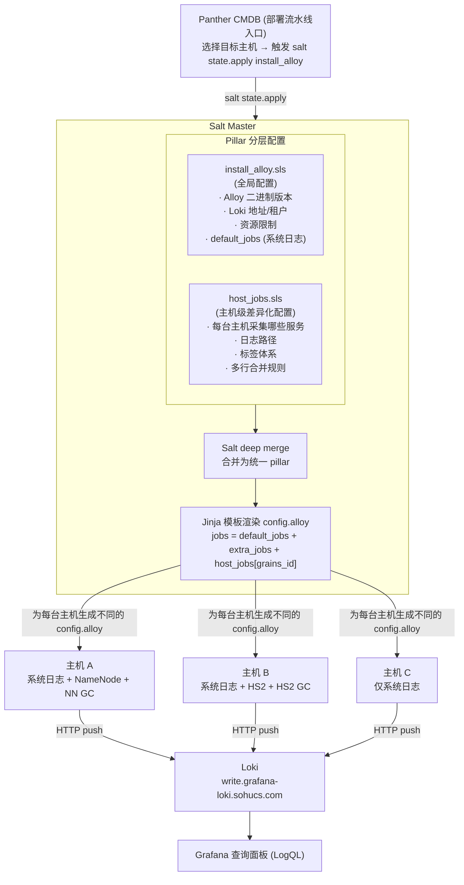

> **文档版本**: 2026-03-26 | **适用范围**: H3 全部集群（已上线，HBase RegionServer 除外）| H2 冷存（待上线）

---

## 一、方案总览

### 1.1 目标

通过 **Grafana Alloy**（轻量日志采集 Agent）+ **Loki**（日志存储与查询引擎），实现大数据集群所有组件日志的统一采集、标签化索引和集中查询。

### 1.2 整体架构



### 1.3 动态配置生成原理

系统的**核心设计**是 **"一份模板 + 按主机差异化的 Pillar"**，让每台主机自动获得属于自己的配置：

| 层级 | 文件 | 作用 | 修改频率 |
|------|------|------|---------|
| **全局层** | `install_alloy.sls` | 所有主机共享的配置（Alloy 版本、Loki 地址、`default_jobs` 系统日志） | 低 |
| **主机层** | `host_jobs.sls` | 每台主机独有的服务日志配置（路径、标签、多行规则），key 为 `grains['id']` | 高 |
| **模板层** | `config.alloy.jinja` | Jinja 模板，遍历 `jobs` 列表生成 Alloy 原生配置 | 基本不改 |

**渲染流程**：

1. Salt 将 `install_alloy.sls` 和 `host_jobs.sls` **深度合并**为一个 `alloy` 字典
2. Jinja 模板通过 `grains['id']` 找到当前主机的 `host_jobs`
3. 最终 `jobs = default_jobs + extra_jobs + host_jobs[当前主机ID]`
4. 模板为每个 job 生成一组 `local.file_match` → `loki.source.file` → `loki.process` 组件

**举例**：假设主机 `10.18.14.23` 是一台 NameNode，它的 `host_jobs` 配置了 `h3offline_nn_svc` 和 `h3offline_nn_gc` 两个 job。模板渲染后，该主机的 `config.alloy` 最终包含：

- 1 个系统日志采集（来自 `default_jobs`）
- 1 个 NameNode 服务日志采集
- 1 个 NameNode GC 日志采集

而另一台只部署了 Alloy 但没有 `host_jobs` 配置的主机，只会采集系统日志。

---

## 二、当前上线状态

### 2.1 集群覆盖情况

| 集群 | 标签值 `cluster=` | 上线状态 | 覆盖组件 |
|------|-------------------|---------|---------|
| H3 实时 | `H3实时` | ✅ 已上线 | NameNode, ResourceManager, ZooKeeper, Ranger, Ambari Server |
| H3 离线 | `H3离线` | ✅ 已上线（RS 除外） | NameNode(×8), ResourceManager(×2), ZooKeeper(×4), HiveServer2(×6), HiveMetaStore(×2), HBase Master(×2), TimelineServer(×2), Ranger(×2), Ambari Server |
| H3 冷存 | `H3冷存` | ✅ 已上线 | NameNode(×2), ResourceManager(×2), ZooKeeper(×3), Ambari Server |
| H2 冷存 | `H2冷存` | ⏳ 待上线 | NameNode(×2), ZooKeeper(×3), ResourceManager(×2) |

> **注意**：H3 离线的 HBase RegionServer（33 台）和 H3 冷存的 RegionServer 配置已写入 pillar，但尚未部署上线。

### 2.2 实际采集的服务 `service_name` 值（已上线）

| `service_name` | 覆盖集群 | 说明 |
|----------------|---------|------|
| `linux-system` | 所有已部署主机 | `/var/log/messages` 系统日志，全局默认 |
| `hadoop-hdfs` | H3实时, H3离线, H3冷存 | NameNode 服务日志 + GC 日志 |
| `hadoop-yarn` | H3实时, H3离线, H3冷存 | ResourceManager / TimelineServer 日志 |
| `zookeeper` | H3实时, H3离线, H3冷存 | ZooKeeper 服务日志 + GC 日志 |
| `hive-hs2` | H3离线 | HiveServer2 服务日志 + GC 日志 |
| `hive-hms` | H3离线 | HiveMetaStore 服务日志 + GC 日志 |
| `hbase` | H3离线 | HBase Master 服务日志 + GC 日志 |
| `ranger` | H3实时, H3离线 | Ranger Admin 日志 |
| `ambari` | H3实时, H3离线, H3冷存 | Ambari Server 运行日志 |
| `ambari-server` | H3实时, H3离线, H3冷存 | Ambari 配置审计日志（JSON 格式） |

### 2.3 完整标签体系

每条日志在 Loki 中都会携带以下标签，用于精确筛选：

| 标签名 | 说明 | 常见取值 |
|--------|------|---------|
| `cluster` | 集群标识 | `H3实时` / `H3离线` / `H3冷存` / `H2冷存` |
| `service_name` | 服务名 | 见上表 |
| `role` | 节点角色 | `namenode` / `resourcemanager` / `zookeeper` / `hiveserver2` / `hivemetastore` / `hbasemaster` / `regionserver` / `timelineserver` / `ranger-admin` / `ambari-server` / `linux-base` |
| `log_type` | 日志类型 | `service`（业务日志）/ `gc`（GC 日志） |
| `instance` | 主机标识 | 来自 `grains['id']`，如 `10.18.14.23` |
| `job` | 特殊任务标识 | 仅 Ambari 审计日志使用：`ambari-config-audit` |

> 💡 **如何理解标签**：可以把标签想象成 Excel 的列。每条日志是一行数据，你可以根据任意列进行筛选和组合。

---

## 三、LogQL 查询基础（零基础入门）

### 3.1 什么是 LogQL

LogQL 是 Loki 的查询语言，语法类似 PromQL。所有查询都在 **Grafana** 的 **Explore** 页面中执行。

一个最基本的查询由两部分组成：

```
{标签选择器} |= "搜索关键词"
   ↑ 筛选条件          ↑ 文本过滤（可选）
```

### 3.2 标签选择器（大括号内）

标签选择器决定了**查哪些日志流**，必须写在大括号 `{}` 里：

```logql
# 精确匹配
{cluster="H3离线"}

# 正则匹配（用 =~ ）
{cluster=~"H3.*"}

# 不等于
{cluster!="H2冷存"}

# 多个条件用逗号分隔（AND 关系）
{cluster="H3离线", service_name="hadoop-hdfs"}
```

### 3.3 文本过滤（管道操作）

在标签选择器后面，可以用管道 `|` 对日志内容做进一步筛选：

| 操作符 | 含义 | 示例 |
|--------|------|------|
| `\|= "text"` | 包含某个字符串 | `{...} \|= "ERROR"` |
| `!= "text"` | 不包含某个字符串 | `{...} != "DEBUG"` |
| `\|~ "regex"` | 正则匹配 | `{...} \|~ "Exception\|Error"` |
| `!~ "regex"` | 正则不匹配 | `{...} !~ "healthcheck"` |

多个过滤器可以**串联**使用：

```logql
# 查找包含 ERROR 但排除 DEBUG 的日志
{cluster="H3离线", service_name="hadoop-hdfs"} |= "ERROR" != "DEBUG"
```

### 3.4 时间范围

- 在 **Grafana** 中，通过右上角的时间选择器设置查询时间范围
- 如果写原生 LogQL，可以用方括号指定：`{...} [5m]` 表示最近 5 分钟

---

## 四、按服务查询 Demo（每个服务至少一例）

> 以下所有查询可直接复制到 Grafana Explore 中执行。

### 4.1 系统日志（linux-system）

所有已部署 Alloy 的主机都会采集系统日志。

```logql
# 查看所有主机的系统日志
{service_name="linux-system"}

# 查看某台主机的系统日志
{service_name="linux-system", instance="10.18.14.23"}

# 查找内核 OOM 事件
{service_name="linux-system"} |= "Out of memory"

# 查找磁盘 IO 错误
{service_name="linux-system"} |~ "I/O error|read-only file system"

# 查找 SSH 登录记录
{service_name="linux-system"} |= "Accepted password"
```

---

### 4.2 HDFS NameNode（hadoop-hdfs）

> 覆盖集群：H3实时（2台）、H3离线（8台）、H3冷存（2台）

```logql
# 查看所有集群的 NameNode 服务日志
{service_name="hadoop-hdfs", role="namenode", log_type="service"}

# 查看 H3 离线集群的 NameNode 日志
{cluster="H3离线", service_name="hadoop-hdfs", role="namenode", log_type="service"}

# 查看某台 NameNode 的日志
{service_name="hadoop-hdfs", instance="10.18.14.23", log_type="service"}

# 查找 NameNode 的 ERROR 日志
{service_name="hadoop-hdfs", role="namenode"} |= "ERROR"

# 查找 NameNode 主备切换事件
{service_name="hadoop-hdfs", role="namenode"} |~ "Standby|Active|failover|TransitionToActive"

# 查看 NameNode GC 日志
{service_name="hadoop-hdfs", role="namenode", log_type="gc"}

# 查找 NameNode Full GC
{service_name="hadoop-hdfs", role="namenode", log_type="gc"} |= "Full GC"
```

---

### 4.3 YARN ResourceManager（hadoop-yarn, role=resourcemanager）

> 覆盖集群：H3实时（2台）、H3离线（2台）、H3冷存（2台）

```logql
# 查看所有 ResourceManager 日志
{service_name="hadoop-yarn", role="resourcemanager", log_type="service"}

# 查看 H3 离线的 RM 日志
{cluster="H3离线", service_name="hadoop-yarn", role="resourcemanager"}

# 查找任务失败记录
{service_name="hadoop-yarn", role="resourcemanager"} |= "FAILED"

# 查找 Application 失败详情（含 App ID）
{service_name="hadoop-yarn", role="resourcemanager"} |~ "application_[0-9]+_[0-9]+" |= "FAILED"

# RM GC 日志
{service_name="hadoop-yarn", role="resourcemanager", log_type="gc"}
```

---

### 4.4 YARN TimelineServer（hadoop-yarn, role=timelineserver）

> 覆盖集群：H3离线（2台：10.18.14.20, 10.18.14.22）

```logql
# 查看 TimelineServer 日志
{service_name="hadoop-yarn", role="timelineserver", log_type="service"}

# 查找 ATS 错误
{service_name="hadoop-yarn", role="timelineserver"} |= "ERROR"

# ATS GC 日志
{service_name="hadoop-yarn", role="timelineserver", log_type="gc"}
```

---

### 4.5 ZooKeeper

> 覆盖集群：H3实时（2台）、H3离线（4台）、H3冷存（3台）

```logql
# 查看所有 ZooKeeper 日志
{service_name="zookeeper", log_type="service"}

# 查看 H3 离线的 ZooKeeper 日志
{cluster="H3离线", service_name="zookeeper"}

# 查找会话过期或连接问题
{service_name="zookeeper"} |~ "Session expired|Connection refused|connection lost"

# 查找 Leader 选举事件
{service_name="zookeeper"} |~ "LEADING|FOLLOWING|LOOKING|election"

# ZooKeeper GC 日志
{service_name="zookeeper", log_type="gc"}
```

---

### 4.6 HiveServer2（hive-hs2）

> 覆盖集群：H3离线（6台：10.18.14.12~15, 10.18.14.18, 10.18.14.20, 10.18.14.22）

```logql
# 查看所有 HS2 日志
{service_name="hive-hs2", log_type="service"}

# 查找查询超时
{service_name="hive-hs2"} |= "timeout"

# 查找慢查询（执行时间较长）
{service_name="hive-hs2"} |~ "Time taken: [0-9]{2,}"

# 查找客户端连接异常
{service_name="hive-hs2"} |~ "Connection reset|Broken pipe|TTransportException"

# 查找查询编译错误
{service_name="hive-hs2"} |= "SemanticException"

# HS2 GC 日志
{service_name="hive-hs2", log_type="gc"}
```

---

### 4.7 Hive MetaStore（hive-hms）

> 覆盖集群：H3离线（2台：10.18.14.12, 10.18.14.21）

```logql
# 查看 MetaStore 日志
{service_name="hive-hms", log_type="service"}

# 查找 MetaStore 异常
{service_name="hive-hms"} |= "Exception"

# 查找元数据操作超时
{service_name="hive-hms"} |= "SocketTimeoutException"

# HMS GC 日志
{service_name="hive-hms", log_type="gc"}
```

---

### 4.8 HBase Master

> 覆盖集群：H3离线（2台：10.18.14.18, 10.18.14.19）

```logql
# 查看 HBase Master 日志
{service_name="hbase", role="hbasemaster", log_type="service"}

# 查找 Region 分裂/合并事件
{service_name="hbase", role="hbasemaster"} |~ "split|merge|RegionInTransition"

# 查找 Master 异常
{service_name="hbase", role="hbasemaster"} |= "ERROR"

# HBase Master GC 日志
{service_name="hbase", role="hbasemaster", log_type="gc"}
```

---

### 4.9 HBase RegionServer（待上线）

> ⚠️ **H3 离线 33 台 RS 和 H3 冷存 RS 配置已写入 pillar，但尚未部署。上线后可用以下查询**：

```logql
# 查看所有 RegionServer 日志
{service_name="hbase", role="regionserver", log_type="service"}

# 查找 RS 异常退出
{service_name="hbase", role="regionserver"} |~ "ABORTING|RegionServer abort|Shutting down"

# 查找 Region 打开/关闭失败
{service_name="hbase", role="regionserver"} |~ "Failed to open|Failed to close"

# RS GC 日志
{service_name="hbase", role="regionserver", log_type="gc"}
```

---

### 4.10 Ranger Admin

> 覆盖集群：H3实时（2台）、H3离线（2台：10.18.14.21, 10.18.14.22）

```logql
# 查看 Ranger 日志
{service_name="ranger", log_type="service"}

# 查找策略同步错误
{service_name="ranger"} |= "ERROR"

# Ranger GC 日志
{service_name="ranger", log_type="gc"}
```

---

### 4.11 Ambari Server

> 覆盖集群：H3实时（10.18.14.33）、H3离线（10.18.14.11）、H3冷存（10.18.130.160）

```logql
# 查看 Ambari 运行日志
{service_name="ambari", log_type="service"}

# 查找 Ambari 错误
{service_name="ambari"} |= "ERROR"

# 查看 Ambari 配置审计日志（JSON 格式，带结构化标签）
{service_name="ambari-server", job="ambari-config-audit"}

# 按审计事件类型过滤（标签由 json_stage 自动提取）
{service_name="ambari-server", event_type="config_change"}

# 按服务名过滤审计日志
{service_name="ambari-server", service="HDFS"}
```

---

## 五、按维度快速查询

### 5.1 按集群查询

```logql
# H3 实时集群所有日志
{cluster="H3实时"}

# H3 离线集群所有日志
{cluster="H3离线"}

# H3 冷存集群所有日志
{cluster="H3冷存"}

# 同时查看多个集群（正则）
{cluster=~"H3实时|H3离线"}
```

### 5.2 按主机查询

```logql
# 查看某台主机的所有日志
{instance="10.18.14.23"}

# 查看某台主机的某服务日志
{instance="10.18.14.23", service_name="hadoop-hdfs"}
```

### 5.3 GC 日志查询

```logql
# 查看所有 GC 日志
{log_type="gc"}

# 查看某集群的 GC 日志
{cluster="H3离线", log_type="gc"}

# 查看某服务的 GC 日志
{service_name="hadoop-hdfs", log_type="gc"}

# 搜索 Full GC
{log_type="gc"} |= "Full GC"

# 搜索 GC 停顿时间较长的记录
{log_type="gc"} |~ "Pause.*[5-9]\\.[0-9]+s|Pause.*[0-9]{2}\\.[0-9]+s"
```

---

## 六、统计与聚合查询

LogQL 不仅能看日志内容，还能做**统计分析**。以下是常用的聚合查询：

```logql
# 统计各主机的日志条数（过去 1 小时）
sum(count_over_time({cluster="H3离线"}[1h])) by (instance)

# 统计各服务的 ERROR 日志条数
sum(count_over_time({cluster="H3离线"} |= "ERROR" [1h])) by (service_name)

# 统计各角色的日志速率（每秒条数）
sum(rate({cluster="H3离线"}[5m])) by (role)

# 找出日志量最大的 5 台主机（可能存在异常）
topk(5, sum(rate({cluster="H3离线"}[5m])) by (instance))

# 统计各节点 Full GC 次数
sum(count_over_time({log_type="gc"} |= "Full GC" [1h])) by (instance)

# 统计各服务的 GC 日志频率
sum(rate({log_type="gc"}[5m])) by (service_name, role)
```

---

## 七、常见运维场景

### 场景 1：NameNode 宕机排查

```logql
# 第一步：查看宕机前后的 ERROR/FATAL 日志
{service_name="hadoop-hdfs", role="namenode"} |~ "ERROR|FATAL|Exception"

# 第二步：查找主备切换事件
{service_name="hadoop-hdfs", role="namenode"} |~ "Standby|Active|failover"

# 第三步：检查 GC 压力是否导致宕机
{service_name="hadoop-hdfs", role="namenode", log_type="gc"} |= "Full GC"
```

### 场景 2：YARN 任务失败

```logql
# 查找任务失败
{service_name="hadoop-yarn", role="resourcemanager"} |= "FAILED"

# 找到失败的 Application ID
{service_name="hadoop-yarn", role="resourcemanager"} |~ "application_[0-9]+_[0-9]+" |= "FAILED"

# 查找 Container 被 kill 的原因
{service_name="hadoop-yarn", role="resourcemanager"} |~ "Container.*killed|preempted"
```

### 场景 3：Hive 查询排查

```logql
# 查找 HS2 慢查询
{service_name="hive-hs2"} |~ "Time taken: [0-9]{2,}"

# 查找编译失败
{service_name="hive-hs2"} |= "SemanticException"

# 查找连接问题
{service_name="hive-hs2"} |~ "Connection reset|Broken pipe|TTransportException"

# 查找 MetaStore 通信异常
{service_name="hive-hms"} |= "SocketTimeoutException"
```

### 场景 4：HBase 异常排查

```logql
# 查找 HBase Master 异常
{service_name="hbase", role="hbasemaster"} |= "ERROR"

# 查找 Region 状态异常
{service_name="hbase", role="hbasemaster"} |~ "RegionInTransition|FAILED_OPEN"

# 上线后：查找 RegionServer 异常退出
{service_name="hbase", role="regionserver"} |~ "ABORTING|RegionServer abort"
```

### 场景 5：节点磁盘告警

```logql
# HDFS 层面磁盘问题
{service_name="hadoop-hdfs", role="namenode"} |~ "disk|volume|IOException"

# 系统层面磁盘 IO 错误
{service_name="linux-system"} |~ "I/O error|read-only file system|No space left"
```

### 场景 6：GC 压力评估

```logql
# 统计各节点过去 1 小时的 Full GC 次数
sum(count_over_time({log_type="gc"} |= "Full GC" [1h])) by (instance, role)

# 查看 Full GC 日志详情
{log_type="gc"} |= "Full GC"

# 找出 GC 频率最高的 5 台主机
topk(5, sum(rate({log_type="gc"}[5m])) by (instance))
```

### 场景 7：多行 Java 堆栈查询

Alloy 已对所有 Java 服务日志配置 `stage.multiline`，多行堆栈会被合并为**单条日志**，可直接搜索堆栈关键字：

```logql
# 搜索 OOM 错误（包含完整堆栈）
{cluster="H3离线"} |= "OutOfMemoryError"

# 搜索 NullPointerException
{service_name="hadoop-hdfs"} |= "NullPointerException"

# 搜索 SocketTimeoutException
{service_name="hive-hms"} |= "SocketTimeoutException"
```

---

## 八、主机 → 服务映射参考表

> 以下表格列出 `host_jobs.sls` 中每台主机（`instance`）实际配置的服务和角色，便于你知道查某台主机时能查到什么。

### H3 实时集群

| instance | 主机名 | 采集的服务 |
|----------|--------|-----------|
| `10.18.14.33` | rtrm1 | NameNode, NameNode-GC, ResourceManager, RM-GC, ZooKeeper, ZK-GC, Ranger, Ranger-GC, **Ambari Server**, **Ambari 审计** |
| `10.18.14.34` | rtrm2 | NameNode, NameNode-GC, ResourceManager, RM-GC, ZooKeeper, ZK-GC, Ranger, Ranger-GC |

### H3 离线集群

| instance | 主机名 | 采集的服务 |
|----------|--------|-----------|
| `10.18.14.11` | dmc014011 | **Ambari Server**, **Ambari 审计** |
| `10.18.14.23`~`10.18.14.30` | dnn014023~030 | NameNode, NameNode-GC（共 8 台） |
| `10.18.14.16` | drm014016 | ResourceManager, RM-GC, ZooKeeper, ZK-GC |
| `10.18.14.17` | drm014017 | ResourceManager, RM-GC |
| `10.18.14.12` | dnn014012 | HiveMetaStore, HMS-GC, HiveServer2, HS2-GC, ZooKeeper, ZK-GC |
| `10.18.14.13`~`10.18.14.15` | dnn014013~015 | HiveServer2, HS2-GC, ZooKeeper, ZK-GC |
| `10.18.14.18` | dnn014018 | HiveServer2, HS2-GC, **HBase Master**, HBase Master-GC |
| `10.18.14.19` | dnn014019 | **HBase Master**, HBase Master-GC |
| `10.18.14.20` | dsrv014020 | TimelineServer, ATS-GC, HiveServer2, HS2-GC |
| `10.18.14.21` | dsrv014021 | HiveMetaStore, HMS-GC, Ranger, Ranger-GC |
| `10.18.14.22` | dsrv014022 | TimelineServer, ATS-GC, HiveServer2, HS2-GC, Ranger, Ranger-GC |
| `ddn013031`~`ddn137049` | — | HBase RegionServer, RS-GC（共 33 台，**待上线**） |

### H3 冷存集群

| instance | 主机名 | 采集的服务 |
|----------|--------|-----------|
| `10.18.130.160` | dnn130160 | NameNode, NN-GC, **Ambari Server**, **Ambari 审计** |
| `10.18.130.161` | dnn130161 | NameNode, NN-GC, ResourceManager, RM-GC |
| `10.18.130.111` | ddn130111 | ResourceManager, RM-GC, ZooKeeper, ZK-GC |
| `10.18.130.112` | ddn130112 | ZooKeeper, ZK-GC |
| `10.18.130.113` | ddn130113 | ZooKeeper, ZK-GC |
| `ecdn137013` | — | HBase RegionServer, RS-GC（**待上线**） |

### H2 冷存集群（⏳ 整体待上线）

| instance | 主机名 | 采集的服务 |
|----------|--------|-----------|
| `10.18.12.27` | dnn9 | NameNode, NN-GC |
| `10.18.12.28` | dnn10 | NameNode, NN-GC |
| `10.18.12.16` | dmeta1 | ZooKeeper, ZK-GC |
| `10.18.12.20` | dsrv1 | ZooKeeper, ZK-GC |
| `10.18.12.21` | dsrv2 | ZooKeeper, ZK-GC |
| `10.18.12.18` | drm1 | ResourceManager, RM-GC |
| `10.18.12.19` | drm2 | ResourceManager, RM-GC |

---

## 九、注意事项

1. **GC 日志年份 glob**：GC 日志采集使用 `gc-2026*.log` 格式，**每年需在 pillar 中更新年份**，否则新年日志不会被采集
2. **Minion ID 验证**：`host_jobs.sls` 中的 key 必须与 `grains['id']` 完全匹配。如查询某主机无日志，先运行 `salt '主机名' grains.get id` 确认
3. **标签基数**：避免在 `instance` 标签上做长时间聚合（如 `sum by (instance)` 查 24 小时），会消耗大量 Loki 资源。建议聚合时间窗口不超过 1~2 小时
4. **时区**：Loki 存储 UTC 时间，Grafana 展示时注意时区设置为 `Asia/Shanghai`（UTC+8）
5. **Ambari 审计日志**是 JSON 格式，通过 `json_stage` + `labels_stage` 自动提取出 `level`、`service`、`operator`、`event_type` 等标签，可直接在标签选择器中使用
6. **多行合并**：所有 Java 服务日志已配置 `stage.multiline`，正则 `^\d{4}-\d{2}-\d{2}` 匹配日志首行，堆栈会被合并为单条日志
