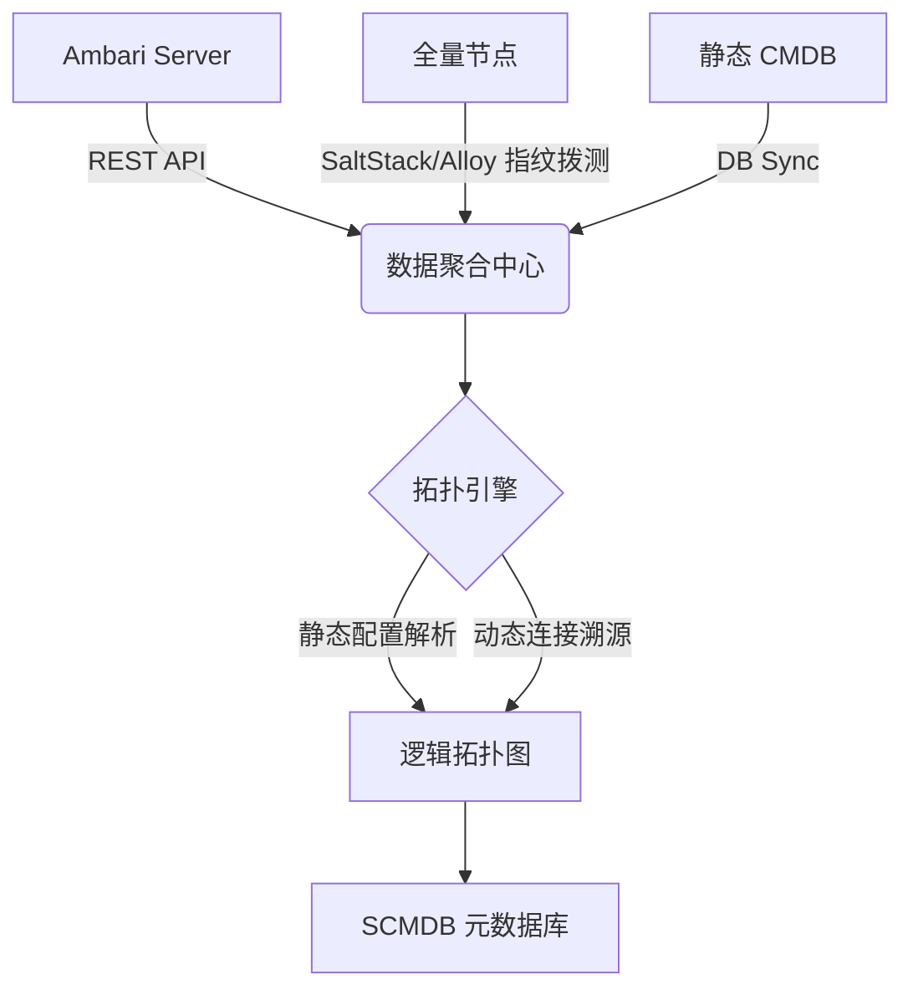

# 大数据集群 SCMDB 服务自动发现实施方案

## 1. 方案背景与目标
针对 H3 集群管理现状（Ambari 托管核心组件 + 静态 CMDB 管理资源 + 存在非托管大数据组件），构建一套能够自动感知服务分布、识别非托管组件并生成逻辑拓扑的 SCMDB 系统，解决可观测性中的“元数据断层”问题。

## 2. 总体架构设计
采用“权威拉取 + 节点拨测 + 配置溯源”的混合架构：



## 3. 详细实施步骤

### 阶段一：Ambari 权威元数据拉取
利用 Ambari REST API 获取集群基准画像。

*   **核心逻辑**：
    1.  遍历所有集群：`/api/v1/clusters`
    2.  获取主机与组件映射：`/api/v1/clusters/{cluster}/hosts?fields=Hosts/host_name,host_components/HostRoles/component_name`
*   **产出**：生成基础的服务-实例映射表（Managed Services）。

### 阶段二：全量节点指纹扫描 (针对非托管组件)
利用 SaltStack 或 Alloy 执行本地脚本，识别未在 Ambari 中注册的大数据组件。

*   **识别策略**：
    - **进程指纹**：通过 `jps -lv` 或 `ps -ef` 获取 Java 进程的 `sun.java.command`。
    - **特征库示例**：
        - `org.apache.spark.deploy.master.Master` -> Spark Master
        - `kafka.Kafka` -> Kafka Broker
        - `org.apache.hadoop.hbase.master.HMaster` -> HBase Master
*   **探测脚本逻辑**：
    ```python
    def discover_java_services():
        # 获取所有 Java 进程及其完整启动命令
        processes = get_java_processes() 
        results = []
        for p in processes:
            # 匹配指纹库
            service_type = match_fingerprint(p.cmdline)
            if service_type:
                results.append({
                    "type": service_type,
                    "pid": p.pid,
                    "listen_ports": get_listen_ports(p.pid)
                })
        return results
    ```

### 阶段三：逻辑拓扑构建
通过解析组件本地配置，建立“谁在依赖谁”的逻辑链条。

*   **静态配置关联**：
    - **HDFS 依赖**：解析 `core-site.xml` 中的 `fs.defaultFS`，确定 NameNode 地址。
    - **YARN 依赖**：解析 `yarn-site.xml` 中的 `yarn.resourcemanager.address`。
    - **Hive -> DB**：解析 `hive-site.xml` 中的 `javax.jdo.option.ConnectionURL`。
*   **自动化链接算法**：
    1.  提取所有组件的 `Endpoints`（IP + Port）。
    2.  在依赖组件的配置中搜索这些 `Endpoints`。
    3.  建立 `Source -> Target` 关系。

## 4. 数据模型 (Schema)
| 实体 | 关键字段 |
| :--- | :--- |
| **Service** | service_id, name, type (HDFS/YARN/Spark), source (Ambari/Discovery) |
| **Instance** | instance_id, service_id, hostname, ip, port, role (Master/Slave), status |
| **Relation** | from_instance_id, to_instance_id, relation_type (RPC/HTTP/JDBC) |

## 5. 落地建议
1.  **分批接入**：首批接入 HDFS/YARN/Hive，验证 Ambari 数据与本地扫描的一致性。
2.  **增量上报**：利用 Alloy 的自定义监控项，将发现逻辑封装为 Metric 上报至 Prometheus，通过 `up` 指标和标签实现实时感知。
3.  **冲突处理**：若 Ambari 与本地发现冲突，以 Ambari 为准，但记录“配置漂移”告警。
