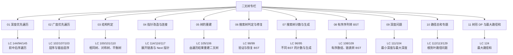

# 二叉树专栏导览

## 专栏简介

在线性表专栏里，我们处理的核心对象是“连续区间”和“相邻元素关系”；进入二叉树之后，问题的抽象层级会明显上升。数组和链表的遍历大多沿着一条线向前推进，而二叉树天然是一种分叉结构：一个节点既要看自己，也要看左子树和右子树，还要处理从根到叶、从叶到根、按层推进、按中序有序等不同观察视角。

这意味着，二叉树题目的真正难点从来不是背几种遍历顺序，而是建立一套稳定的分析框架：

1. 当前节点在问题里扮演什么角色
2. 左右子树分别要返回什么信息
3. 返回值和全局状态如何配合
4. 递归、迭代、层序三种写法各自适合什么场景
5. 普通二叉树与 [[二叉搜索树]] 的约束差异会如何改变解法

本专栏将围绕“遍历”“构造”“搜索树”“路径与深度”“指针重连”五条主线展开，不只给出题解，更强调：

- 为什么这道题天然适合后序递归
- 为什么某些题必须保留全局变量而不能只靠返回值
- 为什么层序遍历看起来只是 BFS，但其实经常是在维护“分层边界”
- 为什么 [[二叉搜索树]] 的中序有序性质能够把复杂问题降维成顺序问题

如果说栈与队列专栏训练的是“局部状态管理”和“单调性”，那么二叉树专栏训练的是另一种更基础的能力：**把一个整体问题拆成左右子问题，并在回溯时完成信息汇总。**

---

## 题目全景

本专栏覆盖你给出的核心题目范围，并按解题抽象重新组织为 18 道高频题：

| 编号 | 题目 | 分类 | 难度 |
|------|------|------|------|
| LeetCode 144 | Binary Tree Preorder Traversal | 深度优先遍历 | 简单 |
| LeetCode 94  | Binary Tree Inorder Traversal | 深度优先遍历 | 简单 |
| LeetCode 145 | Binary Tree Postorder Traversal | 深度优先遍历 | 简单 |
| LeetCode 102 | Binary Tree Level Order Traversal | 广度优先遍历 | 中等 |
| LeetCode 107 | Binary Tree Level Order Traversal II | 广度优先遍历 | 中等 |
| LeetCode 103 | Binary Tree Zigzag Level Order Traversal | 广度优先遍历 | 中等 |
| LeetCode 100 | Same Tree | 结构判定 | 简单 |
| LeetCode 101 | Symmetric Tree | 结构判定 | 简单 |
| LeetCode 110 | Balanced Binary Tree | 结构判定 | 简单 |
| LeetCode 114 | Flatten Binary Tree to Linked List | 指针改造 | 中等 |
| LeetCode 116 | Populating Next Right Pointers in Each Node | 指针连接 | 中等 |
| LeetCode 117 | Populating Next Right Pointers in Each Node II | 指针连接 | 中等 |
| LeetCode 105 | Construct Binary Tree from Preorder and Inorder Traversal | 树的构造 | 中等 |
| LeetCode 106 | Construct Binary Tree from Inorder and Postorder Traversal | 树的构造 | 中等 |
| LeetCode 99  | Recover Binary Search Tree | 二叉搜索树 | 中等 |
| LeetCode 98  | Validate Binary Search Tree | 二叉搜索树 | 中等 |
| LeetCode 96  | Unique Binary Search Trees | 二叉搜索树 | 中等 |
| LeetCode 95  | Unique Binary Search Trees II | 二叉搜索树 | 中等 |
| LeetCode 108 | Convert Sorted Array to Binary Search Tree | 二叉搜索树构造 | 简单 |
| LeetCode 109 | Convert Sorted List to Binary Search Tree | 二叉搜索树构造 | 中等 |
| LeetCode 111 | Minimum Depth of Binary Tree | 深度与层次 | 简单 |
| LeetCode 104 | Maximum Depth of Binary Tree | 深度与层次 | 简单 |
| LeetCode 112 | Path Sum | 路径问题 | 简单 |
| LeetCode 113 | Path Sum II | 路径问题 | 中等 |
| LeetCode 124 | Binary Tree Maximum Path Sum | 树形 DP | 困难 |
| LeetCode 129 | Sum Root to Leaf Numbers | 路径累积 | 中等 |

从面试频率看，真正高频且能形成体系的主干题是：144/94/145、102/103、100/101/110、105/106、98/99、96/95、111/104、112/113/124/129、114/116/117。把这些题吃透，二叉树这一章就算真正过关。

---

## 专栏目录



---

## 分批次创建规划

这是一个明显比线性表、栈与队列更大的专题。为了兼顾系统性和单篇密度，本专栏按三批组织，但会在本次工作中一次性初始化完整：

### 第一批：树的遍历与基础判定

1. [[01 深度优先遍历：前序、中序、后序与递归迭代统一框架]]
2. [[02 广度优先遍历：层序、倒序层序与锯齿层序]]
3. [[03 二叉树结构判定：相同树、对称树与平衡二叉树]]
4. [[04 二叉树指针操作：展开链表与填充右侧指针]]

这一批解决“怎么看树”和“如何验证树结构”的问题，建立 DFS、BFS、对称性、返回高度等基础模板。

### 第二批：构造问题与二叉搜索树

5. [[05 二叉树重建：前序+中序、后序+中序的构造逻辑]]
6. [[06 二叉搜索树判定与修复：Validate BST 与 Recover BST]]
7. [[07 二叉搜索树的数量与生成：Unique BST I/II]]
8. [[08 有序序列转平衡搜索树：数组与链表两种输入]]

这一批解决“如何从结构信息反推树”和“如何利用 BST 中序有序性质降维”的问题。

### 第三批：深度、路径与树形 DP

9. [[09 二叉树深度问题：最小深度、最大深度与 BFS/DFS 取舍]]
10. [[10 根到叶路径专题：Path Sum、Path Sum II 与数字累积]]
11. [[11 树形 DP 进阶：二叉树中的最大路径和]]

这一批把树题真正推到“后序递归 + 状态汇总”的层次，也是二叉树面试里最容易拉开差距的部分。

---

## 各篇文章简介

### [[01 深度优先遍历：前序、中序、后序与递归迭代统一框架]]

很多人会背三种遍历顺序，但一旦改成迭代就开始混乱。本文会从“递归函数在进入节点前、处理左子树后、处理右子树后分别能做什么”这一角度统一理解前中后序，并给出三种遍历的递归、显式栈迭代以及面试口述框架。

### [[02 广度优先遍历：层序、倒序层序与锯齿层序]]

层序遍历不是简单地把节点放进队列，它的真正本质是“按层切分边界”。本文会讲清楚为什么要在每轮开始前固定 `size`，为什么倒序层序有两种写法，以及锯齿层序里“方向切换”到底应当影响遍历过程还是结果写入。

### [[03 二叉树结构判定：相同树、对称树与平衡二叉树]]

这一篇把二叉树中的“布尔判定题”系统化。Same Tree 检查的是值和结构的一致性，Symmetric Tree 检查的是镜像关系，Balanced Binary Tree 则要求同时判断结构是否合法并返回高度。它们对应三种不同的递归函数设计方式。

### [[04 二叉树指针操作：展开链表与填充右侧指针]]

当题目开始要求你“改树”而不是“读树”，很多人的递归会失控。Flatten Binary Tree to Linked List 本质是在原地重连指针；Populating Next Right Pointers 则是在层级维度上建立横向连接。本文会把 DFS 重连与 BFS 串联两类技巧放在同一篇里对比。

### [[05 二叉树重建：前序+中序、后序+中序的构造逻辑]]

树的重建题表面像记公式，实际是在考察你能否从遍历序列中恢复根、左子树区间、右子树区间三者之间的边界关系。本文会重点讲清楚“为什么必须有中序”“为什么前序决定根在前、后序决定根在后”。

### [[06 二叉搜索树判定与修复：Validate BST 与 Recover BST]]

BST 的中序遍历天然有序，这个性质足以解决 Validate BST 和 Recover BST。前者要求你理解“局部大小关系不等于整体合法”；后者要求你在一趟中序里定位被交换的两个节点。这是搜索树专题的核心基石。

### [[07 二叉搜索树的数量与生成：Unique BST I/II]]

这是二叉树专题第一次明显进入动态规划与分治生成。Unique BST I 是典型 Catalan 数计数模型；Unique BST II 进一步要求枚举并生成所有合法结构。本文会把“选根节点”作为统一切入点。

### [[08 有序序列转平衡搜索树：数组与链表两种输入]]

有序数组转 BST 看似简单，真正值得讲的是“为什么取中点可以保证平衡”。而有序链表转 BST 的难点在于链表不支持随机访问，因此不能照抄数组解法。本文会比较“快慢指针找中点”和“模拟中序构造”两种思路。

### [[09 二叉树深度问题：最小深度、最大深度与 BFS/DFS 取舍]]

最小深度和最大深度经常被一起问，但解题逻辑并不对称。最大深度天然适合 DFS；最小深度则要格外警惕“空子树不能直接取 min”这个经典陷阱。本文还会比较 BFS 首次到叶子即可返回这一点为什么成立。

### [[10 根到叶路径专题：Path Sum、Path Sum II 与数字累积]]

从 Path Sum 到 Path Sum II，再到 Sum Root to Leaf Numbers，表面题意不同，本质都是“沿根到叶路径向下携带状态，在叶子处结算”。本文会系统讲解路径状态如何设计、何时回溯、何时复制路径。

### [[11 树形 DP 进阶：二叉树中的最大路径和]]

这是一道标准树形 DP 难题。它训练的是最关键的能力：区分“对父节点可贡献的值”和“当前节点作为路径拐点时的最优值”。只要把这两类值混在一起，代码就一定错。本文会把这个问题彻底讲透，并作为整套二叉树专栏的收束。

---

## 学习路径建议

```
基础路线: 01 → 02 → 03 → 09 → 10
BST 路线: 01 → 05 → 06 → 07 → 08
面试冲刺: 02 → 03 → 05 → 06 → 10 → 11
完整通关: 01 → 11 按顺序推进
```

> [!info] 二叉树最核心的模板只有三个
> 第一，递归 DFS：定义函数返回什么，比“函数里做什么”更重要。
> 第二，层序 BFS：队列不是重点，按层切分边界才是重点。
> 第三，后序汇总：凡是需要同时依赖左右子树结果的问题，优先考虑后序遍历。

> [!note] 为什么二叉树值得单独做成大专栏
> 二叉树题目的覆盖面极广，几乎所有后续专题都会反复用到它的思想：
> - 在 [[图]] 中，你会把 DFS/BFS 从树推广到一般邻接结构
> - 在 [[动态规划]] 中，你会把树形 DP 推广到更复杂的状态设计
> - 在 [[递归与回溯]] 中，你会进一步理解“现场保存”和“返回值语义”
>
> 所以这不是一个孤立专题，而是整个算法体系的分水岭。