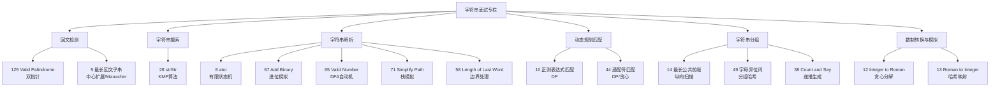

# 字符串面试专栏导览

## 专栏简介

字符串是面试中出现频率仅次于数组和链表的数据类型。与数组不同，字符串题的难点不仅是算法本身，还在于对各种字符集、编码、边界状态的精细处理。很多看似简单的字符串题（如 `atoi`、Valid Number）实际上在细节处理上极易翻车；而另一些题（如正则表达式匹配、最长回文子串）则涵盖了动态规划的经典范式。

本专栏覆盖 LeetCode 3.x 系列共 15 道高频面试题，涵盖字符串的回文、搜索、解析、匹配、转换、模拟六大类别，系统构建字符串题的解题框架。

---

## 专栏目录

| 编号 | 文章标题 | 覆盖 LeetCode 题目 | 核心技巧 |
|------|---------|-----------------|---------|
| 01 | [[01 回文检测：Valid Palindrome 与双指针范式]] | 125 Valid Palindrome | 双指针对向夹逼，字符过滤 |
| 02 | [[02 字符串搜索：Implement strStr 与 KMP 算法]] | 28 Implement strStr() | 朴素匹配、KMP、next 数组构建 |
| 03 | [[03 字符串解析：atoi、Add Binary 与进位模拟]] | 8 String to Integer (atoi), 67 Add Binary | 状态机解析，二进制加法 |
| 04 | [[04 最长回文子串：中心扩展与 Manacher 算法]] | 5 Longest Palindromic Substring | 中心扩展 $O(n^2)$，Manacher $O(n)$ |
| 05 | [[05 动态规划字符串匹配：正则表达式与通配符]] | 10 Regular Expression Matching, 44 Wildcard Matching | DP 状态转移，`.*` 与 `?*` 语义 |
| 06 | [[06 字符串整理：最长公共前缀、异位词与计数说]] | 14 Longest Common Prefix, 49 Group Anagrams, 38 Count and Say | 纵向扫描，排序/哈希分组，递推生成 |
| 07 | [[07 字符串模拟：Valid Number、整数与罗马互转]] | 65 Valid Number, 12 Integer to Roman, 13 Roman to Integer | 有限状态机，贪心分解 |
| 08 | [[08 路径规范化与边界处理：Simplify Path 与 Length of Last Word]] | 71 Simplify Path, 58 Length of Last Word | 栈模拟路径，边界遍历 |

---

## 题目全景

### 按类别分类

**回文系列**
- LeetCode 125：Valid Palindrome（双指针）
- LeetCode 5：Longest Palindromic Substring（中心扩展 / Manacher）

**字符串搜索**
- LeetCode 28：Implement strStr()（KMP）

**字符串解析与模拟**
- LeetCode 8：String to Integer / atoi（状态机）
- LeetCode 67：Add Binary（进位模拟）
- LeetCode 65：Valid Number（有限状态机）
- LeetCode 71：Simplify Path（栈）
- LeetCode 58：Length of Last Word（边界遍历）

**数制转换**
- LeetCode 12：Integer to Roman（贪心）
- LeetCode 13：Roman to Integer（哈希表）

**动态规划匹配**
- LeetCode 10：Regular Expression Matching（DP）
- LeetCode 44：Wildcard Matching（DP / 贪心）

**字符串分组与变换**
- LeetCode 14：Longest Common Prefix（纵向扫描 / 二分）
- LeetCode 49：Group Anagrams（排序键 / 质数哈希）
- LeetCode 38：Count and Say（递推生成）

### 难度分布

| 难度 | 题目 |
|------|------|
| 简单 | 125、67、14、13、58、38 |
| 中等 | 28、8、5、49、71、12 |
| 困难 | 10、44、65 |

---

## 知识点导图

---

## 学习建议

字符串题看似简单，实则是考察工程细节的"陷阱密集区"：

1. **细节优先**：先把题目的所有边界 case 列出来（空字符串、只有一个字符、全是空格、整数溢出等），再动手写代码
2. **状态机思维**：对于解析类题目（atoi、Valid Number），有限状态机（DFA）是最清晰的建模工具，用状态机写出来的代码不会出现"if-else 套娃"的问题
3. **动态规划的二维视角**：字符串匹配类 DP（正则、通配符）都是二维 DP，`dp[i][j]` 表示前 `i` 个模式字符匹配前 `j` 个文本字符，从这个角度出发能快速推导状态转移方程
4. **KMP 必须理解**：strStr 虽然可以暴力过，但面试官几乎必然追问 KMP，理解 next 数组的构建原理是核心

---

*专栏目标：通过 8 篇系统讲解，覆盖字符串面试题的全部核心模式，帮助你在面试中遇到字符串题时做到"见型知法"。*
