# 路径规范化与边界处理：Simplify Path 与 Length of Last Word

## 摘要

这是字符串专栏的收尾篇，覆盖两道工程气息浓厚的题目：LeetCode 71（Simplify Path）和 LeetCode 58（Length of Last Word）。前者是 Unix 文件系统路径规范化的精简实现，用栈处理 `.`（当前目录）、`..`（上级目录）和普通目录名三类分量，工程中 Python 的 `os.path.normpath`、Java 的 `Path.normalize()` 背后都是类似的逻辑；后者是字符串末尾扫描的细节题，从右往左跳过尾部空格，再计数最后一个单词的长度，考察边界处理的严密性。两道题都可以一次写对，关键在于把各类 edge case 在动笔前想清楚。

---

## 第 1 章 LeetCode 71：Simplify Path

### 1.1 题目

**LeetCode 71 - Simplify Path**（中等）

给你一个字符串 `path`，表示指向某一文件或目录的 Unix 风格**绝对路径**（以 `/` 开头）。请你将其转化为更加简洁的规范路径。

规则：
- 路径以单斜杠 `/` 开头
- 两个目录名之间有且只有一个斜杠 `/`
- 路径不能以 `/` 结尾（根目录 `"/"` 除外）
- `.` 表示当前目录
- `..` 表示将目录切换到上一级目录

```
输入: path = "/home/"          → 输出: "/home"
输入: path = "/../"            → 输出: "/"（从根目录继续 .. 不能再往上了）
输入: path = "/home//foo/"     → 输出: "/home/foo"（多个 / 等同一个）
输入: path = "/a/./b/../../c/" → 输出: "/c"
```

### 1.2 解题思路

按 `/` 分割路径，得到一个个分量，对每个分量做处理：

| 分量 | 操作 |
|------|------|
| `""` 或 `"."` | 忽略（空字符串是多个 `/` 之间产生的，`.` 是当前目录） |
| `".."` | 如果栈非空，弹出栈顶（返回上级目录） |
| 其他（普通目录名） | 压入栈 |

最后将栈中元素用 `/` 连接，并在开头加 `/`：

```java
public String simplifyPath(String path) {
    String[] parts = path.split("/");
    Deque<String> stack = new ArrayDeque<>();
    
    for (String part : parts) {
        if (part.equals("..")) {
            if (!stack.isEmpty()) stack.pop();
        } else if (!part.isEmpty() && !part.equals(".")) {
            stack.push(part);
        }
        // 空串和 "." 直接忽略
    }
    
    // 从栈底到栈顶拼接（Deque 的 push 是加到头部，所以遍历要用 descendingIterator）
    StringBuilder sb = new StringBuilder();
    for (String dir : stack) {
        sb.insert(0, "/" + dir); // 或者用 descendingIterator
    }
    
    return sb.length() == 0 ? "/" : sb.toString();
}
```

> [!warning] 注意 `ArrayDeque` 的遍历方向
> `ArrayDeque` 的 `push()` 把元素加到**头部**（等同于 `addFirst()`），所以 `for (String dir : stack)` 是从头到尾迭代，也就是从最后压入的元素（最深目录）开始。拼接时需要用 `descendingIterator()` 或者逐个 `insert(0, ...)`。

改为更清晰的写法：

```java
public String simplifyPath(String path) {
    String[] parts = path.split("/");
    Deque<String> stack = new ArrayDeque<>();
    
    for (String part : parts) {
        if (part.equals("..")) {
            if (!stack.isEmpty()) stack.pollLast(); // 移除末尾（最近压入）
        } else if (!part.isEmpty() && !part.equals(".")) {
            stack.offerLast(part); // 加到末尾
        }
    }
    
    // 从头到尾（根到叶）拼接
    StringBuilder sb = new StringBuilder();
    for (String dir : stack) {
        sb.append("/").append(dir);
    }
    
    return sb.length() == 0 ? "/" : sb.toString();
}
```

使用 `offerLast` 和 `pollLast`，把 `Deque` 当做普通栈用（LIFO），迭代方向是加入的顺序（根 → 叶），无需反转。

**手动验证**（`path = "/a/./b/../../c/"`）：

```
split("/") → ["", "a", ".", "b", "..", "..", "c", ""]

逐个处理:
""  → 忽略（isEmpty）
"a" → stack: ["a"]
"." → 忽略
"b" → stack: ["a", "b"]
".." → 弹出 "b": stack: ["a"]
".." → 弹出 "a": stack: []
"c" → stack: ["c"]
""  → 忽略

结果: "/" + "c" = "/c" ✓
```

**边界情况**：

```
"/../": split → ["", "..", ""]
".." → 栈空，不操作
结果: "" → return "/" ✓

"/home/": split → ["", "home", ""]
"home" → stack: ["home"]
结果: "/home" ✓
```

**复杂度**：时间 $O(n)$，空间 $O(n)$（栈空间）。

### 1.3 不用 split 的双指针解法

`split` 会产生额外的字符串数组，可以用双指针手动切割分量：

```java
public String simplifyPath(String path) {
    int n = path.length();
    Deque<String> stack = new ArrayDeque<>();
    
    int i = 0;
    while (i < n) {
        // 跳过 '/'
        while (i < n && path.charAt(i) == '/') i++;
        if (i == n) break;
        
        // 提取下一个分量
        int start = i;
        while (i < n && path.charAt(i) != '/') i++;
        String part = path.substring(start, i);
        
        if (part.equals("..")) {
            if (!stack.isEmpty()) stack.pollLast();
        } else if (!part.equals(".")) {
            stack.offerLast(part);
        }
    }
    
    StringBuilder sb = new StringBuilder();
    for (String dir : stack) {
        sb.append("/").append(dir);
    }
    return sb.length() == 0 ? "/" : sb.toString();
}
```

两种方法在正确性上等价，`split` 更简洁，双指针更节省内存。

---

## 第 2 章 LeetCode 58：Length of Last Word

### 2.1 题目

**LeetCode 58 - Length of Last Word**（简单）

给你一个字符串 `s`，由若干单词组成，单词前后用一些空格字符隔开。返回字符串中**最后一个**单词的长度。

**单词**是指仅由字母组成、不包含任何空格字符的最大子字符串。

```
输入: "Hello World"        → 输出: 5（"World" 长度 5）
输入: "   fly me   to the moon  " → 输出: 4（"moon" 长度 4）
输入: "luffy is still joyboy" → 输出: 6（"joyboy" 长度 6）
```

### 2.2 从右往左扫描

```java
public int lengthOfLastWord(String s) {
    int i = s.length() - 1;
    
    // 跳过尾部空格
    while (i >= 0 && s.charAt(i) == ' ') i--;
    
    // 此时 i 指向最后一个单词的最后一个字符
    if (i < 0) return 0; // 全是空格的输入（题目保证至少有一个单词，但防御性处理）
    
    // 向左数单词长度
    int len = 0;
    while (i >= 0 && s.charAt(i) != ' ') {
        len++;
        i--;
    }
    return len;
}
```

**手动验证**（`s = "   fly me   to the moon  "`）：

```
初始 i = 24（s.length()-1）
s[24]=' ', s[23]=' '：跳过两个空格，i=22
s[22]='n', 开始计数：
  'n' → len=1, i=21
  'o' → len=2, i=20
  'o' → len=3, i=19
  'm' → len=4, i=18
  s[18]=' '，退出
return 4 ✓
```

**复杂度**：时间 $O(n)$，空间 $O(1)$。

### 2.3 用 split 的一行解法

```java
public int lengthOfLastWord(String s) {
    String[] words = s.trim().split("\\s+");
    return words[words.length - 1].length();
}
```

- `trim()` 去掉首尾空格
- `split("\\s+")` 按一个或多个空白字符分割
- 返回最后一个元素的长度

更简洁，但创建了额外的字符串数组，在极长输入时性能不如指针解法。

### 2.4 常见陷阱

**陷阱 1：没有跳过尾部空格就直接从右数**：

```java
// 错误写法：遇到尾部空格就立刻停止
int i = s.length() - 1;
int len = 0;
while (i >= 0 && s.charAt(i) != ' ') {
    len++;
    i--;
}
return len; // "moon  " 返回 0，错！
```

**陷阱 2：用 `split(" ")` 而非 `split("\\s+")`**：

```java
// 错误：s = "fly me   to" 时，split(" ") 产生 ["fly","me","","","to"]
// 最后一个元素是 "to"，正确；但 "fly me   to  " 的 trim 后是 "fly me   to"
// split(" ") → ["fly","me","","","to"]，最后是 "to"，偶然正确
// 但如果 trim 结果末尾还有多空格... 建议始终用 split("\\s+") 更健壮
```

---

## 第 3 章 工程映射：栈与路径规范化

### 3.1 文件系统中的路径规范化

`Simplify Path` 不只是一道算法题，而是 Unix 文件系统路径处理的核心逻辑。以下是几个真实场景：

**Python（`os.path.normpath`）**：

```python
import os
os.path.normpath("/a/./b/../../c/")  # 返回 "/c"
```

**Java NIO（`Path.normalize()`）**：

```java
Path p = Paths.get("/a/./b/../../c/");
System.out.println(p.normalize());  // 输出 /c
```

**Spring MVC 的 URL 路径规范化**：防止路径遍历攻击（如 `/../../../etc/passwd`），Spring Security 会对 URL 进行规范化后再匹配权限规则。

> [!warning] 路径遍历攻击（Path Traversal）
> 这道题的 `..` 处理逻辑，在安全领域是路径遍历漏洞的核心。若服务器不正确处理用户输入的 `../` 序列，攻击者可以访问文件系统中不应暴露的文件（如 `/etc/passwd`）。正确的防御就是在处理文件路径前，先用栈算法将路径规范化，再检查规范化后的路径是否在允许的目录范围内。

### 3.2 最后一个单词长度的变体

`Length of Last Word` 的核心是"从右往左跳过分隔符再计数"，这个模式在以下场景中很常见：

- **解析最后一个 CSV 字段**：从右往左跳过换行符、定位最后一个逗号
- **日志分析**：提取最后一个 `|` 分隔的字段（如请求耗时）
- **编译器词法分析**：从当前位置向左找标识符边界

---

## 第 4 章 字符串专栏总复习

恭喜你完成了字符串专栏的全部内容！回顾一下这 15 道题覆盖的核心知识体系：

```mermaid
graph TD
    A["字符串算法"] --> B["回文检测"]
    A --> C["字符串搜索"]
    A --> D["字符串解析"]
    A --> E["动态规划"]
    A --> F["模拟与规范化"]
    
    B --> B1["双指针 LeetCode 125"]
    B --> B2["中心扩展 LeetCode 5"]
    B --> B3["Manacher O(n) LeetCode 5"]
    
    C --> C1["暴力 O(mn) LeetCode 28"]
    C --> C2["KMP O(m+n) LeetCode 28"]
    
    D --> D1["DFA atoi LeetCode 8"]
    D --> D2["进位模拟 Add Binary LeetCode 67"]
    D --> D3["旗标/DFA Valid Number LeetCode 65"]
    D --> D4["贪心 Integer to Roman LeetCode 12"]
    D --> D5["哈希 Roman to Integer LeetCode 13"]
    
    E --> E1["二维DP 正则匹配 LeetCode 10"]
    E --> E2["二维DP 通配符 LeetCode 44"]
    
    F --> F1["纵向扫描 LCP LeetCode 14"]
    F --> F2["哈希分组 Anagrams LeetCode 49"]
    F --> F3["序列递推 Count and Say LeetCode 38"]
    F --> F4["栈 路径规范化 LeetCode 71"]
    F --> F5["双指针 Last Word LeetCode 58"]
```



### 4.1 各篇内容索引

| 篇号 | 文章 | 题目 |
|------|------|------|
| [[01 回文检测：Valid Palindrome 与双指针范式]] | 双指针范式 | LeetCode 125 |
| [[02 字符串搜索：Implement strStr 与 KMP 算法深度解析]] | KMP | LeetCode 28 |
| [[03 字符串解析：atoi、Add Binary 与进位模拟]] | DFA + 进位模拟 | LeetCode 8, 67 |
| [[04 最长回文子串：中心扩展与 Manacher 算法]] | 中心扩展 + Manacher | LeetCode 5 |
| [[05 动态规划字符串匹配：正则表达式与通配符]] | 二维 DP | LeetCode 10, 44 |
| [[06 字符串整理：最长公共前缀、异位词与计数说]] | 纵向扫描 + 哈希 | LeetCode 14, 49, 38 |
| [[07 字符串模拟：Valid Number、整数与罗马互转]] | DFA + 贪心 | LeetCode 65, 12, 13 |
| [[08 路径规范化与边界处理：Simplify Path 与 Length of Last Word]] | 栈 + 双指针 | LeetCode 71, 58 |

### 4.2 高频考点

面试中最常出现的字符串题型和对应的必须掌握的核心方法：

**必须能手写的算法**：
1. KMP（LeetCode 28）：`next` 数组构建 + 匹配逻辑
2. 中心扩展（LeetCode 5）：奇偶中心的 `2n-1` 枚举
3. 字符串 DP（LeetCode 10/44）：状态定义 `dp[i][j]` + 初始化 + 转移
4. 路径规范化（LeetCode 71）：栈 + split + 三类分量处理

**必须能解释原理的算法**：
1. Manacher 算法：镜像利用 + 右边界维护
2. DFA（LeetCode 65）：状态定义 + 转移表
3. 质数哈希（LeetCode 49）：唯一分解定理作为哈希函数

> [!note] 专栏后续方向
> 字符串专栏到此结束。建议的下一步方向：
> - **树与图**：BFS/DFS、最短路径、拓扑排序（与字符串题共享 DP 思维）
> - **滑动窗口**：LeetCode 76（最小覆盖子串）是字符串 + 滑动窗口的综合题
> - **Trie（前缀树）**：字符串集合的高效搜索结构，与 LCP 问题密切相关

---

*字符串专栏完结*
