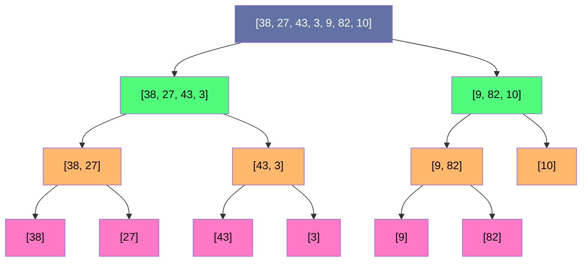
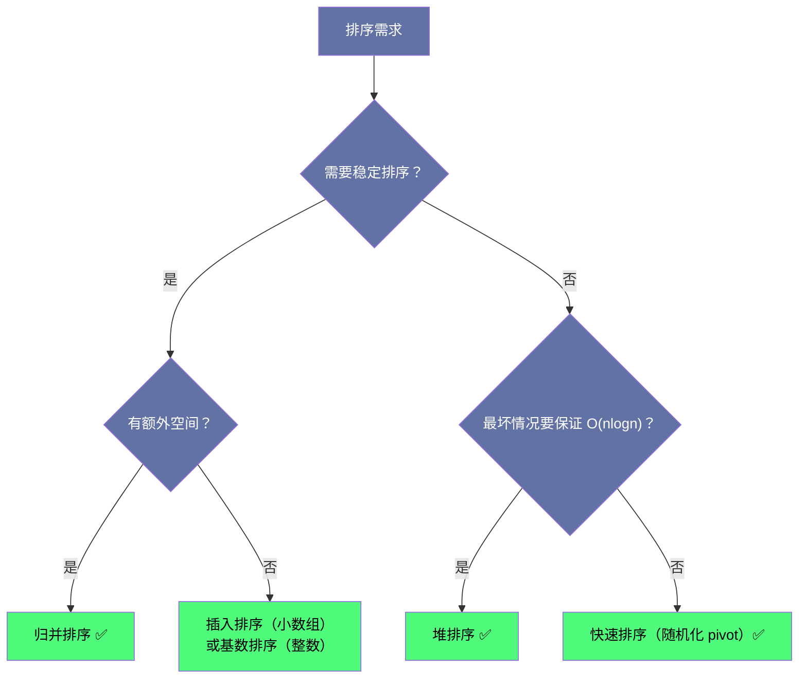

# 排序算法原理全景：从 O(n²) 到 O(nlogn) 的演进之路

## 摘要

排序是计算机科学中研究最深入、应用最广泛的算法领域之一。从日常的数据库 ORDER BY，到分布式计算框架的 Shuffle 阶段，排序无处不在。本文不讲具体题目，而是系统梳理各类排序算法的**演进逻辑与底层原理**——为什么会出现这个算法、它解决了什么前辈算法的问题、它自身的局限在哪里。理解这条演进脉络，面试时的算法选型就不再是靠感觉，而是有据可依的工程决策。

---

## 第 1 章 排序问题的本质与下界

### 1.1 排序到底在排什么

排序问题的形式化定义：给定一个序列 $A = [a_1, a_2, \ldots, a_n]$，找到一个排列 $\pi$，使得 $a_{\pi(1)} \leq a_{\pi(2)} \leq \cdots \leq a_{\pi(n)}$。

这个定义看起来平淡无奇，但它包含了两个隐藏的重要约束：

**约束一：比较模型（Comparison Model）**。我们通常只允许通过"比较两个元素的大小关系"来获取信息，其他任何操作（如直接读取元素的位地址、利用值的范围特性）不在这个模型内。绝大多数排序算法都在这个模型下工作，包括归并排序、快速排序、堆排序等。

**约束二：判断稳定性的意义**。如果两个元素 $a_i = a_j$（$i < j$），排序后若 $a_i$ 仍然在 $a_j$ 前面，则称这个排序算法是**稳定的**。稳定性在纯数字排序中无关紧要，但在按多个字段排序对象时至关重要——例如，先按姓名排序，再按年龄稳定排序，可以保证同年龄段内姓名有序。

### 1.2 比较排序的理论下界

一个极其重要的结论：**任何基于比较的排序算法，在最坏情况下至少需要 $\Omega(n \log n)$ 次比较。**

这不是某个特定算法的局限，而是整个比较模型的理论下界。证明思路如下：

对 $n$ 个元素排序，共有 $n!$ 种可能的输入排列，每种排列对应一个唯一的正确输出。任何基于比较的算法，本质上是在执行一棵**决策树**：每次比较是一个内部节点，产生两个分支（$\leq$ 或 $>$），叶节点是输出结果。

要能正确处理所有 $n!$ 种输入，决策树至少需要 $n!$ 个叶节点。一棵高度为 $h$ 的二叉树最多有 $2^h$ 个叶节点，因此：

$$2^h \geq n! \implies h \geq \log_2(n!)$$

由 Stirling 近似，$\log_2(n!) = \Theta(n \log n)$，因此最坏情况下的比较次数下界是 $\Omega(n \log n)$。

> [!info] 核心概念：决策树模型
> 决策树模型是分析比较排序下界的标准工具。它告诉我们，归并排序和堆排序的 $O(n \log n)$ 已经是最优的——没有任何基于比较的排序算法能在最坏情况下做得更好。
> 这也解释了为什么计数排序、基数排序能突破 $O(n \log n)$：它们不在比较模型内，而是利用了元素值的额外信息。

### 1.3 算法演进的两条主线

排序算法的演进可以归纳为两条主线：

**主线一：减少比较次数**。从插入排序的 $O(n^2)$ 次比较，到归并排序和堆排序的 $O(n \log n)$ 次比较，触及理论下界。

**主线二：利用元素特征突破下界**。当元素的值域有限（如 0-255 的整数）或具有特殊结构（如字符串）时，计数排序、基数排序、桶排序可以在 $O(n)$ 或 $O(nk)$ 时间内完成排序，代价是需要额外空间。

---

## 第 2 章 $O(n^2)$ 排序算法：简单的代价

### 2.1 冒泡排序：最直觉，也最低效

冒泡排序的思路：反复遍历数组，每次比较相邻两个元素，若顺序错误则交换，直到没有元素需要交换。

```java
void bubbleSort(int[] nums) {
    int n = nums.length;
    for (int i = 0; i < n - 1; i++) {
        boolean swapped = false;
        for (int j = 0; j < n - 1 - i; j++) {
            if (nums[j] > nums[j + 1]) {
                int tmp = nums[j];
                nums[j] = nums[j + 1];
                nums[j + 1] = tmp;
                swapped = true;
            }
        }
        if (!swapped) break;  // 一次遍历没有交换，说明已有序，提前终止
    }
}
```

**时间复杂度**：最好 $O(n)$（已有序，加了 `swapped` 优化），平均和最坏 $O(n^2)$。
**稳定性**：稳定（相等元素不交换）。
**适用场景**：几乎不在实际工程中使用，但因代码直观，常作为算法教学的起点。

冒泡排序的本质问题：每次交换只能让一个元素"冒泡"一步，对于一个逆序的元素，它必须一步一步地走到正确位置，效率极低。

### 2.2 插入排序：小数组的王者

插入排序的思路类比打牌：手里已经有一把有序的牌，每次从牌堆摸一张牌，插入到手牌中合适的位置。

```java
void insertionSort(int[] nums) {
    int n = nums.length;
    for (int i = 1; i < n; i++) {
        int key = nums[i];  // 当前要插入的元素
        int j = i - 1;
        // 在已排序的 nums[0..i-1] 中，从后往前找插入位置
        while (j >= 0 && nums[j] > key) {
            nums[j + 1] = nums[j];  // 元素后移，腾出空间
            j--;
        }
        nums[j + 1] = key;  // 插入
    }
}
```

**时间复杂度**：最好 $O(n)$（已有序），平均和最坏 $O(n^2)$。
**稳定性**：稳定。
**空间复杂度**：$O(1)$（原地排序）。

插入排序有一个被很多人忽视的优点：**对于近似有序的数组，插入排序非常快**。如果每个元素距离其最终位置不超过 $k$，插入排序的时间复杂度是 $O(nk)$。这就是为什么 Java 的 `Arrays.sort` 在遇到小数组（通常是长度 < 47）时会切换到插入排序。

> [!note] 设计哲学：混合排序策略
> 现代工业级排序算法（Java 的 TimSort、Python 的 Timsort）都会综合使用多种排序策略：对小数组用插入排序（常数因子小）、检测已有序区间利用其有序性、大数组用归并排序保证 $O(n \log n)$ 最坏情况。理解每种算法的适用场景，才能真正理解这些工程决策。

### 2.3 选择排序：简单但不稳定

选择排序的思路：每次从未排序部分找到最小元素，放到已排序部分的末尾。

```java
void selectionSort(int[] nums) {
    int n = nums.length;
    for (int i = 0; i < n - 1; i++) {
        int minIdx = i;
        for (int j = i + 1; j < n; j++) {
            if (nums[j] < nums[minIdx]) minIdx = j;
        }
        int tmp = nums[i]; nums[i] = nums[minIdx]; nums[minIdx] = tmp;
    }
}
```

**时间复杂度**：始终 $O(n^2)$，无论输入是否有序，因为每次都要扫描整个未排序部分。
**稳定性**：**不稳定**（交换操作可能打乱相同元素的相对顺序）。

选择排序的唯一优点：交换次数恰好是 $O(n)$ 次。在"交换代价远大于比较代价"的场景下（如元素是大型对象且比较只读取一个字段），选择排序的交换开销是最小的。

---

## 第 3 章 $O(n \log n)$ 排序算法：分而治之与结构利用

### 3.1 归并排序：稳定与递归分治的典范

归并排序是"分治"思想最经典的应用。思路：
1. 将数组对半分成两个子数组
2. 递归地对两个子数组分别排序
3. 将两个已排序的子数组合并成一个有序数组

```java
void mergeSort(int[] nums, int left, int right, int[] temp) {
    if (left >= right) return;
    int mid = left + (right - left) / 2;
    mergeSort(nums, left, mid, temp);       // 递归排序左半部分
    mergeSort(nums, mid + 1, right, temp);  // 递归排序右半部分
    merge(nums, left, mid, right, temp);    // 合并两个有序部分
}

void merge(int[] nums, int left, int mid, int right, int[] temp) {
    // 拷贝到辅助数组
    for (int i = left; i <= right; i++) temp[i] = nums[i];
    int i = left, j = mid + 1, k = left;
    while (i <= mid && j <= right) {
        // 注意：<=  保证稳定性（左边相等的元素先放）
        if (temp[i] <= temp[j]) nums[k++] = temp[i++];
        else nums[k++] = temp[j++];
    }
    while (i <= mid) nums[k++] = temp[i++];
    while (j <= right) nums[k++] = temp[j++];
}
```

**时间复杂度**：$O(n \log n)$，无论最好/平均/最坏。递归树共 $\log n$ 层，每层处理 $O(n)$ 的数据。
**空间复杂度**：$O(n)$（辅助数组）加 $O(\log n)$（递归栈），总体 $O(n)$。
**稳定性**：稳定（合并时相等元素优先取左边）。

归并排序有一个明显的缺点：需要 $O(n)$ 的额外空间。对于链表来说，"合并"操作可以通过修改指针实现，不需要额外空间，因此**链表排序通常首选归并排序**（见第 03 篇）。

**归并排序的递归树分析**：



每层的总工作量都是 $O(n)$（合并所有子数组），共 $\log n$ 层，总时间 $O(n \log n)$。

### 3.2 快速排序：实践中最快，理论上最坏

快速排序是工程实践中最常用的排序算法（C++ STL 的 `std::sort`、Java 基本类型排序均基于快排的变体）。它的核心操作是**分区（Partition）**：选定一个基准元素（pivot），将数组划分为"小于等于 pivot 的元素"在左、"大于 pivot 的元素"在右，然后递归排序两部分。

```java
void quickSort(int[] nums, int left, int right) {
    if (left >= right) return;
    int pivot = partition(nums, left, right);
    quickSort(nums, left, pivot - 1);
    quickSort(nums, pivot + 1, right);
}

int partition(int[] nums, int left, int right) {
    // 随机选 pivot，避免最坏情况
    int randIdx = left + (int)(Math.random() * (right - left + 1));
    swap(nums, randIdx, right);
    int pivot = nums[right];
    int i = left - 1;  // i 是小于等于 pivot 区域的右边界
    for (int j = left; j < right; j++) {
        if (nums[j] <= pivot) {
            i++;
            swap(nums, i, j);
        }
    }
    swap(nums, i + 1, right);  // 把 pivot 放到正确位置
    return i + 1;
}
```

**时间复杂度**：
- 平均 $O(n \log n)$：随机 pivot 保证每次分区大致对半，递归树高度约 $\log n$
- 最坏 $O(n^2)$：每次 pivot 都选到最大或最小值（完全逆序数组 + 每次选最后一个元素）

**空间复杂度**：$O(\log n)$（递归栈），最坏 $O(n)$。
**稳定性**：**不稳定**（分区操作会打乱相同元素的相对顺序）。

**为什么快速排序实践中比归并排序快？**

从理论上看，两者都是 $O(n \log n)$，但快速排序在实践中通常快 2-3 倍。原因有三：

1. **缓存友好性**：快速排序的访问模式是顺序的（两个指针从两端向中间走），而归并排序需要频繁在原数组和辅助数组之间拷贝，缓存命中率更低
2. **无需额外空间**：原地分区不需要分配 $O(n)$ 的辅助数组，避免了内存分配的开销
3. **常数因子小**：分区操作非常简洁，指令数少

> [!warning] 生产避坑：快排的最坏情况
> 快速排序最怕的输入是"近似有序的数组"（如已排好序的数组）。如果不加随机化，每次选最后一个元素作为 pivot，在有序输入上递归深度会达到 $O(n)$，导致栈溢出或 $O(n^2)$ 性能。
> 实际工程中的解决方案：**随机化 pivot**（如上面的代码），或**三数取中**（取 left、right、mid 三个位置的中位数作为 pivot）。

### 3.3 堆排序：$O(n \log n)$ 且 $O(1)$ 空间

堆排序的思路：
1. 建堆（Build-Heap）：将数组原地建成最大堆，时间 $O(n)$
2. 反复提取最大值：将堆顶（最大值）与堆末尾元素交换，堆大小减一，然后对新堆顶执行下沉（Sift-Down），恢复堆性质，时间 $O(\log n)$ 每次

```java
void heapSort(int[] nums) {
    int n = nums.length;
    // 建堆：从最后一个非叶节点开始，向前执行下沉
    for (int i = n / 2 - 1; i >= 0; i--) siftDown(nums, i, n);
    // 提取排序
    for (int i = n - 1; i > 0; i--) {
        swap(nums, 0, i);       // 把当前最大值放到末尾
        siftDown(nums, 0, i);   // 恢复堆性质
    }
}

void siftDown(int[] nums, int i, int size) {
    while (true) {
        int largest = i;
        int left = 2 * i + 1, right = 2 * i + 2;
        if (left < size && nums[left] > nums[largest]) largest = left;
        if (right < size && nums[right] > nums[largest]) largest = right;
        if (largest == i) break;
        swap(nums, i, largest);
        i = largest;
    }
}
```

**时间复杂度**：$O(n \log n)$，无论最好/平均/最坏（不受输入影响，非常稳定）。
**空间复杂度**：$O(1)$（原地排序，不需要辅助数组）。
**稳定性**：**不稳定**。

堆排序结合了"时间最优"和"空间最优"的特性，看起来应该是最好的算法，但实践中比快速排序慢，原因在于**缓存不友好**：堆的访问模式是跳跃式的（父节点到子节点的下标跳跃），与 CPU 缓存的局部性原理背道而驰。

> [!note] 设计哲学：建堆为什么是 O(n) 而不是 O(nlogn)
> 直觉上，向一个空堆中插入 $n$ 个元素，每次 $O(\log n)$，总共 $O(n \log n)$。但"从数组原地建堆"有一个更巧妙的方式：从最后一个非叶节点向上执行下沉。
> 数学分析：高度为 $h$ 的节点最多有 $\lceil n/2^{h+1} \rceil$ 个，其下沉代价是 $O(h)$。对所有高度求和：
> $$\sum_{h=0}^{\lfloor \log n \rfloor} \lceil \frac{n}{2^{h+1}} \rceil \cdot O(h) = O(n \sum_{h=0}^{\infty} \frac{h}{2^h}) = O(n)$$
> 这个 $O(n)$ 建堆的性质是堆排序在实践中被低估的优势之一。

---

## 第 4 章 面试排序算法选型决策

### 4.1 横向对比

| 维度 | 插入排序 | 归并排序 | 快速排序 | 堆排序 |
|------|----------|----------|----------|--------|
| 平均时间 | $O(n^2)$ | $O(n \log n)$ | $O(n \log n)$ | $O(n \log n)$ |
| 最坏时间 | $O(n^2)$ | $O(n \log n)$ | $O(n^2)$ | $O(n \log n)$ |
| 空间 | $O(1)$ | $O(n)$ | $O(\log n)$ | $O(1)$ |
| 稳定性 | ✅ 稳定 | ✅ 稳定 | ❌ 不稳定 | ❌ 不稳定 |
| 缓存友好 | ✅ 极好 | 一般 | ✅ 好 | ❌ 差 |
| 实践速度 | 小数组最快 | 中等 | 大数组最快 | 慢于快排 |

### 4.2 面试选型决策树



### 4.3 常见面试问题解析

**Q：链表如何排序？**

对链表而言，快速排序的随机访问特性不再适用（链表无法 $O(1)$ 随机访问），但归并排序的"合并"操作在链表上天然是 $O(1)$ 空间的（只需修改指针）。因此，**链表排序首选归并排序**，且空间复杂度为 $O(\log n)$（递归栈），迭代版本可以做到 $O(1)$。

**Q：数组元素范围已知（如 0-100），如何更快排序？**

元素范围已知意味着可以突破比较排序的下界，使用**计数排序**：统计每个值出现的次数，然后按顺序输出。时间 $O(n+k)$（$k$ 为值域大小），空间 $O(k)$。

**Q：快速排序 vs 归并排序，面试中选哪个？**

- 对数组排序：优先快速排序（加随机化 pivot），实践性能更好
- 对链表排序：只选归并排序
- 需要稳定排序：只选归并排序
- 实现难度差不多，但归并排序的边界条件更容易写对

---

## 第 5 章 排序算法的工程应用

### 5.1 Java 标准库的排序实现

理解标准库的选择，是将算法知识与工程实践连接的重要桥梁。

**`Arrays.sort(int[])`（基本类型数组）**：使用**双轴快速排序（Dual-Pivot Quicksort）**，由 Vladimir Yaroslavskiy 在 2009 年提出并被 Java 7 采用。它选择两个 pivot 将数组分成三段（小于 pivot1、介于 pivot1 和 pivot2 之间、大于 pivot2），在实践中比传统单轴快排减少约 10% 的比较次数。当子数组长度 < 47 时退化为插入排序。

**`Arrays.sort(Object[])`（对象数组）**：使用 **TimSort**，这是一种稳定的混合排序算法（归并排序 + 插入排序），由 Tim Peters 于 2002 年为 Python 设计，后被 Java 采用。TimSort 会先扫描数组，找到已有序的"运行"（run），然后对这些 run 执行归并。最好情况下（数据已基本有序）时间接近 $O(n)$，最坏情况 $O(n \log n)$，且始终稳定。

**为什么对象数组用 TimSort 而基本类型用快速排序？**

对象数组的 `sort` 方法要求**稳定性**（这是 Java 规范的明确要求），而基本类型的值语义不需要稳定性（两个值为 3 的 `int` 是完全等价的，交换顺序没有语义差别）。在不需要稳定性的前提下，快速排序的实践性能更优。

### 5.2 排序在大数据场景的应用

**外部排序（External Sort）**：当数据量超过内存容量时（如 100GB 的日志文件），需要进行外部排序。基本思路是归并排序的自然推广：
1. 将数据分成若干小块，每块能装入内存，在内存中排序后写回磁盘（这些有序小块称为"归并段"）
2. 对所有归并段进行多路归并，利用优先队列在每步选取 $k$ 个段的最小元素

Hadoop MapReduce 的 Shuffle 阶段、数据库的 ORDER BY + 外排等，本质上都是外部归并排序。

**并行排序**：多核环境下，可以将数组分成 $p$ 段（$p$ 为核心数），每段独立排序后再归并。这是 Java 的 `Arrays.parallelSort` 的实现思路，在多核机器上对大数组（默认阈值 8192）有显著加速。

> [!info] 核心概念：排序网络（Sorting Network）
> 在硬件加速场景（如 GPU 排序、FPGA 数据加速卡），常用**排序网络**实现固定宽度的高速排序。排序网络是一组预先确定的比较-交换操作序列，不依赖数据值，可以高度并行化。Bitonic Sort（双调排序）是最著名的并行排序网络之一，常用于 GPU 排序。

---

## 第 6 章 排序算法的常见面试陷阱

### 6.1 稳定性认知错误

**陷阱**：认为选择排序是稳定的（因为它"感觉上"没有乱动元素的顺序）。

**真相**：选择排序不稳定。考虑 `[3, 3*, 1]`（`3*` 代表第二个 3），一轮后变成 `[1, 3*, 3]`，两个 3 的相对顺序被破坏了。

### 6.2 快速排序最坏情况的触发条件

**陷阱**：以为只有"全逆序"才会触发快排最坏情况。

**真相**：任何导致 pivot 每次都选到极值的情况都会触发。常见场景：
- 数组本身有序（升序或降序）
- 数组中有大量相同元素（所有元素相等时，每次分区都是极度不均匀的）

**解决方案**：随机化 pivot + 三路分区（将等于 pivot 的元素单独放一组，递归时不再处理）。

### 6.3 递归深度与栈溢出

**陷阱**：递归版归并排序/快速排序在极大数组（如 $10^7$ 量级）上可能栈溢出。

**真相**：递归深度约为 $\log_2(10^7) \approx 23$ 层（归并排序），或最坏 $10^7$ 层（未优化的快排在有序输入上）。前者一般安全，后者必须处理。解决方案：
- 快排：随机化 pivot（平均递归深度 $O(\log n)$）
- 通用：实现迭代版本，用显式栈替代递归栈

### 6.4 "原地"的含义

**陷阱**：认为归并排序不能"原地"实现，堆排序才是真正的原地排序。

**真相**：确实存在 $O(1)$ 空间的原地归并算法（如块归并排序），但实现极为复杂，时间常数也大，不在面试范围内。通常说归并排序是 $O(n)$ 空间，是指标准实现需要辅助数组；而堆排序是真正 $O(1)$ 的原地排序。

---

## 小结

本文从排序问题的理论下界出发，梳理了各类排序算法的演进逻辑：

- **$O(n^2)$ 算法**（冒泡、插入、选择）：实现简单，适用于小数组或近似有序的场景。插入排序是其中最有工程价值的。
- **$O(n \log n)$ 算法**（归并、快速、堆）：触及比较模型下界。归并排序稳定但需要 $O(n)$ 空间；快速排序实践最快但有最坏情况；堆排序最坏情况有保证且 $O(1)$ 空间但缓存不友好。
- **线性时间排序**（计数、基数、桶）：突破比较下界，但依赖元素值域的额外信息。
- **工程实践**：现代标准库（Java TimSort、双轴快排）均是混合算法，根据场景动态选择策略。

后续三篇文章将深入具体的 LeetCode 题目，把上面的理论落地成可以直接写出的面试代码。

---

**下一篇**：[[02 归并排序实战三连：有序数组与有序链表的合并艺术]]
