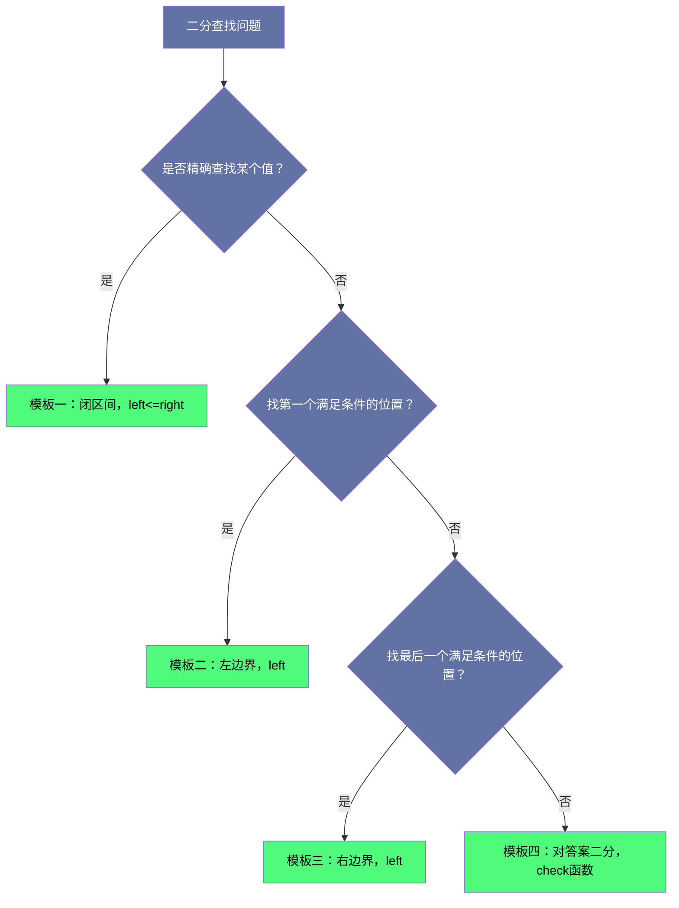

# 二分查找核心模板：从基础到左右边界锁定

## 摘要

二分查找是面试中频率最高的算法之一，但也是出错率最高的算法之一——不是思路不对，而是边界条件一错再错。本文不是要让你"记住"某个模板，而是从**不变量（Loop Invariant）**出发，推导出所有边界条件的必然性，让你在面试中自信地写出正确代码。本文覆盖两道经典题：Search Insert Position（找插入位置）和 Search for a Range（找区间左右边界），并由此引申出"找满足条件的最左/最右边界"这一二分查找最重要的应用模式。

---

## 第 1 章 二分查找的困惑来源

### 1.1 为什么二分查找的边界条件如此让人困惑

问十个程序员"写一个二分查找"，你会看到至少三四种不同的写法：

```java
// 写法 A：left <= right，取 mid = (left+right)/2，返回 -1 / mid
while (left <= right) { ... if ... left = mid+1; else right = mid-1; }

// 写法 B：left < right，取 mid = (left+right)/2，循环后处理
while (left < right) { ... if ... left = mid+1; else right = mid; }

// 写法 C：left + 1 < right，循环后额外检查 left 和 right
while (left + 1 < right) { ... }
```

这三种写法都是正确的，但它们各有适用场景，混用就会出错。困惑的根源在于：大多数人是"记"写法而不是"理解"写法。

### 1.2 不变量：解决边界混乱的钥匙

正确理解二分查找的关键是**循环不变量（Loop Invariant）**——在每次循环迭代开始/结束时，某个关于 `left` 和 `right` 的性质始终成立。

**本文采用的统一思路**：

把问题转化为"**在有序数组中，找满足某个条件的第一个（最左）或最后一个（最右）位置**"。这个框架可以统一几乎所有二分查找问题，包括：
- 查找某个值是否存在
- 查找某个值第一次出现的位置
- 查找某个值最后一次出现的位置
- 查找第一个大于等于/大于某个值的位置（插入位置）

---

## 第 2 章 基础模板：精确查找

### 2.1 标准二分查找

在升序数组中查找目标值 `target`，返回下标，不存在返回 -1。

**闭区间模板**（推荐，边界条件最自然）：

```java
int binarySearch(int[] nums, int target) {
    int left = 0, right = nums.length - 1;  // 搜索区间是 [left, right]（闭区间）

    while (left <= right) {  // 区间不为空时继续（left > right 时区间为空）
        int mid = left + (right - left) / 2;  // 防溢出，等价于 (left+right)/2

        if (nums[mid] == target) {
            return mid;  // 找到
        } else if (nums[mid] < target) {
            left = mid + 1;  // mid 已经检查，且不是答案，下次从 mid+1 开始
        } else {
            right = mid - 1; // 同理
        }
    }
    return -1;  // 未找到
}
```

**不变量**：在每次循环开始时，如果 `target` 存在，它一定在 `[left, right]` 区间内。

- `left = mid + 1`：已知 `nums[mid] < target`，所以 `target` 不在 `[left, mid]` 中，更新为 `[mid+1, right]`
- `right = mid - 1`：已知 `nums[mid] > target`，所以 `target` 不在 `[mid, right]` 中，更新为 `[left, mid-1]`
- `left <= right`：循环条件保证区间非空；`left > right` 时区间 `[left, right]` 为空，没有搜索必要

每一步都由不变量推导，没有任何"感觉"的成分。

### 2.2 一个常见的混淆：mid 向下取整的影响

`mid = left + (right - left) / 2` 是**向下取整**（取左中点）。当区间只有两个元素时：

```
left = 5, right = 6
mid = 5 + (6-5)/2 = 5    （取左边）
```

这在大多数情况下没问题，但在某些模板（如左闭右开）中需要特别注意，否则可能死循环。本文用的闭区间模板，向下取整是安全的。

---

## 第 3 章 LeetCode 35：搜索插入位置

### 3.1 题目

**LeetCode 35 - Search Insert Position**（简单）

给定一个排序数组和一个目标值，在数组中找到目标值，并返回其索引。如果目标值不存在于数组中，返回它将会被按顺序插入的位置。

请必须使用时间复杂度为 $O(\log n)$ 的算法。

```
输入: nums = [1,3,5,6], target = 5
输出: 2

输入: nums = [1,3,5,6], target = 2
输出: 1

输入: nums = [1,3,5,6], target = 7
输出: 4

输入: nums = [1,3,5,6], target = 0
输出: 0
```

### 3.2 问题本质：找第一个大于等于 target 的位置

插入位置是什么？是数组中"第一个大于等于 `target` 的元素"的下标——如果 `target` 本身存在，就返回它的下标；如果不存在，就返回第一个比 `target` 大的元素的下标（这是 `target` 应该插入的位置）。

用一句话概括：**找满足 `nums[i] >= target` 的最小下标 $i$。**

这正是"找左边界"的标准问题。

### 3.3 左边界二分模板

```java
public int searchInsert(int[] nums, int target) {
    int left = 0, right = nums.length;
    // 注意：right = nums.length（不是 length-1）
    // 因为答案可能是 length（target 比所有元素都大时，插到末尾）

    while (left < right) {  // 区间 [left, right) 非空
        int mid = left + (right - left) / 2;
        if (nums[mid] < target) {
            left = mid + 1;  // nums[mid] 不满足条件，答案在 [mid+1, right)
        } else {
            right = mid;     // nums[mid] 满足条件，答案在 [left, mid]，但 mid 本身也可能是答案
        }
    }
    return left;  // 循环结束时 left == right，就是答案
}
```

**这里使用的是左闭右开区间 `[left, right)`。** 解释每个细节：

- `right = nums.length`：搜索区间是 `[0, length)`，包含了"所有元素都小于 target"时答案为 `length` 的情况
- `left < right`：区间 `[left, right)` 非空的条件（`left == right` 时区间为空）
- `right = mid`（不是 `mid - 1`）：当 `nums[mid] >= target` 时，`mid` 本身可能是答案，不能排除，所以 `right = mid`（而不是 `mid - 1`）
- `left = mid + 1`：当 `nums[mid] < target` 时，`mid` 肯定不是答案，可以安全排除，`left = mid + 1`
- 循环结束：`left == right`，区间收缩到一个点，就是满足条件的最小下标

**不变量**：在每次循环开始时，满足 `nums[i] >= target` 的最小 $i$ 一定在 `[left, right)` 中（或者就等于 `right` 本身，表示不存在这样的 $i$，插到末尾）。

### 3.4 验证示例

以 `nums = [1, 3, 5, 6]`，`target = 2` 为例：

| 轮次 | left | right | mid | nums[mid] | 判断 | 操作 |
|------|------|-------|-----|-----------|------|------|
| 1 | 0 | 4 | 2 | 5 | `5 >= 2`，满足条件 | `right = 2` |
| 2 | 0 | 2 | 1 | 3 | `3 >= 2`，满足条件 | `right = 1` |
| 3 | 0 | 1 | 0 | 1 | `1 < 2`，不满足条件 | `left = 1` |
| 结束 | 1 | 1 | — | — | `left == right` | 返回 `1` |

结果：`1`（插入位置），`nums[1]=3` 是第一个 `>= 2` 的元素 ✅

---

## 第 4 章 LeetCode 34：在排序数组中查找元素的第一个和最后一个位置

### 4.1 题目

**LeetCode 34 - Find First and Last Position of Element in Sorted Array（即 Search for a Range）**（中等）

给你一个按照非递减顺序排列的整数数组 `nums`，和一个目标值 `target`。请你找出给定目标值在数组中的开始位置和结束位置。

如果数组中不存在目标值 `target`，返回 `[-1, -1]`。

你必须设计并实现时间复杂度为 $O(\log n)$ 的算法解决此问题。

```
输入: nums = [5,7,7,8,8,10], target = 8
输出: [3,4]

输入: nums = [5,7,7,8,8,10], target = 6
输出: [-1,-1]

输入: nums = [], target = 0
输出: [-1,-1]
```

### 4.2 转化为两次左边界二分

开始位置 = **第一个 `>= target` 的位置**
结束位置 = **最后一个 `<= target` 的位置** = **第一个 `> target` 的位置 - 1**

所以只需要实现一个"左边界二分"函数（找第一个 `>= target` 的位置），然后：
- 开始位置：调用 `lowerBound(nums, target)`，检查是否等于 `target`
- 结束位置：调用 `lowerBound(nums, target + 1) - 1`，检查是否 `>= 0` 且 `== target`

```java
public int[] searchRange(int[] nums, int target) {
    int start = lowerBound(nums, target);  // 第一个 >= target 的位置

    // 如果第一个 >= target 的位置上的值不等于 target，说明 target 不存在
    if (start == nums.length || nums[start] != target) {
        return new int[]{-1, -1};
    }

    int end = lowerBound(nums, target + 1) - 1;  // 最后一个 == target 的位置
    return new int[]{start, end};
}

// 找第一个 >= target 的位置（如果不存在，返回 nums.length）
private int lowerBound(int[] nums, int target) {
    int left = 0, right = nums.length;
    while (left < right) {
        int mid = left + (right - left) / 2;
        if (nums[mid] < target) left = mid + 1;
        else right = mid;
    }
    return left;
}
```

**为什么 `end = lowerBound(nums, target + 1) - 1` 能找到最右边界？**

`lowerBound(nums, target + 1)` 返回的是第一个 `> target` 的位置（即第一个 `>= target+1` 的位置）。那么这个位置减 1，就是最后一个 `== target` 的位置，因为 `target` 和 `target+1` 之间没有间隙（都是整数）。

**验证**：`nums = [5,7,7,8,8,10]`，`target = 8`

- `lowerBound(nums, 8)`：找第一个 `>= 8` 的位置
  - left=0, right=6; mid=3, nums[3]=8 >= 8, right=3
  - left=0, right=3; mid=1, nums[1]=7 < 8, left=2
  - left=2, right=3; mid=2, nums[2]=7 < 8, left=3
  - left=3, right=3，返回 3 ✅
- `lowerBound(nums, 9)`：找第一个 `>= 9` 的位置
  - 类似过程，返回 5
- `end = 5 - 1 = 4` ✅
- 结果：`[3, 4]` ✅

### 4.3 左边界和右边界函数的统一

用两个函数分别处理左右边界，代码清晰但略显重复。另一种写法是直接实现 `lowerBound`（第一个 `>=`）和 `upperBound`（第一个 `>`，相当于 `lowerBound(target+1)`）：

```java
// lowerBound：第一个满足 nums[i] >= target 的 i
// （C++ STL std::lower_bound 的语义）
private int lowerBound(int[] nums, int target) {
    int left = 0, right = nums.length;
    while (left < right) {
        int mid = left + (right - left) / 2;
        if (nums[mid] < target) left = mid + 1;
        else right = mid;
    }
    return left;
}

// upperBound：第一个满足 nums[i] > target 的 i
// （C++ STL std::upper_bound 的语义）
private int upperBound(int[] nums, int target) {
    int left = 0, right = nums.length;
    while (left < right) {
        int mid = left + (right - left) / 2;
        if (nums[mid] <= target) left = mid + 1;  // 注意：<= 而不是 <
        else right = mid;
    }
    return left;
}
```

有了这两个函数，`target` 的出现范围就是 `[lowerBound(target), upperBound(target))`（左闭右开）：
- 如果 `lowerBound(target) == upperBound(target)`，说明 `target` 不存在
- 否则，起始下标是 `lowerBound(target)`，结束下标是 `upperBound(target) - 1`

> [!info] 核心概念：lower_bound 和 upper_bound
> 这两个函数来自 C++ STL，是二分查找最常用的两个工具函数。很多面试题的本质就是实现这两个函数的某种变体。建议在面试前把这两个函数的实现背下来，并能快速推导其正确性。

---

## 第 5 章 二分查找的四大模板总结

### 5.1 模板一：精确查找（找等于 target 的位置）

```java
// 适用：有序数组，查找特定值，返回下标或 -1
int left = 0, right = nums.length - 1;  // 闭区间
while (left <= right) {
    int mid = left + (right - left) / 2;
    if (nums[mid] == target) return mid;
    else if (nums[mid] < target) left = mid + 1;
    else right = mid - 1;
}
return -1;
```

**适用场景**：查找某个值是否存在，有则返回下标，无则返回 -1。

### 5.2 模板二：左边界（第一个满足条件的位置）

```java
// 适用：找第一个满足 condition(nums[i]) 的 i
// condition 必须满足单调性：如果 i 满足，则 i+1 也可能满足（但不一定）
int left = 0, right = nums.length;  // 半开区间 [left, right)
while (left < right) {
    int mid = left + (right - left) / 2;
    if (condition(nums[mid])) right = mid;  // mid 满足，答案在 [left, mid]
    else left = mid + 1;                    // mid 不满足，答案在 [mid+1, right)
}
return left;  // 如果 left == nums.length，说明不存在满足条件的元素
```

**适用场景**：找第一个 `>= target`，找第一个满足某个单调条件的位置。

### 5.3 模板三：右边界（最后一个满足条件的位置）

```java
// 适用：找最后一个满足 condition(nums[i]) 的 i
// condition 必须满足单调性：如果 i 满足，则 i-1 也可能满足（但不一定）
int left = -1, right = nums.length - 1;  // 半开区间 (left, right]
while (left < right) {
    int mid = left + (right - left + 1) / 2;  // 注意：+1，向上取整，避免死循环
    if (condition(nums[mid])) left = mid;   // mid 满足，答案在 [mid, right]
    else right = mid - 1;                   // mid 不满足，答案在 (left, mid-1]
}
return left;  // 如果 left == -1，说明不存在满足条件的元素
```

**注意**：向上取整（`+1`）是关键，否则当 `left = right - 1` 时，`mid = left`，`left = mid` 不推进，死循环。

**适用场景**：找最后一个 `<= target`，找最后一个满足某个单调条件的位置。

### 5.4 模板四：答案二分（对答案进行二分）

这是二分查找最强大的应用，不对数组元素进行二分，而是对**答案范围**进行二分。

```java
// 适用：答案在 [lo, hi] 范围内，且 check(ans) 具有单调性
int left = lo, right = hi;
while (left < right) {
    int mid = left + (right - left) / 2;
    if (check(mid)) right = mid;  // mid 满足，尝试更小的答案
    else left = mid + 1;          // mid 不满足，答案必须更大
}
return left;
```

**适用场景**：木材切割（最大化切割长度）、运输问题（最小化最大载重）、分配问题（最小化最大时间）等。题目特征通常是"找满足某条件的最小/最大值"。

### 5.5 如何选择模板



---

## 第 6 章 常见错误与调试技巧

### 6.1 死循环的产生与避免

**最常见的死循环**：在左闭右开模板中，应该 `right = mid` 却写成了 `right = mid - 1`；或者在右边界模板中忘记了向上取整。

**调试技巧**：用最小规模的例子手动跑一遍。

最危险的情况是 `left` 和 `right` 相邻（`right = left + 1`），此时 `mid = left`（向下取整）：
- 如果 `left = mid`，则 `left` 不变，死循环 ❌
- 如果 `right = mid`，则 `right` 减小，正常 ✅
- 如果 `left = mid + 1`，则 `left` 增大，正常 ✅

因此，右边界模板必须用向上取整（`mid = left + (right - left + 1) / 2`），确保 `mid = right`，不会因为 `left = mid` 导致死循环。

### 6.2 整数溢出

```java
// 错误：可能溢出
int mid = (left + right) / 2;

// 正确：防溢出
int mid = left + (right - left) / 2;
```

当 `left` 和 `right` 都是接近 `Integer.MAX_VALUE` 的大整数时，`left + right` 溢出成负数，导致 `mid` 错误。防溢出写法通过先做减法（`right - left` 不会溢出，因为 `right >= left`），再除以 2，始终安全。

### 6.3 边界外访问

当数组为空（`nums.length == 0`）时，很多写法会在循环开始前就通过 `nums[mid]` 访问越界。需要在开始前加入 `if (nums == null || nums.length == 0) return ...` 的保护。

---

## 小结

本文从不变量出发，系统梳理了二分查找的四大模板：

1. **精确查找**：闭区间 `[left, right]`，`left <= right`，找到返回 `mid`，没找到返回 -1
2. **左边界**：半开区间 `[left, right)`，`left < right`，`right = mid`，循环后 `left` 就是答案（`lowerBound`）
3. **右边界**：半开区间 `(left, right]`，`left < right`，`left = mid`，必须向上取整，循环后 `left` 就是答案
4. **答案二分**：在答案范围内二分，配合 `check` 函数判断可行性

两道经典题：
- **Search Insert Position**：左边界二分，找第一个 `>= target` 的位置，`right = nums.length`
- **Search for a Range**：两次左边界二分，`[lowerBound(target), lowerBound(target+1)-1]`

**记住核心原则**：每次二分消除的区间，必须能证明答案不在其中。只要这个原则没被破坏，写法就是正确的。

---

**上一篇**：[[04 创意排序：荷兰国旗问题与桶排序思想]]
**下一篇**：[[06 二分查找的变体：旋转有序数组与有序矩阵]]
