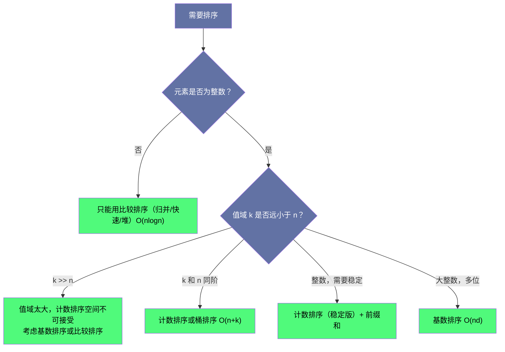

# 计数排序与基数排序：线性时间排序的边界与代价

## 摘要

第一篇文章指出，基于比较的排序存在 $\Omega(n \log n)$ 的理论下界，而计数排序、基数排序、桶排序可以突破这个下界，在特定条件下达到线性时间。本文深入剖析这三种"非比较排序"的原理、适用条件和局限性，并通过 Maximum Gap（最大间距，LeetCode 164）和 H-Index（H 指数，LeetCode 274）两道真实面试题展示它们的应用。

---

## 第 1 章 为什么可以突破 O(n log n) 下界

### 1.1 比较排序下界的前提

第一篇分析了比较排序 $O(n \log n)$ 下界的来源：在**比较模型**中，算法只能通过"比较两个元素大小"来获取信息。

但如果我们被允许用其他方式获取信息，这个下界就不再适用。最典型的例子：如果知道元素的值域范围（比如都在 $[0, 100]$ 内），我们就可以直接"把元素放到它应该在的位置"，而不需要通过比较来确定相对顺序。

**代价**：使用了元素值域的额外信息，需要额外的空间（与值域大小相关）。

### 1.2 三种线性排序的对比

| 算法 | 适用条件 | 时间 | 空间 | 稳定 |
|------|----------|------|------|------|
| 计数排序 | 整数，值域 $[0, k)$ 已知且 $k$ 不大 | $O(n+k)$ | $O(k)$ | ✅ |
| 桶排序 | 数据均匀分布在某个区间 | $O(n+k)$ | $O(n+k)$ | ✅ |
| 基数排序 | 整数或定长字符串，按位排序 | $O(nd)$ | $O(n+b)$ | ✅ |

其中 $k$ 是值域大小，$d$ 是最大值的位数，$b$ 是基数（通常取 10 或 256）。

---

## 第 2 章 计数排序（Counting Sort）

### 2.1 原理

**核心思想**：统计每个值出现的次数，然后按顺序输出。

**步骤**：
1. 创建大小为 $k$ 的计数数组 `count`，`count[i]` 存放值 $i$ 出现的次数
2. 遍历输入，统计每个值的出现次数
3. 顺序输出：对每个值 $i$，输出 `count[i]` 次值 $i$

```java
void countingSort(int[] nums, int max) {
    int[] count = new int[max + 1];
    for (int x : nums) count[x]++;

    int idx = 0;
    for (int v = 0; v <= max; v++) {
        while (count[v]-- > 0) nums[idx++] = v;
    }
}
```

**时间 $O(n+k)$，空间 $O(k)$。**

计数排序的局限：
- 只适用于**整数**（或可以映射为非负整数的值）
- 值域 $k$ 必须**有限且不太大**（$k$ 太大时，空间和时间都不再是 $O(n)$ 级别）
- 如果值域有负数，需要先将所有值平移（`offset = -min`），使最小值为 0

### 2.2 稳定的计数排序

上面的简单实现虽然正确，但不稳定（遇到相同值直接从 0 开始填充，原来的相对顺序丢失）。稳定的计数排序需要一个额外的步骤——**前缀和**：

```java
// 稳定的计数排序（保持相同值元素的原始相对顺序）
void stableCountingSort(int[] nums, int max) {
    int[] count = new int[max + 1];
    for (int x : nums) count[x]++;

    // 前缀和：count[i] 变为"值 <= i 的元素总数"
    for (int i = 1; i <= max; i++) count[i] += count[i - 1];

    // 从后往前填入结果，保证稳定性
    int[] result = new int[nums.length];
    for (int i = nums.length - 1; i >= 0; i--) {
        result[--count[nums[i]]] = nums[i];
    }

    System.arraycopy(result, 0, nums, 0, nums.length);
}
```

稳定性对基数排序至关重要——基数排序的每一轮按单一位的计数排序，**必须是稳定的**，才能保证高位的排序不打乱低位已经排好的顺序。

---

## 第 3 章 桶排序（Bucket Sort）

### 3.1 原理

**核心思想**：将 $[min, max]$ 范围均分为 $k$ 个桶，每个桶覆盖一个子区间。将元素分配到对应的桶中，对每个桶内部单独排序，然后按桶的顺序输出。

**优点**：当数据**均匀分布**时，每个桶内的元素数量约为 $n/k$，桶内排序的总时间是 $k \cdot O((n/k) \log(n/k)) = O(n \log(n/k))$。当 $k = n$ 时，退化为 $O(n)$（每个桶最多一个元素）。

**缺点**：当数据**不均匀分布**时（如所有元素都落入同一个桶），桶排序退化为 $O(n^2)$（单个桶内的插入排序）或 $O(n \log n)$（单个桶内用快速排序）。

```java
void bucketSort(double[] nums) {
    int n = nums.length;
    List<Double>[] buckets = new List[n];
    for (int i = 0; i < n; i++) buckets[i] = new ArrayList<>();

    // 分配元素到桶中（假设元素在 [0, 1) 范围内）
    for (double x : nums) {
        int bucketIdx = (int)(x * n);
        buckets[bucketIdx].add(x);
    }

    // 对每个桶内部排序
    for (List<Double> bucket : buckets) Collections.sort(bucket);

    // 合并结果
    int idx = 0;
    for (List<Double> bucket : buckets) {
        for (double x : bucket) nums[idx++] = x;
    }
}
```

---

## 第 4 章 基数排序（Radix Sort）

### 4.1 原理：按位排序

**核心思想**：将整数按每一位（个位、十位、百位……）分别排序，从低位到高位（LSD，Least Significant Digit）。每一位的排序用稳定的计数排序实现。

**为什么从低位到高位？** 因为后排的高位会保持低位已经排好的相对顺序（稳定排序的性质），最终结果就是按整个数值排好序的。

```
原始: [170, 45, 75, 90, 802, 24, 2, 66]

按个位排序（稳定）:
[170, 90, 802, 2, 24, 45, 75, 66]
 ^0   ^0   ^2  ^2  ^4  ^5  ^5  ^6

按十位排序（稳定）:
[802, 2, 24, 45, 66, 170, 75, 90]
  ^0 ^0  ^2  ^4  ^6   ^7  ^7  ^9

按百位排序（稳定）:
[2, 24, 45, 66, 75, 90, 170, 802]
```

```java
void radixSort(int[] nums) {
    int max = Arrays.stream(nums).max().getAsInt();

    // 从低位到高位，对每一位做计数排序
    for (int exp = 1; max / exp > 0; exp *= 10) {
        countingSortByDigit(nums, exp);
    }
}

void countingSortByDigit(int[] nums, int exp) {
    int n = nums.length;
    int[] count = new int[10];
    int[] output = new int[n];

    // 统计当前位的频率
    for (int num : nums) count[(num / exp) % 10]++;

    // 前缀和，确定每个值的起始位置
    for (int i = 1; i < 10; i++) count[i] += count[i - 1];

    // 从后往前填（保证稳定性）
    for (int i = n - 1; i >= 0; i--) {
        int digit = (nums[i] / exp) % 10;
        output[--count[digit]] = nums[i];
    }

    System.arraycopy(output, 0, nums, 0, n);
}
```

**时间 $O(nd)$**，$d$ 是最大值的位数，$n$ 是元素个数。对于 32 位整数，$d = 10$（十进制），$O(10n) = O(n)$。
**空间 $O(n + b)$**，$b$ 是基数（10 进制时 $b=10$，256 进制时 $b=256$）。

---

## 第 5 章 LeetCode 164：最大间距（Maximum Gap）

### 5.1 题目

**LeetCode 164 - Maximum Gap**（困难）

给定一个未排序的数组，找出排序后相邻元素之间的最大差值。如果数组元素个数小于 2，则返回 0。

你必须编写一个在线性时间内运行并使用线性额外空间的算法。

```
输入: [3,6,9,1]
输出: 3（排序后 [1,3,6,9]，最大差值是 9-6=3）

输入: [10]
输出: 0
```

### 5.2 解题思路：鸽巢原理 + 桶排序

**朴素方案**：先排序（$O(n \log n)$），然后线性扫描找相邻最大差值。但题目要求线性时间，不能用比较排序。

**关键洞察（鸽巢原理）**：

设数组有 $n$ 个元素，最小值为 $min$，最大值为 $max$。排序后相邻元素的差值之和是 $max - min$，共有 $n-1$ 个相邻对，平均差值是 $\frac{max-min}{n-1}$。

由鸽巢原理，最大相邻差值一定 $\geq$ 平均差值，即：

$$\text{最大相邻差值} \geq \frac{max - min}{n - 1}$$

**现在，以 $\lceil \frac{max-min}{n-1} \rceil$（平均间距上取整）为桶的大小，建立 $n-1$ 个桶**。

由于桶的大小等于平均间距，同一个桶内的两个元素之差**严格小于**桶的大小（严格小于平均间距）。因此，**最大相邻差值一定来自相邻两个非空桶之间，而不是来自同一个桶内部**！

基于此，对每个桶只需记录桶内的最小值和最大值，最终答案是：

$$\max(\text{下一个非空桶的最小值} - \text{当前非空桶的最大值})$$

```java
public int maximumGap(int[] nums) {
    if (nums.length < 2) return 0;

    int n = nums.length;
    int min = Integer.MAX_VALUE, max = Integer.MIN_VALUE;
    for (int x : nums) { min = Math.min(min, x); max = Math.max(max, x); }

    if (min == max) return 0;  // 所有元素相同

    // 桶的大小：至少为 1，防止除以 0
    int bucketSize = Math.max(1, (max - min) / (n - 1));
    int bucketCount = (max - min) / bucketSize + 1;

    int[] bucketMin = new int[bucketCount];
    int[] bucketMax = new int[bucketCount];
    Arrays.fill(bucketMin, Integer.MAX_VALUE);
    Arrays.fill(bucketMax, Integer.MIN_VALUE);

    // 将元素分配到桶中
    for (int x : nums) {
        int idx = (x - min) / bucketSize;
        bucketMin[idx] = Math.min(bucketMin[idx], x);
        bucketMax[idx] = Math.max(bucketMax[idx], x);
    }

    // 遍历相邻非空桶，找最大差值
    int maxGap = 0;
    int prevMax = bucketMax[0];  // 上一个非空桶的最大值

    for (int i = 1; i < bucketCount; i++) {
        if (bucketMin[i] == Integer.MAX_VALUE) continue;  // 空桶，跳过
        maxGap = Math.max(maxGap, bucketMin[i] - prevMax);
        prevMax = bucketMax[i];
    }

    return maxGap;
}
```

**时间 $O(n)$，空间 $O(n)$。**

> [!info] 核心概念：鸽巢原理的应用
> 鸽巢原理（Pigeonhole Principle）：$n+1$ 个鸽子放进 $n$ 个巢，至少有一个巢里有 2 只鸽子。
> 在这道题中：$n$ 个元素放进 $n-1$ 个桶，至少有一个桶是空的（因为最小值和最大值各占一个桶，中间 $n-2$ 个元素放进 $n-1-2=n-3$ 个中间桶，当 $n \geq 3$ 时必有空桶）。空桶的存在保证了最大间距来自跨桶而不是桶内。

---

## 第 6 章 LeetCode 274：H 指数（H-Index）

### 6.1 题目

**LeetCode 274 - H-Index**（中等）

给你一个整数数组 `citations`，其中 `citations[i]` 表示研究者的第 $i$ 篇论文被引用的次数。计算并返回该研究者的 h 指数。

根据维基百科上 h 指数的定义：h 代表"高引用次数"，一名科研人员的 h 指数 是指他（她）至少发表了 $h$ 篇论文，并且**至少**有 $h$ 篇论文被引用次数**大于等于** $h$。如果 $h$ 有多种可能的值，h 指数 是其中最大的那个。

```
输入: citations = [3,0,6,1,5]
输出: 3（研究者有 3 篇论文被引用了至少 3 次）

输入: citations = [1,3,1]
输出: 1
```

### 6.2 解法一：排序后二分/线性扫描

先对引用次数降序排序，然后找最大的 $h$，满足"第 $h$ 篇论文的引用次数 $\geq h$"。

```java
public int hIndex(int[] citations) {
    Arrays.sort(citations);
    int n = citations.length;
    for (int i = 0; i < n; i++) {
        // 从后往前，检查第 n-i 篇（降序第 i+1 篇）的引用次数
        if (citations[n - 1 - i] <= i) return i;
    }
    return n;
}
```

**时间 $O(n \log n)$，空间 $O(1)$。**

### 6.3 解法二：计数排序（线性时间）

h 指数的值域是 $[0, n]$（一个人有 $n$ 篇论文，h 指数最多是 $n$）。利用这个约束，可以用计数排序实现 $O(n)$。

**思路**：统计引用次数 $\geq i$ 的论文数量，找最大的 $i$ 满足"引用次数 $\geq i$ 的论文数 $\geq i$"。

```java
public int hIndex(int[] citations) {
    int n = citations.length;
    int[] count = new int[n + 1];  // count[i] = 引用次数恰好为 i 的论文数（引用数 > n 统一记为 n）

    for (int c : citations) {
        count[Math.min(c, n)]++;  // 引用次数超过 n 的，统一归到 n 这一组
    }

    // 从 n 开始向下，累加引用次数 >= i 的论文数，找到第一个满足条件的 h
    int total = 0;
    for (int i = n; i >= 0; i--) {
        total += count[i];
        if (total >= i) return i;  // 引用次数 >= i 的论文数 >= i，满足 h 指数定义
    }

    return 0;  // 不可能到这里
}
```

**时间 $O(n)$，空间 $O(n)$。**

**为什么可以直接 `return i`，而不需要继续检查更大的 $i$？**

因为我们是从大到小遍历 $i$，第一次满足 `total >= i` 的 $i$，就是最大的满足条件的 h 指数。之后的 $i$ 更小，满足条件的会更容易（`total` 更大，`i` 更小），但我们要的是最大值，所以第一次满足就是答案。

---

## 第 7 章 线性排序的适用性总结

### 7.1 使用线性排序的决策



### 7.2 面试中使用线性排序的信号

遇到以下特征，可以考虑线性排序：
- 题目给出了**元素值的范围**（如"0 到 10000"）
- 题目要求 $O(n)$ 时间（暗示不能用比较排序）
- 元素是整数且值域不大（H-Index 的值域是 $[0, n]$）
- 题目需要"稳定排序"且元素是整数

---

## 小结

本文讲解了三种线性时间排序算法及其面试应用：

1. **计数排序**：时间 $O(n+k)$，适用于小值域整数。稳定版需要前缀和。LeetCode 274（H-Index）的 $O(n)$ 最优解。

2. **桶排序**：时间平均 $O(n)$，适用于均匀分布数据。LeetCode 164（Maximum Gap）利用桶排序 + 鸽巢原理实现线性时间。

3. **基数排序**：时间 $O(nd)$，适用于大整数或定长字符串，依赖稳定的计数排序。

**线性排序的代价**：都需要利用元素值的额外信息（值域范围），且需要 $O(n)$ 到 $O(k)$ 的额外空间。比较排序不需要这些假设，但受 $O(n \log n)$ 下界约束。

**面试核心**：遇到"要求线性时间"或"元素值域有限"的题目，立刻想到计数排序/桶排序。遇到"最大间距"类问题，结合鸽巢原理思考桶的大小设计。

---

**上一篇**：[[08 排序在非排序题中的妙用：区间合并与贪心]]
**下一篇**：[[10 排序与查找综合通关：面试高频模式总结]]
