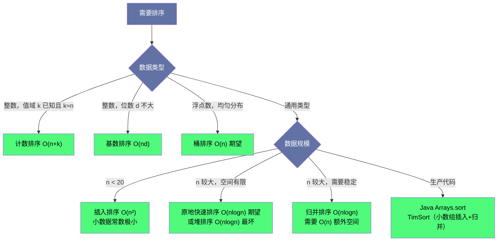
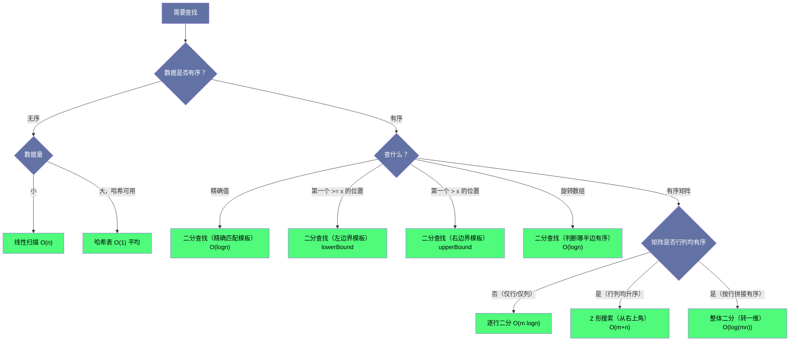
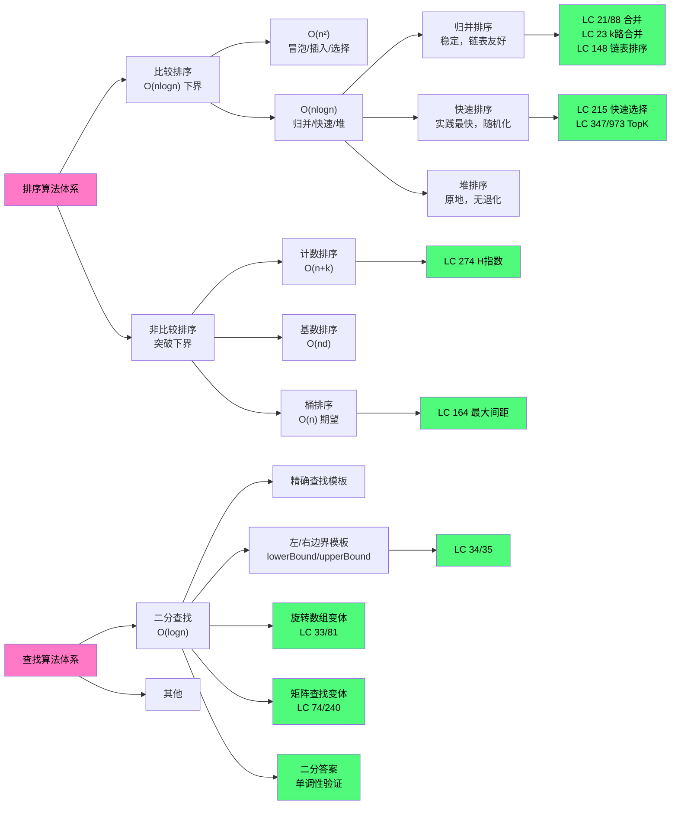

# 排序与查找综合通关：面试高频模式总结

## 摘要

经过前九篇的深度剖析，本文以"面试通关"为目标，从模式识别、算法选型、复杂度速查、常见陷阱和"开口表达"五个维度，将排序与查找专栏的知识体系系统性串联。本文不引入新题目，而是帮助你建立一套**遇到题目就能快速定位解法**的直觉。

---

## 第 1 章 面试题的识别框架

### 1.1 从题目类型到算法类别

面试中，排序与查找类题目通常有这些触发特征：

| 题目特征 | 首先联想的算法 | 代表题目 |
|----------|----------------|----------|
| 两个有序数组/链表合并 | 双指针 / 归并 | LC 21, LC 88 |
| k 路合并 | 最小堆 / 分治归并 | LC 23 |
| 链表排序 | 归并排序（自底向上） | LC 148 |
| 三类分组（0/1/2、小/等/大） | 荷兰国旗（三指针） | LC 75 |
| 数组中缺失的正整数 / 元素归位 | 原地哈希 / 桶思想 | LC 41 |
| 有序数组中查找位置或边界 | 二分查找（左/右边界模板） | LC 34, LC 35 |
| 旋转数组中查找 | 二分查找（判断有序半段） | LC 33, LC 81 |
| 矩阵中查找（行列均有序） | Z 形查找（从右上角） | LC 240 |
| 第 K 大 / 前 K 个 | 快速选择 O(n) / 最小堆 O(n log k) | LC 215, LC 347 |
| 区间合并 / 会议室 / 活动选择 | 排序 + 贪心 | LC 56, LC 253, LC 435 |
| 值域有限 / 要求线性时间 | 计数排序 / 桶排序 | LC 164, LC 274 |
| 答案在某范围内，可以验证 | 二分答案 | 各类"最大化最小值"题 |

### 1.2 排序题的两类用途

排序在解题中扮演两种角色：

**角色一：排序本身就是目的（直接排序题）**
- 链表排序（LC 147, LC 148）
- k 个有序链表合并（LC 23）
- 荷兰国旗（LC 75）

**角色二：排序作为预处理，为后续算法创造条件（间接排序题）**
- 区间合并（LC 56, LC 57）：排序使贪心成立
- 三数之和、两数之和变体：排序使双指针成立
- H 指数（LC 274）：排序使线性扫描成立
- K 近邻点（LC 973）：自定义排序规则，排好后取前 K 个

**面试技巧**：遇到"间接排序题"，要明确说出"我先排序，是因为……（使双指针/贪心/二分成立）"，而不是只说"先排序"。

---

## 第 2 章 算法选型决策树

### 2.1 排序算法选型



### 2.2 查找算法选型



---

## 第 3 章 复杂度完全速查

### 3.1 排序算法复杂度

| 算法 | 最好 | 平均 | 最坏 | 空间 | 稳定 | 适用场景 |
|------|------|------|------|------|------|----------|
| 冒泡排序 | $O(n)$ | $O(n^2)$ | $O(n^2)$ | $O(1)$ | ✅ | 几乎不用（理解比较排序用） |
| 插入排序 | $O(n)$ | $O(n^2)$ | $O(n^2)$ | $O(1)$ | ✅ | 小数组（$n < 20$）、近乎有序 |
| 选择排序 | $O(n^2)$ | $O(n^2)$ | $O(n^2)$ | $O(1)$ | ❌ | 几乎不用 |
| 归并排序 | $O(n \log n)$ | $O(n \log n)$ | $O(n \log n)$ | $O(n)$ | ✅ | 链表排序、外部排序、稳定要求 |
| 快速排序 | $O(n \log n)$ | $O(n \log n)$ | $O(n^2)$ | $O(\log n)$ | ❌ | 通用内存排序，实践最快 |
| 堆排序 | $O(n \log n)$ | $O(n \log n)$ | $O(n \log n)$ | $O(1)$ | ❌ | 保证最坏 $O(n \log n)$，对 cache 不友好 |
| 计数排序 | $O(n+k)$ | $O(n+k)$ | $O(n+k)$ | $O(k)$ | ✅ | 小值域整数 |
| 基数排序 | $O(nd)$ | $O(nd)$ | $O(nd)$ | $O(n+b)$ | ✅ | 大整数、定长字符串 |
| 桶排序 | $O(n)$ | $O(n)$ | $O(n^2)$ | $O(n+k)$ | ✅ | 均匀分布浮点数 |

### 3.2 本专栏高频题复杂度

| LeetCode | 题目 | 最优时间 | 空间 | 核心技巧 |
|----------|------|----------|------|----------|
| 88 | 合并两有序数组 | $O(m+n)$ | $O(1)$ | 从后往前双指针 |
| 21 | 合并两有序链表 | $O(m+n)$ | $O(1)$ | 哑节点 + 双指针 |
| 23 | 合并 k 个有序链表 | $O(N \log k)$ | $O(k)$ | 最小堆 |
| 147 | 链表的插入排序 | $O(n^2)$ | $O(1)$ | 每次找正确位置插入 |
| 148 | 链表排序 | $O(n \log n)$ | $O(1)$ | 自底向上归并（自然长度） |
| 75 | 颜色分类 | $O(n)$ | $O(1)$ | 荷兰国旗三指针 |
| 41 | 缺失的第一个正数 | $O(n)$ | $O(1)$ | 原地哈希 |
| 35 | 搜索插入位置 | $O(\log n)$ | $O(1)$ | 左边界二分 |
| 34 | 在有序数组中查范围 | $O(\log n)$ | $O(1)$ | lowerBound + upperBound |
| 33 | 搜索旋转排序数组 | $O(\log n)$ | $O(1)$ | 判断哪半边有序 |
| 81 | 搜索旋转数组 II | $O(\log n)$ 均摊 | $O(1)$ | 重复元素 left++ |
| 74 | 搜索二维矩阵 | $O(\log(mn))$ | $O(1)$ | 整体二分（转 1D） |
| 240 | 搜索二维矩阵 II | $O(m+n)$ | $O(1)$ | Z 形搜索（右上角）|
| 215 | 数组中第 K 大元素 | $O(n)$ 期望 | $O(\log n)$ | 快速选择 |
| 347 | 前 K 个高频元素 | $O(n)$ | $O(n)$ | 桶排序（频率为下标）|
| 973 | 最接近原点的 K 个点 | $O(n)$ 期望 | $O(\log n)$ | 快速选择 |
| 56 | 合并区间 | $O(n \log n)$ | $O(n)$ | 排序 + 线性扫描 |
| 57 | 插入区间 | $O(n)$ | $O(n)$ | 三段式处理 |
| 253 | 会议室 II | $O(n \log n)$ | $O(n)$ | 排序 + 最小堆 |
| 435 | 无重叠区间 | $O(n \log n)$ | $O(1)$ | 按结束时间排序 + 贪心 |
| 164 | 最大间距 | $O(n)$ | $O(n)$ | 桶排序 + 鸽巢原理 |
| 274 | H 指数 | $O(n)$ | $O(n)$ | 计数排序 |

---

## 第 4 章 常见陷阱与错误盘点

### 4.1 二分查找的四大陷阱

**陷阱一：循环条件 `left < right` vs `left <= right`**

- 查找精确值：用 `left <= right`，找不到时返回 -1
- 查找边界（lowerBound/upperBound）：用 `left < right`，结束时 `left == right` 就是答案

```java
// 精确查找
while (left <= right) {
    int mid = left + (right - left) / 2;
    if (nums[mid] == target) return mid;
    else if (nums[mid] < target) left = mid + 1;
    else right = mid - 1;
}
return -1;

// 左边界（lowerBound）
while (left < right) {
    int mid = left + (right - left) / 2;
    if (nums[mid] < target) left = mid + 1;
    else right = mid;  // 不排除 mid，因为它可能是答案
}
// left == right，就是第一个 >= target 的位置
```

**陷阱二：`mid = (left + right) / 2` 的整数溢出**

当 `left` 和 `right` 都很大时（接近 `Integer.MAX_VALUE`），`left + right` 可能溢出。
正确写法：`mid = left + (right - left) / 2`

**陷阱三：`right = mid` vs `right = mid - 1`**

- 用 `left < right` 时，当不满足条件时，`right = mid`（不能排除 mid）
- 用 `left <= right` 时，当不满足条件时，`right = mid - 1`（可以排除 mid，因为已判断不是答案）

两种写法混用会导致死循环或漏掉答案。**选定一种模板，全程统一使用。**

**陷阱四：旋转数组中的重复元素处理**

LeetCode 81（有重复元素的旋转数组），当 `nums[left] == nums[mid]` 时，无法判断哪半段有序，只能 `left++`，这导致最坏时间 $O(n)$。LeetCode 33（无重复元素）没有这个问题。

### 4.2 归并排序的陷阱

**链表排序（LC 148）的自底向上实现**

自底向上的关键是**找到每段的头节点**，需要用 `splitList(head, len)` 从 `head` 出发走 `len-1` 步，返回本段最后一个节点，并将其 next 截断。

常见错误：
- `splitList` 后忘记断开 next 指针，两段链表仍然相连，merge 之后结果乱
- 每轮 merge 后忘记更新 `subLen`，死循环

**合并区间（LC 56）的最后一个区间**

循环结束后，最后的 `[curStart, curEnd]` 还未加入结果，必须在循环外单独处理。

### 4.3 快速选择的陷阱

**`partition` 后的范围边界**

三路分区后，返回的是 `[lt, gt]` 的范围（所有等于 pivot 的位置），目标 k 的判断需要正确区分：
- `k < lt`：在左侧 `[left, lt-1]` 继续
- `k > gt`：在右侧 `[gt+1, right]` 继续
- `lt <= k <= gt`：找到，返回

如果用的是二路分区，partition 返回单个位置 `p`：
- `k < p`：在 `[left, p-1]` 继续
- `k > p`：在 `[p+1, right]` 继续
- `k == p`：找到

### 4.4 计数排序和桶排序的陷阱

**计数排序的负数处理**

如果数组中有负数，需要先找最小值 `min`，然后用 `num - min` 作为数组下标。

**桶排序的桶大小计算（LC 164）**

桶大小应为 `Math.max(1, (max - min) / (n - 1))`，分母中 `n-1` 不是 `n`（因为有 $n$ 个元素，排序后有 $n-1$ 个相邻对）。当所有元素相同时（`min == max`），直接返回 0，避免除以零。

---

## 第 5 章 面试现场的表达策略

### 5.1 解题思路的标准表达框架

每道题按这个框架清晰表达：

1. **我观察到**（Observation）：发现题目的关键约束（"输入是有序的"，"值域在 0 到 n"，"要找第 K 大"）
2. **所以我想到**（Insight）：基于观察，引出核心算法（"输入有序，想到二分"，"值域有限，想到计数排序"）
3. **具体做法是**（Algorithm）：描述算法步骤
4. **复杂度分析**（Complexity）：时间和空间，解释理由
5. **边界情况**（Edge Cases）：空数组、单元素、重复值、负数、溢出等

### 5.2 各类题目的"开口话术"

**二分查找类**

> "这道题的输入是有序的（或答案空间可以二分），满足单调性，可以用二分查找。我使用的是左边界模板，维护 `[left, right)` 的不变量是……"

**归并排序类（链表）**

> "链表不支持随机访问，快速排序不适合。选归并排序，它天然适合链表的分治。为了空间 $O(1)$，我用自底向上的迭代归并，以 `subLen = 1, 2, 4, ...` 逐轮合并……"

**荷兰国旗类**

> "元素只有三个值，要求原地且 $O(n)$，这是荷兰国旗问题。维护三个指针 low, mid, high，保证 [0, low) 全是 0，[low, mid) 全是 1，(high, n-1] 全是 2……"

**快速选择类**

> "找第 K 大，可以全排序但时间 $O(n \log n)$ 不够优。用快速选择，每次 partition 后只递归一侧，期望 $O(n)$。具体地，partition 以随机选择的 pivot 为基准，把数组分成 < pivot, == pivot, > pivot 三段……"

**区间题类（按结束时间排序）**

> "这是活动选择问题，贪心策略是优先选结束最早的区间，因为结束早的区间给后面的区间留出了更多空间。可以用交换论证（Exchange Argument）证明这个贪心策略是最优的……"

### 5.3 被追问时的应对

**"能不能不用额外空间？"**

- 计数排序/桶排序：通常需要 $O(k)$ 额外空间，很难原地完成。但可以说明为什么——值域信息需要存储
- 归并排序链表：自底向上迭代归并可以 $O(1)$ 空间
- 快速选择：递归版本 $O(\log n)$ 栈空间，迭代版本 $O(1)$

**"能不能更快？"**

- "这道题有 $\Omega(n \log n)$ 的比较排序下界，如果不利用值域特性，$O(n \log n)$ 已是最优"
- "如果允许利用值域信息，可以用计数排序/桶排序达到 $O(n)$"

**"这个算法最坏情况如何？"**

- 快速排序/快速选择：随机化 pivot 后最坏 $O(n^2)$ 概率极低（期望 $O(n \log n)$），但确定性最坏仍是 $O(n^2)$
- 桶排序：退化到所有元素同一桶时 $O(n^2)$（取决于桶内排序算法）
- 堆排序/归并排序：严格 $O(n \log n)$ 无退化

---

## 第 6 章 专栏知识图谱



---

## 第 7 章 专栏十篇回顾

| 篇目 | 核心主题 | 掌握重点 |
|------|----------|----------|
| 01 | 排序算法全景 | 比较排序下界证明，6 种基础算法时空复杂度 |
| 02 | 归并排序实战 | LC 88 从后合并，LC 21 哑节点，LC 23 堆合并 |
| 03 | 链表排序 | LC 147 插入排序，LC 148 自底向上 O(1) 空间归并 |
| 04 | 创意排序 | LC 75 荷兰国旗三指针，LC 41 原地桶思想 |
| 05 | 二分查找核心 | 4 种模板，lowerBound/upperBound，LC 34/35 |
| 06 | 二分查找变体 | LC 33/81 旋转数组，LC 74/240 矩阵查找 |
| 07 | 快速选择与 TopK | LC 215 QuickSelect，LC 347/973 堆+桶，LC 703 流式 |
| 08 | 排序与贪心 | LC 56/57 区间合并，LC 253 会议室，LC 435 活动选择 |
| 09 | 线性排序 | 计数/基数/桶排序，LC 164 鸽巢原理，LC 274 H 指数 |
| 10 | 综合通关 | 模式识别，选型决策树，陷阱，面试表达 |

---

## 小结

**专栏完结。** 回顾 10 篇的内容：

- **算法原理**（第 1 篇）：排序算法的理论基础，为什么比较排序有下界，各大算法的时空复杂度。

- **实战编码**（第 2-4 篇）：归并排序的三大合并变体，链表排序的特殊挑战，荷兰国旗和原地哈希两种创意思路。

- **查找深度**（第 5-6 篇）：二分查找的四种模板，旋转数组的分段判断，矩阵查找的 Z 形遍历。

- **进阶应用**（第 7-9 篇）：快速选择的期望 $O(n)$，排序作为贪心预处理，线性时间排序的边界与代价。

- **综合通关**（第 10 篇，本篇）：模式识别、选型决策、陷阱、表达。

**下一步学习方向**：
- 字符串排序（Trie、后缀数组）
- 外部排序（多路归并）
- 并行排序（样本排序、BitonicSort）
- 数据库索引（B+ 树中的有序性与二分）

---

**上一篇**：[[09 计数排序与基数排序：线性时间排序的边界与代价]]
**专栏导览**：[[00 专栏导览]]
