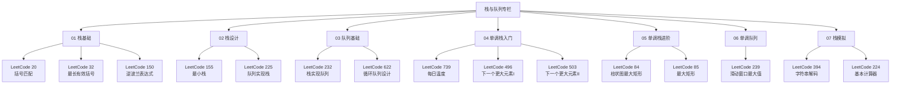

# 栈与队列专栏导览

## 专栏简介

栈（Stack）和队列（Queue）是两种最基础的线性数据结构，也是算法面试中频率最高的考察点之一。栈遵循 LIFO（Last In First Out，后进先出）原则，队列遵循 FIFO（First In First Out，先进先出）原则。掌握这两种结构的核心不仅是能调用 API，而是理解：

1. **何时选用栈**：需要"撤销最近操作"、"匹配最近打开的符号"、"追踪当前嵌套层级"时，栈是自然选择
2. **何时选用队列**：需要"按到达顺序处理"、"维护滑动窗口"、"BFS 广度优先搜索"时，队列是核心工具
3. **单调栈/单调队列**：在栈与队列的约束之上，额外维护"单调性"，用 $O(n)$ 的摊还代价解决朴素方法需要 $O(n^2)$ 甚至 $O(n^3)$ 的范围查询问题

本专栏覆盖 LeetCode 上最高频的栈与队列题目，从基础到进阶，系统讲解每一类题型的思维模式与代码实现。

---

## 题目全景

本专栏覆盖以下 15 道高频题目：

| 编号 | 题目 | 分类 | 难度 |
|------|------|------|------|
| LeetCode 20  | Valid Parentheses（有效的括号）| 栈基础 | 简单 |
| LeetCode 32  | Longest Valid Parentheses（最长有效括号）| 栈基础 | 困难 |
| LeetCode 150 | Evaluate Reverse Polish Notation（逆波兰表达式求值）| 栈基础 | 中等 |
| LeetCode 155 | Min Stack（最小栈）| 栈设计 | 中等 |
| LeetCode 225 | Implement Stack using Queues（用队列实现栈）| 设计 | 简单 |
| LeetCode 232 | Implement Queue using Stacks（用栈实现队列）| 设计 | 简单 |
| LeetCode 622 | Design Circular Queue（设计循环队列）| 队列设计 | 中等 |
| LeetCode 739 | Daily Temperatures（每日温度）| 单调栈 | 中等 |
| LeetCode 496 | Next Greater Element I（下一个更大元素 I）| 单调栈 | 简单 |
| LeetCode 503 | Next Greater Element II（下一个更大元素 II）| 单调栈 | 中等 |
| LeetCode 84  | Largest Rectangle in Histogram（柱状图中最大的矩形）| 单调栈 | 困难 |
| LeetCode 85  | Maximal Rectangle（最大矩形）| 单调栈 | 困难 |
| LeetCode 239 | Sliding Window Maximum（滑动窗口最大值）| 单调队列 | 困难 |
| LeetCode 394 | Decode String（字符串解码）| 栈模拟 | 中等 |
| LeetCode 224 | Basic Calculator（基本计算器）| 栈模拟 | 困难 |

---

## 专栏目录



---

## 各篇文章简介

### [[01 栈的基础应用：括号匹配、最长有效括号与逆波兰表达式]]

栈最经典的应用场景是"匹配"——判断括号是否合法、求最长合法括号子串、计算逆波兰表达式。这三道题覆盖了栈的入栈出栈核心操作，以及用下标栈（不是字符栈）处理范围问题的技巧。

### [[02 栈的设计题：最小栈与用队列模拟栈]]

最小栈（LeetCode 155）要求在普通栈操作之外，支持 $O(1)$ 的 `getMin()` 查询——这需要一个辅助栈同步追踪最小值。LeetCode 225 则考察用队列实现栈，理解两种数据结构的"互相模拟"本质。

### [[03 队列基础：用栈实现队列与循环队列设计]]

LeetCode 232 用两个栈（"输入栈"和"输出栈"）实现队列，摊还分析每次操作的均摊时间复杂度是 $O(1)$。LeetCode 622 循环队列考察数组实现时的下标取模技巧，是面试中常见的设计题。

### [[04 单调栈入门：每日温度与下一个更大元素]]

单调栈是本专栏最重要的技术。用一个"从底到顶单调递减"的栈，$O(n)$ 时间内求出每个元素的"下一个更大元素"。LeetCode 739、496、503 三道题从不同角度反复练习这一模式。

### [[05 单调栈进阶：柱状图中最大矩形]]

LeetCode 84（柱状图最大矩形）和 85（最大矩形）是单调栈的终极考题，也是面试中最难的栈题。核心思想：用单调递增栈维护柱子的"左边界"，在弹栈时计算以当前柱子为高度的最大矩形面积。

### [[06 单调队列：滑动窗口最大值]]

LeetCode 239（滑动窗口最大值）是单调队列的标准题，要求 $O(n)$ 时间内求出所有大小为 $k$ 的窗口的最大值。用双端队列（Deque）维护窗口内的单调递减序列，是单调队列最经典的应用。

### [[07 字符串嵌套解码与基本计算器]]

LeetCode 394（字符串解码）和 LeetCode 224（基本计算器）都是用栈处理"嵌套结构"的典型题——前者是 `k[encoded_string]` 格式的递归展开，后者是带括号的四则运算表达式求值。

---

## 专栏学习路径建议

```
初学者路线: 20 → 150 → 155 → 232 → 739 → 496 → 394
进阶路线:   32 → 503 → 84 → 239 → 224
完整通关:   按专栏顺序 01 → 07
```

> [!info] 单调栈是重点
> 本专栏 7 篇中有 3 篇（04、05、06）围绕单调栈/单调队列展开。这不是偶然——单调栈是算法面试中"性价比"最高的技术之一：模板固定、代码量少、能解决大量"范围最值"问题。建议在 04 篇打好基础后，重点攻克 05 和 06。
