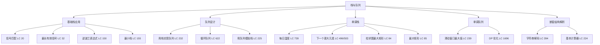

# 字符串嵌套解码与基本计算器：栈处理嵌套结构的终极范式

## 摘要

本篇是栈与队列专栏的收尾篇，以两道经典题收尾：LeetCode 394（Decode String）和 LeetCode 224（Basic Calculator）。它们共同揭示了栈处理嵌套结构的通用范式：**遇到开括号时，将当前状态压栈以"保存现场"；遇到闭括号时，弹栈以"恢复现场"，然后在恢复的状态上继续处理**。掌握这个范式，括号匹配、嵌套解析、递归求值等一类问题都可以用同一套思维框架解决。篇末附有专栏全局复习：题目索引、高频考点、学习路径与下一步建议。

---

## 第 1 章 LeetCode 394：字符串解码

### 1.1 题目

**LeetCode 394 - Decode String**（中等）

给定一个编码字符串，按规则解码并返回结果：`k[encoded_string]` 表示将 `encoded_string` 重复 `k` 次。数字 `k` 可以是多位数，嵌套可以有多层。

```
"3[a]2[bc]"     → "aaabcbc"
"3[a2[c]]"      → "accaccacc"
"2[abc]3[cd]ef" → "abcabccdcdcdef"
```

约束：数字只出现在 `[` 前，字母只出现在方括号内或方括号外（不会有数字紧跟字母的情况如 `3a`），输入字符串保证合法。

### 1.2 思路推导

**递归思路**：`3[a2[c]]` 的含义是：解码 `a2[c]`，然后重复 3 次。解码 `a2[c]` 又需要解码 `c` 重复 2 次——这是一个递归结构，每遇到 `[` 就"下一层"，遇到 `]` 就"上一层"。

**用栈模拟递归**：递归和栈本质等价。用两个栈：
- `countStack`：保存当前层的重复次数 `k`
- `stringStack`：保存当前层在遇到 `[` 之前已经构建好的字符串

**逐字符处理规则**：

| 当前字符 | 操作 |
|---------|------|
| 数字 | 累积多位数：`num = num * 10 + digit` |
| `[` | 将当前 `num` 和 `current` 分别压入 `countStack` 和 `stringStack`；重置 `num=0, current=""` |
| `]` | 弹出 `count` 和 `prev`；`current = prev + current.repeat(count)` |
| 字母 | 直接追加到 `current` |

### 1.3 代码实现

```java
public String decodeString(String s) {
    Deque<Integer> countStack = new ArrayDeque<>();  // 保存重复次数
    Deque<StringBuilder> stringStack = new ArrayDeque<>(); // 保存上一层字符串
    
    StringBuilder current = new StringBuilder(); // 当前层正在构建的字符串
    int num = 0; // 当前累积的数字
    
    for (char c : s.toCharArray()) {
        if (Character.isDigit(c)) {
            // 累积多位数
            num = num * 10 + (c - '0');
        } else if (c == '[') {
            // 保存现场：当前 num 和 current 压栈
            countStack.push(num);
            stringStack.push(current);
            // 重置，准备处理下一层
            num = 0;
            current = new StringBuilder();
        } else if (c == ']') {
            // 恢复现场：弹出重复次数和上一层字符串
            int count = countStack.pop();
            StringBuilder prev = stringStack.pop();
            // current 重复 count 次，拼接到 prev 后面
            for (int i = 0; i < count; i++) {
                prev.append(current);
            }
            current = prev; // 恢复为上一层
        } else {
            // 普通字母，追加到当前层
            current.append(c);
        }
    }
    
    return current.toString();
}
```

### 1.4 逐步模拟

```
s = "3[a2[c]]"
字符处理过程：

'3': num=3
'[': 压栈 count=3, prev=""; num=0, current=""
'a': current="a"
'2': num=2
'[': 压栈 count=2, prev="a"; num=0, current=""
'c': current="c"
']': 弹出 count=2, prev="a"
    current = "a" + "c"*2 = "acc"
    current="acc"
']': 弹出 count=3, prev=""
    current = "" + "acc"*3 = "accaccacc"
    current="accaccacc"

结果: "accaccacc" ✓
```

### 1.5 细节分析

**为什么需要 `StringBuilder` 而不是 `String`**？`String` 是不可变的，每次 `+=` 都会创建新对象，在重复次数大、字符串长时会产生大量临时对象。`StringBuilder` 在内部使用可变 char 数组，`append` 操作是 $O(1)$ 摊还。

**为什么 `stringStack` 存 `StringBuilder`？**  
`stringStack.push(current)` 之后立刻 `current = new StringBuilder()`，所以栈中的 `current` 和新的 `current` 指向不同对象，互不影响。如果 `current` 是 `String` 类型也没问题（String 不可变），但 `StringBuilder` 性能更好。

**复杂度**：设输出字符串长度为 $m$，时间 $O(m)$（每个字符最多处理常数次），空间 $O(m)$（栈中保存的字符串总长不超过 $m$）。

---

## 第 2 章 LeetCode 224：基本计算器

### 2.1 题目

**LeetCode 224 - Basic Calculator**（困难）

给你一个字符串表达式 `s`，请你实现一个基本计算器来计算并返回它的值。字符串中包含：
- 非负整数（可能是多位数）
- `+`、`-` 运算符
- `(`、`)` 括号
- 空格（需要跳过）

**不含**乘除法，不含负数直接出现（但括号内可以通过 `-` 间接产生负值，如 `1 - (2 + 3)` = `-4`）。

```
"1 + 1"               → 2
" 2-1 + 2 "           → 3
"(1+(4+5+2)-3)+(6+8)" → 23
```

### 2.2 思路推导

不含括号时，逐字符扫描，用 `result` 累积结果、`sign` 记录当前符号（`+1` 或 `-1`）、`num` 累积当前数字即可：

```
result += sign * num
```

**括号的处理**：括号的作用是"括号内的子表达式先算，结果作为一个整体"。遇到 `(` 时，括号外的部分已经算到一半，需要先"暂停"：把当前的 `result` 和 `sign` 压栈保存，重置 `result=0, sign=1`，在括号内重新开始计算。遇到 `)` 时，括号内的结果已经算完（保存在 `result`），弹出括号前的 `result_prev` 和 `sign_prev`，用 `result = result_prev + sign_prev * result` 恢复。

**逐字符处理规则**：

| 当前字符 | 操作 |
|---------|------|
| 数字 | 累积多位数：`num = num * 10 + digit` |
| `+` | 结算：`result += sign * num`；`sign=1, num=0` |
| `-` | 结算：`result += sign * num`；`sign=-1, num=0` |
| `(` | 压栈 `result` 和 `sign`；`result=0, sign=1` |
| `)` | 结算：`result += sign * num`；弹出 `sign_prev` 和 `result_prev`；`result = result_prev + sign_prev * result`；`num=0` |
| 空格 | 跳过 |

> [!warning] 关键：遇到运算符和 `)` 前都需要先结算当前数字
> 当前 `num` 只有在遇到运算符、`)` 或字符串末尾时才被加入 `result`。遇到 `(` 时 `num` 必定为 0（因为题目保证括号前是运算符，如 `1+(2+3)` 中 `(` 前是 `+`，触发了 `sign` 更新时 `num` 已结算）。

### 2.3 代码实现

```java
public int calculate(String s) {
    Deque<Integer> stack = new ArrayDeque<>(); // 保存括号前的 [result, sign]
    int result = 0;
    int sign = 1; // 当前符号，1 表示 +，-1 表示 -
    int num = 0;
    
    for (int i = 0; i < s.length(); i++) {
        char c = s.charAt(i);
        
        if (Character.isDigit(c)) {
            // 累积多位数
            num = num * 10 + (c - '0');
        } else if (c == '+') {
            result += sign * num;
            sign = 1;
            num = 0;
        } else if (c == '-') {
            result += sign * num;
            sign = -1;
            num = 0;
        } else if (c == '(') {
            // 保存现场
            stack.push(result);   // 先压 result
            stack.push(sign);     // 再压 sign（在栈顶）
            // 重置，开始计算括号内的子表达式
            result = 0;
            sign = 1;
            num = 0;
        } else if (c == ')') {
            // 结算括号内最后一个数字
            result += sign * num;
            num = 0;
            // 恢复现场：弹出括号前的 sign 和 result
            int prevSign = stack.pop();
            int prevResult = stack.pop();
            // 括号整体结果 = 括号前结果 + 括号前符号 * 括号内结果
            result = prevResult + prevSign * result;
        }
        // 空格：跳过（无需处理）
    }
    
    // 处理最后一个数字（字符串末尾没有运算符触发结算）
    result += sign * num;
    
    return result;
}
```

### 2.4 逐步模拟

```
s = "(1+(4+5+2)-3)+(6+8)"

i=0, '(': 压栈 result=0, sign=1; result=0, sign=1, num=0
i=1, '1': num=1
i=2, '+': result=0+1*1=1; sign=1, num=0
i=3, '(': 压栈 result=1, sign=1; result=0, sign=1, num=0
i=4, '4': num=4
i=5, '+': result=0+1*4=4; sign=1, num=0
i=6, '5': num=5
i=7, '+': result=4+1*5=9; sign=1, num=0
i=8, '2': num=2
i=9, ')': result=9+1*2=11; num=0
    弹出 prevSign=1, prevResult=1
    result = 1 + 1*11 = 12
i=10, '-': result=12+1*0=12 (num=0, 无事发生); sign=-1, num=0
i=11, '3': num=3
i=12, ')': result=12+(-1)*3=9; num=0
    弹出 prevSign=1, prevResult=0
    result = 0 + 1*9 = 9
i=13, '+': result=9+1*0=9; sign=1, num=0
i=14, '(': 压栈 result=9, sign=1; result=0, sign=1, num=0
i=15, '6': num=6
i=16, '+': result=0+1*6=6; sign=1, num=0
i=17, '8': num=8
i=18, ')': result=6+1*8=14; num=0
    弹出 prevSign=1, prevResult=9
    result = 9 + 1*14 = 23

末尾: result=23+1*0=23

结果: 23 ✓
```

### 2.5 关于 LeetCode 227 和 772 的扩展

| 题目 | 运算符 | 复杂度 |
|------|-------|-------|
| LeetCode 224 | `+`, `-`, `(`, `)` | 一个栈，两个变量 |
| LeetCode 227（Basic Calculator II）| `+`, `-`, `*`, `/`，无括号 | 一个栈，处理优先级 |
| LeetCode 772（Basic Calculator III）| 全部 | 递归或双栈 |

LeetCode 227（含乘除但无括号）的核心思路：遇到 `+/-` 时直接结算，遇到 `*/` 时弹出上一个数字并乘除后压回（乘除优先级高于加减，必须立刻计算）。

---

## 第 3 章 两道题的共同模式

### 3.1 "保存现场，恢复现场"——栈处理嵌套的通用范式

LeetCode 394 和 224 都遵循同一个结构：

```
遇到 '[' 或 '(':
  1. 将"当前层的状态"压栈（字符串/结果和符号/其他上下文）
  2. 重置状态，开始处理"下一层（嵌套内部）"

遇到 ']' 或 ')':
  1. 完成"当前层的处理"（结算最后一个元素）
  2. 弹出"上一层的状态"
  3. 将当前层的结果合并到上一层状态中
```

这个模式和**递归**完全对应：`[`/`(` 是递归调用，`]`/`)` 是递归返回。栈只是将隐式的递归调用栈显式化了。

**判断何时需要这个模式**：  
> 当问题包含嵌套括号，且括号内的子问题结果需要以某种方式"合并"到括号外的结果时，就可以用"压栈保存外层状态"的方式处理。

### 3.2 模式在其他题目中的出现

| 题目 | 嵌套来源 | 压栈的状态 |
|------|---------|---------|
| LeetCode 394（解码字符串）| `k[...]` 嵌套 | `(num, 已构建字符串)` |
| LeetCode 224（基本计算器）| `(...)` 括号 | `(result, sign)` |
| LeetCode 856（括号分数）| `(...)` 括号 | `当前分数` |
| LeetCode 1190（反转每对括号间的子串）| `(...)` 括号 | `当前字符串` |

---

## 第 4 章 专栏总复习

本章是**栈与队列专栏**的全局总结。

### 4.1 专栏题目索引

| 篇数 | 主题 | 题目 | 核心知识点 |
|------|------|------|----------|
| 01 | 栈的基础应用 | LC 20 括号匹配 | 配对模型 |
| 01 | 栈的基础应用 | LC 32 最长有效括号 | 下标差值 |
| 01 | 栈的基础应用 | LC 150 逆波兰表达式 | 操作数/运算符分流 |
| 02 | 栈的设计题 | LC 155 最小栈 | 辅助栈，同步最小值 |
| 02 | 栈的设计题 | LC 225 用队列模拟栈 | 双队列轮换或单队列旋转 |
| 03 | 队列基础 | LC 232 用栈实现队列 | 双栈摊还 $O(1)$ |
| 03 | 队列基础 | LC 622 循环队列 | Ring Buffer，`(head+size)%cap` |
| 04 | 单调栈入门 | LC 739 每日温度 | 单调递减栈，弹栈记录差值 |
| 04 | 单调栈入门 | LC 496 下一个更大元素 I | 哈希表配合 |
| 04 | 单调栈入门 | LC 503 下一个更大元素 II | 循环数组，下标取模 |
| 05 | 单调栈进阶 | LC 84 柱状图最大矩形 | 弹栈时结算，左中右三点 |
| 05 | 单调栈进阶 | LC 85 最大矩形（二维）| 逐行累计高度，调用 84 |
| 06 | 单调队列 | LC 239 滑动窗口最大值 | 双端队列，队头最大，摊还 $O(n)$ |
| 07 | 嵌套结构 | LC 394 字符串解码 | 压栈保存现场，弹栈恢复现场 |
| 07 | 嵌套结构 | LC 224 基本计算器 | 括号内重置，括号后合并 |

### 4.2 高频考点与面试建议

**高频 TOP 5**（出现在国内外大厂面试题库中）：

1. **LeetCode 20 括号匹配**：几乎 100% 出现在面试的"热身"阶段，3 分钟内写出来是基本要求
2. **LeetCode 739 每日温度**：单调栈最高频考题，要求现场推导思路，不只背模板
3. **LeetCode 155 最小栈**：设计题，考察"空间换时间"思维
4. **LeetCode 84 柱状图最大矩形**：困难题中出现频率最高的，是单调栈掌握程度的分水岭
5. **LeetCode 239 滑动窗口最大值**：高频实战题，考察单调队列和摊还分析

**面试中最容易翻车的点**：
- LeetCode 32：需要用下标差值（`i - stack.peek()`），不是直接的高度
- LeetCode 84：哨兵的使用，以及弹栈时"左边界是新栈顶"的理解
- LeetCode 394：`num = num * 10 + digit` 处理多位数；`stringStack` 存 `StringBuilder` 时注意引用语义
- LeetCode 224：字符串末尾要记得 `result += sign * num`

### 4.3 知识图谱



### 4.4 学习路径建议

**如果你是零基础**：先从 LC 20 → LC 155 → LC 232 开始，理解栈和队列的基本性质，再进入单调栈。

**如果你有一定基础**：从 LC 739 入手单调栈，理解"弹栈时结算"后再解 LC 84，用 LC 239 掌握单调队列，最后用 LC 394/224 收尾。

**如果准备面试**：TOP 5 的题目（20/739/155/84/239）必须做到"闭卷 10 分钟写出"的熟练度；每道题都要准备一套"思路讲解 → 代码实现 → 复杂度分析"的完整口述。

**进阶方向**：
- 单调栈 → [[接雨水 LC 42]]（单调递减栈）、[[去除重复字母 LC 316]]（单调栈 + 贪心）
- 单调队列 → DP 优化（[[LeetCode 862]]、[[LeetCode 918]]）
- 嵌套解析 → [[LeetCode 772]]（完整计算器，含乘除和括号）、[[LeetCode 1190]]

---

## 专栏后记

**栈与队列专栏**至此完结。本专栏从基础应用出发，经过设计题、单调栈、单调队列，到最后的嵌套结构解析，系统覆盖了这一数据结构在算法面试中的全部高频场景。

栈和队列看起来简单，但真正的难点不在于"用栈还是用队列"，而在于：
- **什么时候压栈，什么时候弹栈**（单调栈的判断条件）
- **弹栈时能获取到什么信息**（左边界、右边界、上下文状态）
- **如何通过保存/恢复状态来处理嵌套**（递归 ↔ 栈的等价转换）

理解了这三点，就理解了栈这个数据结构在算法层面的本质。

---

> 如果你觉得本专栏对你有帮助，欢迎探索知识库中的其他专栏：
> - [[数组与链表]] — 双指针、滑动窗口、前缀和
> - [[树与图]] — DFS/BFS、树的遍历、拓扑排序  
> - [[动态规划]] — 线性 DP、区间 DP、背包问题
