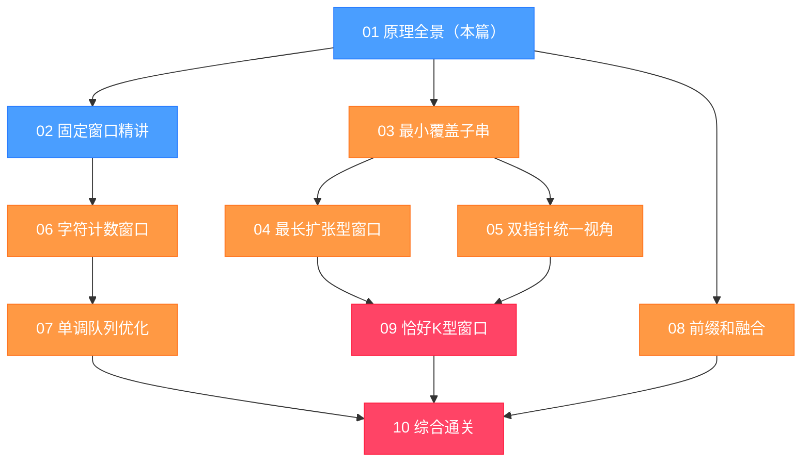

# 滑动窗口算法原理全景：从暴力枚举到 $O(n)$ 的思维跃迁

## 摘要

滑动窗口是解决"连续子数组/子字符串"类问题的核心利器。它不是一个具体的算法，而是一种**思维范式**——通过维护一个动态移动的区间，把看似需要枚举所有子区间的 $O(n^2)$ 甚至 $O(n^3)$ 问题，降低到 $O(n)$。本文不讲具体题目，而是系统梳理滑动窗口的**本质逻辑与演进推导**：为什么暴力枚举低效、窗口思想是如何自然涌现的、固定窗口与可变窗口的本质区别是什么、通用模板框架如何推导，以及这套思维范式的边界与局限。

---

## 第 1 章 从暴力枚举说起：子区间问题的天然低效

### 1.1 子区间问题的通用形式

面试中遇到"子数组"或"子字符串"相关的问题，往往是这样一类形式：

> 给定一个数组（或字符串）$A$，找到满足某个条件 $P$ 的**连续子区间** $A[l..r]$，使得某个目标函数 $f(A[l..r])$ 取得最大/最小值，或统计满足条件的子区间个数。

比如：
- 长度为 $k$ 的子数组中，元素之和最大的是哪个？
- 所有字符都不重复的子字符串，最长能有多长？
- 包含特定字符集合的最短子字符串是哪个？

这类问题的共同特征是：**答案藏在所有连续子区间中的某一个（或某几个）里**。

### 1.2 暴力枚举的代价

最朴素的思路是枚举所有子区间。一个长度为 $n$ 的数组，其连续子区间由左端点 $l$ 和右端点 $r$ 确定，共有 $\frac{n(n+1)}{2}$ 个子区间，数量是 $O(n^2)$ 级别的。

对每个子区间再做一次 $O(n)$ 的计算（比如求和、统计字符），总时间复杂度达到 $O(n^3)$。即使预先计算前缀和，可以把每次区间计算降到 $O(1)$，枚举依然是 $O(n^2)$ 的。

```java
// 暴力枚举：求长度为 k 的子数组最大和
int maxSumBrute(int[] nums, int k) {
    int n = nums.length;
    int maxSum = Integer.MIN_VALUE;
    for (int l = 0; l <= n - k; l++) {          // 枚举左端点
        int sum = 0;
        for (int r = l; r < l + k; r++) {        // 计算区间和：O(k)
            sum += nums[r];
        }
        maxSum = Math.max(maxSum, sum);
    }
    return maxSum;
}
// 时间复杂度：O(n*k)，当 k 接近 n 时退化为 O(n²)
```

**$O(n^2)$ 到底有多慢？** 当 $n = 10^5$ 时，$O(n^2) = 10^{10}$ 次操作，在普通机器上大约需要 10 秒以上——远超面试题通常的 1 秒时间限制。

> [!info] 核心概念：LeetCode 的时间限制经验值
> LeetCode 的评测机每秒大约能跑 $10^8$ 次简单操作。当 $n = 10^5$ 时，$O(n \log n)$ 约 $1.7 \times 10^6$ 次，远在安全范围内；$O(n^2)$ 约 $10^{10}$ 次，必然超时。面试时，一旦题目给出 $n \leq 10^5$，就应该立即意识到需要 $O(n \log n)$ 或 $O(n)$ 的解法。

### 1.3 暴力法的冗余在哪里

分析暴力枚举为何低效，关键在于找到**重复计算**。

以求长度为 $k$ 的子数组最大和为例。暴力法的过程：
1. 计算 $A[0..k-1]$ 的和：$a_0 + a_1 + \cdots + a_{k-1}$
2. 计算 $A[1..k]$ 的和：$a_1 + a_2 + \cdots + a_k$
3. 计算 $A[2..k+1]$ 的和：$a_2 + a_3 + \cdots + a_{k+1}$

观察两次相邻计算：$A[1..k]$ 与 $A[0..k-1]$ 相比，新增了 $a_k$，去掉了 $a_0$，中间的 $a_1, \ldots, a_{k-1}$ 被**重复计算了两次**。

这就是症结所在：每次移动一个位置，大量元素的处理是重复的。如果我们能从上一次的结果**增量更新**得到下一次的结果，每次只处理一个元素的进和出，就能把 $O(k)$ 的区间计算变成 $O(1)$。

这正是滑动窗口思想的核心：**用增量更新替代全量重算**。

---

## 第 2 章 滑动窗口的核心抽象

### 2.1 "窗口"是什么

"窗口"这个词来自日常生活中滑动的玻璃窗——它是一个固定大小的开口，可以在一面墙上左右移动，每次展示一段连续的内容。在算法中，"窗口"就是数组（或字符串）上的**一段连续子区间 $[left, right]$**，由两个指针 `left` 和 `right` 界定。

"滑动"是指这个区间在数组上从左到右移动。每一步，窗口的右端点 `right` 向右扩展（新元素进入窗口），或左端点 `left` 向右收缩（旧元素离开窗口），或两者同时发生。

关键约束：**`left` 和 `right` 都只向右移动，不会回头**。这是滑动窗口达到 $O(n)$ 时间复杂度的根本保证——每个元素至多被右指针"进窗"一次，被左指针"出窗"一次，总共被处理 $O(n)$ 次。

### 2.2 窗口的状态维护

窗口不仅仅是一个区间边界，它还携带一个**状态**——描述当前窗口内容的某种统计量。这个状态在每次窗口移动时被**增量更新**，而不是从零重新计算。

常见的窗口状态：
- **整数求和**：`sum += nums[right]` 进窗，`sum -= nums[left]` 出窗
- **字符频率计数**：`freq[s.charAt(right)]++` 进窗，`freq[s.charAt(left)]--` 出窗
- **不同元素个数**：进窗时若频率从 0 变为 1，则 `distinct++`；出窗时若频率从 1 变为 0，则 `distinct--`
- **极值（最大/最小）**：无法简单增量更新，需要**单调队列**辅助（见第 07 篇）

> [!note] 设计哲学：窗口状态是滑动窗口算法的核心设计点
> 一道滑动窗口题能否被高效解决，很大程度上取决于**窗口状态能否以 $O(1)$ 的代价增量更新**。如果每次移动都需要重新扫描整个窗口来更新状态，复杂度就退化回 $O(n^2)$，失去了滑动窗口的意义。

### 2.3 固定窗口 vs 可变窗口：两种根本不同的使用场景

滑动窗口有两种截然不同的形态，面试中必须能准确识别：

**固定窗口**：窗口的大小 $k$ 是题目给定的常量，不随窗口内容改变。每次移动，右指针向右扩展一步，左指针同步向右收缩一步，窗口大小始终维持在 $k$。

**可变窗口**：窗口的大小由当前窗口内容是否"合法"决定。右指针持续向右扩展；当窗口不合法时，左指针向右收缩，直到窗口重新合法。不同题目对"合法"的定义不同，这是可变窗口最需要思考的部分。

| 维度 | 固定窗口 | 可变窗口 |
|------|----------|----------|
| 窗口大小 | 常量 $k$ | 动态变化 |
| 左指针移动 | 与右指针同步，每次移动 1 | 按需收缩，可能移动多次 |
| 典型问题 | 求大小为 $k$ 的子数组的最大/平均值 | 求满足条件的最长/最短子区间 |
| 难点 | 极值维护（需单调队列） | 收缩条件的判断 |

---

## 第 3 章 固定窗口：增量更新的精妙

### 3.1 固定窗口的框架推导

以"求长度为 $k$ 的子数组最大和"为例，推导固定窗口的通用框架。

**初始化阶段**：先将前 $k$ 个元素放入窗口，计算初始状态。

**滑动阶段**：右指针从 $k$ 开始向右移动。每次移动时：
1. `nums[right]` 进入窗口：更新状态
2. `nums[left]` 离开窗口，`left++`：更新状态
3. 窗口大小仍为 $k$，记录或更新答案

```java
int maxSumFixed(int[] nums, int k) {
    int n = nums.length;
    int sum = 0;

    // 初始化：计算前 k 个元素的和
    for (int i = 0; i < k; i++) {
        sum += nums[i];
    }
    int maxSum = sum;

    // 滑动：right 从 k 到 n-1，每次右进左出
    for (int right = k; right < n; right++) {
        sum += nums[right];          // 新元素进窗
        sum -= nums[right - k];      // 旧元素（left = right - k）出窗
        maxSum = Math.max(maxSum, sum);
    }
    return maxSum;
}
// 时间复杂度：O(n)，空间复杂度：O(1)
```

与暴力法相比，每次移动只做了 2 次加减法（1 次加法进窗，1 次减法出窗），而不是重新求 $k$ 个元素的和。**增量更新**把 $O(k)$ 的操作变成了 $O(1)$。

### 3.2 固定窗口的"出窗元素"计算

注意上面代码中一个细节：`sum -= nums[right - k]`，而不是 `sum -= nums[left]`。

当 `right` 处于位置 $i$ 时，窗口应该是 $[i - k + 1, i]$，出窗的是 $nums[i - k]$，即 $nums[right - k]$。

这是固定窗口中一个常见的索引关系。也可以用显式的 `left` 指针来写，效果等价但更清晰：

```java
int left = 0;
for (int right = 0; right < n; right++) {
    sum += nums[right];
    if (right >= k - 1) {                    // 窗口已满时才处理
        maxSum = Math.max(maxSum, sum);
        sum -= nums[left++];                 // 出窗，同时 left 后移
    }
}
```

两种写法都是正确的，第二种逻辑更连贯，推荐在面试中使用。

### 3.3 固定窗口难在哪里：极值维护的困境

固定窗口看起来很简单，但有一类问题会让它陷入困境：**求窗口内的最大值（或最小值）**。

当 `nums[right]` 进窗时，更新最大值很容易：`maxVal = Math.max(maxVal, nums[right])`。

但当 `nums[left]` 出窗时，如果出窗的恰好是当前最大值，新的最大值是多少？必须重新扫描整个窗口，这需要 $O(k)$ 的时间，整体复杂度退化回 $O(nk)$。

这个问题无法用简单的增量更新解决，需要引入**单调双端队列**（Monotone Deque），将每次操作降回 $O(1)$ 均摊，这是第 07 篇的主题。

---

## 第 4 章 可变窗口：收缩时机的逻辑

### 4.1 为什么可变窗口更难

可变窗口比固定窗口难，核心难在**收缩条件的判断**：
- 什么时候窗口是"合法"的？
- 什么时候应该收缩？
- 收缩之后，还要继续收缩吗？

不同的题目，"合法"的定义千差万别：
- "窗口内所有字符出现次数都 ≥ 1"：适用于最小覆盖子串
- "窗口内不存在重复字符"：适用于最长无重复字符子串
- "窗口内 0 的个数 ≤ k"：适用于翻转 k 个 0 后的最长连续 1

### 4.2 可变窗口的通用框架

```java
int left = 0;
// 窗口状态：根据具体题目定义
for (int right = 0; right < n; right++) {
    // 步骤 1：right 元素进窗，更新窗口状态
    add(nums[right]);

    // 步骤 2：检查窗口合法性，不合法则收缩
    while (窗口不合法) {
        remove(nums[left]);   // left 元素出窗，更新窗口状态
        left++;
    }

    // 步骤 3：此时窗口合法，更新答案
    answer = Math.max(answer, right - left + 1);  // 或其他逻辑
}
```

这个框架的正确性依赖一个关键性质：**右指针扩展后，如果窗口不合法，只需要向右移动左指针（而不是右指针）就能让窗口重新合法**。换句话说，收缩左边界总能"解决问题"。

这个性质并不是所有子区间问题都满足的，只有当"合法性"关于左端点有单调性时（即：如果 $[l, r]$ 不合法，那么 $[l, r+1]$、$[l, r+2]$ 也不合法；但 $[l+1, r]$ 可能合法），可变窗口才能正确工作。

### 4.3 "最长"与"最短"的答案更新位置

可变窗口有两种常见的问题形式，答案的更新位置不同：

**求最长合法子区间**：while 循环结束后（窗口合法时）更新答案。

```java
// 求最长：在 while 循环之后更新
while (窗口不合法) { remove(nums[left++]); }
answer = Math.max(answer, right - left + 1);  // 合法窗口，更新最长
```

**求最短合法子区间**：while 循环内部更新答案（每次收缩前窗口都合法，记录当前合法窗口的大小）。

```java
// 求最短：在 while 循环内部更新
while (窗口合法) {
    answer = Math.min(answer, right - left + 1);  // 合法，记录候选答案
    remove(nums[left++]);  // 尝试继续收缩
}
```

> [!warning] 生产避坑：答案更新位置决定正确性
> 这是可变窗口最容易出错的地方。求最短时，答案要在 `while` 循环**内**更新；求最长时，答案要在 `while` 循环**后**更新。混淆这两点会导致答案遗漏或错误。每次写题前先明确：我在求最长还是最短？

---

## 第 5 章 时间复杂度证明：为什么是 $O(n)$

### 5.1 均摊分析

滑动窗口的时间复杂度是 $O(n)$，用**均摊分析**可以严格证明：

- `right` 指针从 0 移动到 $n-1$，总共移动 $n$ 次
- `left` 指针从 0 开始，只向右移动，且 `left ≤ right`，因此 `left` 的移动次数 ≤ $n$ 次
- 每次 `right` 或 `left` 移动时，做 $O(1)$ 的工作（假设窗口状态的增量更新是 $O(1)$）

因此，总的操作次数是 $O(n) + O(n) = O(n)$。

这个证明的关键前提是：**每个元素最多被 `right` 指针访问一次（进窗），被 `left` 指针访问一次（出窗）**，共 $2n$ 次访问，故为 $O(n)$。

### 5.2 什么情况下滑动窗口会退化

如果窗口状态的增量更新不是 $O(1)$，而是 $O(k)$，那么整体复杂度会退化到 $O(nk)$。常见的退化场景：

- **维护窗口最大值/最小值，但用线性扫描**：每次出窗后扫描整个窗口找新的最大值，$O(k)$ 一次，总体 $O(nk)$
- **哈希表的某些操作退化**：在极端情况下哈希冲突，但这在实际中罕见

解决方案是引入合适的数据结构（单调队列、有序集合等），把 $O(k)$ 的操作摊还回 $O(1)$。

### 5.3 与前缀和的时间复杂度比较

前缀和也是处理子数组求和的经典技法，同样可以 $O(1)$ 查询任意区间的和，预处理 $O(n)$，查询 $O(1)$。

| 方法 | 预处理 | 单次查询 | 适用场景 |
|------|--------|----------|----------|
| 暴力枚举 | $O(1)$ | $O(k)$ | $n$ 很小 |
| 前缀和 | $O(n)$ | $O(1)$ | 需要频繁查询任意区间 |
| 滑动窗口 | $O(1)$ | — | 子区间问题，有单调性 |

前缀和和滑动窗口不是对立关系，而是互补关系：前缀和适合"查任意区间"，滑动窗口适合"在满足约束的前提下找最优区间"。有些题目甚至需要两者结合（见第 08 篇）。

---

## 第 6 章 适用范围与边界：不是所有问题都能用滑动窗口

### 6.1 滑动窗口的适用条件

滑动窗口能正确工作，需要满足一个本质条件：**问题对于区间具有单调性**。

具体来说：
- 当右端点固定时，左端点越小，窗口越"宽松"（或越"紧"），且这种单调性是一致的
- 当添加右端点导致窗口"超标"时，只通过增加左端点（收缩窗口）就能让窗口"达标"

**正例**：最长无重复字符子串。当右端点固定，加入新字符后出现重复，收缩左边界一定能消除重复。✅

**反例**：找子数组中元素之积等于某个特定值 $K$（而非 ≤ $K$）。当乘积 > K 时，收缩左边界可以让乘积变小，但不能精确控制等于 $K$，窗口的合法性没有单调性。❌（需要哈希或前缀积，不能用窗口）

### 6.2 常见的误用场景

**误用一：子数组中绝对值和**。负数的存在破坏了单调性——加入一个负数，和反而减小；去掉一个负数，和反而增大，"合法"的判断没有单调性。❌

**误用二：子数组中所有元素都是某个质数**。进入一个非质数元素后，如何让窗口只包含质数？只能收缩右边界（不进），而不是收缩左边界，这不符合滑动窗口的左进右出框架。❌

**误用三：不连续的子序列**。滑动窗口只适用于**连续**子区间，对于子序列（可以不连续的）问题，通常需要动态规划。❌

> [!warning] 生产避坑：单调性是使用滑动窗口的充要条件
> 看到"子数组/子字符串 + 最长/最短/个数"时，先判断问题是否有单调性。如果有，用滑动窗口；如果没有（如存在负数的最大子数组和），不能用滑动窗口，需要考虑动态规划（[[Kadane 算法]]）或前缀和 + 排序等技法。

### 6.3 滑动窗口与动态规划的边界

很多子数组问题，既可以用滑动窗口，也可以用动态规划，但两者有明显的适用偏好：

- **滑动窗口**：约束条件是"窗口状态满足/不满足某个阈值"，状态可以增量维护，单调性明显
- **动态规划**：子问题之间有递推关系，"前 $i$ 个元素"的最优解可以由"前 $i-1$ 个元素"推导

典型的分界线是**负数**：当数组可以包含负数时，加入新元素可能让"窗口变好"（负数减小了和），也可能让"窗口变坏"，单调性被打破，需要 DP；当数组全为正数/非负数时，单调性通常成立，可以用滑动窗口。

---

## 第 7 章 面试中的模式识别

### 7.1 识别滑动窗口题的信号词

面试题一旦出现以下关键词组合，高概率是滑动窗口：

| 信号词 | 示例 | 说明 |
|--------|------|------|
| "连续子数组/子字符串" + "最长" | 最长无重复子串 | 可变窗口，求最大窗口长度 |
| "连续子数组/子字符串" + "最短" | 最小覆盖子串 | 可变窗口，求最小窗口长度 |
| "大小为 k 的子数组" | 每个子数组中的最大值 | 固定窗口 |
| "连续子数组/子字符串" + "个数" | 乘积小于 k 的子数组个数 | 可变窗口，每次右指针移动时统计贡献 |
| "字母异位词" | 找字符串中所有字母异位词 | 固定窗口 + 字符计数 |

### 7.2 解题四步法

遇到滑动窗口题时，可以按以下四步处理：

**第一步：确认连续性**。题目要求的是连续子区间吗？如果是子序列（可以跳过元素），需要换方法。

**第二步：判断固定还是可变**。题目给出了固定的窗口大小 $k$ 吗？如果有，用固定窗口模板；如果没有，用可变窗口模板。

**第三步：定义窗口状态**。什么数据结构用来描述当前窗口的内容？计数器、哈希表、单调队列？如何在 $O(1)$ 内增量更新？

**第四步：定义合法条件与答案更新**。什么情况下窗口合法？答案在什么时候更新（收缩前还是收缩后）？

### 7.3 专栏学习路线图

本专栏 10 篇文章的学习顺序与依赖关系：



---

## 第 8 章 本专栏的设计哲学

### 8.1 为什么按"思维难度"而非"题目类型"组织

网上大多数滑动窗口教程按题目标签分类——"定长窗口一类、变长窗口一类、字符串一类"——这种分类方式的问题是，当你面对一道新题时，还是不知道该套哪个模板。

本专栏的组织逻辑是：**按思维难度和知识点的依赖关系递进**，每篇文章都在前一篇的基础上增加一个新的思维要素：

1. 固定窗口只需理解"增量更新"
2. 可变窗口需要理解"收缩条件"
3. 字符计数窗口需要理解"如何用哈希表维护字符约束"
4. 单调队列窗口需要理解"如何 $O(1)$ 维护极值"
5. 恰好 K 型窗口需要理解"差分技巧"

每篇文章只引入一个新的思维要素，保持专注度，避免认知超载。

### 8.2 关于代码实现语言

本专栏的代码示例以 Java 为主，因为面试中 Java 是最常见的语言，且 Java 的类型系统使代码意图更清晰。所有关键代码都配有逐行注释，重点说明"为什么这么写"而非"这行代码做了什么"。

对于需要用到标准库数据结构的题目，会明确指出使用 `ArrayDeque`（双端队列）、`HashMap`（哈希表）还是 `int[]`（字符频率数组），并说明选择依据。

---

## 本篇总结

本篇从暴力枚举的冗余出发，推导出滑动窗口的本质：**用增量更新替代全量重算，通过维护窗口状态把子区间问题的时间复杂度从 $O(n^2)$ 降到 $O(n)$**。

核心结论：
- **固定窗口**：每次同步移动 `left` 和 `right`，适合题目给出固定窗口大小的情形
- **可变窗口**：右指针扩展，条件不满足时左指针收缩；求最长在收缩后更新答案，求最短在收缩中更新答案
- **适用前提**：问题对区间具有单调性，即收缩/扩展窗口能单调地改善/恶化合法性

这三个结论是整个专栏的基础。后续每篇文章，都是在这个框架上处理一类具体的变体或挑战。

---

## 参考与延伸

- [[排序与查找专栏]] — 二分查找与滑动窗口的思维对照
- [[双指针算法]] — 滑动窗口是同向双指针的特殊形式
- [[前缀和与差分数组]] — 与滑动窗口互补的子数组处理技法
- [[单调队列]] — 用于解决滑动窗口内的极值维护问题

---

## 课后练习

**LeetCode 1052 - 爱生气的书店老板**（中等）

书店老板在某些时刻会生气，生气时顾客不满意。老板可以利用一个秘密技巧，连续 `minutes` 分钟内不生气。给你顾客数数组 `customers`、老板生气标记数组 `grumpy` 和整数 `minutes`，求老板使用技巧后能让多少顾客满意。

**提示**：固定窗口大小为 `minutes`，窗口内统计「原本不满意但因技巧变满意」的顾客数；窗口外统计「本来就满意」的顾客数；两者相加取最大。
