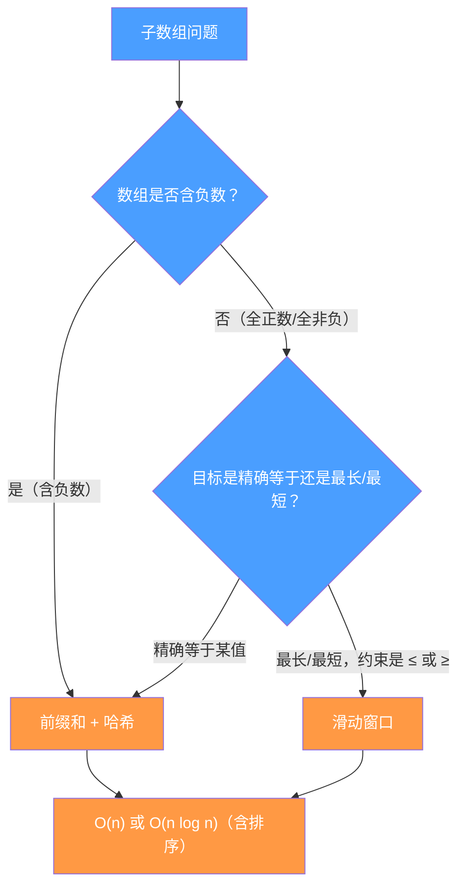

# 前缀和与滑动窗口的思想融合：子数组求和类问题

## 摘要

滑动窗口和前缀和是处理子数组问题的两大核心技法，但它们的适用场景有本质区别：滑动窗口依赖单调性（适合正数数组的最长/最短约束），前缀和 + 哈希则适合"精确等于某个目标值"的子数组统计（无需单调性，可有负数）。本文通过 LeetCode 560（和为 K 的子数组，前缀和哈希的入门）、LeetCode 974（和可被 K 整除的子数组，前缀和 + 同余定理）、LeetCode 1248（统计优美子数组，奇数个数的前缀和计数）三道题，系统讲解前缀和哈希的思维框架，并深度分析它与滑动窗口的适用边界：什么时候选哪种，以及两者能否结合。

---

## 第 1 章 滑动窗口的局限：负数打破单调性

### 1.1 正数的单调性

前几篇反复强调：滑动窗口的正确性依赖单调性。以"子数组和 ≥ target"为例：
- 数组全为正数：扩大窗口（右指针右移），和增大；收缩窗口（左指针右移），和减小。单调性成立 ✅
- 数组包含负数：扩大窗口，和可能减小（加入负数）；收缩窗口，和可能增大（去掉负数）。单调性被打破 ❌

一旦有负数，滑动窗口就无法保证"当前窗口不合法时，收缩左指针一定能让窗口合法"。

### 1.2 "精确等于 K" vs "至少/至多 K"

另一个滑动窗口无法直接处理的情形是"子数组和**精确等于** K"（而非"至少 K"或"至多 K"）：

假设当前窗口和 = 10，K = 7，和 > K，应该收缩？收缩后和可能变成 8、6、3……，不知道是否会经过 7。如果经过 7 了我们错过了（因为只在稳定后检查），或者因为负数的存在根本无法预测收缩结果。

"精确等于"要求在整个连续子数组中找到**总和恰好为 K**的情形，这需要穷举所有子数组，而前缀和提供了一种高效穷举的方法。

### 1.3 前缀和的本质

定义前缀和 $P[i] = nums[0] + nums[1] + \cdots + nums[i-1]$（以 $P[0]=0$ 为基准）。

子数组 $[l, r]$ 的和 = $P[r+1] - P[l]$。

因此，"子数组 $[l, r]$ 的和等于 K"等价于 $P[r+1] - P[l] = K$，即 $P[l] = P[r+1] - K$。

**核心转化**：找子数组和等于 K，转化为找两个前缀和 $P[l]$ 和 $P[r+1]$，使其差为 K。这是一个"两数之差等于 K"的问题，用哈希表可以 $O(1)$ 查找。

---

## 第 2 章 LeetCode 560：和为 K 的子数组

### 2.1 题目

**LeetCode 560 - Subarray Sum Equals K**（中等）

给你一个整数数组 `nums` 和一个整数 `k`，统计并返回数组中和为 `k` 的连续子数组的数量。

```
输入：nums = [1,1,1], k = 2
输出：2（子数组 [1,1] 出现两次）

输入：nums = [1,2,3], k = 3
输出：2（子数组 [3] 和 [1,2]）
```

**注意**：`nums` 中可以有负数！

### 2.2 为什么不能用滑动窗口

示例：`nums = [1,-1,1,-1,1]`, `k = 0`。如果用滑动窗口，因为有负数，收缩和扩展的行为都不可预测，无法保证正确性。

前缀和 + 哈希是正确解法。

### 2.3 前缀和 + 哈希的思路

遍历数组，维护当前前缀和 `prefix`。在遍历到位置 `i` 时：

- 当前前缀和是 `prefix = P[i+1]`
- 我们需要找有多少个之前的前缀和 `P[l]` 满足 `P[l] = prefix - k`
- 用 `HashMap<Integer, Integer> count` 记录每个前缀和出现的次数

当遍历到 `i` 时，`count.getOrDefault(prefix - k, 0)` 就是以 `i` 为右端点的子数组和为 `k` 的数量。

```java
public int subarraySum(int[] nums, int k) {
    int prefix = 0;   // 当前前缀和
    int result = 0;
    Map<Integer, Integer> count = new HashMap<>();
    count.put(0, 1);  // 前缀和为 0 出现一次（对应空前缀，即子数组从 0 开始）

    for (int num : nums) {
        prefix += num;
        // 查找有多少个之前的前缀和 = prefix - k
        result += count.getOrDefault(prefix - k, 0);
        // 将当前前缀和加入哈希表
        count.merge(prefix, 1, Integer::sum);
    }
    return result;
}
```

**时间复杂度**：$O(n)$
**空间复杂度**：$O(n)$（最坏情况所有前缀和不同）

### 2.4 为什么要预设 `count.put(0, 1)`

`count.put(0, 1)` 表示"空前缀（$P[0]=0$）出现一次"。

考虑子数组从下标 0 开始的情形（即 $l=0$）：此时需要 $P[l] = P[0] = 0$。如果不预先在哈希表中放入 `{0: 1}`，当 `prefix == k`（即整个从 0 到 i 的子数组和恰好等于 k）时，会找不到对应的 $P[0]$，漏掉这种情况。

> [!info] 核心概念：前缀和的哨兵初始化
> `count.put(0, 1)` 是前缀和哈希的**哨兵**，对应"以 0 为左端点"的子数组。几乎所有前缀和哈希题都需要这个初始化，忘记它会导致漏掉"从数组头部开始的子数组"。

### 2.5 追踪示例

`nums = [1,1,1], k = 2`：

```
初始：count = {0: 1}, prefix = 0

num=1: prefix=1, 查 1-2=-1，count[-1]=0，result=0；count={0:1, 1:1}
num=1: prefix=2, 查 2-2=0，count[0]=1，result=1；count={0:1, 1:1, 2:1}
num=1: prefix=3, 查 3-2=1，count[1]=1，result=2；count={0:1, 1:1, 2:1, 3:1}

输出：2 ✓
```

---

## 第 3 章 LeetCode 974：和可被 K 整除的子数组

### 3.1 题目

**LeetCode 974 - Subarray Sums Divisible by K**（中等）

给定一个整数数组 `nums` 和一个整数 `k`，返回其中元素之和可被 `k` 整除的（连续、非空）子数组的数目。

```
输入：nums = [4,5,0,-2,-3,1], k = 5
输出：7
解释：所有元素之和为 5 倍数的子数组：[4,5,0,-2,-3,1],[5],[5,0],[5,0,-2,-3],[0],[0,-2,-3],[−2,−3]

输入：nums = [5], k = 9
输出：0
```

### 3.2 同余定理：将整除转化为余数相等

子数组 $[l, r]$ 的和可被 $k$ 整除，等价于 $P[r+1] - P[l] \equiv 0 \pmod{k}$，即 $P[r+1] \equiv P[l] \pmod{k}$。

**核心结论**：找子数组和可被 $k$ 整除的数量，等价于找前缀和序列中**余数相同的配对数**。

用哈希表记录每个余数出现的次数。当遍历到位置 $i$，当前前缀和 $P[i+1]$ 的余数是 `r`，那么所有之前余数也是 `r` 的前缀和，都可以与当前位置配对构成可整除子数组。配对数 = `count[r]`。

```java
public int subarraysDivByK(int[] nums, int k) {
    int prefix = 0, result = 0;
    int[] count = new int[k];  // count[r] = 余数为 r 的前缀和出现次数
    count[0] = 1;               // 空前缀的余数为 0

    for (int num : nums) {
        prefix += num;
        // Java 中负数取模可能为负，需要修正
        int mod = ((prefix % k) + k) % k;
        result += count[mod];
        count[mod]++;
    }
    return result;
}
```

**时间复杂度**：$O(n)$
**空间复杂度**：$O(k)$（count 数组大小为 k）

### 3.3 负数取模的陷阱

Java 中，`-2 % 5 = -2`（保留被除数符号），而数学意义上 $-2 \bmod 5 = 3$（结果总在 $[0, k-1]$ 范围内）。

修正方式：`((prefix % k) + k) % k`。这行代码在两种情况下都正确：
- `prefix >= 0`：`prefix % k` 已在 $[0, k-1]$，加 $k$ 再取模不改变结果
- `prefix < 0`：`prefix % k` 在 $[-(k-1), 0]$，加 $k$ 后变为 $[1, k]$，再取模得到 $[1, k-1]$ 或 $0$

> [!warning] 生产避坑：Java 中的负数取模
> Java、C++ 等语言的 `%` 运算符在负数时返回负余数，与数学取模不同。当代码中有取模操作且输入可能有负数时，必须加 `((x % k) + k) % k` 的修正。Python 中 `%` 总返回非负数，无需此修正。

### 3.4 计数的数学原理：配对数的组合

如果余数为 $r$ 的前缀和出现了 $m$ 次，那么从这 $m$ 个前缀和中选任意两个配对，可以构成 $C(m, 2) = m(m-1)/2$ 个可整除子数组。

但代码中用的不是组合，而是**逐个累加**：遍历到第 $i$ 个余数为 $r$ 的前缀和时，`count[r]` 是之前余数为 $r$ 的数量，`result += count[r]` 等价于"当前前缀和和之前每一个余数相同的前缀和都配对一次"。遍历完后，所有配对都被计算，且不重不漏。这是比预先算 $C(m,2)$ 更简洁的实现方式。

---

## 第 4 章 LeetCode 1248：统计优美子数组

### 4.1 题目

**LeetCode 1248 - Count Number of Nice Subarrays**（中等）

给你一个整数数组 `nums` 和整数 `k`，如果某个子数组中恰好有 `k` 个奇数数字，我们就认为这个子数组是优美子数组。请返回这个数组中优美子数组的数目。

```
输入：nums = [1,1,2,1,1], k = 3
输出：2
解释：包含 3 个奇数的子数组：[1,1,2,1] 和 [1,2,1,1]

输入：nums = [2,4,6], k = 1
输出：0

输入：nums = [2,2,2,1,2,2,1,2,2,2], k = 2
输出：16
```

### 4.2 转化：将奇偶性映射为前缀和

将数组中的奇数替换为 1，偶数替换为 0，问题转化为"和为 k 的子数组数目"——完全等价于 LeetCode 560。

```java
public int numberOfSubarrays(int[] nums, int k) {
    int prefix = 0, result = 0;
    Map<Integer, Integer> count = new HashMap<>();
    count.put(0, 1);

    for (int num : nums) {
        prefix += num & 1;  // 奇数贡献 1，偶数贡献 0
        result += count.getOrDefault(prefix - k, 0);
        count.merge(prefix, 1, Integer::sum);
    }
    return result;
}
```

`num & 1`：位与操作，奇数末位是 1，偶数末位是 0，得到 1 或 0。比 `num % 2` 更简洁（同样效果）。

这道题几乎是 LeetCode 560 的代码复制，改动只有"前缀和的定义（奇数前缀和而非元素前缀和）"一行。

### 4.3 前缀和框架的通用性

通过 560、974、1248 三道题，可以看出前缀和哈希框架的高度通用性：

| 题目 | 前缀和定义 | 查询条件 | 关键转化 |
|------|------------|----------|----------|
| 560 和为 K | 元素累加和 | `prefix - k` | 直接用元素值 |
| 974 整除 K | 元素累加和 mod K | 同余数 `mod` | 取模映射 |
| 1248 奇数个数为 K | 奇数个数累加 | `prefix - k` | 奇数→1，偶数→0 |

框架是固定的，变化的只有"前缀和的定义方式"和"哈希查找的条件"。

---

## 第 5 章 前缀和与滑动窗口的适用边界

### 5.1 决策树：什么时候用哪种方法



**简化规则**：
- 有负数 → 前缀和哈希
- 全正数 + "精确等于" → 前缀和哈希（或"至多 K" - "至多 K-1"转化，见第 09 篇）
- 全正数 + "最长/最短/不超过" → 滑动窗口

### 5.2 前缀和哈希不适用的场景

**场景一：需要找子数组本身（而非数量）**。前缀和哈希可以统计个数，但要找具体的子数组（返回起始索引），需要在哈希表中额外存储下标，代码稍复杂。

**场景二：约束不是求和**。如果约束是"子数组内最大值减最小值 ≤ limit"，前缀和无法描述这种约束（没有对应的"前缀最大值差"概念），只能用滑动窗口 + 单调队列。

**场景三：需要连续最长（正数）**。对于全正数的"最长子数组和 ≥ K"，滑动窗口是 $O(n)$，前缀和 + 二分是 $O(n \log n)$，滑动窗口更优。

### 5.3 两者结合的场景

有些题目同时使用前缀和和滑动窗口的思想：

**LeetCode 862（和至少为 K 的最短子数组，含负数）**：数组含负数，前缀和单调性不成立，但可以用**前缀和 + 单调双端队列**，把问题转化为"在前缀和序列中，找最短的上升区间 $[l, r]$ 使 $P[r] - P[l] \geq K$"，用单调队列优化查找。这是本专栏最难的综合题型。

这道题的实现超出本篇范围，但思维链条值得记录：负数 → 不能直接滑动窗口 → 转化为前缀和序列 → 在前缀和序列上用单调队列 → $O(n \log n)$（用有序集合）或 $O(n)$（用单调队列）。

---

## 第 6 章 前缀和的变形与推广

### 6.1 二维前缀和与矩阵子数组

对于二维数组（矩阵），前缀和也可以推广：

$$P[i][j] = \sum_{r=0}^{i-1}\sum_{c=0}^{j-1} A[r][c]$$

子矩阵 $(r_1, c_1)$ 到 $(r_2, c_2)$ 的和 = $P[r_2+1][c_2+1] - P[r_1][c_2+1] - P[r_2+1][c_1] + P[r_1][c_1]$（容斥原理）。

LeetCode 1074（元素和为目标值的子矩阵数量）需要二维前缀和 + 按行枚举，将二维问题降维为一维的"和为 K 的子数组"问题。

### 6.2 差分数组：前缀和的"逆操作"

差分数组是前缀和的逆：对差分数组求前缀和，得到原数组。

差分数组的用途：**范围更新**（对 $[l, r]$ 区间内所有元素加 $v$）。在差分数组 `d` 上只做两次操作 `d[l] += v; d[r+1] -= v`，最后对 `d` 求前缀和即可得到更新后的数组。

这与滑动窗口没有直接关系，但是子数组操作类问题的重要工具。

---

## 本篇总结

本篇系统讲解了前缀和哈希框架及其与滑动窗口的关系：

1. **LeetCode 560（和为 K）**：前缀和哈希的入门题，`count.put(0,1)` 的哨兵初始化
2. **LeetCode 974（整除 K）**：同余定理将整除转化为余数相等，负数取模的 Java 陷阱
3. **LeetCode 1248（奇数个数）**：奇偶性映射到 0/1，复用前缀和哈希框架

**核心区分**：
- 滑动窗口 → 全正数 + 单调性约束（最长/最短/不超过）
- 前缀和哈希 → 精确等于某值，或数组含负数

---

## 参考与延伸

- [[01 滑动窗口算法原理全景：从暴力枚举到 O(n) 的思维跃迁]] — 滑动窗口适用条件（正数单调性）
- [[05 同向双指针统一视角：快慢指针与滑动窗口的辩证关系]] — LeetCode 209 的前缀和解法
- [[09 多类别元素与恰好 K 型窗口：高阶滑动窗口技法]] — "恰好 K"转化的系统讨论

---

## 课后练习

**LeetCode 523 - 连续的子数组和**（中等）

给你一个整数数组 `nums` 和整数 `k`，判断是否存在长度**至少为 2** 的连续子数组，其元素之和为 `k` 的倍数。

**提示**：与 LeetCode 974 同余定理类似——子数组 `[l, r]` 的和是 `k` 的倍数，等价于 `P[r+1] % k == P[l] % k`。用 `HashMap<余数, 最早出现的下标>` 记录每个余数第一次出现的位置；当遍历到 `r+1` 时，若当前余数已在 map 中，且 `(r+1) - map.get(mod) >= 2`（子数组长度至少为 2），则返回 true。注意与 974 的区别：974 统计数量，本题只判断存在性且有「长度至少 2」的约束。
