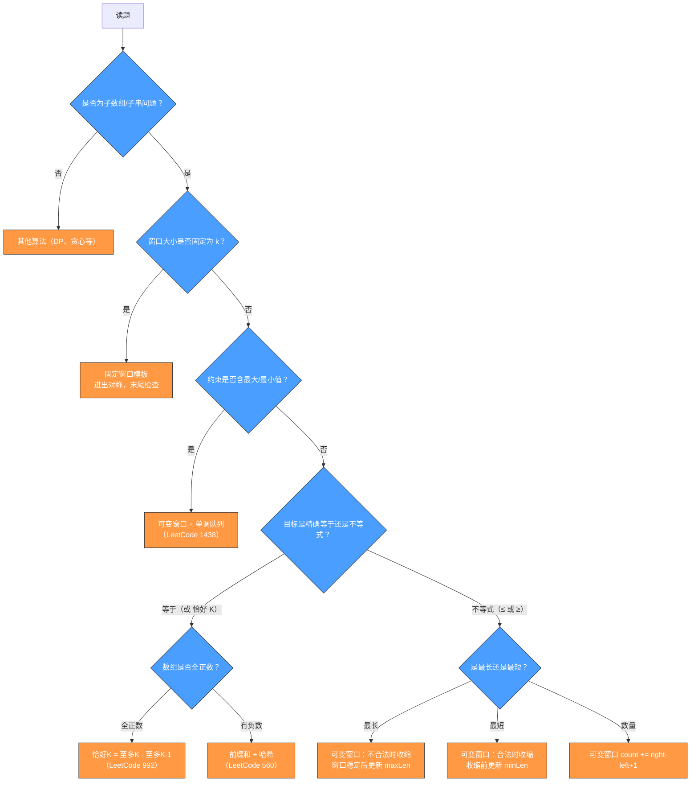
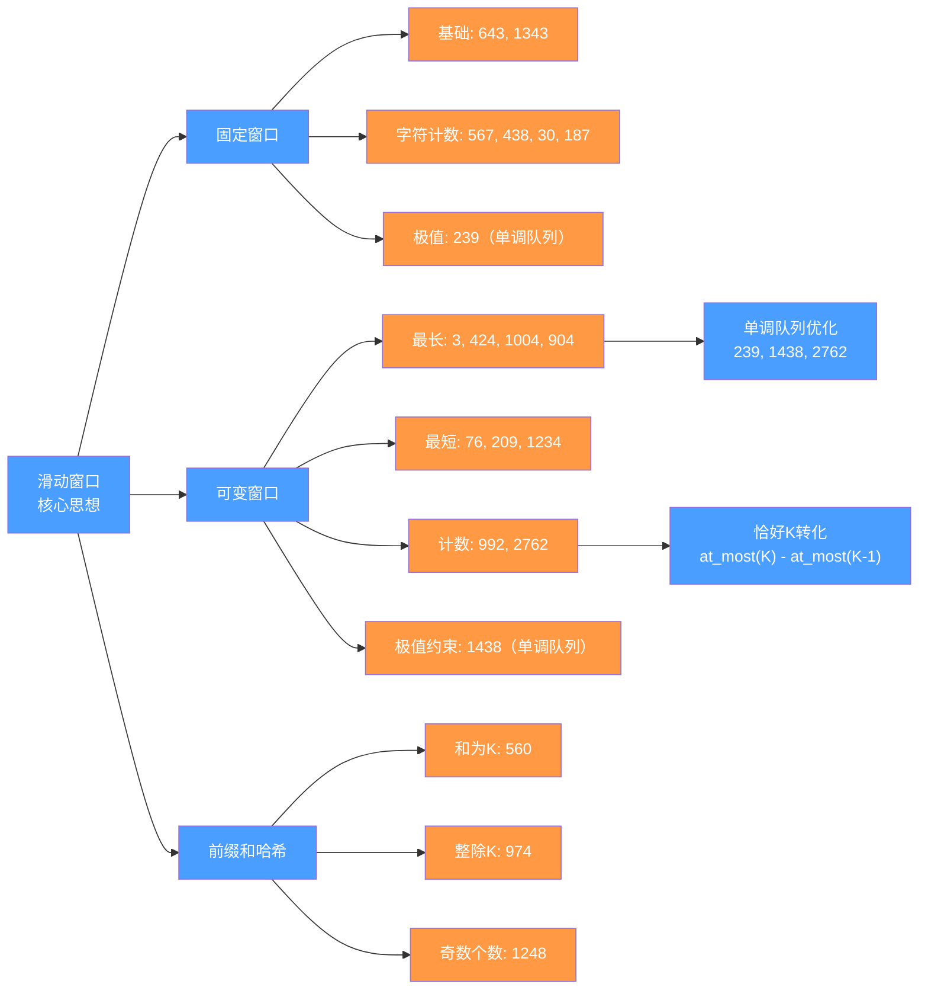

# 滑动窗口综合通关：面试高频模式总结与难题攻破

## 摘要

本篇是整个专栏的压轴收尾篇。经过前九篇系统学习，你已经掌握了从固定窗口、可变窗口、单调队列、前缀和哈希到"恰好 K"转化的全套技法。本篇不再引入新题，而是从**三个维度**帮你将零散知识整合为体系：一、模式识别决策树（拿到题目如何 30 秒内确定用哪种技法）；二、所有技法与典型题目的速查汇总；三、高频错误盘点与面试话术模板。

---

## 第 1 章 模式识别：拿到题目如何快速定位

### 1.1 关键词扫描

拿到题目先扫描题目文字，找以下关键词：

| 关键词 | 提示方向 |
|--------|----------|
| 连续子数组 / 连续子串 | 滑动窗口或前缀和 |
| 长度为 k / 大小为 k | 固定窗口 |
| 最长 / 最短 | 可变窗口 |
| 数量 / 个数 | 可变窗口计数 或 前缀和哈希 |
| 不重复 / 不同元素 | 可变窗口 + 哈希（最多 1 种） |
| 至多 / 不超过 | 可变窗口（单调约束） |
| 恰好 | "恰好 K" = "至多 K" - "至多 K-1" |
| 最大值 / 最小值（窗口内）| 单调队列 |
| 和为 K / 和等于 | 前缀和哈希（尤其有负数时） |
| 整除 / 余数 | 前缀和 + 同余 |
| 字母异位词 / 排列 | 固定窗口 + 字符计数 + match |
| 替换 k 次 | 可变窗口（最长 + 替换操作） |

### 1.2 四步判断流程



### 1.3 单调性的快速验证

在使用可变窗口之前，一定要确认单调性：

**验证方法**：在脑海中用 `[a, a, a, ...]`（全相同元素）试跑一遍。固定一个右端点，从左端点等于右端点开始，逐步向左移（扩大窗口）——随着窗口扩大，约束量应该**单调变化**（只增大或只减小）。

- "子数组和"：随窗口扩大单调增大（全正数）或不单调（有负数）
- "不同元素数"：随窗口扩大单调增大（可能维持），收缩后单调减小或维持
- "最大值 - 最小值"：随窗口扩大单调增大，收缩后单调减小或维持

---

## 第 2 章 六大核心模板速查

### 2.1 固定窗口（大小严格等于 k）

```java
// 适用：子数组/子串长度严格等于 k
int left = 0;
for (int right = 0; right < n; right++) {
    // ① 进窗：处理 nums[right]
    add(nums[right]);
    
    // ② 出窗：当窗口大小超过 k
    if (right - left + 1 > k) {
        remove(nums[left]);
        left++;
    }
    
    // ③ 检查：窗口刚好为 k
    if (right - left + 1 == k) {
        updateAnswer();
    }
}
// 代表题：643, 1343, 567, 438, 239
```

### 2.2 可变窗口——最长（不合法时收缩）

```java
// 适用：求满足某约束的最长子数组
int left = 0, maxLen = 0;
for (int right = 0; right < n; right++) {
    // ① 进窗
    add(nums[right]);
    
    // ② 收缩：当窗口不合法时
    while (!isValid()) {
        remove(nums[left]);
        left++;
    }
    
    // ③ 更新答案：窗口合法时的长度
    maxLen = Math.max(maxLen, right - left + 1);
}
// 代表题：3, 76（注意76是最短，答案更新位置不同）, 904, 1004, 424
```

### 2.3 可变窗口——最短（合法时收缩）

```java
// 适用：求满足某约束的最短子数组
int left = 0, minLen = Integer.MAX_VALUE;
for (int right = 0; right < n; right++) {
    // ① 进窗
    add(nums[right]);
    
    // ② 收缩：当窗口合法时（尽量缩小）
    while (isValid()) {
        minLen = Math.min(minLen, right - left + 1);  // 收缩前更新
        remove(nums[left]);
        left++;
    }
}
return minLen == Integer.MAX_VALUE ? 0 : minLen;
// 代表题：76, 209, 1234
```

### 2.4 可变窗口——计数（至多 K 型）

```java
// 适用：统计满足"至多 K 个某类元素"的子数组数量
int left = 0, count = 0;
for (int right = 0; right < n; right++) {
    add(nums[right]);
    while (exceeded(k)) {  // 超过 k 时收缩
        remove(nums[left]);
        left++;
    }
    count += right - left + 1;  // 以 right 为右端点的合法子数组数量
}
// 代表题：992（用 atMostK 函数）
```

### 2.5 单调队列（固定/可变窗口极值）

```java
Deque<Integer> maxQ = new ArrayDeque<>();
for (int right = 0; right < n; right++) {
    // 进队尾：弹出比 nums[right] 小（或 <=）的下标
    while (!maxQ.isEmpty() && nums[maxQ.peekLast()] <= nums[right]) maxQ.pollLast();
    maxQ.addLast(right);
    
    // 出队首：移除过期元素
    if (maxQ.peekFirst() < left) maxQ.pollFirst();
    
    // 查询：队首是当前窗口最大值
    int windowMax = nums[maxQ.peekFirst()];
}
// 代表题：239, 1438, 2762
```

### 2.6 前缀和哈希（精确等于 K）

```java
int prefix = 0;
int result = 0;
Map<Integer, Integer> count = new HashMap<>();
count.put(0, 1);  // 哨兵：空前缀的前缀和为 0，出现一次
for (int num : nums) {
    prefix += transform(num);  // 前缀和的增量（可以是 num 本身，也可以是 num & 1 等）
    result += count.getOrDefault(prefix - k, 0);
    count.merge(prefix, 1, Integer::sum);
}
// 代表题：560, 974, 1248
```

---

## 第 3 章 全专栏题目汇总与难度分布

### 3.1 固定窗口类

| LeetCode | 题目 | 难度 | 核心技法 |
|----------|------|------|----------|
| 643 | 子数组最大平均数 | 简单 | 基础滑动和 |
| 1343 | 大小为 K 且平均值大于等于阈值的子数组数目 | 中等 | 固定窗口计数 |
| 567 | 字符串的排列 | 中等 | 字符计数 + match |
| 438 | 找字符串中所有字母异位词 | 中等 | 同 567，多输出 |
| 239 | 滑动窗口最大值 | 困难 | 单调队列 |
| 2461 | 长度为 K 子数组中的最大和 | 中等 | 固定窗口 + 不同元素 |
| 30 | 与所有单词相关联的子串 | 困难 | 多起点固定窗口 |
| 187 | 重复的 DNA 序列 | 中等 | 固定窗口 + 滚动哈希 |

### 3.2 可变窗口最长类

| LeetCode | 题目 | 难度 | 核心技法 |
|----------|------|------|----------|
| 3 | 无重复字符的最长子串 | 中等 | 不含重复的最长 |
| 424 | 替换后的最长重复字符 | 中等 | maxFreq 不回退 |
| 1004 | 最大连续1的个数 III | 中等 | "坏元素"框架 |
| 1493 | 删掉一个元素后全为1的最长子数组 | 中等 | 同上，"坏元素"=0 |
| 904 | 水果成篮 | 中等 | 至多 2 种 |
| 2401 | 最长优美子数组 | 中等 | XOR 单调性 |

### 3.3 可变窗口最短类

| LeetCode | 题目 | 难度 | 核心技法 |
|----------|------|------|----------|
| 76 | 最小覆盖子串 | 困难 | need/window/match 三件套 |
| 209 | 长度最小的子数组 | 中等 | 和 ≥ K 最短 |
| 1234 | 替换子串得到平衡字符串 | 中等 | 反向思维 + 多类别合法判断 |

### 3.4 可变窗口计数类

| LeetCode | 题目 | 难度 | 核心技法 |
|----------|------|------|----------|
| 992 | K 个不同整数的子数组 | 困难 | "恰好 K" = "至多 K" - "至多 K-1" |
| 2762 | 不间断子数组 | 中等 | 双单调队列 + `count += right-left+1` |

### 3.5 前缀和哈希类

| LeetCode | 题目 | 难度 | 核心技法 |
|----------|------|------|----------|
| 560 | 和为 K 的子数组 | 中等 | 前缀和 + 哈希，哨兵 {0:1} |
| 974 | 和可被 K 整除的子数组 | 中等 | 同余定理，负数取模修正 |
| 1248 | 统计优美子数组 | 中等 | 奇数→1，复用 560 框架 |

### 3.6 单调队列类

| LeetCode | 题目 | 难度 | 核心技法 |
|----------|------|------|----------|
| 239 | 滑动窗口最大值 | 困难 | 单调队列入门 |
| 1438 | 绝对差不超过限制的最长连续子数组 | 中等 | 双单调队列 |
| 2762 | 不间断子数组 | 中等 | 双单调队列 + 计数 |

---

## 第 4 章 高频错误盘点

### 4.1 错误一：出窗时更新顺序错误

**错误写法**（字符计数类固定窗口）：

```java
// 错误：先更新 match，再调整 count
int out = s.charAt(left);
match -= count[out] == need[out] ? 1 : 0;  // 错误！
count[out]--;
```

**正确写法**：

```java
// 正确：先检查是否恰好满足，再减少
int out = s.charAt(left);
if (count[out] == need[out]) match--;  // 减少前，count[out] == need[out] 代表之前恰好满足
count[out]--;
left++;
```

### 4.2 错误二：前缀和哈希忘记哨兵

```java
// 错误：没有 count.put(0, 1)
Map<Integer, Integer> count = new HashMap<>();  // 缺少初始化
// 导致漏掉从数组头开始的子数组

// 正确：
Map<Integer, Integer> count = new HashMap<>();
count.put(0, 1);  // 空前缀哨兵
```

### 4.3 错误三：Java 负数取模

```java
// 错误：Java 中 -2 % 5 = -2，不是期望的 3
int mod = prefix % k;  // 可能为负

// 正确：
int mod = ((prefix % k) + k) % k;  // 保证非负
```

### 4.4 错误四：Integer == 比较

```java
// 错误：比较 HashMap 中的 Integer 对象用 ==
if (count.get(c) == need[c]) { ... }  // 当值超过 127 时，缓存外的 Integer 对象 == 返回 false

// 正确：
if (count.getOrDefault(c, 0).equals(need[c])) { ... }
// 或：
if (count.getOrDefault(c, 0) == (int) need[c]) { ... }  // 强制拆箱
```

### 4.5 错误五：单调队列弹出条件

```java
// 弹出条件用 < 还是 <=？
// 用 < 时：相等元素都保留在队列中（允许重复下标）
// 用 <= 时：相等元素只保留最新的（队列严格单调递减）
// 两者对于求最大值都正确（队首仍是最大值），但 <= 更简洁

// 推荐使用 <=：
while (!deque.isEmpty() && nums[deque.peekLast()] <= nums[right]) deque.pollLast();
```

### 4.6 错误六：最长/最短的答案更新位置混淆

```java
// 最短窗口（如 LeetCode 76）：
// 收缩前更新答案！（因为收缩后窗口可能不合法）
while (isValid()) {
    minLen = Math.min(minLen, right - left + 1);  // 在这里！
    remove(nums[left++]);
}

// 最长窗口（如 LeetCode 3）：
// 收缩后更新答案（窗口稳定合法后）
while (!isValid()) remove(nums[left++]);
maxLen = Math.max(maxLen, right - left + 1);  // 在这里！
```

---

## 第 5 章 面试话术模板

### 5.1 开场分析（拿到题目后的口头思路）

```
"这道题要求在连续子数组/子串中找 [最长/最短/数量]，满足 [某个约束]。
我观察到这个约束具有单调性：[说明为什么扩大窗口会让约束向某个方向变化]。
因此我可以用滑动窗口来解决，时间复杂度 O(n)。"
```

或（有负数时）：

```
"注意数组中有负数，这破坏了和的单调性，滑动窗口无法直接使用。
我用前缀和把'子数组和等于 K'转化为'两个前缀和之差等于 K'，
再用哈希表 O(1) 查找，总体时间复杂度 O(n)。"
```

### 5.2 编码时的自我验证清单

| 检查项 | 说明 |
|--------|------|
| 进窗/出窗顺序 | 进窗：先加元素再更新状态；出窗：先更新状态再移指针 |
| 哨兵初始化 | 前缀和哈希必须 `count.put(0, 1)` |
| 取模符号 | Java 负数取模需 `((x % k) + k) % k` |
| 答案更新位置 | 最长：收缩后；最短：收缩前 |
| 窗口是否满足大小 | 固定窗口：`right - left + 1 == k` 时才更新答案 |
| 整型溢出 | 求和时用 `long`，尤其是"最大和"题目 |

### 5.3 时间复杂度说明

所有单指针单调收缩的滑动窗口：$O(n)$（每个元素最多进窗/出窗各一次，均摊 $O(1)$）。

单调队列优化：额外保持 $O(n)$，因为每个下标也最多入队/出队各一次。

"恰好 K" = "至多 K" - "至多 K-1"：调用 `atMostK` 两次，仍是 $O(n)$。

前缀和哈希：$O(n)$，空间 $O(n)$（或 $O(k)$ 当取模范围有限时）。

---

## 第 6 章 知识图谱：专栏全景



---

## 专栏结语

历经十篇文章，我们从"暴力枚举的冗余"出发，系统掌握了：

1. **固定窗口**：进出对称，窗口大小严格等于 k
2. **可变窗口**：单调性是 $O(n)$ 的本质，最长（收缩后更新）与最短（收缩前更新）的答案位置
3. **字符计数**：`int[26]` 或 `int[128]`，`match` 计数器跟踪满足字符数
4. **单调队列**：均摊 $O(1)$ 维护窗口极值，双队列同时维护最大/最小
5. **前缀和哈希**：打破正数限制，处理负数数组和精确等于 K 的问题
6. **"恰好 K" 转化**："至多 K" - "至多 K-1"，把不可直接处理的精确约束转化为两个单调约束

滑动窗口的精髓不是记模板，而是理解**为什么单调性让双指针可以一次扫描**，以及如何把具体题目约束翻译成这种单调性。掌握了这个思维框架，任何变体都能举一反三。

---

## 参考与延伸

- [[00 专栏导览]] — 全专栏题目索引与模板速查
- [[01 滑动窗口算法原理全景：从暴力枚举到 O(n) 的思维跃迁]] — 单调性的本质分析
- [[07 单调队列优化滑动窗口：O(n) 求窗口极值的艺术]] — 单调队列完整讲解
- [[08 前缀和与滑动窗口的思想融合：子数组求和类问题]] — 前缀和哈希完整讲解
- [[09 多类别元素与恰好 K 型窗口：高阶滑动窗口技法]] — "恰好 K"转化技法
